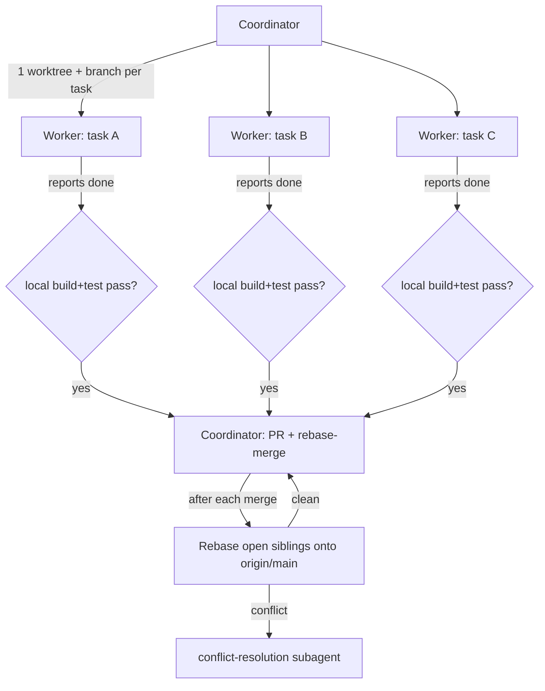

<!-- file: docs/agent-tasks/ORCHESTRATION.md -->
<!-- version: 1.0.0 -->
<!-- guid: 1c9d8e7f-3a2b-4c50-9e81-6f7a8b9c0d12 -->
<!-- last-edited: 2026-06-28 -->

# Orchestration — running many task-agents in parallel

This is the portable, tool-agnostic version of the coordinator pattern this repo
uses for `/parallel-sweep`. It lets you run several `TASK-*.md` agents at once
without them stepping on each other, then merge them one at a time with automatic
sibling rebasing.

The model is **coordinator + workers**:

- **Workers** are AI agents, one per task, each confined to its own git worktree.
  Workers only read/write code and run tests. **Workers never run `git push`,
  `gh pr ...`, or merge** — they report "done" and hand back.
- **The coordinator** (you, or a stronger agent) owns all git/gh: it creates the
  worktrees, gates each finished worker on a local build/test, opens+merges the
  PR, and rebases the still-open siblings after each merge.



## Why this shape

| Risk | Mitigation |
|------|------------|
| Two agents edit the same file → corrupt merges | One worktree per task; each agent is told to stay inside its worktree path. |
| Agent pushes/merges half-done work | Only the coordinator touches git/gh. Workers are report-only. |
| Sibling branches drift from main and rot | After every merge, rebase all open siblings onto `origin/main`. |
| A weak worker model wanders | Each task is fully self-contained with explicit acceptance criteria; the coordinator rejects a "done" that fails the local gate. |
| Tasks have dependencies | Run dependent tasks in waves (see each workstream's `run.sh` order). Don't start a task whose `Depends on:` isn't merged yet. |

## Step-by-step (manual coordinator)

1. **Pick a wave** of independent tasks (no unmet `Depends on:`). Good first
   wave for transcription-matching: `TASK-01` + `TASK-05` (independent);
   `TASK-04` depends on `TASK-02`.
2. **Create worktrees + prompt files**: run `./run-sweep.sh <workstream> <TASK-id>...`
   (see below). It makes `.worktrees/<slug>` per task and writes a
   `*.agent-prompt.txt` you paste into each agent.
3. **Dispatch** one agent per prompt file. Let them run concurrently.
4. **Gate** each finished worker:
   ```bash
   cd .worktrees/<slug>
   go build ./... && go test ./<changed-pkgs>/ -count=1
   ```
   If red, send the agent back with the failure output. If green, continue.
5. **Merge** (coordinator only):
   ```bash
   git -C .worktrees/<slug> push -u origin <branch>
   gh pr create --fill && gh pr merge <n> --rebase
   ```
6. **Rebase siblings** after each merge:
   ```bash
   for wt in .worktrees/*; do
     git -C "$wt" fetch origin main -q && git -C "$wt" rebase origin/main || {
       echo "CONFLICT in $wt — hand to a conflict-resolution subagent"; }
   done
   ```
7. **Repeat** for the next wave.

## Dependency waves per workstream

- **transcription-matching**: wave1 = TASK-01, TASK-05; wave2 = TASK-02, TASK-03;
  wave3 = TASK-04 (needs TASK-02).
- **dedup-intro-falsepositive**: wave1 = TASK-01 (investigate, read-only) →
  then TASK-02, TASK-03, TASK-04 in parallel.
- **dedup-ui**: all five are independent — one wave, up to 5 in parallel.
- **system-docs**: TASK-01 (outline) first → remaining doc tasks in parallel.

## If you have a stronger agentic tool

You can let a single strong "coordinator agent" do steps 2–7 autonomously: give
it this file plus the workstream's `run.sh`, and tell it to act as the
coordinator (own all git/gh, dispatch worker subagents per task, gate on local
tests, merge, rebase siblings). The workers it spawns should be the cheap
capability tiers from the roster in `README.md`.
