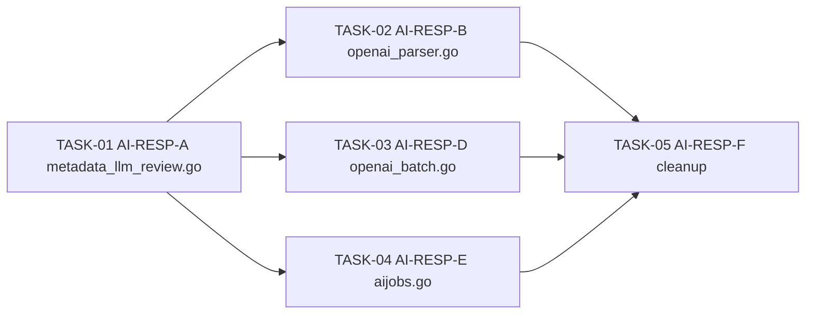

<!-- file: docs/agent-tasks/ai-responses-migration/orchestration.md -->
<!-- version: 1.1.0 -->
<!-- guid: 28d2a50b-9953-4c55-897b-4cc5a0b5d79f -->
<!-- last-edited: 2026-08-11 -->

# Orchestration — ai-responses-migration workstream

Read the package-level [`../ORCHESTRATION.md`](../ORCHESTRATION.md) first.

> **This entire workstream is DEFERRED/OPTIONAL.** Do not dispatch any task here
> until a human has explicitly greenlit the OpenAI Responses API migration for
> this repo. These briefs exist so the work is ready to run the moment it is
> approved — they are not a queue to burn through automatically.

## Why this sequencing

All five tasks touch `internal/ai/` (and one touches `internal/ai/aijobs/`).
TASK-02 and TASK-05 both edit `internal/ai/openai_parser.go`, and TASK-05 also
sweeps the rest of `internal/ai/` after everything else lands — so it **must**
run last, serialized after A, B, D, and E are all merged. Running any cleanup
task concurrently with a migration task on the same file guarantees a rebase
conflict, and running cleanup before the migrations means deleting code that
is still load-bearing.

## Waves



- **Wave 1 (serial, single task)**: TASK-01 (AI-RESP-A). This is the pattern-setter —
  it establishes how a Chat Completions call becomes a `/v1/responses` call in this
  codebase (request shape, response parsing, error handling). Merge it before
  starting anything else so B/D/E can copy the pattern instead of inventing three
  slightly different ones.
- **Wave 2 (parallel, 3 tasks, after TASK-01 merges)**: TASK-02 (AI-RESP-B,
  `openai_parser.go`), TASK-03 (AI-RESP-D, `openai_batch.go`), TASK-04
  (AI-RESP-E, `internal/ai/aijobs/aijobs.go`). These touch three different files
  with no overlap between each other, so they can run as three parallel worktrees.
  TASK-03 is **conditional** — if the OpenAI Batches API does not yet support
  `/v1/responses` endpoints, the task stops after documenting the blocker instead
  of migrating anything; do not let that block TASK-02 or TASK-04.
- **Wave 3 (serial, single task, after B/D/E all merge)**: TASK-05 (AI-RESP-F)
  sweeps `internal/ai/` for any remaining Chat Completions call sites now that
  A/B/D/E have migrated their pieces. It explicitly must NOT touch
  `embedding_client.go` (AI-RESP-C is a permanent do-not-migrate marker — the
  `/v1/embeddings` endpoint has no Responses API equivalent).

## Collision notes

- `internal/ai/openai_parser.go` is edited by TASK-02 (migration) and read/swept
  by TASK-05 (cleanup) — TASK-05 must start from a rebase onto TASK-02's merged
  commit, never in parallel with it.
- `internal/ai/embedding_client.go` is **out of scope for every task in this
  workstream**. If any task's grep turns up Chat/Responses-adjacent code in that
  file, leave it untouched and note it in the PR description.

## Run it (only once greenlit)

```bash
./run.sh 01            # AI-RESP-A first, wait for merge
./run.sh 02 03 04       # parallel wave
./run.sh 05             # cleanup, after 02/03/04 all merge
```
