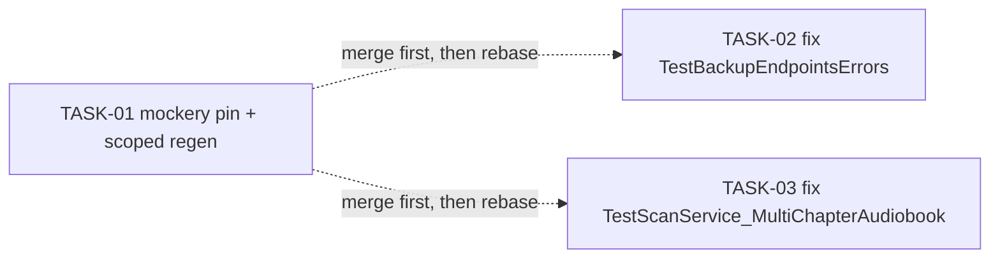

&lt;!-- file: docs/agent-tasks/ci-flaky-fixes/orchestration.md --&gt;
&lt;!-- version: 1.0.0 --&gt;
&lt;!-- guid: c31545dc-25a5-42af-85f4-05c6b3a07050 --&gt;
&lt;!-- last-edited: 2026-07-01 --&gt;

# Orchestration — ci-flaky-fixes workstream

Read the package-level [`../ORCHESTRATION.md`](../ORCHESTRATION.md) first.

## Waves

**Wave 1a (solo):** TASK-01 runs and merges by itself first. It regenerates
`internal/database/mocks/`, `internal/operations/mocks/`,
`internal/scanner/mocks/`, and other mockery-managed mock files listed in
`.mockery.yaml`. Any other task's PR opened while TASK-01 is in flight would
have to rebase over a large mock diff — cheaper to just gate on it.

**Wave 1b (parallel):** once TASK-01 has merged to `origin/main`, dispatch
TASK-02 and TASK-03 in parallel. They touch completely disjoint files:

- TASK-02: `internal/server/server_extra_test.go` (the test) and
  `internal/server/handlers/system/handler.go` (the code under test).
- TASK-03: `internal/server/scan_edge_cases_test.go` (the test) and
  `internal/scanner/service.go` / `internal/scanner/scanner.go` (the scanner
  code, if the fix requires touching production code rather than just the
  test/testutil).

No file overlap between TASK-02 and TASK-03 → no rebase risk between them.
Both should rebase onto `origin/main` after TASK-01 merges (to pick up any
mock changes) before opening their own PRs.

## Run it

Each task's brief is self-contained (worktree setup, goal, steps, test,
commit, PR/merge). Dispatch TASK-01 first; once its PR is merged, dispatch
TASK-02 and TASK-03 together.
