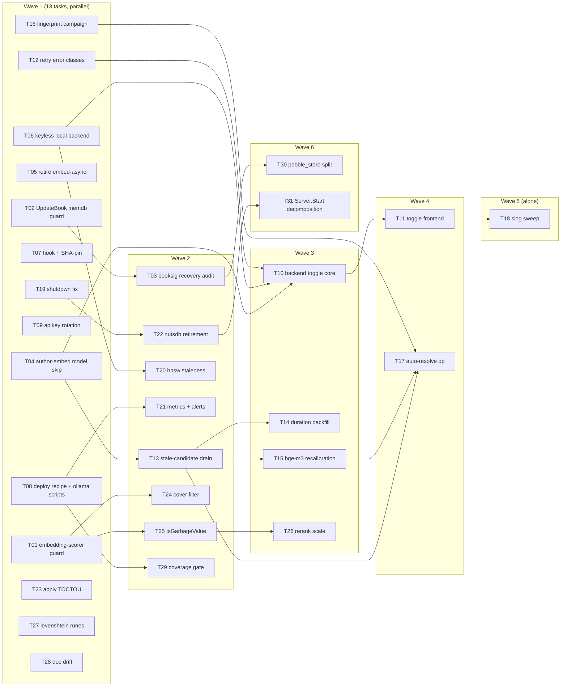

<!-- file: docs/agent-tasks/consultancy-roadmap/orchestration.md -->
<!-- version: 1.0.0 -->
<!-- guid: 2d551ac6-ccfb-433e-aa65-3777b23f8d02 -->
<!-- last-edited: 2026-07-03 -->

# Orchestration — consultancy-roadmap workstream

Read the package-level [`../ORCHESTRATION.md`](../ORCHESTRATION.md) first. This
file adds the workstream-specific wave order. 31 tasks, 6 waves.

## Waves (respect `Depends on:`)



- **Wave 1** — all files disjoint; run up to 14 in parallel (T01, T02, T04, T05,
  T06, T07, T08, T09, T12, T16, T19, T23, T27, T28).
- **Wave 2** — starts only after its specific dependency merges (not the whole
  wave): T03 (needs T02), T13 (T04, `engine.go`), T20 (T06, `server.go`),
  T21 + T29 (T08, `Makefile`/`deploy/`), T22 (T19, `server_lifecycle.go`),
  T24 + T25 (T01, `metafetch`; T24 edits `service_search.go`, T25 edits
  `service_scoring.go` — disjoint, so parallel with each other).
- **Wave 3** — T10 (Opus; after T04/T06/T12), T14 + T15 (after T13; T14 edits
  dataset/backfill files, T15 edits `engine.go` — verify no overlap before
  running in parallel; if both touch `engine.go`, serialize T14 after T15),
  T26 (after T25, `service_scoring.go`).
- **Wave 4** — T11 (after T10), T17 (Opus; after T13/T15/T16).
- **Wave 5** — T18 slog sweep runs ALONE (dozens of files repo-wide). Use
  `/parallel-sweep` with per-package child tasks if desired.
- **Wave 6** — the two structural splits (T30, T31), lowest priority, Opus.

## Prod-data gates

T03, T13, T15, T17 end at a **dry-run report**. Applying to prod requires the
owner's explicit greenlight, exactly like the M0 purge and CONS-10 precedents.

## Run it

```bash
# from docs/agent-tasks/consultancy-roadmap/
./run.sh                                       # print task list + set up worktrees
./run.sh 01 02 04 05 06 07 08 09 12 16 19 23 27 28   # wave 1
# merge wave 1, rebase siblings, then per-dependency wave 2+ (see above)
```

After each wave: gate each worktree with `make ci`, push/PR/merge as
coordinator, rebase remaining siblings onto `origin/main` before the next wave.
