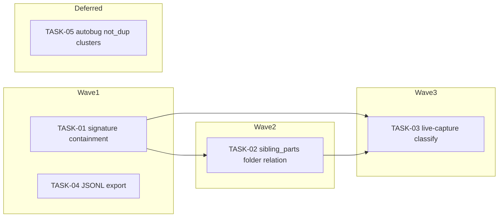

&lt;!-- file: docs/agent-tasks/dedup-dataset/orchestration.md --&gt;
&lt;!-- version: 1.0.0 --&gt;
&lt;!-- guid: dc905d0c-0bf8-4290-a674-349ef0213ea4 --&gt;
&lt;!-- last-edited: 2026-07-01 --&gt;

# Orchestration — dedup-dataset workstream

Read the package-level [`../ORCHESTRATION.md`](../ORCHESTRATION.md) first. This
file only adds the workstream-specific wave order and same-file collision notes.

## Same-file collisions (read before dispatching in parallel)

- **TASK-01** (`C5-sig`) and **TASK-02** (`C5-folder`) both edit
  `internal/dedup/dataset/builder.go`, but they touch **disjoint functions**
  (`signatureRelation` vs `folderRelation`) in different line ranges. They are
  still placed in **different waves** (Wave 1 and Wave 2) to keep the rebase
  surface small — do not run them in the same wave even though the functions
  don't overlap, because a worker regenerating file headers or reformatting
  imports can still produce a spurious conflict. Merge TASK-01 first, rebase,
  then start TASK-02.
- **TASK-03** (`C5`, live-capture wiring) touches
  `internal/database/embedding_store.go` and `internal/dedup/engine.go`. If the
  separate "dedup-hardening" workstream is running concurrently and also has
  tasks touching `internal/dedup/engine.go`, TASK-03 **must be serialized
  after** those tasks land on `origin/main` — rebase TASK-03's worktree onto
  the latest `origin/main` immediately before starting work, and again
  immediately before opening the PR.
- **TASK-04** (`C7`, JSONL export) is isolated to
  `internal/server/handlers/dedup/` (new file) and read-only additions to
  `internal/database/dedup_label.go` — no overlap with TASK-01/02/03. Safe to
  run fully in parallel with Wave 1.
- **TASK-05** (`C8`) is **deferred** — do not dispatch it until the prod
  labeled-dataset backfill (tracked separately, "Bucket 3" / CONS-10 drain) has
  completed. It is included here only so the design is written down.

## Waves



- **Wave 1** (parallel, independent): TASK-01, TASK-04. Neither depends on the
  other; TASK-04 touches a different package entirely.
- **Wave 2** (serialized after Wave 1's TASK-01 merges): TASK-02. Rebase onto
  `origin/main` before starting so `builder.go` reflects TASK-01's merged
  `signatureRelation` change.
- **Wave 3** (after TASK-01 and TASK-02 are both merged): TASK-03. It wires
  `BuildExample`/`Classify` — the same functions TASK-01/02 extended the
  outputs of — into the live candidate-upsert path, so it should build on the
  final `builder.go` state, not a pre-Wave-1 snapshot.
- **Deferred** (do NOT dispatch automatically): TASK-05. Requires explicit
  human go-ahead once the prod backfill is confirmed complete.

## Run it

```bash
# from docs/agent-tasks/
./run.sh                    # prints wave order
./run.sh 01 04               # wave 1 only
./run.sh 02                  # wave 2 (after TASK-01 merged + rebase)
./run.sh 03                  # wave 3 (after TASK-01 + TASK-02 merged)
# TASK-05 is NOT included in normal ./run.sh dispatch — start it manually only
# after confirming the prod backfill (Bucket 3 / CONS-10 drain) is complete.
```

After each wave: gate each worktree with
`go build ./... &amp;&amp; go test ./internal/dedup/... ./internal/database/... -count=1`,
push/PR/merge as coordinator, then rebase remaining siblings onto
`origin/main` before starting the next wave.
