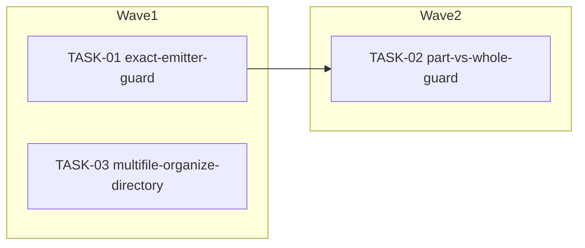

<!-- file: docs/agent-tasks/dedup-hardening/orchestration.md -->
<!-- version: 1.0.0 -->
<!-- guid: 8d2e2857-1c18-4662-a54b-a1acce616e73 -->
<!-- last-edited: 2026-07-01 -->

# Orchestration — dedup-hardening workstream

Read the package-level [`../ORCHESTRATION.md`](../ORCHESTRATION.md) first. This
file only adds the workstream-specific wave order.

## Waves (respect `Depends on:`)



- **Wave 1** (parallel, independent files): TASK-01 (`internal/dedup/engine.go`)
  and TASK-03 (`internal/itunes/service/importer.go` +
  `internal/organizer/organizer.go`) touch disjoint files, so they run
  concurrently.
- **Wave 2** (serialized after Wave 1's TASK-01 merges): TASK-02 also edits
  `internal/dedup/engine.go`. Running it in parallel with TASK-01 guarantees a
  merge conflict / rebase churn on the same file (both add guard functions near
  `upsertExactCandidate`), so TASK-02 MUST NOT start until TASK-01's PR is
  merged to `origin/main` and TASK-02's worktree is rebased on top of it.
- TASK-03 has no file overlap with TASK-01/TASK-02 and can merge whenever its
  own tests pass — it does not gate or get gated by the other two.

## Run it

```bash
# from docs/agent-tasks/
./run.sh                 # prints wave order + sets up worktrees for wave 1
./run.sh 01 03            # wave 1 (parallel)
./run.sh 02               # wave 2 (only after TASK-01 is merged + rebased)
```

After each wave: gate each worktree with
`go build ./... && go test ./internal/dedup/... ./internal/itunes/... -count=1`,
push/PR/merge as coordinator, then rebase remaining siblings onto
`origin/main` before starting the next wave.
