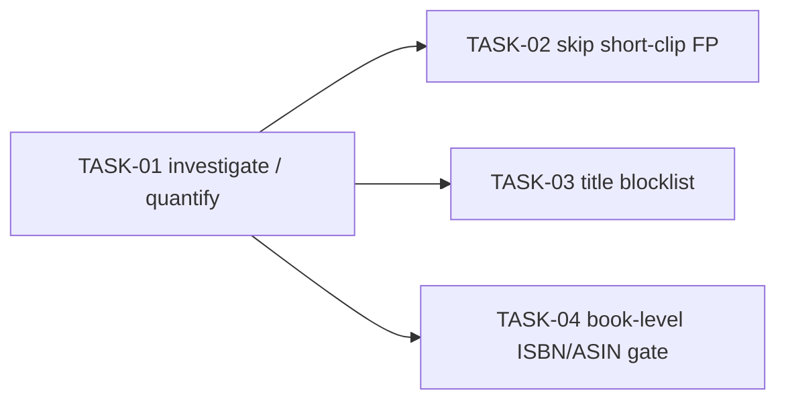

<!-- file: docs/agent-tasks/dedup-intro-falsepositive/README.md -->
<!-- version: 1.0.0 -->
<!-- guid: a4b6c8e0-2d4f-4a6b-8c0d-3e5f7a9b1c3d -->
<!-- last-edited: 2026-06-28 -->

# Workstream C — Kill Audible intro/outro dedup false positives

**Problem (TODO.md DEDUP-INTRO-1):** the exact dedup layer fingerprints
individual audio files. Short publisher intro/outro clips ("This is Audible…",
jingles, brand stings) produce **identical chromaprints across unrelated books
from the same publisher**, so dedup pairs them as duplicates. Estimated up to
~372K candidate pairs are polluted by this class.

The fix is layered defense — none alone is sufficient:
1. **Don't fingerprint-match tiny clips** (a <60s file is almost always an
   intro/outro, not a book).
2. **Blocklist known boilerplate titles** so they never seed an exact match.
3. **Gate file matches at the book level** by ISBN/ASIN — if two books have
   different ISBNs/ASINs, a shared short-clip fingerprint must not merge them.

## Tasks & order



| Task | Title | Priority | Effort | Depends on |
|------|-------|----------|--------|-----------|
| TASK-01 | Investigate & quantify the false-positive class (read-only) | P1 | M | — |
| TASK-02 | Skip fingerprint compare on short clips (<60s) | P2 | M | TASK-01 |
| TASK-03 | Title blocklist for publisher boilerplate | P3 | S | TASK-01 |
| TASK-04 | Book-level ISBN/ASIN gate before file match | P2 | M | TASK-01 |

Do TASK-01 first (read-only) — its findings tune the thresholds/lists in the
others. Then TASK-02/03/04 can run in parallel.

## Where the code lives (verify before editing)

- `internal/dedup/` — dedup engine, `book_dedup.go`, `engine.go`, the exact
  fingerprint layer. Tests: `internal/dedup/*_test.go`.
- Fingerprint data: `BookFile.AcoustIDFingerprint*` fields; duration is on the
  `BookFile`/`Book`. The LSH secondary index drives exact-layer matches.
- Use a **code-exploration subagent** to map the exact-layer match path before
  changing thresholds:
  ```bash
  grep -rn "exact\|AcoustID\|fingerprint\|LSH\|chromaprint\|DurationSec" internal/dedup/ | head -40
  ```
