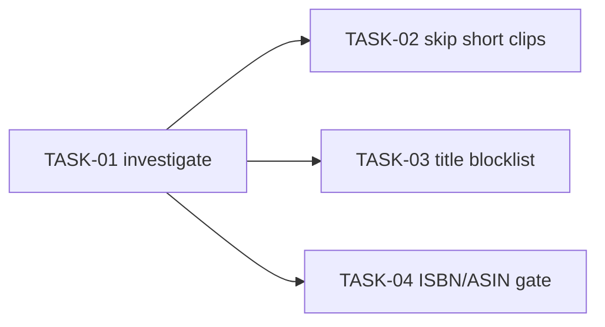

<!-- file: docs/agent-tasks/dedup-intro-falsepositive/orchestration.md -->
<!-- version: 1.0.0 -->
<!-- guid: f9a1b3c5-7293-4f10-9b52-8d0e2f406182 -->
<!-- last-edited: 2026-06-28 -->

# Orchestration — dedup-intro-falsepositive workstream

Read the package-level [`../ORCHESTRATION.md`](../ORCHESTRATION.md) first.

## Waves



- **Wave 1**: TASK-01 (read-only investigation) — run alone, merge its
  `FINDINGS.md` first so the others can use its thresholds/lists.
- **Wave 2** (parallel): TASK-02, TASK-03, TASK-04.

These three edit `internal/dedup/` and may lightly conflict — after the first of
them merges, rebase the other two onto `origin/main` (hand conflicts to a
conflict-resolution subagent) before continuing.

## Run it

```bash
./run.sh 01          # investigation first
./run.sh 02 03 04    # after FINDINGS.md merged
```
