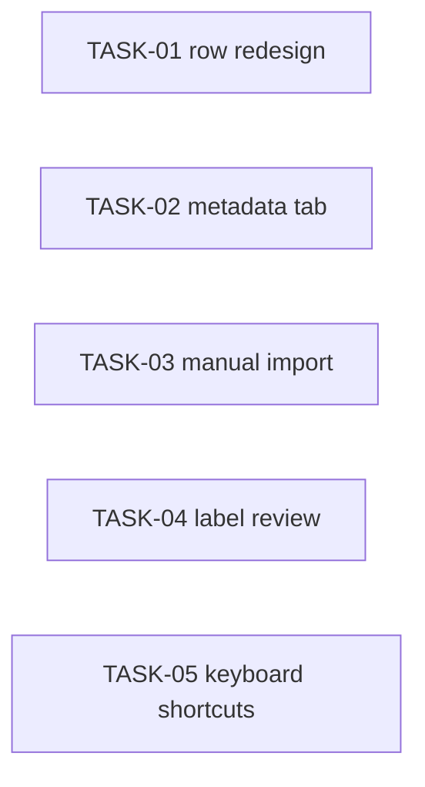

<!-- file: docs/agent-tasks/dedup-ui/orchestration.md -->
<!-- version: 1.0.0 -->
<!-- guid: 71829304-5061-4798-9d30-658697081950 -->
<!-- last-edited: 2026-06-28 -->

# Orchestration — dedup-ui workstream

Read the package-level [`../ORCHESTRATION.md`](../ORCHESTRATION.md) first.

## Waves

All five tasks are independent → **one wave, up to 5 agents in parallel**.



TASK-01 and TASK-05 both touch the dedup page/components and may lightly
conflict; after the first merges, rebase the other onto `origin/main`.

## Run it

```bash
./run.sh            # set up all five
./run.sh 01 03 05   # subset
```

Per task, gate with `cd web && npm run build && npm test`, then push/PR/merge as
coordinator and rebase siblings.
