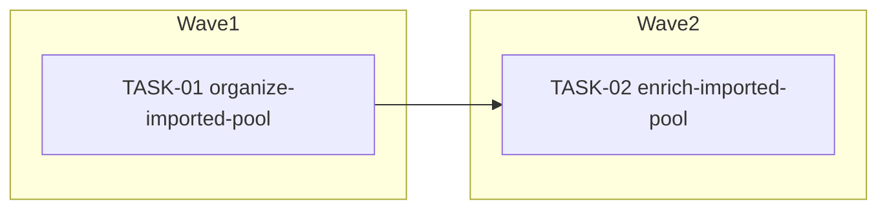

<!-- file: docs/agent-tasks/itunes-import/orchestration.md -->
<!-- version: 1.0.0 -->
<!-- guid: 13e10220-b6f2-47c6-826c-1e1cdcb3121d -->
<!-- last-edited: 2026-07-05 -->

# Orchestration — itunes-import workstream

Read the package-level [`../ORCHESTRATION.md`](../ORCHESTRATION.md) first. This file only adds the workstream-specific wave order.

**Execution mode:** SERIAL WAVES (coordinator-driven) — trigger: both tasks edit internal/itunes/service/importer.go (collision table row 2); enrich (TASK-02) serializes after organize (TASK-01).

## Waves (respect `Depends on:`)



- **Wave 1** (single task): TASK-01.
- **Wave 2** (serialized): TASK-02 — MUST NOT start until wave 1's PR is merged to `origin/main` and this worktree is rebased on top.

## Coordinator protocol (verbatim)

> **Coordinator owns git. Workers never push.** Each worker operates only inside its
> assigned worktree: edit, test, commit — then stop. Workers never run `git push`,
> `gh pr`, or any merge command. The coordinator runs the gate (`make ci`) in each
> finished worktree, opens the PR, merges (rebase/FF unless the repo profile says
> otherwise), and then **rebases every open sibling worktree** before dispatching
> anything else.
>
> **Per-merge sibling-rebase loop:** after EVERY merge to `origin/main`:
> for each open sibling worktree, `git fetch origin && git rebase
> origin/main`. A sibling that skips a rebase is a future conflict.
>
> **Conflict escalation ladder** (in order, never skip a rung): 1) clean rebase;
> 2) conflict-resolver subagent (Sonnet-class, only when the conflict spans 1–3 small
> files); 3) file-copy cherry-pick fallback — re-apply the task's file states onto a
> fresh branch from HEAD; 4) mark `rebase_blocked`, stop the lane, escalate to a human.
>
> **A wave MUST NOT start** while any of: the previous wave has an unmerged PR; any
> sibling worktree is un-rebased; the gate is red on `origin/main`; or a
> `rebase_blocked` marker is unresolved.

## Run it

```bash
# from docs/agent-tasks/itunes-import/
./run.sh                 # print task list + set up worktrees
./run.sh 01 ./run.sh 02
```

After each wave: gate each worktree with `make ci`, push/PR/merge as coordinator, then rebase remaining sibling worktrees onto `origin/main` before starting the next wave.
