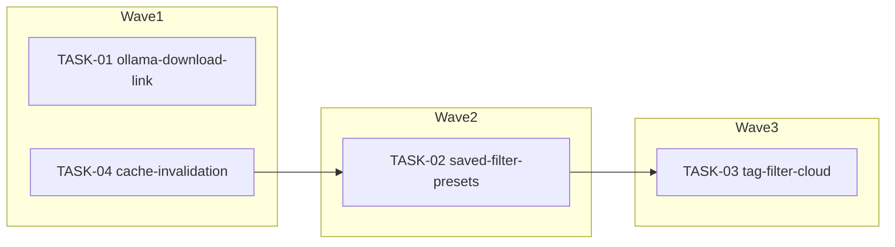

<!-- file: docs/agent-tasks/library-ui/orchestration.md -->
<!-- version: 1.0.0 -->
<!-- guid: f6838763-cda0-4f20-b75b-7a7569ca05fa -->
<!-- last-edited: 2026-07-01 -->

# Orchestration — library-ui workstream

Read the package-level [`../ORCHESTRATION.md`](../ORCHESTRATION.md) first. This
file only adds the workstream-specific wave order.

## Waves (respect `Depends on:`)



- **Wave 1** (parallel, independent files): TASK-01
  (`web/src/components/settings/EmbeddingSettingsSection.tsx`) and TASK-04
  (`web/src/pages/Library.tsx` + `web/src/stores/useLibraryCache.ts`) touch
  disjoint files, so they run concurrently.
- **Wave 2** (serialized after Wave 1's TASK-04 merges): TASK-02 also edits
  `web/src/pages/Library.tsx`. Running it in parallel with TASK-04 guarantees a
  merge conflict / rebase churn on the same file (both touch mutation handlers
  and the header filter menu), so TASK-02 MUST NOT start until TASK-04's PR is
  merged to `origin/main` and TASK-02's worktree is rebased on top of it.
- **Wave 3** (serialized after Wave 2's TASK-02 merges): TASK-03 also edits
  `web/src/pages/Library.tsx` (filter state + header controls). TASK-03 MUST
  NOT start until TASK-02's PR is merged and TASK-03's worktree is rebased
  onto `origin/main`.
- TASK-01 has no file overlap with TASK-02/TASK-03/TASK-04 and can merge
  whenever its own tests pass — it does not gate or get gated by the other
  three.

## Run it

```bash
# from docs/agent-tasks/
./run.sh                 # prints wave order + sets up worktrees for wave 1
./run.sh 01 04            # wave 1 (parallel)
./run.sh 02               # wave 2 (only after TASK-04 is merged + rebased)
./run.sh 03               # wave 3 (only after TASK-02 is merged + rebased)
```

After each wave: gate each worktree with
`cd web && npm install && npm run build && npm test`, push/PR/merge as
coordinator, then rebase remaining siblings onto `origin/main` before starting
the next wave.
