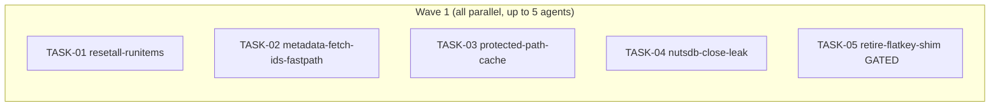

&lt;!-- file: docs/agent-tasks/perf-cleanup/orchestration.md --&gt;
&lt;!-- version: 1.0.0 --&gt;
&lt;!-- guid: 9c3be510-43da-45bf-8e18-50cba87ea7e3 --&gt;
&lt;!-- last-edited: 2026-07-01 --&gt;

# Orchestration — perf-cleanup workstream

Read the package-level [`../ORCHESTRATION.md`](../ORCHESTRATION.md) first. This
file only adds the workstream-specific wave order.

## Waves (respect `Depends on:`)



- **Wave 1** (fully parallel, up to 5 agents): TASK-01 through TASK-05. Each
  task touches a disjoint set of files, so there is no rebase collision risk
  between them:
  - TASK-01: `internal/plugins/acoustid/reset_all.go` (+ new `reset_all_test.go`)
  - TASK-02: `internal/server/metadata_ops.go` (+ new `metadata_ops_fastpath_test.go`)
  - TASK-03: `internal/server/server_middleware.go` +
    `internal/audiobooks/helpers.go` (+ new test files in each package)
  - TASK-04: `internal/database/nuts_activity_store.go` (+ optional test)
  - TASK-05: `internal/config/update_service.go` (+ existing config tests)

  No two tasks touch the same file, so all five can be dispatched to
  independent worktrees and merged in any order without a sibling-rebase
  step being strictly required. Still rebase each worktree onto
  `origin/main` before opening its PR, in case an unrelated PR landed on
  `main` in the meantime — that is unrelated-file hygiene, not a
  collision between these five tasks.

- **TASK-05 is GATED.** Per the workstream spec, the flat-to-nested config
  remap shim in `internal/config/update_service.go` may only be removed once
  the nested config has been running in production for ~1 week without a
  flat-key payload showing up in logs/telemetry. If that stability window has
  not been confirmed at dispatch time, TASK-05 should be **held out of the
  wave** (do not dispatch it) until a human explicitly greenlights it. See the
  "GATED" banner at the top of `TASK-05-retire-flatkey-shim.md`.

## Run it

```bash
# from docs/agent-tasks/
./run.sh                 # prints wave order + sets up worktrees for wave 1
./run.sh 01 02 03 04     # wave 1 minus the gated task (default until greenlit)
./run.sh 05              # only once the 1-week prod-stability gate is confirmed
```

After each task: gate its worktree with the package-scoped build+test command
listed in that task's "How to test" section, push/PR/merge as coordinator, then
rebase any remaining sibling worktrees onto `origin/main`.
