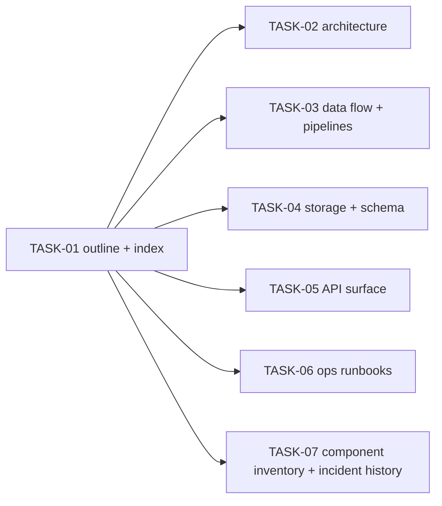

<!-- file: docs/agent-tasks/system-docs/README.md -->
<!-- version: 1.0.0 -->
<!-- guid: 93041526-7283-491a-9f52-87a819203172 -->
<!-- last-edited: 2026-06-28 -->

# Workstream E — Comprehensive system documentation (DOCS-1)

Produce a high-quality documentation set for the audiobook-organizer under
`docs/system/`. Target (TODO.md DOCS-1): **≥9 files and ≥7 Mermaid diagrams**
spanning flowchart, sequence, state-machine, and (where useful) Gantt/ER types.
Model: the `falkcorp/burndown-tasks/docs` gold standard.

These are **documentation** tasks (no production code changes). Recommended
subagent: **documentation subagent** (a **code-exploration subagent** first to
gather accurate detail). Each task writes one area's doc(s) with at least one
Mermaid diagram and is committed independently.

## Tasks & order



| Task | Doc(s) produced | Diagram type |
|------|-----------------|--------------|
| TASK-01 | `docs/system/README.md` (index + outline) | flowchart (site map) |
| TASK-02 | `docs/system/architecture.md` | flowchart (component graph) |
| TASK-03 | `docs/system/pipelines.md` (scan→organize→metadata→dedup→fingerprint) | sequence + state machine |
| TASK-04 | `docs/system/storage.md` (PebbleDB/NutsDB/memdb, key formats) | ER/flowchart |
| TASK-05 | `docs/system/api.md` (HTTP surface, operations v2) | sequence |
| TASK-06 | `docs/system/runbooks.md` (deploy, reparse, dedup drain, recovery) | flowchart |
| TASK-07 | `docs/system/components.md` + `docs/system/incidents.md` | flowchart + timeline/Gantt |

That's 8 task-produced files + this index = **9 files**, and ≥7 diagrams across
them. TASK-01 first (defines the index every other doc links into); TASK-02..07
then run in parallel.

## Accuracy rules (all tasks)

- **Verify against code**, don't invent. Cross-check existing docs:
  `docs/AI-REFERENCE.md`, `docs/database-architecture.md`,
  `docs/database-pebble-schema.md`, and the specs under `docs/specs/`.
- Every file carries the standard header (`<!-- file/version/guid/last-edited -->`).
- Mermaid blocks must render (fenced ```mermaid). Keep diagrams readable
  (≤~25 nodes); split if larger.
- Link between docs with relative paths; keep the index (`docs/system/README.md`)
  authoritative.
