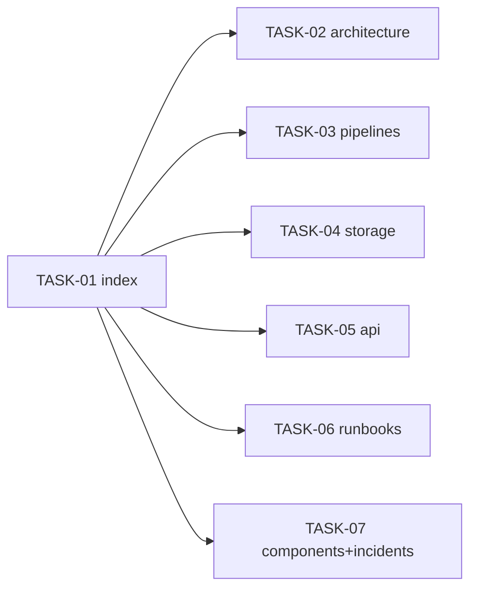

<!-- file: docs/agent-tasks/system-docs/orchestration.md -->
<!-- version: 1.0.0 -->
<!-- guid: 1b829304-5061-4182-973a-586970 -->
<!-- last-edited: 2026-06-28 -->

# Orchestration — system-docs workstream

Read the package-level [`../ORCHESTRATION.md`](../ORCHESTRATION.md) first.

## Waves



- **Wave 1**: TASK-01 (index) — merge first so the others link into agreed names.
- **Wave 2** (parallel): TASK-02..07. They write distinct files → low conflict
  risk (only the index links, already set by TASK-01).

Each is docs-only — gate is "Mermaid renders + links resolve", no code build.

## Run it

```bash
./run.sh 01            # index first
./run.sh 02 03 04 05 06 07
```
