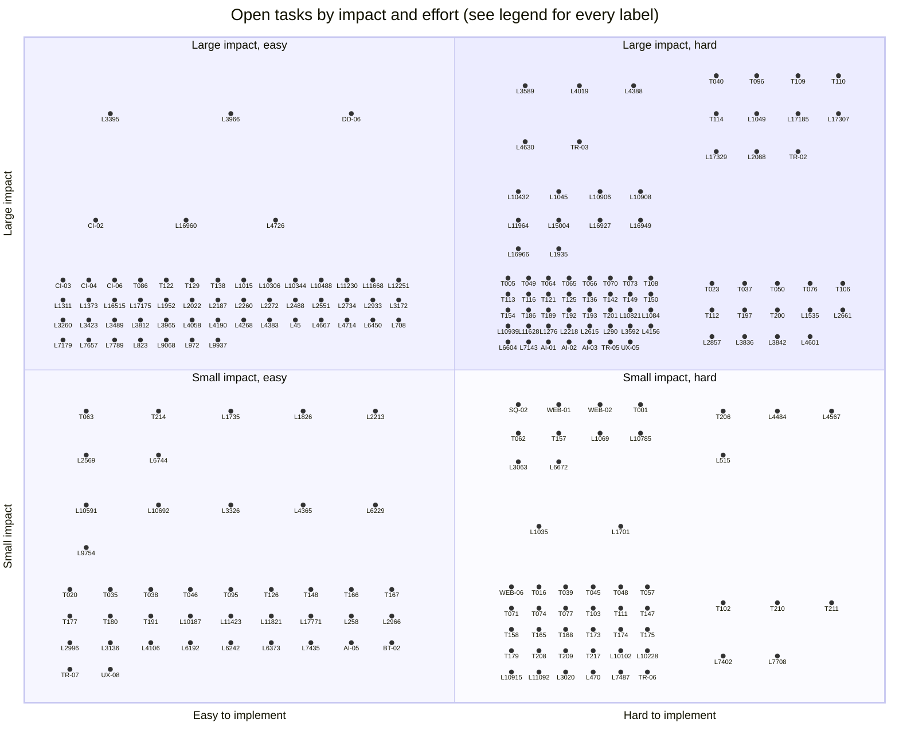

<!-- file: docs/agent-tasks/todo-completion-2026-09/QUADRANT.md -->
<!-- version: 1.0.0 -->
<!-- guid: 6f1d3b8e-2a47-4c95-b0e3-9d7c5a2e1f60 -->
<!-- last-edited: 2026-09-11 -->

# Impact vs effort — every open task on one chart

Generated by `state/tools/build_quadrant.py` from the same rows as
[PRIORITY-MATRIX.md](PRIORITY-MATRIX.md); regenerate, never hand-edit:

```bash
python3 docs/agent-tasks/todo-completion-2026-09/state/tools/build_quadrant.py \
    docs/agent-tasks/todo-completion-2026-09/state docs/agent-tasks/todo-completion-2026-09/QUADRANT.md
```

**How to read it.** Each dot is one unit of work: a brief (`T083` = TASK-083; `TR-03`, `AI-01`,
`UX-05`, `DD-06` are sibling-initiative briefs), an audit finding (`DA-04`, `CI-02`, …), or a
TODO.md section that no brief covers (`L1015` = the section whose first item was line 1015 at
the 2026-09-10 freeze). Right of the centre line = effort M or L; left = S. Above the centre
line = data-loss, security or correctness; below = perf, ux or hygiene. Inside a quadrant the
rows sit in bands by class, worst at the top, and are spread out only so the labels stay
readable — horizontal position inside a band carries no meaning. Gated rows (owner decision,
prod run, or a parked sibling initiative) are on the chart but marked 🔒 in the legend.

**227 open rows** — {'Large impact · easy': 55, 'Large impact · hard': 79, 'Small impact · easy': 42, 'Small impact · hard': 51}. Done since the 2026-09-10 freeze: 76
(listed in PRIORITY-MATRIX.md section C).
By class: {'data-loss': 19, 'security': 13, 'correctness': 102, 'perf': 21, 'ux': 8, 'hygiene': 64}.
By effort: {'S': 97, 'M': 96, 'L': 34}.



## Start here — large impact, easy, not gated

- **`L3966`** [Apply it, REPOINTING rather than deleting](https://github.com/falkcorp/audiobook-organizer/blob/main/TODO.md?plain=1#L4019) — data-loss, effort S · `TODO.md:3966` · brief `TASK-352`
- **`CI-02`** [frontend-ci.yml grants an unjustified, broad permission ceiling to an external reusable workflow](https://github.com/falkcorp/audiobook-organizer/blob/main/.github/workflows/frontend-ci.yml#L20) — security/high, effort S · `CI-02` · brief `TASK-307`
- **`CI-03`** [Node version drift: security.yml pins Node 20.x for npm dependency submission while every other workflow uses ](https://github.com/falkcorp/audiobook-organizer/blob/main/.github/workflows/security.yml#L77) — correctness/medium, effort S · `CI-03` · brief `TASK-312`
- **`CI-04`** [The only Go-version consistency check truncates to major.minor, never checks .envrc/Dockerfiles, and only warn](https://github.com/falkcorp/audiobook-organizer/blob/main/.github/workflows/test-action-integration.yml#L105) — correctness/medium, effort S · `CI-04` · brief `TASK-313`
- **`CI-06`** [frontend job gate is a computed `if:` that can silently skip a required-looking check](https://github.com/falkcorp/audiobook-organizer/blob/main/.github/workflows/frontend-ci.yml#L54) — correctness/low, effort S · `CI-06` · brief `TASK-320`
- **`T086`** [Collapse internal whitespace in util.NormalizeAuthor so double-spaced names dedupe correctly](https://github.com/falkcorp/audiobook-organizer/blob/main/docs/agent-tasks/todo-completion-2026-09/misc-go/TASK-086-collapse-internal-whitespace-in-util-normalizeau.md) — correctness, effort S · `TASK-086`
- **`T122`** [Add an {edition_suffix} folder-pattern token (TODO.md L5021)](https://github.com/falkcorp/audiobook-organizer/blob/main/docs/agent-tasks/todo-completion-2026-09/organize/TASK-122-add-an-edition-suffix-folder-pattern-token.md) — correctness, effort S · `TASK-122`
- **`T129`** [Fix wipeActivity dry-run count saturating at 2](https://github.com/falkcorp/audiobook-organizer/blob/main/docs/agent-tasks/todo-completion-2026-09/server/TASK-129-fix-wipeactivity-dry-run-count-saturating-at-2.md) — correctness, effort S · `TASK-129`
- **`T138`** [Exempt the ABS router group from the global BasicAuth() middleware](https://github.com/falkcorp/audiobook-organizer/blob/main/docs/agent-tasks/todo-completion-2026-09/server/TASK-138-exempt-the-abs-router-group-from-the-global-basi.md) — correctness, effort S · `TASK-138`
- **`L1015`** [Why the books are `imported` is NOT yet established](https://github.com/falkcorp/audiobook-organizer/blob/main/TODO.md?plain=1#L1065) — correctness, effort S, 2 items · `TODO.md:1015`
- **`L10306`** [C111 census: the nil `is_primary_version` population is 5,702 (all ungrouped) — "22,552 nils" was a misread](https://github.com/falkcorp/audiobook-organizer/blob/main/TODO.md?plain=1#L10393) — correctness, effort S, 2 items · `TODO.md:10306`
- **`L10344`** [C716 resolved: the "3,954-book API-vs-store gap" decomposes to 3,953 instrument + 2 quarantined + 0 unexplaine](https://github.com/falkcorp/audiobook-organizer/blob/main/TODO.md?plain=1#L10434) — correctness, effort S · `TODO.md:10344`

## Legend

Every label on the chart, grouped by quadrant and ordered worst-first (class, then severity,
then effort). Links open the brief, the finding's source line, or the section's first open
TODO.md line on `main`.

### Large impact · easy — 55 rows (4 gated)

- **`L3395`** [Decide whether a backup that lands on the same filesystem should warn at startup](https://github.com/falkcorp/audiobook-organizer/blob/main/TODO.md?plain=1#L3448) — data-loss, effort S · `TODO.md:3395` · brief `TASK-349` 🔒 **GATED:** HOLD-FOR-OWNER — The item's own text is a policy decision, not a spec an agent can implement.
- **`L3966`** [Apply it, REPOINTING rather than deleting](https://github.com/falkcorp/audiobook-organizer/blob/main/TODO.md?plain=1#L4019) — data-loss, effort S · `TODO.md:3966` · brief `TASK-352`
- **`DD-06`** [Prod drain of ~387k exact-candidate backlog via dedup.drain-stale (dry-run -> AskUserQuestion -> apply -> veri](https://github.com/falkcorp/audiobook-organizer/blob/main/docs/agent-tasks/dedup-pipeline-hardening/TASK-06-prod-drain-run.md) — data-loss, effort S · `dedup-pipeline-hardening/TASK-06` 🔒 **GATED:** DEFER — drainStaleDoneFlag present (drain_stale.go:47) so the prerequisite (TASK-03) is merged and the mechanism matches design;
- **`CI-02`** [frontend-ci.yml grants an unjustified, broad permission ceiling to an external reusable workflow](https://github.com/falkcorp/audiobook-organizer/blob/main/.github/workflows/frontend-ci.yml#L20) — security/high, effort S · `CI-02` · brief `TASK-307`
- **`L16960`** [TODO-SEC-JWT — Rotate `ABS_JWT_SECRET`](https://github.com/falkcorp/audiobook-organizer/blob/main/TODO.md?plain=1#L17058) — security, effort S · `TODO.md:16960` · brief `TASK-371` 🔒 **GATED:** HOLD-FOR-OWNER — Every cited item is un-dispatchable as a worktree+PR code task; this brief is an operator runbook, not a code brief.
- **`L4726`** [SEC-BACKUP-ABSPATH — Decide whether the backup restore path should *reject* absolute tar en](https://github.com/falkcorp/audiobook-organizer/blob/main/TODO.md?plain=1#L4779) — security, effort S · `TODO.md:4726` · brief `TASK-357` 🔒 **GATED:** HOLD-FOR-OWNER — Real heading is an unrelated WAL-teardown bug; the decision gate blocks straight dispatch.
- **`CI-03`** [Node version drift: security.yml pins Node 20.x for npm dependency submission while every other workflow uses ](https://github.com/falkcorp/audiobook-organizer/blob/main/.github/workflows/security.yml#L77) — correctness/medium, effort S · `CI-03` · brief `TASK-312`
- **`CI-04`** [The only Go-version consistency check truncates to major.minor, never checks .envrc/Dockerfiles, and only warn](https://github.com/falkcorp/audiobook-organizer/blob/main/.github/workflows/test-action-integration.yml#L105) — correctness/medium, effort S · `CI-04` · brief `TASK-313`
- **`CI-06`** [frontend job gate is a computed `if:` that can silently skip a required-looking check](https://github.com/falkcorp/audiobook-organizer/blob/main/.github/workflows/frontend-ci.yml#L54) — correctness/low, effort S · `CI-06` · brief `TASK-320`
- **`T086`** [Collapse internal whitespace in util.NormalizeAuthor so double-spaced names dedupe correctly](https://github.com/falkcorp/audiobook-organizer/blob/main/docs/agent-tasks/todo-completion-2026-09/misc-go/TASK-086-collapse-internal-whitespace-in-util-normalizeau.md) — correctness, effort S · `TASK-086`
- **`T122`** [Add an {edition_suffix} folder-pattern token (TODO.md L5021)](https://github.com/falkcorp/audiobook-organizer/blob/main/docs/agent-tasks/todo-completion-2026-09/organize/TASK-122-add-an-edition-suffix-folder-pattern-token.md) — correctness, effort S · `TASK-122`
- **`T129`** [Fix wipeActivity dry-run count saturating at 2](https://github.com/falkcorp/audiobook-organizer/blob/main/docs/agent-tasks/todo-completion-2026-09/server/TASK-129-fix-wipeactivity-dry-run-count-saturating-at-2.md) — correctness, effort S · `TASK-129`
- **`T138`** [Exempt the ABS router group from the global BasicAuth() middleware](https://github.com/falkcorp/audiobook-organizer/blob/main/docs/agent-tasks/todo-completion-2026-09/server/TASK-138-exempt-the-abs-router-group-from-the-global-basi.md) — correctness, effort S · `TASK-138`
- **`L1015`** [Why the books are `imported` is NOT yet established](https://github.com/falkcorp/audiobook-organizer/blob/main/TODO.md?plain=1#L1065) — correctness, effort S, 2 items · `TODO.md:1015`
- **`L10306`** [C111 census: the nil `is_primary_version` population is 5,702 (all ungrouped) — "22,552 nils" was a misread](https://github.com/falkcorp/audiobook-organizer/blob/main/TODO.md?plain=1#L10393) — correctness, effort S, 2 items · `TODO.md:10306`
- **`L10344`** [C716 resolved: the "3,954-book API-vs-store gap" decomposes to 3,953 instrument + 2 quarantined + 0 unexplaine](https://github.com/falkcorp/audiobook-organizer/blob/main/TODO.md?plain=1#L10434) — correctness, effort S · `TODO.md:10344`
- **`L10488`** [3. Real authors, genuinely duplicated](https://github.com/falkcorp/audiobook-organizer/blob/main/TODO.md?plain=1#L10578) — correctness, effort S, 3 items · `TODO.md:10488`
- **`L11230`** [Search placeholder hint missing when navigating to All Books from Finished](https://github.com/falkcorp/audiobook-organizer/blob/main/TODO.md?plain=1#L11321) — correctness, effort S, 6 items · `TODO.md:11230`
- **`L11668`** [🐛 `book_file.missing` / `file_exists` are stale — nothing maintains them](https://github.com/falkcorp/audiobook-organizer/blob/main/TODO.md?plain=1#L11759) — correctness, effort S, 5 items · `TODO.md:11668`
- **`L12251`** [Missing-file lane — follow-ups after the report-only change (#2614)](https://github.com/falkcorp/audiobook-organizer/blob/main/TODO.md?plain=1#L12348) — correctness, effort S, 24 items · `TODO.md:12251`
- **`L1311`** [Two incidental defects found en route](https://github.com/falkcorp/audiobook-organizer/blob/main/TODO.md?plain=1#L1361) — correctness, effort S, 2 items · `TODO.md:1311`
- **`L1373`** [Terminal ops never get `completed_at`, so they linger as zombies (2026-09-07)](https://github.com/falkcorp/audiobook-organizer/blob/main/TODO.md?plain=1#L1423) — correctness, effort S, 6 items · `TODO.md:1373`
- **`L16515`** [Status 2026-08-04](https://github.com/falkcorp/audiobook-organizer/blob/main/TODO.md?plain=1#L16613) — correctness, effort S, 4 items · `TODO.md:16515`
- **`L17175`** [SEC: origin is reachable from the LAN — "bind loopback" is NOT achievable as specified](https://github.com/falkcorp/audiobook-organizer/blob/main/TODO.md?plain=1#L17273) — correctness, effort S, 4 items · `TODO.md:17175`
- **`L1952`** [CodeQL: the repo's path-sanitizer barrier model does not credit SecureJoin, and we now know it is not the pred](https://github.com/falkcorp/audiobook-organizer/blob/main/TODO.md?plain=1#L2002) — correctness, effort S, 3 items · `TODO.md:1952`
- **`L2022`** [Activity SQLite backend — follow-ups after the cutover](https://github.com/falkcorp/audiobook-organizer/blob/main/TODO.md?plain=1#L2072) — correctness, effort S, 8 items · `TODO.md:2022`
- **`L2187`** [Provider throttling — follow-ups](https://github.com/falkcorp/audiobook-organizer/blob/main/TODO.md?plain=1#L2240) — correctness, effort S, 5 items · `TODO.md:2187`
- **`L2260`** [Orphan duplicate series rows (found fixing the ABS black tiles, 2026-09-05)](https://github.com/falkcorp/audiobook-organizer/blob/main/TODO.md?plain=1#L2313) — correctness, effort S, 2 items · `TODO.md:2260`
- **`L2272`** [Library scan killed by the watchdog while its own auto-backup ran (2026-09-05)](https://github.com/falkcorp/audiobook-organizer/blob/main/TODO.md?plain=1#L2325) — correctness, effort S, 5 items · `TODO.md:2272`
- **`L2488`** [`TestPersistChaptersForBook_MultiFileMP3s_SynthesizesFromTrackTags` asserts on the ffprobe version, not the co](https://github.com/falkcorp/audiobook-organizer/blob/main/TODO.md?plain=1#L2541) — correctness, effort S, 5 items · `TODO.md:2488`
- **`L2551`** [`Book.author_name` is declared in TypeScript but the API never sends it](https://github.com/falkcorp/audiobook-organizer/blob/main/TODO.md?plain=1#L2604) — correctness, effort S, 3 items · `TODO.md:2551`
- **`L2734`** [`SearchBooks` compares a NORMALIZED author name against a raw lower-cased query](https://github.com/falkcorp/audiobook-organizer/blob/main/TODO.md?plain=1#L2787) — correctness, effort S, 6 items · `TODO.md:2734`
- **`L2933`** [Tier 1 — highest value, do next](https://github.com/falkcorp/audiobook-organizer/blob/main/TODO.md?plain=1#L2986) — correctness, effort S, 3 items · `TODO.md:2933`
- **`L3172`** [Testing](https://github.com/falkcorp/audiobook-organizer/blob/main/TODO.md?plain=1#L3225) — correctness, effort S, 3 items · `TODO.md:3172`
- **`L3260`** [Investigate kektordb as a vector-store option](https://github.com/falkcorp/audiobook-organizer/blob/main/TODO.md?plain=1#L3313) — correctness, effort S, 2 items · `TODO.md:3260`
- **`L3423`** [A running scan does not say which kind of scan it is](https://github.com/falkcorp/audiobook-organizer/blob/main/TODO.md?plain=1#L3476) — correctness, effort S, 4 items · `TODO.md:3423`
- **`L3489`** [Auto-organize throws away a relationship it already has, then a later scan rediscovers it](https://github.com/falkcorp/audiobook-organizer/blob/main/TODO.md?plain=1#L3542) — correctness, effort S, 3 items · `TODO.md:3489`
- **`L3812`** [`/reconcile/latest-scan` hides an older, usable preview behind an unparseable newer one](https://github.com/falkcorp/audiobook-organizer/blob/main/TODO.md?plain=1#L3865) — correctness, effort S, 2 items · `TODO.md:3812`
- **`L3965`** [Task 2 — decide the route for the 2,307 (needs a decision, not code yet)](https://github.com/falkcorp/audiobook-organizer/blob/main/TODO.md?plain=1#L4018) — correctness, effort S, 6 items · `TODO.md:3965`
- **`L4058`** [`ensureSingleFileBookFile` is now a backlog-only backfill — decide its retirement](https://github.com/falkcorp/audiobook-organizer/blob/main/TODO.md?plain=1#L4111) — correctness, effort S, 4 items · `TODO.md:4058`
- **`L4190`** [Update Deluge when the organizer moves a book's files](https://github.com/falkcorp/audiobook-organizer/blob/main/TODO.md?plain=1#L4243) — correctness, effort S, 3 items · `TODO.md:4190`
- **`L4268`** [Scan cache is keyed per-book but the skip decision is per-file](https://github.com/falkcorp/audiobook-organizer/blob/main/TODO.md?plain=1#L4321) — correctness, effort S, 3 items · `TODO.md:4268`
- **`L4383`** [Repair the book rows that were written one-per-track](https://github.com/falkcorp/audiobook-organizer/blob/main/TODO.md?plain=1#L4436) — correctness, effort S, 2 items · `TODO.md:4383`
- **`L45`** [Wire `WithRequestTimeout` to config — a cold model load is 84% of the 30s budget](https://github.com/falkcorp/audiobook-organizer/blob/main/TODO.md?plain=1#L98) — correctness, effort S, 3 items · `TODO.md:45`
- **`L4667`** [The directory author fallback reads the TITLE as the author on organized books](https://github.com/falkcorp/audiobook-organizer/blob/main/TODO.md?plain=1#L4720) — correctness, effort S, 2 items · `TODO.md:4667`
- **`L4714`** [`recoverPebbleClosed` does not cover the WAL-write leg, so teardown still panics](https://github.com/falkcorp/audiobook-organizer/blob/main/TODO.md?plain=1#L4767) — correctness, effort S, 25 items · `TODO.md:4714`
- **`L6450`** [Update, same day: scope this down — most of it already exists](https://github.com/falkcorp/audiobook-organizer/blob/main/TODO.md?plain=1#L6524) — correctness, effort S, 4 items · `TODO.md:6450`
- **`L708`** [Decide whether to cap openai-go's own retry loop](https://github.com/falkcorp/audiobook-organizer/blob/main/TODO.md?plain=1#L758) — correctness, effort S, 5 items · `TODO.md:708`
- **`L7179`** [Library data integrity — surfaced by the chapters-backfill cohort run](https://github.com/falkcorp/audiobook-organizer/blob/main/TODO.md?plain=1#L7253) — correctness, effort S, 3 items · `TODO.md:7179`
- **`L7657`** [Config › Dedup](https://github.com/falkcorp/audiobook-organizer/blob/main/TODO.md?plain=1#L7732) — correctness, effort S · `TODO.md:7657`
- **`L7789`** [Config](https://github.com/falkcorp/audiobook-organizer/blob/main/TODO.md?plain=1#L7864) — correctness, effort S, 11 items · `TODO.md:7789`
- **`L823`** [The review lane still downloads the entire candidate set (2026-09-09)](https://github.com/falkcorp/audiobook-organizer/blob/main/TODO.md?plain=1#L873) — correctness, effort S, 3 items · `TODO.md:823`
- **`L9068`** [⚠️ The activity channel overflows during organize and DROPS records](https://github.com/falkcorp/audiobook-organizer/blob/main/TODO.md?plain=1#L9146) — correctness, effort S, 3 items · `TODO.md:9068`
- **`L972`** [ABS layer hides every `imported` book — author pages undercount (2026-09-07)](https://github.com/falkcorp/audiobook-organizer/blob/main/TODO.md?plain=1#L1022) — correctness, effort S, 2 items · `TODO.md:972`
- **`L9937`** [Search / version-group census corrections (2026-08-13)](https://github.com/falkcorp/audiobook-organizer/blob/main/TODO.md?plain=1#L10024) — correctness, effort S, 3 items · `TODO.md:9937`

### Large impact · hard — 79 rows (23 gated)

- **`L3589`** [Repair the 12,525 existing books with no `book_file` rows, and the ~1,710 track-titled fragment rows](https://github.com/falkcorp/audiobook-organizer/blob/main/TODO.md?plain=1#L3642) — data-loss, effort M · `TODO.md:3589` · brief `TASK-350` 🔒 **GATED:** HOLD-FOR-OWNER — A worktree PR can build a repair tool, but closing this item means running it against damaged prod rows, which collides 
- **`L4019`** [Decide how to repair the duplicate author rows that already exist](https://github.com/falkcorp/audiobook-organizer/blob/main/TODO.md?plain=1#L4072) — data-loss, effort M · `TODO.md:4019` · brief `TASK-353` 🔒 **GATED:** HOLD-FOR-OWNER — The cited text is purely a decision request, not an implementable spec.
- **`L4388`** [Decide the repair shape with the user before writing it](https://github.com/falkcorp/audiobook-organizer/blob/main/TODO.md?plain=1#L4441) — data-loss, effort M · `TODO.md:4388` · brief `TASK-355` 🔒 **GATED:** HOLD-FOR-OWNER — Item is a decision gate, not a spec — collapsing per-track book rows without a chosen shape is exactly the write an agen
- **`L4630`** [Decide how to merge the duplicate author rows already present, and whether book `AuthorID`s pointing](https://github.com/falkcorp/audiobook-organizer/blob/main/TODO.md?plain=1#L4683) — data-loss, effort M · `TODO.md:4630` · brief `TASK-356` 🔒 **GATED:** HOLD-FOR-OWNER — Item text is a decision request about merge policy, not an implementable fix.
- **`TR-03`** [Route the MoveStorage call sites through mode-aware relocation](https://github.com/falkcorp/audiobook-organizer/blob/main/docs/agent-tasks/torrent-relocation/TASK-03-mode-aware-callsites.md) — data-loss, effort M · `torrent-relocation/TASK-03` 🔒 **GATED:** parked (DECISIONS-PENDING row 2)
- **`T040`** [Make UnmergeAuto reverse external-ID reassignment and iTunes write-back removals, not just the book record](https://github.com/falkcorp/audiobook-organizer/blob/main/docs/agent-tasks/todo-completion-2026-09/dedup/TASK-040-make-unmergeauto-reverse-external-id-reassignmen.md) — data-loss, effort L · `TASK-040` 🔒 **GATED:** DEFER — UnmergeAuto (internal/dedup/auto_resolve.go:389) has no caller outside its own definition — no route or handler wires it
- **`T096`** [Require every mutating operation to declare and enforce dry_run support at the registry](https://github.com/falkcorp/audiobook-organizer/blob/main/docs/agent-tasks/todo-completion-2026-09/missing-file-lane/TASK-096-require-every-mutating-operation-to-declare-and-.md) — data-loss, effort L · `TASK-096`
- **`T109`** [Parse Deluge torrent release names into structured candidate metadata (author/series/volume/narrator/edition/y](https://github.com/falkcorp/audiobook-organizer/blob/main/docs/agent-tasks/todo-completion-2026-09/missing-file-lane/TASK-109-parse-deluge-torrent-release-names-into-structur.md) — data-loss, effort L · `TASK-109` 🔒 **GATED:** DEFER — Feeds Deluge-parsed release-name metadata into the identity matcher, but the torrent-relocation initiative is parked and
- **`T110`** [Audit book/file grouping against Deluge torrent file-list membership (read-only, tier 1 of the item's own 3-ti](https://github.com/falkcorp/audiobook-organizer/blob/main/docs/agent-tasks/todo-completion-2026-09/missing-file-lane/TASK-110-audit-book-file-grouping-against-deluge-torrent-.md) — data-loss, effort L · `TASK-110` 🔒 **GATED:** DEFER — Read-only audit tier, but net-new Deluge development (0 hits for audit/grouping code in internal/deluge or internal/plug
- **`T114`** [Never delete — re-associate: combine debris books into a template match by duration, then version-group (TODO.](https://github.com/falkcorp/audiobook-organizer/blob/main/docs/agent-tasks/todo-completion-2026-09/missing-file-lane/TASK-114-never-delete-re-associate-combine-debris-books-i.md) — data-loss, effort L · `TASK-114`
- **`L1049`** [Full-application-database reset (future, GATED)](https://github.com/falkcorp/audiobook-organizer/blob/main/TODO.md?plain=1#L1099) — data-loss, effort L · `TODO.md:1049` · brief `TASK-336` 🔒 **GATED:** DEFER — The item's own text makes the DB reset valid only after the reverify gate (TASK-335) exists; that gate is unbuilt and it
- **`L17185`** [ABS-SYNC TASK-12 (P1, data-loss class): close the three identity gaps so §4.3's ID-durability claim ](https://github.com/falkcorp/audiobook-organizer/blob/main/TODO.md?plain=1#L17283) — data-loss, effort L · `TODO.md:17185` · brief `TASK-373`
- **`L17307`** [iTunes 2-way-sync — continuation (P3 redefine + reverse sync + footgun audit)](https://github.com/falkcorp/audiobook-organizer/blob/main/TODO.md?plain=1#L17405) — data-loss, effort L · `TODO.md:17307` · brief `TASK-374` 🔒 **GATED:** HOLD-FOR-OWNER — Validator (TASK-364 row): blocked on an unresolved owner design decision — no shipped design to implement against.
- **`L17329`** [iTunes 2-way sync writeback (edit-in-place, preserve play-state)](https://github.com/falkcorp/audiobook-organizer/blob/main/TODO.md?plain=1#L17427) — data-loss, effort L · `TODO.md:17329` · brief `TASK-375` 🔒 **GATED:** HOLD-FOR-OWNER — Validator (TASK-364 row): blocked on an unresolved owner design decision — no shipped design to implement against.
- **`L2088`** [Duplicate & placeholder book records — PRIORITY 3 of the 2026-09-05 audit cleanup](https://github.com/falkcorp/audiobook-organizer/blob/main/TODO.md?plain=1#L2141) — data-loss, effort L · `TODO.md:2088` · brief `TASK-342`
- **`TR-02`** [Real-Deluge re-point spike + UpdateStoragePath implementation](https://github.com/falkcorp/audiobook-organizer/blob/main/docs/agent-tasks/torrent-relocation/TASK-02-deluge-repoint-spike.md) — data-loss, effort L · `torrent-relocation/TASK-02` 🔒 **GATED:** parked (DECISIONS-PENDING row 2)
- **`L10432`** [CA12 wave 2: model `logging.Sanitize`/`SanitizeErr`/`logger.sanitizeLogLine` as CodeQL log-injection](https://github.com/falkcorp/audiobook-organizer/blob/main/TODO.md?plain=1#L10522) — security, effort M · `TODO.md:10432` · brief `TASK-364`
- **`L1045`** [Reauth / passkey reverify gate (future)](https://github.com/falkcorp/audiobook-organizer/blob/main/TODO.md?plain=1#L1095) — security, effort M · `TODO.md:1045` · brief `TASK-335`
- **`L10906`** [SEC-2 — bootstrap still writes plaintext credential files (`internal/server/bo](https://github.com/falkcorp/audiobook-organizer/blob/main/TODO.md?plain=1#L10996) — security, effort M · `TODO.md:10906` · brief `TASK-365`
- **`L10908`** [SEC-4 residue — no CSP header yet (middleware comment defers until a nonce/hash strate](https://github.com/falkcorp/audiobook-organizer/blob/main/TODO.md?plain=1#L10998) — security, effort M · `TODO.md:10908` · brief `TASK-366`
- **`L11964`** [`OperationDef.Permissions` is enforced by nothing — and PR-3 is about to delete the code that *is* d](https://github.com/falkcorp/audiobook-organizer/blob/main/TODO.md?plain=1#L12060) — security, effort M · `TODO.md:11964` · brief `TASK-367` 🔒 **GATED:** SUPERSEDED — TriggerOperationV2 (handlers/operations_v2.go:578-588) already enforces def.Permissions behind h.enforcePerms; NewOperat
- **`L15004`** [react-router GHSA-qwww-vcr4-c8h2 — accepted, not reachable, do not re-litigate](https://github.com/falkcorp/audiobook-organizer/blob/main/TODO.md?plain=1#L15102) — security, effort M · `TODO.md:15004` · brief `TASK-368`
- **`L16927`** [TODO-SSO-EDGE — Neither native-app auth mode is actually configured at the Cloudflare ](https://github.com/falkcorp/audiobook-organizer/blob/main/TODO.md?plain=1#L17025) — security, effort M · `TODO.md:16927` · brief `TASK-369` 🔒 **GATED:** HOLD-FOR-OWNER — Every cited item is un-dispatchable as a worktree+PR code task; this brief is an operator runbook, not a code brief.
- **`L16949`** [TODO-SEC-BIND — The service binds every interface (`ExecStart=… serve --host 0.0.0.0 -](https://github.com/falkcorp/audiobook-organizer/blob/main/TODO.md?plain=1#L17047) — security, effort M · `TODO.md:16949` · brief `TASK-370` 🔒 **GATED:** HOLD-FOR-OWNER — Every cited item is un-dispatchable as a worktree+PR code task; this brief is an operator runbook, not a code brief.
- **`L16966`** [TODO-SEC-SYSTEMD — The unit has `User=audiobook`, `NoNewPrivileges`, `ProtectKernelTunabl](https://github.com/falkcorp/audiobook-organizer/blob/main/TODO.md?plain=1#L17064) — security, effort M · `TODO.md:16966` · brief `TASK-372` 🔒 **GATED:** HOLD-FOR-OWNER — Every cited item is un-dispatchable as a worktree+PR code task; this brief is an operator runbook, not a code brief.
- **`L1935`** [🔴 The barrier still does not fire, and deleting the invalid file did not fix it](https://github.com/falkcorp/audiobook-organizer/blob/main/TODO.md?plain=1#L1985) — security, effort M · `TODO.md:1935` · brief `TASK-341` 🔒 **GATED:** HOLD-FOR-OWNER — Section title is unrelated (reflink/zdb) to the cited item (CodeQL barrier); the item's own text says a guess-fix is not
- **`T005`** [Wire OnlyParsedTranscription-style filtering into the interactive audiobooks list endpoint](https://github.com/falkcorp/audiobook-organizer/blob/main/docs/agent-tasks/todo-completion-2026-09/audiobooks/TASK-005-wire-onlyparsedtranscription-style-filtering-int.md) — correctness, effort M · `TASK-005`
- **`T049`** [Acoustic-confirm signal: promote near-dupe title-leak pairs using WholeFileSimilarity](https://github.com/falkcorp/audiobook-organizer/blob/main/docs/agent-tasks/todo-completion-2026-09/dedup/TASK-049-acoustic-confirm-signal-promote-near-dupe-title-.md) — correctness, effort M · `TASK-049`
- **`T064`** [Add a Part->disc / Chapter->track filename parser so 'P0-C0'-style folders stop falling to ambiguous](https://github.com/falkcorp/audiobook-organizer/blob/main/docs/agent-tasks/todo-completion-2026-09/itunes/TASK-064-add-a-part-disc-chapter-track-filename-parser-so.md) — correctness, effort M · `TASK-064`
- **`T065`** [P2 relocate-only sync cycle -- wire RunRelocateSyncCycle to a caller and add an end-to-end test](https://github.com/falkcorp/audiobook-organizer/blob/main/docs/agent-tasks/todo-completion-2026-09/itunes/TASK-065-p2-relocate-only-sync-cycle-the-composed-cycle-a.md) — correctness, effort M · `TASK-065`
- **`T066`** [Wire a durable freshness stamp for maintenance.chapters-backfill before it is ever scheduled](https://github.com/falkcorp/audiobook-organizer/blob/main/docs/agent-tasks/todo-completion-2026-09/maintenance/TASK-066-wire-a-durable-freshness-stamp-for-maintenance-c.md) — correctness, effort M · `TASK-066`
- **`T070`** [Add a user-configurable activity-log retention window (default 7 days, 0=never)](https://github.com/falkcorp/audiobook-organizer/blob/main/docs/agent-tasks/todo-completion-2026-09/maintenance/TASK-070-add-a-user-configurable-activity-log-retention-w.md) — correctness, effort M · `TASK-070`
- **`T073`** [Read-through audit of the 8 ctxOpID consumer call sites now that op IDs actually arrive](https://github.com/falkcorp/audiobook-organizer/blob/main/docs/agent-tasks/todo-completion-2026-09/maintenance/TASK-073-read-through-audit-of-the-8-ctxopid-consumer-cal.md) — correctness, effort M · `TASK-073`
- **`T108`** [Add the review/rating half of app-to-server reading-state sync (reading status half already exists) (TODO.md L](https://github.com/falkcorp/audiobook-organizer/blob/main/docs/agent-tasks/todo-completion-2026-09/missing-file-lane/TASK-108-add-the-review-rating-half-of-app-to-server-read.md) — correctness, effort M · `TASK-108`
- **`T113`** [Missing-input triggering: enqueue the producer op when a waiting_deps requirement's input has never run (TODO.](https://github.com/falkcorp/audiobook-organizer/blob/main/docs/agent-tasks/todo-completion-2026-09/missing-file-lane/TASK-113-missing-input-triggering-enqueue-the-producer-op.md) — correctness, effort M · `TASK-113`
- **`T116`** [Forward IsCanceled() through reporterLogger to the ops registry's cancellation signal (TODO.md L4586)](https://github.com/falkcorp/audiobook-organizer/blob/main/docs/agent-tasks/todo-completion-2026-09/operations/TASK-116-forward-iscanceled-through-reporterlogger-to-the.md) — correctness, effort M · `TASK-116`
- **`T121`** [Make resolveOrganizedFilePath's plan-on-faith fallback loud and verify-before-write (TODO.md L4919)](https://github.com/falkcorp/audiobook-organizer/blob/main/docs/agent-tasks/todo-completion-2026-09/organize/TASK-121-make-resolveorganizedfilepath-s-plan-on-faith-fa.md) — correctness, effort M · `TASK-121`
- **`T125`** [Index track names on BookDocument so smart playlists can match them](https://github.com/falkcorp/audiobook-organizer/blob/main/docs/agent-tasks/todo-completion-2026-09/search/TASK-125-index-track-names-on-bookdocument-so-smart-playl.md) — correctness, effort M · `TASK-125`
- **`T136`** [Convert reconcile.apply from ResumeDrop to real checkpoint/resume](https://github.com/falkcorp/audiobook-organizer/blob/main/docs/agent-tasks/todo-completion-2026-09/server/TASK-136-convert-reconcile-apply-from-resumedrop-to-real-.md) — correctness, effort M · `TASK-136`
- **`T142`** [Expose UnmergeAuto through an admin undo-merge endpoint (list + invoke)](https://github.com/falkcorp/audiobook-organizer/blob/main/docs/agent-tasks/todo-completion-2026-09/server-handlers/TASK-142-expose-unmergeauto-through-an-admin-undo-merge-e.md) — correctness, effort M · `TASK-142`
- **`T149`** [Detect multi-file books whose synthesized chapter timeline stops short of Book.Duration (per-file BookFile.Dur](https://github.com/falkcorp/audiobook-organizer/blob/main/docs/agent-tasks/todo-completion-2026-09/server-handlers/TASK-149-detect-multi-file-books-whose-synthesized-chapte.md) — correctness, effort M · `TASK-149`
- **`T150`** [Audit apply-shaped endpoints for missing tag/file-I/O writeback](https://github.com/falkcorp/audiobook-organizer/blob/main/docs/agent-tasks/todo-completion-2026-09/server-handlers/TASK-150-audit-apply-shaped-endpoints-for-missing-tag-fil.md) — correctness, effort M · `TASK-150`
- **`T154`** [Implement POST /api/session/local-all (batch local-session sync, accept both body shapes)](https://github.com/falkcorp/audiobook-organizer/blob/main/docs/agent-tasks/todo-completion-2026-09/server-handlers/TASK-154-implement-post-api-session-local-all-batch-local.md) — correctness, effort M · `TASK-154`
- **`T186`** [Measure the real double-primary rate library-wide, then build the demote-extras sibling of ElectMissingPrimari](https://github.com/falkcorp/audiobook-organizer/blob/main/docs/agent-tasks/todo-completion-2026-09/misc-go/TASK-186-measure-the-real-double-primary-rate-library-wid.md) — correctness, effort M · `TASK-186`
- **`T189`** [Play the first ~2 minutes of part 1's audio directly from the review metadata panel, reusing the existing boun](https://github.com/falkcorp/audiobook-organizer/blob/main/docs/agent-tasks/todo-completion-2026-09/web/TASK-189-play-the-first-2-minutes-of-part-1-s-audio-direc.md) — correctness, effort M · `TASK-189`
- **`T192`** [Clamp ComposeScore against per-kind confidence bounds; route calibrate-composite Round 2 through a new apply_c](https://github.com/falkcorp/audiobook-organizer/blob/main/docs/agent-tasks/todo-completion-2026-09/dedup/TASK-192-clamp-composescore-against-per-kind-confidence-b.md) — correctness, effort M · `TASK-192`
- **`T193`** [Wire Round-2 confidence-bound clamping into a distinct apply_confidence path; keep the live display score raw](https://github.com/falkcorp/audiobook-organizer/blob/main/docs/agent-tasks/todo-completion-2026-09/dedup/TASK-193-wire-round-2-confidence-bound-clamping-into-a-di.md) — correctness, effort M · `TASK-193`
- **`T201`** [Wire per-file intro classification into the regroup-shattered-books classifier, outranking runtime (TODO.md L8](https://github.com/falkcorp/audiobook-organizer/blob/main/docs/agent-tasks/todo-completion-2026-09/missing-file-lane/TASK-201-wire-per-file-intro-classification-into-the-regr.md) — correctness, effort M · `TASK-201`
- **`L10821`** [Offset-pagination walkers: 5 remaining + the CI flake is NOT the cross-page swap](https://github.com/falkcorp/audiobook-organizer/blob/main/TODO.md?plain=1#L10911) — correctness, effort M · `TODO.md:10821`
- **`L1084`** [Sweep `api.ts` for missing `{data:…}` envelope unwraps (2026-09-07)](https://github.com/falkcorp/audiobook-organizer/blob/main/TODO.md?plain=1#L1134) — correctness, effort M, 3 items · `TODO.md:1084`
- **`L10939`** [Series table integrity — follow-ups from the 2026-08-14 prune repair](https://github.com/falkcorp/audiobook-organizer/blob/main/TODO.md?plain=1#L11029) — correctness, effort M, 2 items · `TODO.md:10939`
- **`L11628`** [Stranded `.tmp-rename` recovery — bisect complete, recovery outstanding](https://github.com/falkcorp/audiobook-organizer/blob/main/TODO.md?plain=1#L11719) — correctness, effort M · `TODO.md:11628`
- **`L1276`** [Work](https://github.com/falkcorp/audiobook-organizer/blob/main/TODO.md?plain=1#L1326) — correctness, effort M · `TODO.md:1276`
- **`L2218`** [Author-numbering cleanup follow-ups (from the 2026-09-05 production runs)](https://github.com/falkcorp/audiobook-organizer/blob/main/TODO.md?plain=1#L2271) — correctness, effort M, 2 items · `TODO.md:2218` · brief `TASK-343` 🔒 **GATED:** RECLASSIFY — Section matches but the class tag is wrong — reporting/completeness gaps, not a data-loss or security risk.
- **`L2615`** [`internal/personname` silently drops every Georgian author (and the obvious fix is inert)](https://github.com/falkcorp/audiobook-organizer/blob/main/TODO.md?plain=1#L2668) — correctness, effort M · `TODO.md:2615`
- **`L290`** [Audit every path derived from `database_path` for overlay-order dependence](https://github.com/falkcorp/audiobook-organizer/blob/main/TODO.md?plain=1#L340) — correctness, effort M, 2 items · `TODO.md:290`
- **`L3592`** [Prod has `chapter_consolidation_threshold_min = 0`, which disables multi-file grouping](https://github.com/falkcorp/audiobook-organizer/blob/main/TODO.md?plain=1#L3645) — correctness, effort M · `TODO.md:3592`
- **`L4156`** [AI filename parsing is queued now — what to verify after deploy](https://github.com/falkcorp/audiobook-organizer/blob/main/TODO.md?plain=1#L4209) — correctness, effort M, 2 items · `TODO.md:4156`
- **`L6604`** [CI / automation](https://github.com/falkcorp/audiobook-organizer/blob/main/TODO.md?plain=1#L6678) — correctness, effort M · `TODO.md:6604`
- **`L7143`** [ABS API — sweep every endpoint for accepted-but-ignored query parameters](https://github.com/falkcorp/audiobook-organizer/blob/main/TODO.md?plain=1#L7217) — correctness, effort M · `TODO.md:7143`
- **`AI-01`** [Migrate metadata_llm_review.go single call to /v1/responses (AI-RESP-A)](https://github.com/falkcorp/audiobook-organizer/blob/main/docs/agent-tasks/ai-responses-migration/TASK-01-metadata-llm-review.md) — correctness, effort M · `ai-responses-migration/TASK-01` 🔒 **GATED:** on hold (useResponsesAPI design)
- **`AI-02`** [Migrate openai_parser.go single-shot calls (6 sites) (AI-RESP-B)](https://github.com/falkcorp/audiobook-organizer/blob/main/docs/agent-tasks/ai-responses-migration/TASK-02-openai-parser.md) — correctness, effort M · `ai-responses-migration/TASK-02` 🔒 **GATED:** on hold (useResponsesAPI design)
- **`AI-03`** [Migrate Batches API (openai_batch.go) -- verify allowlist first (AI-RESP-D)](https://github.com/falkcorp/audiobook-organizer/blob/main/docs/agent-tasks/ai-responses-migration/TASK-03-batches-api.md) — correctness, effort M · `ai-responses-migration/TASK-03` 🔒 **GATED:** on hold (useResponsesAPI design)
- **`TR-05`** [qBittorrent re-point + Transmission client in internal/download (guarded)](https://github.com/falkcorp/audiobook-organizer/blob/main/docs/agent-tasks/torrent-relocation/TASK-05-qbit-transmission-adapters.md) — correctness, effort M · `torrent-relocation/TASK-05` 🔒 **GATED:** parked (DECISIONS-PENDING row 2)
- **`UX-05`** [C8: auto-file a GitHub issue per not_dup cluster, dry-run + human-gated (#1447)](https://github.com/falkcorp/audiobook-organizer/blob/main/docs/agent-tasks/ux-small-items/TASK-05-c8-autofile-notdup-issues.md) — correctness, effort M · `ux-small-items/TASK-05`
- **`T023`** [Investigate then evict/dirty-flag merged-away book/file IDs from every read cache so losers stop appearing aft](https://github.com/falkcorp/audiobook-organizer/blob/main/docs/agent-tasks/todo-completion-2026-09/database/TASK-023-investigate-then-evict-dirty-flag-merged-away-bo.md) — correctness, effort L · `TASK-023`
- **`T037`** [Omnibus/anthology book_type field -- Part 1 of the omnibus-detection-and-dedup spec](https://github.com/falkcorp/audiobook-organizer/blob/main/docs/agent-tasks/todo-completion-2026-09/database/TASK-037-omnibus-anthology-book-type-field-part-1-of-the-.md) — correctness, effort L · `TASK-037`
- **`T050`** [Shattered-book reassembly: match fragment file-sets against the reference corpus via fpidx containment](https://github.com/falkcorp/audiobook-organizer/blob/main/docs/agent-tasks/todo-completion-2026-09/dedup/TASK-050-shattered-book-reassembly-match-fragment-file-se.md) — correctness, effort L · `TASK-050`
- **`T076`** [Author-narrator swap repair, routed through the review queue](https://github.com/falkcorp/audiobook-organizer/blob/main/docs/agent-tasks/todo-completion-2026-09/maintenance/TASK-076-author-narrator-swap-repair-routed-through-the-r.md) — correctness, effort L · `TASK-076`
- **`T106`** [Import found playlist files (.m3u/.m3u8/.pls/.cue/.xspf) during scan, resolving entries to book_file rows (TOD](https://github.com/falkcorp/audiobook-organizer/blob/main/docs/agent-tasks/todo-completion-2026-09/missing-file-lane/TASK-106-import-found-playlist-files-m3u-m3u8-pls-cue-xsp.md) — correctness, effort L · `TASK-106`
- **`T112`** [Build the First Aid orchestrator + frontend trigger button (dry-run by default, no schedule) (TODO.md L8890)](https://github.com/falkcorp/audiobook-organizer/blob/main/docs/agent-tasks/todo-completion-2026-09/missing-file-lane/TASK-112-build-the-first-aid-orchestrator-frontend-trigge.md) — correctness, effort L · `TASK-112`
- **`T197`** [Audit every registry.RunItems caller's custom Label closure for the post-fn re-render timing change](https://github.com/falkcorp/audiobook-organizer/blob/main/docs/agent-tasks/todo-completion-2026-09/misc-go/TASK-197-audit-every-registry-runitems-caller-s-custom-la.md) — correctness, effort L · `TASK-197`
- **`T200`** [Build the tiered per-file intro-transcription backfill (Tiers 0/1/1b/2/3) (TODO.md L8316)](https://github.com/falkcorp/audiobook-organizer/blob/main/docs/agent-tasks/todo-completion-2026-09/missing-file-lane/TASK-200-build-the-tiered-per-file-intro-transcription-ba.md) — correctness, effort L · `TASK-200`
- **`L1535`** [Real reflink detection via zdb DVA comparison (LOW PRIORITY, 2026-09-07)](https://github.com/falkcorp/audiobook-organizer/blob/main/TODO.md?plain=1#L1585) — correctness, effort L · `TODO.md:1535`
- **`L2661`** ["Last, First" is not used as a discriminator when choosing the author side](https://github.com/falkcorp/audiobook-organizer/blob/main/TODO.md?plain=1#L2714) — correctness, effort L · `TODO.md:2661`
- **`L2857`** [Re-calibrate the absolute title-distance gates for non-Latin scripts](https://github.com/falkcorp/audiobook-organizer/blob/main/TODO.md?plain=1#L2910) — correctness, effort L · `TODO.md:2857`
- **`L3836`** [Finish the LLM fallback chain — stages 2 through 4](https://github.com/falkcorp/audiobook-organizer/blob/main/TODO.md?plain=1#L3889) — correctness, effort L, 2 items · `TODO.md:3836`
- **`L3842`** [Stage 3 — durable deferral — When no rung answers, the candidates are currently just left unparsed](https://github.com/falkcorp/audiobook-organizer/blob/main/TODO.md?plain=1#L3895) — correctness, effort L · `TODO.md:3842` · brief `TASK-351` 🔒 **GATED:** RECLASSIFY — Section matches exactly, but this is a pipeline-completeness feature, mislabelled into the data-loss/security bucket.
- **`L4601`** [resume-sweep — never started, needs the user's go-ahead](https://github.com/falkcorp/audiobook-organizer/blob/main/TODO.md?plain=1#L4654) — correctness, effort L · `TODO.md:4601`

### Small impact · easy — 42 rows (2 gated)

- **`T063`** [internal/itunes/backfill.go BackfillITunesTrackPIDs: same offset-pagination bug](https://github.com/falkcorp/audiobook-organizer/blob/main/docs/agent-tasks/todo-completion-2026-09/itunes/TASK-063-internal-itunes-backfill-go-backfillitunestrackp.md) — perf, effort S · `TASK-063`
- **`T214`** [Cap GET /api/v1/audiobooks/metadata/cache/review to a default page size, add all=true escape hatch, and log wh](https://github.com/falkcorp/audiobook-organizer/blob/main/docs/agent-tasks/todo-completion-2026-09/server-handlers/TASK-214-cap-get-api-v1-audiobooks-metadata-cache-review-.md) — perf, effort S · `TASK-214`
- **`L1735`** [N+1 / batch-endpoint audit follow-ups (2026-09-08)](https://github.com/falkcorp/audiobook-organizer/blob/main/TODO.md?plain=1#L1785) — perf, effort S, 10 items · `TODO.md:1735`
- **`L1826`** [New hotspots INSIDE search, ranked (these are the real follow-ups)](https://github.com/falkcorp/audiobook-organizer/blob/main/TODO.md?plain=1#L1876) — perf, effort S, 5 items · `TODO.md:1826`
- **`L2213`** [Author-numbering cleanup follow-ups (from the 2026-09-05 production runs)](https://github.com/falkcorp/audiobook-organizer/blob/main/TODO.md?plain=1#L2266) — perf, effort S · `TODO.md:2213`
- **`L2569`** [Dedup search resolves book IDs with a full `GetAllBooksCore` read](https://github.com/falkcorp/audiobook-organizer/blob/main/TODO.md?plain=1#L2622) — perf, effort S, 3 items · `TODO.md:2569`
- **`L6744`** [Tasks](https://github.com/falkcorp/audiobook-organizer/blob/main/TODO.md?plain=1#L6818) — perf, effort S, 2 items · `TODO.md:6744`
- **`L10591`** [Likely cause](https://github.com/falkcorp/audiobook-organizer/blob/main/TODO.md?plain=1#L10681) — ux, effort S · `TODO.md:10591`
- **`L10692`** [PERF-4 is still live: iTunes search calls `SearchBooks(search, 0, 0)`](https://github.com/falkcorp/audiobook-organizer/blob/main/TODO.md?plain=1#L10782) — ux, effort S, 3 items · `TODO.md:10692`
- **`L3326`** [Applied books stay in the list in BulkMetadataSearchDialog](https://github.com/falkcorp/audiobook-organizer/blob/main/TODO.md?plain=1#L3379) — ux, effort S, 2 items · `TODO.md:3326`
- **`L4365`** [Fix](https://github.com/falkcorp/audiobook-organizer/blob/main/TODO.md?plain=1#L4418) — ux, effort S · `TODO.md:4365`
- **`L6229`** [Bulk book-merge shows "Merged all" even when individual merges failed](https://github.com/falkcorp/audiobook-organizer/blob/main/TODO.md?plain=1#L6303) — ux, effort S · `TODO.md:6229`
- **`L9754`** [Make metadata fields on the book page clickable (future improvement)](https://github.com/falkcorp/audiobook-organizer/blob/main/TODO.md?plain=1#L9841) — ux, effort S, 2 items · `TODO.md:9754`
- **`T020`** [Delete the fully inert --enable-sqlite3-i-know-the-risks flag and EnableSQLite config option](https://github.com/falkcorp/audiobook-organizer/blob/main/docs/agent-tasks/todo-completion-2026-09/config/TASK-020-delete-the-fully-inert-enable-sqlite3-i-know-the.md) — hygiene, effort S · `TASK-020`
- **`T035`** [Add DeleteNarrator to the store (CRUD building block only)](https://github.com/falkcorp/audiobook-organizer/blob/main/docs/agent-tasks/todo-completion-2026-09/database/TASK-035-add-deletenarrator-to-the-store-crud-building-bl.md) — hygiene, effort S · `TASK-035`
- **`T038`** [Filter system-sourced tags out of the Browse-by-Tag cloud](https://github.com/falkcorp/audiobook-organizer/blob/main/docs/agent-tasks/todo-completion-2026-09/database/TASK-038-filter-system-sourced-tags-out-of-the-browse-by-.md) — hygiene, effort S · `TASK-038`
- **`T046`** [Route merge.AsExternalIDReassigner through database.AsCapability instead of a bare assertion](https://github.com/falkcorp/audiobook-organizer/blob/main/docs/agent-tasks/todo-completion-2026-09/dedup/TASK-046-route-merge-asexternalidreassigner-through-datab.md) — hygiene, effort S · `TASK-046`
- **`T095`** [Instrument sort_by usage to inform the enabled_sort_indexes decision](https://github.com/falkcorp/audiobook-organizer/blob/main/docs/agent-tasks/todo-completion-2026-09/missing-file-lane/TASK-095-instrument-sort-by-usage-to-inform-the-enabled-s.md) — hygiene, effort S · `TASK-095`
- **`T126`** [Surface to the user when 'all'/'and' (or any stopword) is silently dropped from a search query](https://github.com/falkcorp/audiobook-organizer/blob/main/docs/agent-tasks/todo-completion-2026-09/search/TASK-126-surface-to-the-user-when-all-and-or-any-stopword.md) — hygiene, effort S · `TASK-126`
- **`T148`** [Re-capture the series ABS fixture against a populated library (it currently contains zero series)](https://github.com/falkcorp/audiobook-organizer/blob/main/docs/agent-tasks/todo-completion-2026-09/server-handlers/TASK-148-re-capture-the-series-abs-fixture-against-a-popu.md) — hygiene, effort S · `TASK-148`
- **`T166`** [Make the book-detail page's Author field(s) link to a library view filtered by that author](https://github.com/falkcorp/audiobook-organizer/blob/main/docs/agent-tasks/todo-completion-2026-09/web/TASK-166-make-the-book-detail-page-s-author-field-s-link-.md) — hygiene, effort S · `TASK-166`
- **`T167`** [Make the book-detail page's Series field link to a library view filtered by that series, landing at series_ind](https://github.com/falkcorp/audiobook-organizer/blob/main/docs/agent-tasks/todo-completion-2026-09/web/TASK-167-make-the-book-detail-page-s-series-field-link-to.md) — hygiene, effort S · `TASK-167`
- **`T177`** [Add a per-test deadline (context.WithTimeout) to internal/database's riskiest unbounded-wait test helpers](https://github.com/falkcorp/audiobook-organizer/blob/main/docs/agent-tasks/todo-completion-2026-09/database/TASK-177-add-a-per-test-deadline-context-withtimeout-to-i.md) — hygiene, effort S · `TASK-177`
- **`T180`** [Measure whether dedup:duration-abridged (3,573) is over-firing before touching its display](https://github.com/falkcorp/audiobook-organizer/blob/main/docs/agent-tasks/todo-completion-2026-09/dedup/TASK-180-measure-whether-dedup-duration-abridged-3-573-is.md) — hygiene, effort S · `TASK-180`
- **`T191`** [Bump the github-common reusable-workflow pins in at least two PRs, low-consequence first](https://github.com/falkcorp/audiobook-organizer/blob/main/docs/agent-tasks/todo-completion-2026-09/ci-tooling/TASK-191-bump-the-github-common-reusable-workflow-pins-in.md) — hygiene, effort S · `TASK-191`
- **`L10187`** [Author table: copyright text and HTML entities leaked into artist tags](https://github.com/falkcorp/audiobook-organizer/blob/main/TODO.md?plain=1#L10274) — hygiene, effort S, 2 items · `TODO.md:10187`
- **`L11423`** [Import-path scan no longer surfaces per-file scan errors](https://github.com/falkcorp/audiobook-organizer/blob/main/TODO.md?plain=1#L11514) — hygiene, effort S · `TODO.md:11423`
- **`L11821`** [Update 2026-08-16: one of these was NOT pre-existing](https://github.com/falkcorp/audiobook-organizer/blob/main/TODO.md?plain=1#L11917) — hygiene, effort S · `TODO.md:11821`
- **`L17771`** [Remaining — execution state (briefs)](https://github.com/falkcorp/audiobook-organizer/blob/main/TODO.md?plain=1#L17869) — hygiene, effort S · `TODO.md:17771`
- **`L258`** [Activity compaction — three follow-ups found while fixing the double-count](https://github.com/falkcorp/audiobook-organizer/blob/main/TODO.md?plain=1#L308) — hygiene, effort S · `TODO.md:258`
- **`L2966`** [Tier 2 — worth doing, needs a per-test read](https://github.com/falkcorp/audiobook-organizer/blob/main/TODO.md?plain=1#L3019) — hygiene, effort S, 4 items · `TODO.md:2966`
- **`L2996`** [Do NOT convert — with the reason](https://github.com/falkcorp/audiobook-organizer/blob/main/TODO.md?plain=1#L3049) — hygiene, effort S, 4 items · `TODO.md:2996`
- **`L3136`** [Tooling / CI](https://github.com/falkcorp/audiobook-organizer/blob/main/TODO.md?plain=1#L3189) — hygiene, effort S · `TODO.md:3136`
- **`L4106`** [staticcheck gates nothing on a PR — decide whether it should](https://github.com/falkcorp/audiobook-organizer/blob/main/TODO.md?plain=1#L4159) — hygiene, effort S, 3 items · `TODO.md:4106`
- **`L6192`** [📋 `DECISIONS-PENDING.md` contradicts itself — settled decisions still listed as open](https://github.com/falkcorp/audiobook-organizer/blob/main/TODO.md?plain=1#L6266) — hygiene, effort S · `TODO.md:6192`
- **`L6242`** [🧹 DEP-1e — drop the deprecated `Book.ITunesPath` field](https://github.com/falkcorp/audiobook-organizer/blob/main/TODO.md?plain=1#L6316) — hygiene, effort S · `TODO.md:6242`
- **`L6373`** [🧩 Queued-op consolidator — collapse N queued runs of one def into a single merged op](https://github.com/falkcorp/audiobook-organizer/blob/main/TODO.md?plain=1#L6447) — hygiene, effort S · `TODO.md:6373`
- **`L7435`** [ghcommon reusable-workflow pins are a month apart — decide, don't drift](https://github.com/falkcorp/audiobook-organizer/blob/main/TODO.md?plain=1#L7510) — hygiene, effort S, 2 items · `TODO.md:7435`
- **`AI-05`** [Delete remaining Chat Completions call sites in internal/ai/ (AI-RESP-F)](https://github.com/falkcorp/audiobook-organizer/blob/main/docs/agent-tasks/ai-responses-migration/TASK-05-cleanup-chatcompletions.md) — hygiene, effort S · `ai-responses-migration/TASK-05` 🔒 **GATED:** on hold (useResponsesAPI design)
- **`BT-02`** [Drain the staticcheck backlog to green (#1796)](https://github.com/falkcorp/audiobook-organizer/blob/main/docs/agent-tasks/bug-techdebt/TASK-02-staticcheck-burndown.md) — hygiene, effort S · `bug-techdebt/TASK-02`
- **`TR-07`** [Close the deferred undo re-point item: mode-matrix cells in existing suites](https://github.com/falkcorp/audiobook-organizer/blob/main/docs/agent-tasks/torrent-relocation/TASK-07-undo-repoint-closure.md) — hygiene, effort S · `torrent-relocation/TASK-07` 🔒 **GATED:** parked (DECISIONS-PENDING row 2)
- **`UX-08`** [SLOG-PROD-VERIFY: smoke-test the op-ID chain on prod, read-only (#1255) -- NOT AGENT WORK](https://github.com/falkcorp/audiobook-organizer/blob/main/docs/agent-tasks/ux-small-items/TASK-08-slog-prod-verify.md) — hygiene, effort S · `ux-small-items/TASK-08`

### Small impact · hard — 51 rows (1 gated)

- **`SQ-02`** [No persisted author->books secondary index; pre-memdb-warmup fallback does two full-keyspace scans for a singl](https://github.com/falkcorp/audiobook-organizer/blob/main/internal/database/pebble_store.go#L2254) — perf/high, effort M · `SQ-02` · brief `TASK-322`
- **`WEB-01`** [Authors page fetches the entire authors table on every mount, no server pagination](https://github.com/falkcorp/audiobook-organizer/blob/main/web/src/services/api.ts#L1893) — perf/high, effort M · `WEB-01` · brief `TASK-324`
- **`WEB-02`** [Series page fetches the entire series table on every mount, no server pagination](https://github.com/falkcorp/audiobook-organizer/blob/main/web/src/services/api.ts#L1827) — perf/medium, effort M · `WEB-02` · brief `TASK-327`
- **`T001`** [Add a short-TTL cache to the search branch of GetAudiobooksWithTotal](https://github.com/falkcorp/audiobook-organizer/blob/main/docs/agent-tasks/todo-completion-2026-09/audiobooks/TASK-001-add-a-short-ttl-cache-to-the-search-branch-of-ge.md) — perf, effort M · `TASK-001`
- **`T062`** [internal/itunes/backfill.go BackfillExternalIDs: replace offset pagination with GetAllBooksFullFrom cursor](https://github.com/falkcorp/audiobook-organizer/blob/main/docs/agent-tasks/todo-completion-2026-09/itunes/TASK-062-internal-itunes-backfill-go-backfillexternalids-.md) — perf, effort M · `TASK-062`
- **`T157`** [Parallelize the per-candidate synchronous label/breakdown refresh in DismissDedupCluster](https://github.com/falkcorp/audiobook-organizer/blob/main/docs/agent-tasks/todo-completion-2026-09/server-handlers/TASK-157-parallelize-the-per-candidate-synchronous-label-.md) — perf, effort M · `TASK-157`
- **`L1069`** [Re-enable SQLite activity backend after details compression (2026-09-07)](https://github.com/falkcorp/audiobook-organizer/blob/main/TODO.md?plain=1#L1119) — perf, effort M · `TODO.md:1069`
- **`L10785`** [✅ Root cause (2026-08-14, fixed in `fix/author-getter-conformance`)](https://github.com/falkcorp/audiobook-organizer/blob/main/TODO.md?plain=1#L10875) — perf, effort M · `TODO.md:10785`
- **`L3063`** [Concurrency](https://github.com/falkcorp/audiobook-organizer/blob/main/TODO.md?plain=1#L3116) — perf, effort M · `TODO.md:3063`
- **`L6672`** [Dedup](https://github.com/falkcorp/audiobook-organizer/blob/main/TODO.md?plain=1#L6746) — perf, effort M · `TODO.md:6672`
- **`T206`** [Split or speed up the internal/server test package -- migrate call sites to a lighter newTestServer helper](https://github.com/falkcorp/audiobook-organizer/blob/main/docs/agent-tasks/todo-completion-2026-09/server/TASK-206-split-or-speed-up-the-internal-server-test-packa.md) — perf, effort L · `TASK-206`
- **`L4484`** [Tasks](https://github.com/falkcorp/audiobook-organizer/blob/main/TODO.md?plain=1#L4537) — perf, effort L · `TODO.md:4484`
- **`L4567`** [The real fix, and the home for the path-keyed cache](https://github.com/falkcorp/audiobook-organizer/blob/main/TODO.md?plain=1#L4620) — perf, effort L · `TODO.md:4567`
- **`L515`** [Two db-optimize ops exist; only one reports progress](https://github.com/falkcorp/audiobook-organizer/blob/main/TODO.md?plain=1#L565) — perf, effort L · `TODO.md:515`
- **`L1035`** [Activity-log reset feature + reauth gate (2026-09-07)](https://github.com/falkcorp/audiobook-organizer/blob/main/TODO.md?plain=1#L1085) — ux, effort M · `TODO.md:1035`
- **`L1701`** [Finish the v1 resume teardown: the `opstate:params` side table and `GetInterruptedOperations`](https://github.com/falkcorp/audiobook-organizer/blob/main/TODO.md?plain=1#L1751) — ux, effort M · `TODO.md:1701`
- **`WEB-06`** [No Vitest or Playwright coverage exists for the Authors or Series pages](https://github.com/falkcorp/audiobook-organizer/blob/main/web/src/pages/__tests__) — hygiene/medium, effort M · `WEB-06` · brief `TASK-332`
- **`T016`** [Rename write_back_metadata config key to auto_write_tags_on_fetch with deprecated-alias migration](https://github.com/falkcorp/audiobook-organizer/blob/main/docs/agent-tasks/todo-completion-2026-09/config/TASK-016-rename-write-back-metadata-config-key-to-auto-wr.md) — hygiene, effort M · `TASK-016`
- **`T039`** [Add transcribe_status to the book-summary list projection and a frontend quality filter control](https://github.com/falkcorp/audiobook-organizer/blob/main/docs/agent-tasks/todo-completion-2026-09/database/TASK-039-add-transcribe-status-to-the-book-summary-list-p.md) — hygiene, effort M · `TASK-039`
- **`T045`** [Build a dry-run report-only classifier for series that look like they were minted from a book title](https://github.com/falkcorp/audiobook-organizer/blob/main/docs/agent-tasks/todo-completion-2026-09/dedup/TASK-045-build-a-dry-run-report-only-classifier-for-serie.md) — hygiene, effort M · `TASK-045`
- **`T048`** [Physically co-locate a Combine survivor's files under RootDir after CombineBooks](https://github.com/falkcorp/audiobook-organizer/blob/main/docs/agent-tasks/todo-completion-2026-09/dedup/TASK-048-physically-co-locate-a-combine-survivor-s-files-.md) — hygiene, effort M · `TASK-048`
- **`T057`** [Phase 8 -- write the ABS topology, runbook, and migration guide](https://github.com/falkcorp/audiobook-organizer/blob/main/docs/agent-tasks/todo-completion-2026-09/docs/TASK-057-phase-8-write-the-abs-topology-runbook-and-migra.md) — hygiene, effort M · `TASK-057`
- **`T071`** [Build a detection-only report of other title-fragment author rows](https://github.com/falkcorp/audiobook-organizer/blob/main/docs/agent-tasks/todo-completion-2026-09/maintenance/TASK-071-build-a-detection-only-report-of-other-title-fra.md) — hygiene, effort M · `TASK-071`
- **`T074`** [Build a report-only census of books with a placeholder author already baked into their organizer-tree path but](https://github.com/falkcorp/audiobook-organizer/blob/main/docs/agent-tasks/todo-completion-2026-09/maintenance/TASK-074-build-a-report-only-census-of-books-with-a-place.md) — hygiene, effort M · `TASK-074`
- **`T077`** [Narrow the 3 remaining maintenance-jobs callees off maintenance.JobStore](https://github.com/falkcorp/audiobook-organizer/blob/main/docs/agent-tasks/todo-completion-2026-09/maintenance/TASK-077-narrow-the-3-remaining-maintenance-jobs-callees-.md) — hygiene, effort M · `TASK-077`
- **`T103`** [Build a report-only op categorizing the transcribe_status vs IntroTranscription drift (79.3% whisper_error-wit](https://github.com/falkcorp/audiobook-organizer/blob/main/docs/agent-tasks/todo-completion-2026-09/missing-file-lane/TASK-103-build-a-report-only-op-categorizing-the-transcri.md) — hygiene, effort M · `TASK-103`
- **`T111`** [Build the pre-apply snapshot tool for the 138 pending multidisc holds (TODO.md L8837)](https://github.com/falkcorp/audiobook-organizer/blob/main/docs/agent-tasks/todo-completion-2026-09/missing-file-lane/TASK-111-build-the-pre-apply-snapshot-tool-for-the-138-pe.md) — hygiene, effort M · `TASK-111`
- **`T147`** [Align ABS conformance fixtures with the oracle so CompareValues stays green permanently](https://github.com/falkcorp/audiobook-organizer/blob/main/docs/agent-tasks/todo-completion-2026-09/server-handlers/TASK-147-align-abs-conformance-fixtures-with-the-oracle-s.md) — hygiene, effort M · `TASK-147`
- **`T158`** [Add a Settings panel section to edit path_aliases](https://github.com/falkcorp/audiobook-organizer/blob/main/docs/agent-tasks/todo-completion-2026-09/web/TASK-158-add-a-settings-panel-section-to-edit-path-aliase.md) — hygiene, effort M · `TASK-158`
- **`T165`** [Review the 17 apiFetch-callers' catch handlers for session-expiry messaging](https://github.com/falkcorp/audiobook-organizer/blob/main/docs/agent-tasks/todo-completion-2026-09/web/TASK-165-review-the-17-apifetch-callers-catch-handlers-fo.md) — hygiene, effort M · `TASK-165`
- **`T168`** [Make Narrator, Publisher, Genre, and Release Year fields link to filtered library views (all four have real fi](https://github.com/falkcorp/audiobook-organizer/blob/main/docs/agent-tasks/todo-completion-2026-09/web/TASK-168-make-narrator-publisher-genre-and-release-year-f.md) — hygiene, effort M · `TASK-168`
- **`T173`** [Add resizable/sortable columns to the acoustic dedup candidates table](https://github.com/falkcorp/audiobook-organizer/blob/main/docs/agent-tasks/todo-completion-2026-09/web/TASK-173-add-resizable-sortable-columns-to-the-acoustic-d.md) — hygiene, effort M · `TASK-173`
- **`T174`** [Add resizable/sortable columns to the Activity Log table](https://github.com/falkcorp/audiobook-organizer/blob/main/docs/agent-tasks/todo-completion-2026-09/web/TASK-174-add-resizable-sortable-columns-to-the-activity-l.md) — hygiene, effort M · `TASK-174`
- **`T175`** [Add resizable/sortable columns to the split-book dedup candidates table](https://github.com/falkcorp/audiobook-organizer/blob/main/docs/agent-tasks/todo-completion-2026-09/web/TASK-175-add-resizable-sortable-columns-to-the-split-book.md) — hygiene, effort M · `TASK-175`
- **`T179`** [database.Store (40) -- build the AST/go-types CI gate that makes it unreachable in new files](https://github.com/falkcorp/audiobook-organizer/blob/main/docs/agent-tasks/todo-completion-2026-09/database/TASK-179-database-store-40-build-the-ast-go-types-ci-gate.md) — hygiene, effort M · `TASK-179`
- **`T208`** [Migrate internal/server test fixtures to setupTestServerWithStore — itunes_error_test.go, version_lifecycle_te](https://github.com/falkcorp/audiobook-organizer/blob/main/docs/agent-tasks/todo-completion-2026-09/server/TASK-208-migrate-internal-server-test-fixtures-to-setupte.md) — hygiene, effort M · `TASK-208`
- **`T209`** [Migrate internal/server test fixtures to setupTestServerWithStore — itunes_integration_test.go, indexed_store_](https://github.com/falkcorp/audiobook-organizer/blob/main/docs/agent-tasks/todo-completion-2026-09/server/TASK-209-migrate-internal-server-test-fixtures-to-setupte.md) — hygiene, effort M · `TASK-209`
- **`T217`** [Evidence panel: explain a missing score derivation in plain language and offer re-search inline](https://github.com/falkcorp/audiobook-organizer/blob/main/docs/agent-tasks/todo-completion-2026-09/web/TASK-217-evidence-panel-explain-a-missing-score-derivatio.md) — hygiene, effort M · `TASK-217`
- **`L10102`** [Search follow-ups from the wildcard/phrase fix (2026-08-13)](https://github.com/falkcorp/audiobook-organizer/blob/main/TODO.md?plain=1#L10189) — hygiene, effort M, 2 items · `TODO.md:10102`
- **`L10228`** [Author table: book titles are being comma-split into author rows](https://github.com/falkcorp/audiobook-organizer/blob/main/TODO.md?plain=1#L10315) — hygiene, effort M · `TODO.md:10228`
- **`L10915`** [2026-06-22 security-sweep: the items still open after the status pass](https://github.com/falkcorp/audiobook-organizer/blob/main/TODO.md?plain=1#L11005) — hygiene, effort M, 2 items · `TODO.md:10915`
- **`L11092`** [`?version_group_id=` lists the whole library, and cannot be guarded](https://github.com/falkcorp/audiobook-organizer/blob/main/TODO.md?plain=1#L11182) — hygiene, effort M · `TODO.md:11092`
- **`L3020`** [Docs](https://github.com/falkcorp/audiobook-organizer/blob/main/TODO.md?plain=1#L3073) — hygiene, effort M · `TODO.md:3020`
- **`L470`** [Operation parent/child lineage is never populated by the BACKEND](https://github.com/falkcorp/audiobook-organizer/blob/main/TODO.md?plain=1#L520) — hygiene, effort M · `TODO.md:470`
- **`L7487`** [Interface width: the five the sweep did not reach](https://github.com/falkcorp/audiobook-organizer/blob/main/TODO.md?plain=1#L7562) — hygiene, effort M, 2 items · `TODO.md:7487`
- **`TR-06`** [Tri-state relocation config + Settings UI + docs](https://github.com/falkcorp/audiobook-organizer/blob/main/docs/agent-tasks/torrent-relocation/TASK-06-tristate-relocation-config.md) — hygiene, effort M · `torrent-relocation/TASK-06` 🔒 **GATED:** parked (DECISIONS-PENDING row 2)
- **`T102`** [TypeScript 6.0.3 → 7.0.2 migration (the one remaining piece of the frontend-framework-versions survey) (TODO.m](https://github.com/falkcorp/audiobook-organizer/blob/main/docs/agent-tasks/todo-completion-2026-09/missing-file-lane/TASK-102-typescript-6-0-3-7-0-2-migration-the-one-remaini.md) — hygiene, effort L · `TASK-102`
- **`T210`** [Migrate internal/server test fixtures to setupTestServerWithStore — server_coverage_phase2_test.go, deluge_int](https://github.com/falkcorp/audiobook-organizer/blob/main/docs/agent-tasks/todo-completion-2026-09/server/TASK-210-migrate-internal-server-test-fixtures-to-setupte.md) — hygiene, effort L · `TASK-210`
- **`T211`** [Migrate internal/server test fixtures to setupTestServerWithStore — cover_history_test.go, server_middleware_t](https://github.com/falkcorp/audiobook-organizer/blob/main/docs/agent-tasks/todo-completion-2026-09/server/TASK-211-migrate-internal-server-test-fixtures-to-setupte.md) — hygiene, effort L · `TASK-211`
- **`L7402`** [Organize/apply rename paths: three hand-verified silent failures](https://github.com/falkcorp/audiobook-organizer/blob/main/TODO.md?plain=1#L7477) — hygiene, effort L · `TODO.md:7402`
- **`L7708`** [Dedup](https://github.com/falkcorp/audiobook-organizer/blob/main/TODO.md?plain=1#L7783) — hygiene, effort L · `TODO.md:7708`

