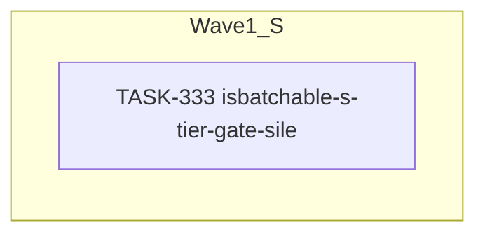

<!-- file: docs/agent-tasks/todo-completion-2026-09/activity/orchestration.md -->
<!-- version: 1.0.0 -->
<!-- guid: 08a1797c-8557-43ef-9418-661f5f38cc45 -->
<!-- last-edited: 2026-09-10 -->

# Orchestration — activity workstream (todo-completion-2026-09)

Read the package-level [`../ORCHESTRATION.md`](../ORCHESTRATION.md) first. Waves here are by effort (S → M → L) because the new briefs carry no cross-task `Depends on:`; carried-forward briefs keep their original `Depends on:` line — honor it over this grouping. **Same-file rule:** two briefs that name the same file in their anchors never run in the same wave.

