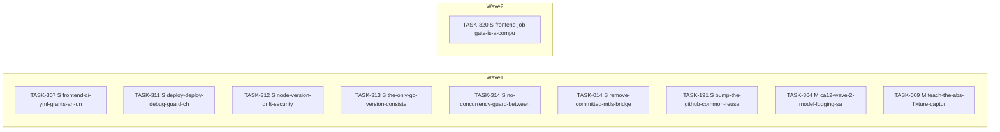

<!-- file: docs/agent-tasks/todo-completion-2026-09/ci-tooling/orchestration.md -->
<!-- version: 1.7.0 -->
<!-- guid: 26cd9f1b-4bc6-4db5-a343-77522635bb1a -->
<!-- last-edited: 2026-09-10 -->

# Orchestration — ci-tooling workstream (todo-completion-2026-09)

Read the package-level [`../ORCHESTRATION.md`](../ORCHESTRATION.md) first. Waves here are effort order (S → M → L) with the **same-file rule applied**: a brief joins the earliest wave in which no earlier-placed brief names one of its source files, so two briefs that share a file never sit in the same wave. Carried-forward briefs keep their original `Depends on:` line — honor it over this grouping.

**Held for the owner (not dispatchable as code):** TASK-341 (HOLD-FOR-OWNER)
