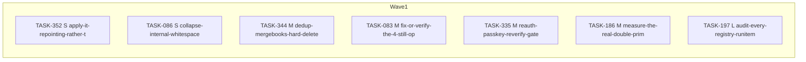

<!-- file: docs/agent-tasks/todo-completion-2026-09/misc-go/orchestration.md -->
<!-- version: 1.6.0 -->
<!-- guid: a2d5e791-8594-476f-bd60-cd506e9d0231 -->
<!-- last-edited: 2026-09-10 -->

# Orchestration — misc-go workstream (todo-completion-2026-09)

Read the package-level [`../ORCHESTRATION.md`](../ORCHESTRATION.md) first. Waves here are effort order (S → M → L) with the **same-file rule applied**: a brief joins the earliest wave in which no earlier-placed brief names one of its source files, so two briefs that share a file never sit in the same wave. Carried-forward briefs keep their original `Depends on:` line — honor it over this grouping.

**Held for the owner (not dispatchable as code):** TASK-349 (HOLD-FOR-OWNER), TASK-350 (HOLD-FOR-OWNER), TASK-355 (HOLD-FOR-OWNER), TASK-357 (HOLD-FOR-OWNER), TASK-369 (HOLD-FOR-OWNER), TASK-370 (HOLD-FOR-OWNER), TASK-371 (HOLD-FOR-OWNER), TASK-372 (HOLD-FOR-OWNER), TASK-374 (HOLD-FOR-OWNER)
