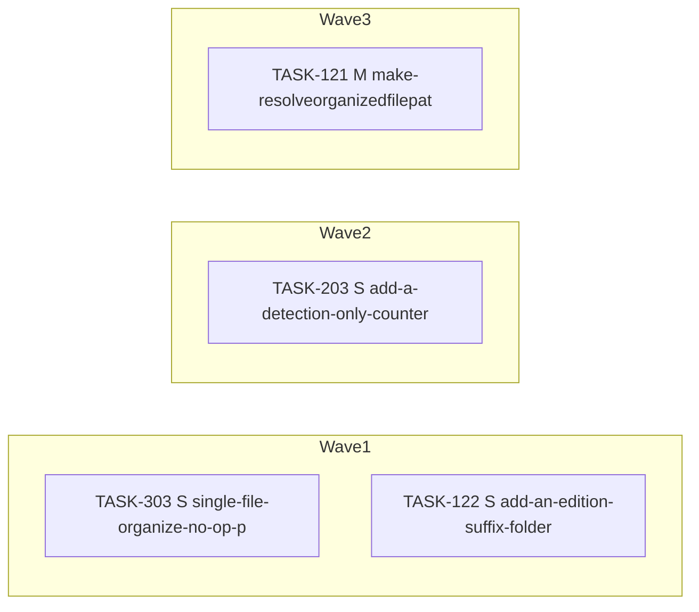

<!-- file: docs/agent-tasks/todo-completion-2026-09/organize/orchestration.md -->
<!-- version: 1.6.0 -->
<!-- guid: cb675bf1-028e-4703-813a-e9f497898418 -->
<!-- last-edited: 2026-09-10 -->

# Orchestration — organize workstream (todo-completion-2026-09)

Read the package-level [`../ORCHESTRATION.md`](../ORCHESTRATION.md) first. Waves here are effort order (S → M → L) with the **same-file rule applied**: a brief joins the earliest wave in which no earlier-placed brief names one of its source files, so two briefs that share a file never sit in the same wave. Carried-forward briefs keep their original `Depends on:` line — honor it over this grouping.

