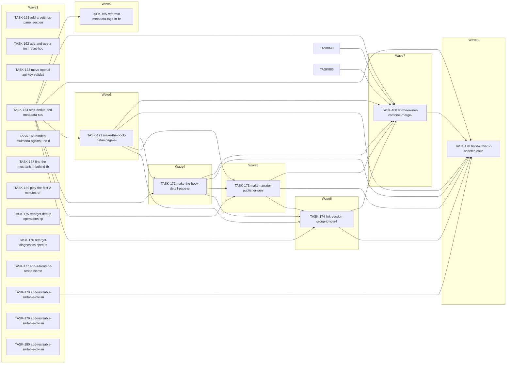

<!-- file: docs/agent-tasks/todo-completion/web/orchestration.md -->
<!-- version: 1.0.0 -->
<!-- guid: a77f49e4-964d-45bd-855f-f055b4f7a827 -->
<!-- last-edited: 2026-08-21 -->

# Orchestration — web workstream (todo-completion)

Read the package-level [`../../ORCHESTRATION.md`](../../ORCHESTRATION.md) first. This file only adds the workstream-specific wave order.

## Waves (respect `Depends on:` and the collision matrix)

An edge `A --> B` means B waits for A's merge (shared file or explicit dependency). No edge = parallel-safe.

## Coordinator protocol (verbatim)

> **Coordinator owns git. Workers never push.** Each worker operates only inside its
> assigned worktree: edit, test, commit — then stop. Workers never run `git push`,
> `gh pr`, or any merge command. The coordinator runs the gate (`make ci && npm --prefix web run lint && npm --prefix web test ; npm --prefix web run lint && npm --prefix web test`) in each
> finished worktree, opens the PR, merges (rebase/FF unless the repo profile says
> otherwise), and then **rebases every open sibling worktree** before dispatching
> anything else.
>
> **Per-merge sibling-rebase loop:** after EVERY merge to `origin/main`:
> for each open sibling worktree, `git fetch origin && git rebase
> origin/main`. A sibling that skips a rebase is a future conflict.
>
> **Conflict escalation ladder** (in order, never skip a rung): 1) clean rebase;
> 2) conflict-resolver subagent (Sonnet-class, only when the conflict spans 1–3 small
> files); 3) file-copy cherry-pick fallback — re-apply the task's file states onto a
> fresh branch from HEAD; 4) mark `rebase_blocked`, stop the lane, escalate to a human.
>
> **A wave MUST NOT start** while any of: the previous wave has an unmerged PR that is
> NOT a held review-critical PR; any sibling worktree is un-rebased; the gate is red on
> `origin/main`; or a `rebase_blocked` marker is unresolved.
>
> **Held PRs (review-critical / prod-data path):** the coordinator opens the PR and
> STOPS — never `gh pr merge`. A held PR does not block the wave; only tasks that share a
> file with it are deferred to a `held-dependent` queue and dispatched after the owner
> merges it. The owner sees the held list in the coordinator's status report.

## Run it

Dispatch each brief with the paste preamble:

> You are an autonomous coding agent. Execute this task exactly. Do not skip the
> START HERE setup. Stop and report if any acceptance criterion fails.

Run at most 4 workers concurrently on this machine (16 concurrent agents crashed the session on 2026-08-21).
