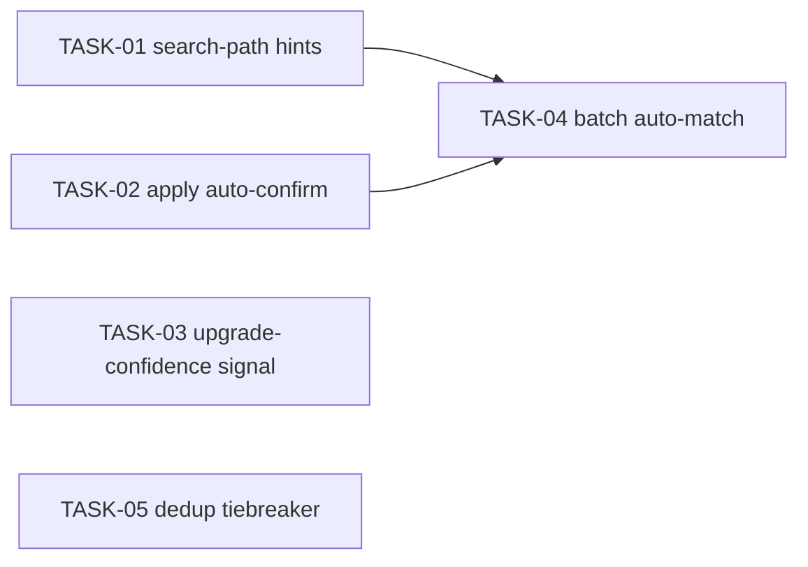

<!-- file: docs/agent-tasks/transcription-matching/README.md -->
<!-- version: 1.0.0 -->
<!-- guid: 2d4f6a80-1b3c-4e5f-9a0b-7c8d9e0f1a2b -->
<!-- last-edited: 2026-06-28 -->

# Workstream B — Wire transcription into matching (TOP PRIORITY)

Each audiobook can carry **audio-derived** fields parsed from the first 90s of
narration (Whisper): `Book.TranscribedTitle`, `Book.TranscribedAuthor`,
`Book.TranscribedNarrator` (`internal/database/store.go` ~line 269). These are
ground truth pulled from the book itself, so when an external metadata candidate
matches them, that is strong evidence the candidate is correct.

**Already shipped (do NOT redo):** the *discovery / auto-fetch* path already uses
these fields — `hintsFromBook`, `transcriptionBoost`, and the variadic
`transcriptionHints` on `pickBestMatchFromScored` in
`internal/metafetch/service_scoring.go`, plus fallback query construction in
`internal/metafetch/service_fetch.go`. The parser that fills the fields was also
fixed (`internal/transcribe/parse.go`, staged extractor) and a `reparse_only`
op exists on `maintenance.transcribe-book-intros`.

These tasks extend that wiring into the rest of the **matching** surface:
manual search, apply/auto-confirm, the upgrade job, batch auto-apply, and dedup.

## Tasks & dependency graph

| Task | Title | Priority | Effort | Depends on |
|------|-------|----------|--------|-----------|
| TASK-01 | Search-path transcription hints | P1 | S | — |
| TASK-02 | Apply auto-confirm on exact transcription match | P1 | M | — |
| TASK-03 | Upgrade-confidence transcription signal | P2 | M | — |
| TASK-04 | Batch auto-match operation | P1 | L | TASK-02 |
| TASK-05 | Dedup tiebreaker via transcription | P3 | M | — |

Run wave 1 (TASK-01, TASK-05) and wave 2 (TASK-02, TASK-03) in parallel;
TASK-04 last (needs TASK-02). See `orchestration.md`.

## Shared reference — scoring constants & helpers

From `internal/metafetch/service_scoring.go` (verify before editing — line numbers drift):

| Symbol | Meaning |
|--------|---------|
| `f1MinScore = 0.35` | min score for the F1 base tier |
| `config.AppConfig.MetadataScoring.EmbeddingBestMatch` | min score for the embedding tier |
| `transcriptionHints{title, author, narrator}` | the audio-derived hints struct |
| `hintsFromBook(book *database.Book) transcriptionHints` | extracts + drops garbage |
| `transcriptionBoost(score, r, hints)` | ×2.0 exact title / ×1.4 substring / ×1.6 author / ×1.4 narrator |
| `pickBestMatchFromScored(..., hints ...transcriptionHints)` | variadic; hints optional |
| `containsCI(a, b)` | case-insensitive substring both-ways |

`MetadataReviewStatus` values: `nil` (unreviewed) · `"matched"` · `"no_match"`.
Tests for this area go in `internal/metafetch/transcription_match_test.go`.

> **Tag**: in TODO.md these correspond to the "wire transcription into matching"
> initiative (TRANSCR-MATCH-1..5).
