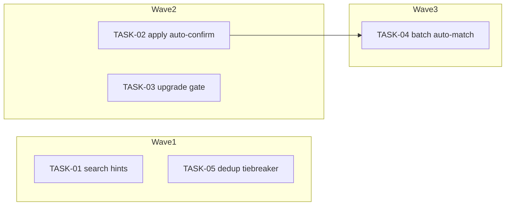

<!-- file: docs/agent-tasks/transcription-matching/orchestration.md -->
<!-- version: 1.0.0 -->
<!-- guid: 83a4b50c-7192-44b5-9c61-3c4d5e6f7081 -->
<!-- last-edited: 2026-06-28 -->

# Orchestration — transcription-matching workstream

Read the package-level [`../ORCHESTRATION.md`](../ORCHESTRATION.md) first. This
file only adds the workstream-specific wave order.

## Waves (respect `Depends on:`)



- **Wave 1** (parallel, independent): TASK-01, TASK-05.
- **Wave 2** (parallel, independent): TASK-02, TASK-03.
- **Wave 3** (after TASK-02 merged): TASK-04.

## Run it

```bash
# from docs/agent-tasks/
./run.sh                 # prints wave order + sets up worktrees for wave 1
./run.sh 01 05           # wave 1 only
./run.sh 02 03           # wave 2 (after wave 1 merged + siblings rebased)
./run.sh 04              # wave 3 (after TASK-02 merged)
```

After each wave: gate each worktree (`go build ./... && go test ./internal/metafetch/ -count=1`),
push/PR/merge as coordinator, then rebase remaining siblings onto `origin/main`.
