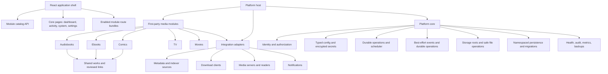
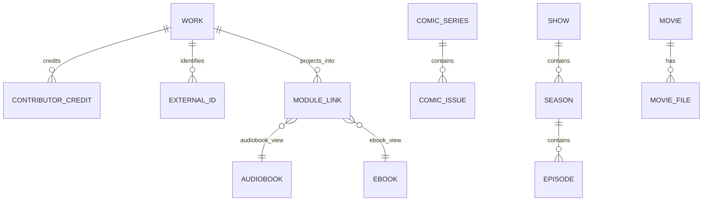

<!-- file: docs/architecture/2026-09-18-pluggable-media-platform-evaluation.md -->
<!-- version: 1.1.0 -->
<!-- guid: 0fbbd3bc-b6bf-4d6f-beb1-6a09cb00ec68 -->
<!-- last-edited: 2026-09-18 -->

# Pluggable Media Platform Evaluation

> **Adversarial review:** The original proposal was challenged against current
> lifecycle, persistence, UI, data-model, security, and migration behavior.
> Corrections from that review are incorporated below; the evidence and
> rejected assumptions are recorded in
> [`2026-09-18-pluggable-media-platform-adversarial-review.md`](2026-09-18-pluggable-media-platform-adversarial-review.md).

## Recommendation

Keep Go. Evolve this application into a **single-binary, compile-time modular
media platform**, then prove the architecture by extracting the existing
audiobook feature into the first domain module and adding ebooks as the second.
Do not use Go shared-object plugins, and do not begin by trying to replace
Sonarr and Radarr wholesale.

The product should distinguish three things that the current code calls
"plugins":

1. **Platform modules** are first-party, compiled-in media domains such as
   audiobooks, ebooks, comics, TV, and movies. A module owns its domain model,
   API, operations, and UI contributions. Users can enable or disable it.
2. **Integrations** are compiled-in adapters such as metadata sources,
   download clients, media servers, notifications, and import sources. They
   implement a small, typed capability contract and are configured per module.
3. **External extensions** are a later opt-in boundary for untrusted or
   independently shipped code. They run out of process over a versioned API;
   they never link into the Go process.

This keeps deployment as simple as today while making each media surface
optional and independently testable.

## Current-state findings

The organizer already has several valuable foundations.

| Existing foundation | Evidence | Reuse in the platform |
| --- | --- | --- |
| Single deployable artifact | Go binary embeds the React build | Keep one binary/container for first-party modules. |
| Compile-time service assembly | `internal/serviceregistry` supports dependency ordering, lifecycle, groups, and per-instance test overrides | Make it the sole backend composition mechanism. |
| Durable async work | `internal/operations/registry` has operation definitions, permissions, resource sets, retries, schedules, liveness, and resumability | Retain as the common job system for every module. |
| Domain events | `internal/plugin.EventBus` publishes import, organize, metadata, and lifecycle events | Replace book-only event names with versioned cross-domain events. |
| Scoped integration HTTP routes | `internal/plugin.Registry` provides enablement, health checks, config, and `/api/v1/plugins/{id}` routes | Retire or narrow it into the integrations runtime. |
| Existing plugin SDK | `pkg/plugin/sdk` registers operation definitions | Fold its useful operation-facing API into the canonical module/integration SDK. |
| React shell | `web/src/App.tsx` and `web/src/components/layout/Sidebar.tsx` own the static route/sidebar lists | Replace the hard-coded lists with a typed module contribution registry. |

The problem is that three overlapping extension systems exist today:

- `internal/serviceregistry` composes in-process services through `init()`
  registrations and groups such as `core`, `plugins`, and `scheduler`.
- `internal/plugin` manages a global runtime registry for lifecycle, health,
  config, events, and scoped routes.
- `pkg/plugin/sdk` models plugins as operation registrars.

They serve different purposes but have the same name and partially duplicate
lifecycle, enablement, and capability concepts. A domain module cannot yet
declare its persistence, navigation, routes, migrations, or integration needs
as one coherent unit. The data store also exposes one large audiobook-shaped
`database.Store`; while individual consumers usually narrow it, a new media
type cannot join that schema without adding more book-specific assumptions.

## Options considered

### Option A — compiled-in modules with a versioned internal SDK (recommended)

Modules are ordinary Go packages imported by an explicit generated or
hand-maintained `internal/platform/builtin` package. Each contributes a typed
manifest at startup. Its server code and React code are both built with the
application; enablement determines whether its routes, jobs, configuration,
and navigation appear.

Advantages:

- Preserves the single-binary deployment and cross-platform Go build story.
- Gives compile-time type safety and ordinary Go/TypeScript tests.
- Supports safe schema migration, filesystem permissions, dependency ordering,
  upgrade compatibility, and observability in one process.
- Fits the existing service and operation registries.

Costs:

- Adding a first-party module requires a release.
- It is not a marketplace for arbitrary third-party code.

### Option B — Go `.so` shared-object plugins

Go's `plugin` package can load shared objects only on a limited set of Unix-like
platforms. Plugins must be built with exactly compatible Go versions,
dependencies, and build flags; they share process memory and can crash or
corrupt the host. It is unsuitable for Docker portability, Windows support,
safe upgrades, isolation, or a public ecosystem. It also does not solve React
route delivery or schema migration.

**Reject this option.** Go is not the limitation; this specific Go runtime
mechanism is the wrong product boundary.

### Option C — external process plugins from day one

An extension is a separate executable/container that talks to the host via
HTTP, gRPC, or a message protocol. This is the correct eventual boundary for
third-party providers and risky integrations.

Advantages:

- Crash, dependency, and release isolation.
- Language-independent extension authorship without Java or Python being
  required for the host.
- Clear versioned contracts and permission boundaries.

Costs:

- Requires RPC contracts, authentication, lifecycle supervision, diagnostics,
  data ownership rules, UI strategy, packaging, and compatibility policy.
- Introducing it before the in-process contracts stabilise would slow delivery
  of ebooks and comics considerably.

**Defer this option.** Build the same manifest/capability contract internally
first, then expose a constrained out-of-process protocol only for integrations.

## Target architecture



### Platform core

Core should contain only functions which are truly shared by multiple modules:

- authentication, users, roles, API keys, tenancy policy, and audit trails;
- configuration, encrypted secrets, module enablement, schema versioning, and
  backups;
- the service container, module catalog, lifecycle supervisor, health checks,
  logging, metrics, and update compatibility checks;
- HTTP middleware, API envelopes, server-sent events, webhooks, and a shared
  error model;
- durable operations, scheduling, resource/write-set locking, event delivery,
  notifications, and activity history;
- storage roots, path mapping, safe moves/copies, hashing, quarantine, disk
  checks, and import observation;
- generic people, works, external identifiers, tags, collections, and user
  preferences only where their semantics are genuinely cross-media.

Core must **not** own a universal `MediaItem` with a large nullable schema.
Episodes, comic issues, audiobook tracks, and ebook files behave differently;
a universal row would reproduce the current book-shaped coupling at a larger
scale.

### Module contract

Every first-party module should provide one descriptor, registered through the
same explicit builtin package. The following is a design target, not a
drop-in interface:

```go
type Module interface {
    Descriptor() ModuleDescriptor
    Register(Registrar) error
}

type ModuleDescriptor struct {
    ID          string // "audiobooks", "ebooks", "comics", "tv", "movies"
    Version     string
    DisplayName string
    Category    ModuleCategory // library, episodic, automation
    DependsOn   []string
    Navigation  []NavigationItem
    Settings    []SettingsSection
}

type Registrar interface {
    RegisterService(ServiceDef) error
    RegisterRoute(RouteDef) error
    RegisterOperation(OperationDef) error
    RegisterMigration(Migration) error
    RegisterEventSchema(EventSchema) error
    RegisterCapabilityRequest(CapabilityRequest) error
}
```

The host validates duplicate IDs/routes, dependency cycles, requested
capabilities, migration sequencing, and whether the module is enabled before
starting it. A disabled module is not merely hidden: its routes and recurring
jobs are absent, while its data remains intact until an explicit uninstall or
data-purge action.

For the first platform release, enable/disable takes effect on the next process
restart. Hot enablement is unsafe with the current Gin route tree, service
container, and operation registrations: routes cannot be cleanly removed,
services are built once, and current plugin enable/disable handlers only flip
an in-memory flag. A future hot-lifecycle design would need reversible route
dispatch, operation draining, dependency reference counts, and explicit
start/stop transitions. It is not part of stages 0–2.

Use an explicit builtin list rather than discovery by `init()`. Go `init()`
can remain an implementation detail inside existing packages during migration,
but visible product composition should be auditable in one place:

```go
var Builtins = []platform.Module{
    audiobooks.NewModule(),
    ebooks.NewModule(),
    comics.NewModule(),
    tv.NewModule(),
    movies.NewModule(),
}
```

### Integration contract

An integration is not a media module. It supplies a narrow capability such as
`metadata.lookup`, `indexer.search`, `download.enqueue`, `download.history`,
`media.sync`, or `notification.send`. The module chooses integrations that
implement the capability; the host owns secrets, credentials, health state,
rate limits, and per-module enablement.

Interfaces should be typed and small. For example, a download client needs
transport-agnostic methods for enqueue, state lookup, remove, and completed
item correlation; it must not receive the whole database or a filesystem root.
The existing Deluge implementation is a useful extraction candidate. This also
prevents a TV module from encoding Sonarr-specific assumptions into the common
host.

For an eventual external integration, retain this shape but expose it through
gRPC or HTTP with a signed host-issued token and declared permissions. Keep
modules in process until there is a concrete product need for third-party media
domains.

### Data ownership and linked books/audiobooks

Adopt a small shared bibliographic graph rather than a shared physical-media
table:



- **Core catalog** initially owns `Work`, contributors, normalized external
  identifiers, user tags, and cross-module links. It does not introduce an
  edition/expression hierarchy until cross-format evidence requires one.
- **Audiobooks** owns narration, tracks/chapters, audio analysis,
  transcodes, listening progress, and audio-file organization.
- **Ebooks** owns formats, reader metadata, annotations/progress, DRM policy,
  cover/format inspection, and ebook-file organization.
- **Comics** owns series/issue/volume numbering, page/archive metadata, and
  reading state.
- **TV and movies** own their separate episodic/movie metadata, monitored
  state, release profiles, quality, wanted/search lifecycle, and video files.

An audiobook and an ebook initially link through the same `Work` when
identifiers and curation support that conclusion. They do **not** automatically
share an edition: an audiobook can be abridged, translated, revised, or based
on a text release that cannot be established from available metadata. The
existing `Work` record is enough for the first cross-format milestone. Add a
core `Edition`/`Expression` concept only after real ebook and audiobook data
demonstrates which distinctions the product can reliably populate. The UI
presents one work detail page with available representations, then routes into
the appropriate module view. It must never infer an association merely from
title text; matching remains a reviewable operation with provenance and a user
override.

In Pebble, core keys and module keys should be explicitly namespaced, for
example `catalog:work:<id>`, `audiobooks:item:<id>`, and
`ebooks:item:<id>`. Each module owns its records and indexes. Cross-module
references are IDs with a stable documented contract, not copied JSON objects.
This permits backups, migration, and eventual selective export without asking
one giant `database.Store` to understand every type.

### API and navigation

At browser startup the shell calls `GET /api/v1/platform/modules`. It receives
only enabled module descriptors. The client intersects those IDs with a
compile-time TypeScript registry of trusted route components; the server never
names or supplies executable JavaScript. Unknown server module IDs are shown as
an incompatibility diagnostic, not rendered. The web build still compiles every
first-party React route bundle, but lazy-loads only enabled module routes. This
is the practical answer to
"enable a plugin and see it in the navigation" without remote JavaScript
execution.

Suggested navigation:

```text
Dashboard
Library
  Books
    Audiobooks
    Ebooks
  Comics
Screen
  TV
  Movies
Activity / Downloads / Wanted
System / Settings
```

Books is a parent domain, not a forced merged library. It offers a cross-format
work search and links to audio/ebook-specific views. Module paths use a stable
namespace—`/library/audiobooks`, `/library/ebooks`, `/library/comics`,
`/screen/tv`, and `/screen/movies`—with APIs under
`/api/v1/modules/{module-id}`. Common pages remain core routes.

The current static arrays in `Sidebar.tsx` and routes in `App.tsx` should first
be replaced by an in-repo TypeScript module registry that mirrors the backend
descriptor. Do not load arbitrary JavaScript from a plugin ZIP; that turns a
media-management feature into a browser code-execution and supply-chain
problem.

## Migration plan

This is a platform conversion, not an atomic refactor. The order below keeps
the existing audiobook product usable throughout.

| Stage | Outcome | Main work | Exit criteria |
| --- | --- | --- | --- |
| 0. Consolidate extension vocabulary | One documented distinction between modules, integrations, and internal services | Deprecate duplicate plugin concepts; inventory registrations and global state | No new feature is added to the legacy plugin APIs. |
| 1. Platform kernel | Module catalog, typed descriptor, restart-bound enablement state, navigation manifest, namespaced settings | Extract a small host API over the service/operation systems; use events only for lossy notifications | Audiobooks can register as a module without changed behaviour; disabling removes its startup graph after restart. |
| 2. Audiobooks as the reference module | Existing audio library is behind module routes/contracts | Move audiobook-specific route/service/config registrations; retain compatibility redirects | Full regression suite and existing data work unchanged. |
| 3. Ebooks | First non-audio domain plus shared work links | EPUB/PDF/CBZ import, ebook metadata, file rules, work-link review workflow | A single work can safely surface ebook and audiobook representations. |
| 4. Comics | Prove serial/issue hierarchy | Comic series/issue domain, archive scanning, reader state, comic metadata integration | Comics has no audiobook-only fields or dependencies. |
| 5. Shared automation integrations | Reusable indexer/download/history/path-mapping abstractions | Extract Deluge and future SAB/nzb/torrent adapters; integration settings and health | A module can configure an integration without app-wide conditional code. |
| 6. TV then movies | Sonarr/Radarr replacement capability | Wanted/release/quality/profile pipeline, indexers, download handoff, import/rename, calendar | TV and movie modules run independently, sharing only platform/integration contracts. |
| 7. Optional external integrations | Supported out-of-process adapter protocol | Versioned RPC, manifests, permission grant, supervisor, diagnostics | A non-Go adapter can be installed without in-process execution. |

The first implementation plan should cover stages 0–1 only. Ebooks is the
right second plan because it exercises shared bibliographic links and files
without immediately importing the much larger release-monitoring and
quality-profile problem of TV/movies.

## Scale, risk, and staffing assumptions

Assuming one experienced Go/React engineer who knows the current codebase, and
accounting for the current coupling (hundreds of server/database files and
hundreds of `database.Book` call sites):

- stages 0–2: roughly 12–20 focused engineering weeks;
- stage 3 (a useful ebook module): roughly 8–16 weeks;
- stage 4 (comics): roughly 6–12 weeks after ebooks;
- stages 5–6: roughly 9–18 engineer-months before TV/movies approach mature
  Sonarr/Radarr workflows; the difficult parts are release monitoring,
  indexer/download interoperability, safety, history, and edge-case import
  semantics—not rendering a library grid;
- stage 7 should be scheduled only after at least two integrations have stable
  internal contracts.

These are sequencing estimates, not commitments. The biggest uncertainty is
how much Sonarr/Radarr compatibility is desired: a good personal replacement
is far smaller than parity across indexers, quality profiles, custom formats,
remote path mapping, download clients, calendars, and automation rules.

## Risks and guardrails

- **Do not build a generic everything-schema.** Share only stable catalog
  concepts and leave physical media/lifecycle records module-owned.
- **Do not rename everything “plugin.”** Treat module, integration, service,
  and external extension as distinct technical boundaries.
- **Do not make enabled mean merely hidden.** Disabled modules must not run
  schedulers, mutate files, or expose routes.
- **Keep migrations forward-only and per module.** Require backup validation
  before module upgrades and retain data on disable.
- **Do not physically rewrite existing audiobook keys during extraction.** Put
  the legacy keyspace behind an audiobook-owned adapter first. Namespace new
  module data immediately; migrate old keys only when a measured benefit
  exceeds the rollback risk.
- **Do not use the current event bus for correctness.** It dispatches
  asynchronously in memory, logs subscriber errors, and loses events on
  restart. Cross-module state changes require a durable operation, transactional
  outbox, or explicit synchronous call; events remain notifications until a
  durable bus exists.
- **Preserve filesystem safety as core.** Imports and organizers must request
  storage capabilities and emit durable audit/undo records.
- **Test contracts, not only packages.** Add module conformance tests for
  manifests, routes, migrations, operations, permissions, and disabled state;
  run end-to-end flows per enabled module combination.
- **Build TV/movies after the shared automation seam exists.** Copying Sonarr
  or Radarr endpoints into this server before that boundary would create a
  second monolith rather than a platform.

## Answer to the language question

Go is a good fit for this platform: it gives a compact, cross-platform,
single-binary host; explicit interfaces; controlled concurrency; and an
excellent operational story for scanners, download monitoring, and file work.
The limitation is dynamic in-process loading, which is not a drawback for the
recommended first-party module architecture. Use Go for the host and
first-party modules, TypeScript/React for the bundled UI, and language-neutral
RPC only when an external integration has earned the complexity.

No Java or Python is required.

The internal module interfaces should nevertheless use transport-neutral DTOs
and explicit API versions from the start. That keeps a later out-of-process
integration boundary possible without prematurely operating an RPC plugin
system.
