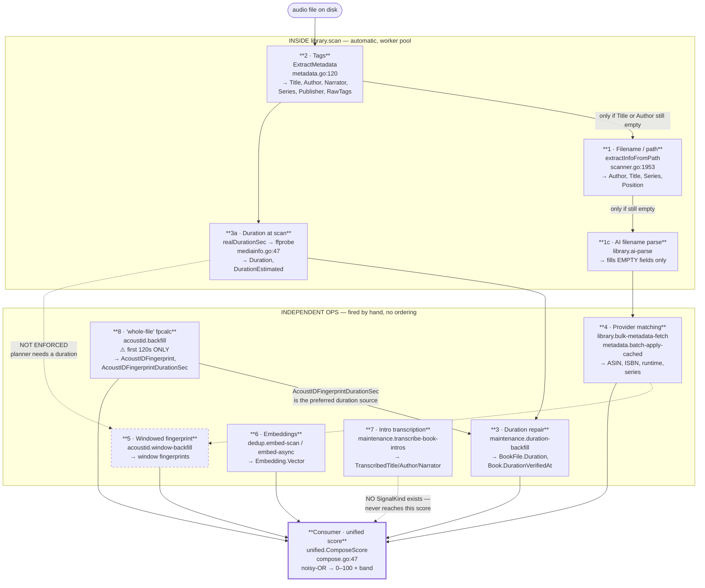
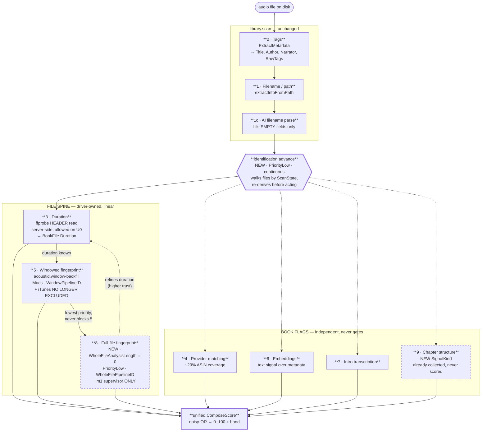
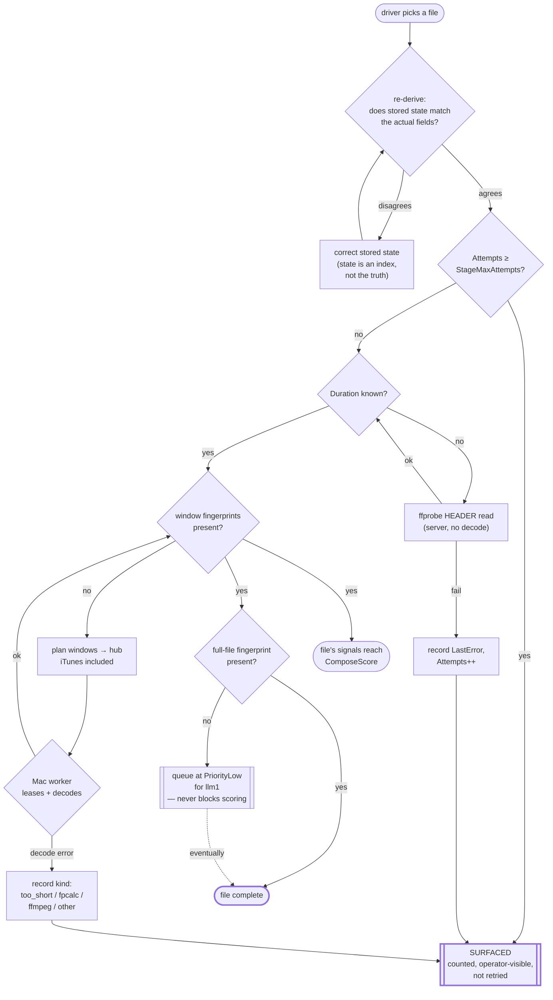

<!-- file: docs/architecture/identification-pipeline.md -->
<!-- version: 1.3.0 -->
<!-- guid: 7c3e9a15-42bd-4f68-b0d1-5e8a97c3f204 -->
<!-- last-edited: 2026-09-21 -->

# The identification pipeline — stages and decision trees

What actually happens to one audio file, in order, from "the scanner found it"
to "we know what it is." Every stage below is anchored to code at `e9978e0f2`.

## The three findings this document exists to state

**1. It is not a pipeline.** There is no orchestrator. No pipeline type, no
stage runner, no chain. Stages 1–3 run inside the scanner
(`internal/scanner/process_file.go`); stages 4–8 are independent operations
fired by hand, in whatever order an operator happens to fire them.

**2. The machinery to make it a pipeline already exists and is unused.**
`registry.Requirement` (`internal/operations/registry/types.go:379`) has two
kinds: `ReqOpCompleted` — "op X must have completed *for this subject*" — and
`ReqFieldSet` — "field F on this subject is non-empty." That is exactly
stage-ordering. Exactly one op in the codebase uses it: `dedup.check-book`
(`internal/plugins/dedup/check_book.go:75`), and only the `ReqFieldSet` variant.
**`ReqOpCompleted` has zero production users.** Its only appearance outside the
type definition is a doc comment at
`internal/operations/registry/deps.go:100` whose worked example is, verbatim,
`Requirement{Kind: ReqOpCompleted, OpType: "acoustid.fingerprint-extract", AllFiles: true}`.
Someone wrote down the exact thing we need, as an example, and never wired it.

**3. The stage-3 → stage-5 dependency is real, unenforced, and costing files
right now.** The window planner needs a duration. Nothing guarantees stage 3 ran
first. Files arrive without one and are deferred rather than read — live count
below.

> `DependsOn` on a definition is **not** a prerequisite. Its own comment reads
> "op def IDs that must NOT be running for this op to start"
> (`types.go:125`) — it is mutual exclusion. The registry models *concurrency
> conflicts* thoroughly (`Writes`/`Reads` write-set gating) and *data
> dependencies* not at all.

---

## Stage spine

Each node is `input required → output written`. Solid edges are data
dependencies that hold in practice; dashed edges are dependencies nothing
enforces.



Note the cycle that the ordering question hides: **stage 8 feeds stage 3.**
`AcoustIDFingerprintDurationSec` is the *first* case in the duration op's
per-segment switch (`duration_backfill.go:278`) — the highest-trust duration we
have comes from having already decoded the file for a fingerprint. And stage 5
declines to run without a duration. So the cheapest fix for `unknown_duration`
is not to run stage 3 first; it is to stop requiring a duration we are about to
measure anyway.

---

## Decision tree for one file

Where a file *stops*. Dead ends are the point — each one is a file we never
identify.


Live counts are from the `acoustid.window-backfill` run started
2026-09-21T21:55Z, read at 19:44 EDT.

**~147,000 files are excluded from acoustic identification by policy, not by
failure.** `itunes_tree` (≈143,766) plus `unknown_duration` (3,131 and rising).

The two exclusions are not the same kind of thing, and the difference matters:

- **`itunes_tree` (`window_backfill.go:833`) is a deliberate, documented
  choice.** It is checked *before* `os.Stat`, with the stated intent that
  "nothing under the iTunes tree is touched, not even read." Whoever wrote it
  read the standing ban as covering reads too. That is a defensible
  interpretation of a rule whose stated subject is mutation — it is a decision
  to revisit with the owner, not a bug to fix.
- **`unknown_duration` (`worker_hub.go:864`) is incoherent.** It fires when
  `fingerprint.ChooseDuration` finds no duration source, so the window planner
  declines to open a file — over a number it would obtain by opening that file.
  fpcalc decodes the audio regardless; the duration is needed only to *place*
  the windows. In `remote_only` mode this defers the file instead of falling
  back to a server lane, so these 3,131 files simply queue forever.

---

## The owner's three open questions, answered

### "4. Metadata matching if possible (we might want to move this later not sure? probably though)"

**Keep it at 4, but it must be a branch, never a gate.**

Evidence: provider matching is gated on an identity that stages 1–2 produce, and
ASIN coverage is ~29% overall, ~27% among poorly-identified books
(`.claude/notes/content-matcher-design.md`, sampled 120 books of 72,063).
Fingerprinting is identity-independent and applies to 100% of files.

So provider matching helps roughly a quarter of the population and cannot help
the rest until identity bootstrap exists. If stage 5 ever waits on stage 4, the
~71% without an ASIN never get an acoustic signal either. Draw it parallel.

> **This does not conflict with the "LOCKED build order"** in
> `content-matcher-design.md`. That note labels its list a *build* order — what
> to implement when. This document is a *runtime* order — what happens to one
> file. Orthogonal axes; both hold.

### "6. maybe embeddings?"

**Already built, already consumed — this one is not speculative.**
`dedup.embed-scan` / `dedup.embed-async` embed
`BuildBookEmbeddingText(title, author, narrator, series, seq)`
(`internal/dedup/engine.go:2754`) into `database.Embedding.Vector`, mirrored to
an ANN index. `CollectEmbedding` (`collectors_embedding.go:158`) reads it back
and produces two scored signals: `SigEmbedHigh` (cos ≥ 0.95, conf 0.88–0.95) and
`SigEmbedMedium` (0.85 ≤ cos < 0.95, conf 0.65–0.80).

Note what this means: embeddings are a **text** signal over metadata we already
have. They re-rank what stages 1–2 produced; they add no new information about
the audio. Useful, but not an identification stage in the way 5 and 8 are.

### "8. full fpcalc" — fallback, or completeness pass?

**Neither, because full fpcalc does not exist.**

`acoustid.backfill` is the op that calls itself the whole-file fingerprint. It
analyzes `fingerprintLengthSec()`, which defaults to
`DefaultAnalysisLengthSec = 120` (`internal/fingerprint/wholefile.go:27`) —
**the first 120 seconds**, not the file. A true whole-file cut exists as a
constant, `WholeFileAnalysisLength = 0` (`wholefile.go:31`), and is not the
default. The op's own package doc says whole-file; the code reads two minutes.

For most of this library the first two minutes are the shared Audible intro
sting. That is the documented reason `WholeFileSimilarity`
(`wholefile.go:144`) trims 10% off each end before comparing — a workaround for
a fingerprint that is mostly not the book.

So stage 8 as the owner wrote it — "full fpcalc" as a final, definitive pass —
is **unbuilt work, not a wiring question.** And what `acoustid.backfill` does
produce is *upstream*, not downstream: `AcoustIDFingerprintDurationSec` is the
first case in the duration op's switch. It yields `SigExactAcoustID` (conf 0.99)
and `SigLSHAcoustID` (0.90–0.97, Hamming-scaled).

---

## Two gates worth knowing in detail

### Stage 4 — what "a match" means

`pickBestMatchFromScored` (`service_scoring.go:662`) starts from F1 token
overlap against the search words, then multiplies: author match ×1.5 / mismatch
×0.7 / missing ×0.75, narrator match ×1.3, audiobook-format ×1.15 with a
narrator and ×0.85 without, plus a runtime-duration multiplier. It accepts at
`bestScore >= minScore` — **0.35** on the f1 tier
(`service_scoring.go:411`), **0.70** on the embedding tier (`:512`). Below
that it returns nil and there is no auto-match.

The ASIN path bypasses all of it. If the query looks like an ASIN
(`service_search.go:876`), the pipeline does a direct Audible lookup with
Audnexus fallback, outside the `MetadataSource` interface — so outside
`ProtectedSource`'s circuit breaker and throttle, hand-gated instead. The
resulting candidate is scored normally and then **overwritten** to 1.0
(`service_search.go:933`) with the reason string "matched by ASIN, which is
authoritative, so the title/author score was overridden." A reviewer seeing 1.0
is seeing a bypass, by design.

### Stage 5 — why a worker is allowed to run at all

The parity gate (`internal/fingerprint/workerclient/gate.go`) is strict and it
is load-bearing. A worker must: be on an allowlisted read-only network mount
with a failing write probe; match the server's pipeline ID and an allowed
(fpcalc, ffmpeg) version pair; resolve every calibration file to the same size,
mtime and SHA-256 of its first 64 KiB; and then **re-cut every calibration
window locally and match the SHA-256 of the raw chromaprint and the frame count
exactly** (`gate.go:242-291`) — "this worker does not reproduce the server's
prints byte for byte; refusing to run."

This is the part of the design that should *not* be simplified away. Fingerprints
from mismatched tool versions are silently incomparable: they do not error, they
just never match. The gate converts a silent corruption into a refusal.

## Signals that are written and never read

Found while inventorying. Each is real evidence we collect and discard at
scoring time.

| Signal | Stored at | Read by dedup scoring? |
|---|---|---|
| **Chapter structure / count** | `chapters:<bookID>`, `pebble_store_chapters.go:23` | **No.** `GetChaptersForBook` has 3 callers — chapters backfill, the ABS mapper, scan-time persistence. Zero references under `internal/dedup/`. No `SignalKind` exists. |
| **Transcription** | `Book.IntroTranscription`, `TranscribedTitle/Author/Narrator`, `store.go:355-365` | **Not by the unified score.** No `SigTranscript` in `unified/score.go`. Reaches only the legacy `ScanBookDuplicates` path and metafetch scoring. |
| **Narrator** | `Book.Narrator`, `store.go:196` | Only indirectly, folded into the embedding text. No narrator-equality signal. |
| **File size** | `BookFile.FileSize` | Only as a `hasPlausibleAudio` gate input (`engine.go:2242`). Not a scored signal. |
| **Codec / bitrate / samplerate / channels / bit depth** | 5 `BookFile` fields | **No write site at all** — 0% populated (`content-matcher-design.md` §0.2). |

Chapter structure is the notable one. Per-chapter lengths are close to a
fingerprint of a book's *edition*, and the content-matcher design leans on them
("measured duration ≈ suspected chapter-N length"). We persist them for ABS and
never score them.

---

## Appendix — operation registry

| Stage | def_id | Registered | Concurrency |
|---|---|---|---|
| 1 | *(none — inline)* `extractInfoFromPath` | `scanner.go:1953` | pool via `ProcessBooksParallel` |
| 1c | `library.ai-parse` | `library_ai_parse_op.go:43` | `errgroup` + `SetLimit` |
| 2 | *(none — inline)* `ExtractMetadata` | `metadata.go:120` | in scan pool |
| 2b | `maintenance.tag-backfill` | `tag_backfill.go:150` | `RunItems`, `Concurrency: NumCPU*4` |
| 3 | `maintenance.duration-backfill` | `duration_backfill.go:188` | producer/worker/collector, 4 workers |
| 3b | `acoustid.fingerprint-duration-repair` | `acoustid/duration_backfill.go:39` | remote workers only |
| 4 | `library.bulk-metadata-fetch` | `metadata_ops.go:559` | — |
| 4 | `metadata.batch-apply-cached` | `batch_apply_op.go:272` | — |
| 4 | `metadata.candidate-fetch` | `metadata_candidate_op.go:105` | — |
| 5 | `acoustid.window-backfill` | acoustid plugin / `worker_hub.go` | remote worker hub, lease-based |
| 6 | `dedup.embed-scan`, `dedup.embed-async` | `embed_scan.go`, `embed_async.go` | — |
| 7 | `maintenance.transcribe-book-intros` | `intro_transcribe.go:112` | `RunItems` |
| 8 | `acoustid.backfill` | `backfill.go:270` | `RunItems`, `Concurrency: backfillWorkers()` — server-side decode |
| 8b | `acoustid.lsh-backfill`, `dedup.lsh-index-build` | — | prerequisite for LSH probe |
| — | `dedup.full-scan`, `dedup.rescore` | `full_scan.go`, `rescore_op.go` | drives `ComposeScore` |

## What this suggests doing

Not a plan — the observations that follow from the diagram.

1. **Drop the duration precondition in the window planner.** It declines to open
   a file over a number it would obtain by opening that file. 3,131 files and
   climbing, deferred forever in `remote_only` mode.
2. **Put `itunes_tree` to the owner.** ≈143,766 files — 19% of the corpus — with
   no acoustic signal, ever. The standing ban's subject is mutation; the code
   chose not to read either. That is the owner's call to confirm or narrow, not
   a bug to quietly fix.
3. **Decide what stage 8 is.** There is no whole-file fingerprint today, only a
   120-second one. Either build it or stop calling it whole-file — the name is
   currently doing damage in both directions.
4. **Wire `ReqOpCompleted` on the stages that actually depend on each other.**
   The machinery is built, documented, and used by one op.
5. **Give chapter structure a `SignalKind`.** We already collect it, per book,
   and throw it away at scoring time.

Keep the parity gate. It is the one piece of this that is complicated for a
reason.

---

# Part II — Target state

Part I maps what exists at `e9978e0f2`. This part is the desired pipeline, and
it is a *proposal*: nothing below is built. It follows three owner decisions
taken 2026-09-21:

1. **Fingerprint everything, iTunes included.** The ban's subject is mutation;
   fingerprinting only reads.
2. **Build a real full-file fpcalc**, at lowest priority, on `llm1` only.
3. **Sequence the stages with a per-file state machine and a driver**, rather
   than hand-firing ops in whatever order an operator picks.

## The one structural change

A file carries its own identification state, and a continuous low-priority
driver walks each file to its next stage. Ops stop being things an operator
fires and become stage handlers the driver calls.

**This is an extension of `database.ScanState`, not a new column beside it.**
That struct (`scan_state.go:36`) already is a per-file state machine — it has
`NeedsDeep`, `Attempts`, `DeepScanMaxAttempts = 3`, `LastError`, and a retry
ceiling that surfaces a row rather than retrying it forever. Its own comment
states the principle the rest of this design needs:

> "an empty hash is ambiguous between 'not attempted yet' and 'attempted and
> failed', and the second must stay visible instead of being retried forever"

That reasoning was applied to hashing and never extended to duration,
fingerprinting or transcription — which is exactly why a missing signal is
today indistinguishable from a broken collector. Generalizing it is the change.

```go
// One per stage, replacing the single Attempts/LastError pair.
type StageStatus struct {
    Done      bool   `json:"done,omitzero"`
    Attempts  int    `json:"attempts,omitzero"`
    LastError string `json:"last_error,omitzero"`
}
```

`omitzero`, never `omitempty` — the v1/v2 hazard documented at
`scan_state.go:17` applies to every field added here.

### The file spine is linear; the book level is not

The file spine is a chain, so `MIN()` over it is well defined:

`new → tagged → duration_ok → fp_windowed → fp_full`

Book **spine** state is `MIN(file states)` — a book is `fp_windowed` only when
every one of its files is, which makes a partially-missing book block *visibly*
instead of averaging out. Book **flags** — `matched`, `embedded`,
`transcribed`, `scored` — are independent and advance on their own.

> **A surfaced file is excluded from the `MIN`, and its book advances with the
> gap recorded.** This is the load-bearing half of the rule. Including surfaced
> files would pin a book behind one permanently-undecodable file forever — which
> is the 3,121-file dead end reincarnated at book granularity, and the same
> drifted-state shape that made 93% of the ABS-invisible books invisible. A book
> whose files are `[ok, ok, SURFACED]` is `fp_windowed` **and** carries a
> `files_surfaced: 1` count. It advances; it does not pretend to be whole.

> Keeping the book level as flags rather than a second chain is load-bearing.
> Part I establishes that provider matching is a parallel branch and never a
> gate (ASIN coverage ~29%). A single book enum would put `matched` in a chain
> and contradict that finding inside this document.

## Target stage spine



Compare with Part I: every dashed "NOT ENFORCED" edge is now a driver
transition, and the stage-8 → stage-3 edge is no longer a cycle, because
stage 3 no longer *waits* on anything. It is a header read.

## The three dead ends this closes

### 1. `unknown_duration` — 3,121 files, closed by a header read

Today `remoteEligible` (`worker_hub.go:862-866`) rejects a file whose duration
is unknown, because `PlanWindows` needs one, and the rejection comment reads
"a worker can't ffprobe for the server." True — but **the server can**, and the
owner confirmed on 2026-09-19 that ffprobe *header* reads on U0 are permitted.
A header read is not a decode.

So duration stops being a separately-fired op that may or may not have run, and
becomes a precondition the driver satisfies inline, on demand, for the one file
it is about to plan. The cycle in Part I dissolves: nothing waits on a number
it is about to measure.

### 2. `itunes_tree` — ~143,766 files, closed by deleting one `case`

`planOne` (`window_backfill.go:830`) excludes the frozen iTunes tree before it
even stats the file. Removing that one case is the entire change.

**It does not touch root registration**, so the ~105 root-gated ops are
unaffected, and every mutation guard stays exactly where it is — the other
callers of `config.UnderFrozenITunesTree` (`merge/itunes_guard.go:226`,
`repoint_unrecorded_renames.go:284`, `rewrite_path_prefix.go:444`,
`fs_regroup_xml.go:302`) are all write paths and none of them move.

The planner was the only **read** gated by a rule about writes.

### 3. Stage 8 — from a misnamed 120-second op to a real full-file pass

`acoustid.backfill` analyzes `DefaultAnalysisLengthSec = 120`
(`wholefile.go:27`) while calling itself the whole-file fingerprint. The real
constant, `WholeFileAnalysisLength = 0` (`wholefile.go:31`), exists and is
unused.

The new op runs at `WholeFileAnalysisLength`, at `registry.PriorityLow`
(`types.go:277` — already exists, no new concept), and is **llm1-only by
deployment, not by protocol**:

- The hub gates a lease on `req.Pipeline` matching the run's pipeline
  (`worker_hub.go:1290`). A full-file run declares its own `WholeFilePipelineID`.
- Only a worker configured for that pipeline can lease from it, and only `llm1`
  runs that supervisor.
- **No protocol change.** There is no per-worker allowlist in the hub today —
  `pick` (`worker_hub.go:879-902`) is FIFO and worker-agnostic — and this design
  does not add one.

> Separation by pipeline is a deployment guarantee, not an enforced one: any
> worker configured with that pipeline could lease. That is acceptable here —
> the goal is to keep full-file decodes off the Macs that are running the window
> backfill, not to defend against a misconfigured host.

**Provisioning dependency, not code:** `llm1` needs the library mounted, an
fpcalc+ffmpeg pair inside `allowedToolVersions` (`worker_hub.go:314`), and the
supervisor running. Two different failures, at two different times — worth
knowing which you are looking at:

- **A root `llm1` is configured for but has not mounted fails at startup.**
  `checkMount` (`workerclient/gate.go:59`) verifies the mount exists, is an
  allowed filesystem type, sits under its reported mount point, and is mounted
  **read-only** — the error literally asks "is the share mounted?".
- **A root the server offers that `llm1` is not configured for fails per job**,
  with `root X is not configured on this worker`. That is deliberate: the
  comment at `worker_hub.go:998-1003` explains it is "visible and per-file
  rather than a silent whole-population refusal."

One more thing the gate settles: `checkHello` (`gate.go:88`) refuses to run if
the server's pipeline is not the one the worker was built for. So pipeline
separation is enforced on **both** sides already — the worker refuses a
mismatched run at hello, the server refuses a mismatched lease
(`worker_hub.go:1290`). A full-file worker is therefore a distinct supervisor
carrying `WholeFilePipelineID`, and today's window workers would refuse a
full-file run outright rather than silently accept it.

## Target decision tree for one file

Part I's tree was drawn to show where a file *stops*. This one has no silent
stops: every exit is a recorded `StageStatus`, visible and countable.



The two properties that make this different from Part I: a file that fails is
**surfaced with a reason** rather than silently deferred forever, and the
full-file pass is a tail that never gates scoring.

## What has to be built

> **Status, 2026-09-22.** Items 3 and 4 are BUILT, MERGED and DEPLOYED, with the
> results measured on prod below. Item 7's weight is decided (0.85-0.93). Items
> 1 and 2 are not started. The rest of this document remains a proposal.

| # | Change | Where | Size |
|---|---|---|---|
| 1 | Per-stage `StageStatus` on `ScanState` | `internal/database/scan_state.go` | small, but touches every writer |
| 2 | `identification.advance` driver op | new, `internal/plugins/maintenance/` | the bulk of the work |
| 3 | ✅ **DONE** — duration probed in `planOne` | `window_backfill.go` | merged `b8a6609e8` |
| 4 | ✅ **DONE** — iTunes exclusion deleted | `window_backfill.go` | merged `4fa425d54` |
| 5 | Full-file op + `WholeFilePipelineID` | `internal/plugins/acoustid/` | medium |
| 6 | `llm1` fp supervisor provisioning | ops, not code | small |
| 7 | `SignalKind` for chapter structure (weight **0.85-0.93**, owner 2026-09-22) | `internal/dedup/unified/` | small |

Order matters for 1 and 2 only; 3, 4 and 7 are independent and can land first.

## Measured outcome of items 3 and 4

Deployed 2026-09-22 02:31 and confirmed from the live plan, not predicted:

```
window-backfill plan (live): rows=762662 missing_rows=92655
  duration_probed=62185 duration_probe_failed=57
  T0 eligible=114368  T1 eligible=555537
  excluded=map[non_audio_ext:25 not_regular_file:77]
```

- **`itunes_tree` is gone from `excluded`** — it read `itunes_tree:143766`
  before. Those files are in the eligible pool for the first time, and the run's
  total rose from 366,243 to 413,484.
- **`unknown_duration` collapsed from 3,928 to 5** in the running tally. The
  probe measured 62,185 durations with 57 failures (0.09%). Note that 62,185 is
  ~15x the pre-change `unknown_duration` count: most of the newly-included
  iTunes files lacked a duration too, which an estimate taken before the change
  could not have seen.
- Deferrals that remain are real per-file decode failures
  (`worker_decode_error:*`), not eligibility refusals.

Both changes are inert until `acoustid.window-backfill` re-plans, which is why
the deploy was followed by a restart of that op.

## What deliberately does not change

- **Every iTunes *mutation* guard.** The ban stands; only the read gate goes.
- **The parity gate and the bootstrap claim** (`worker_hub.go:793-804`). Part I's
  closing line holds — it is the one complicated piece that is complicated for
  a reason.
- **`registry.Writes`/`Reads` write-set gating.** Concurrency conflicts are
  modeled well already. This design adds data dependencies, which were missing;
  it does not touch mutual exclusion.
- **`ReqOpCompleted`.** Worth noting: the driver largely *replaces* the need to
  wire it, because per-file state is a finer instrument than per-op completion.
  Part I recommended wiring it; if the driver is built, that recommendation is
  superseded rather than deferred.
