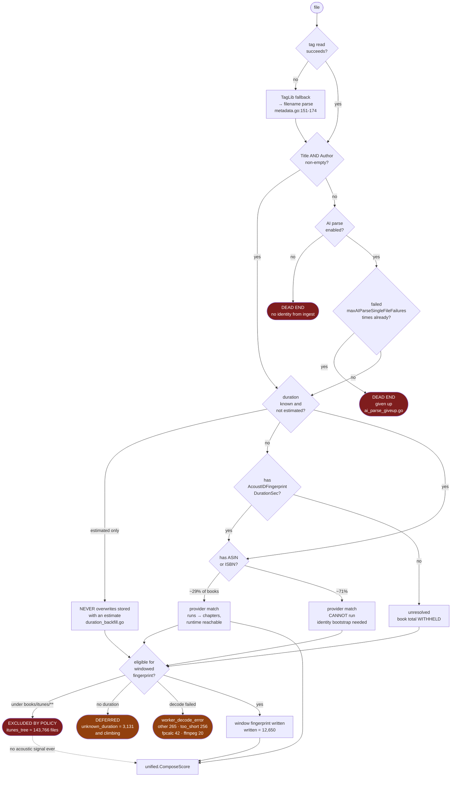

<!-- file: docs/architecture/identification-pipeline.md -->
<!-- version: 1.0.0 -->
<!-- guid: 7c3e9a15-42bd-4f68-b0d1-5e8a97c3f204 -->
<!-- last-edited: 2026-09-21 -->

# The identification pipeline — stages and decision trees

What actually happens to one audio file, in order, from "the scanner found it"
to "we know what it is." Every stage below is anchored to code at `e9978e0f2`.

## The three findings this document exists to state

**1. It is not a pipeline.** There is no orchestrator. No pipeline type, no
stage runner, no chain. Stages 1–3 run inside the scanner
(`internal/scanner/process_file.go`); stages 4–8 are independent operations
fired by hand, in whatever order an operator happens to fire them.

**2. The machinery to make it a pipeline already exists and is unused.**
`registry.Requirement` (`internal/operations/registry/types.go:379`) has two
kinds: `ReqOpCompleted` — "op X must have completed *for this subject*" — and
`ReqFieldSet` — "field F on this subject is non-empty." That is exactly
stage-ordering. Exactly one op in the codebase uses it: `dedup.check-book`
(`internal/plugins/dedup/check_book.go:75`), and only the `ReqFieldSet` variant.
**`ReqOpCompleted` has zero production users.** Its only appearance outside the
type definition is a doc comment at
`internal/operations/registry/deps.go:100` whose worked example is, verbatim,
`Requirement{Kind: ReqOpCompleted, OpType: "acoustid.fingerprint-extract", AllFiles: true}`.
Someone wrote down the exact thing we need, as an example, and never wired it.

**3. The stage-3 → stage-5 dependency is real, unenforced, and costing files
right now.** The window planner needs a duration. Nothing guarantees stage 3 ran
first. Files arrive without one and are deferred rather than read — live count
below.

> `DependsOn` on a definition is **not** a prerequisite. Its own comment reads
> "op def IDs that must NOT be running for this op to start"
> (`types.go:125`) — it is mutual exclusion. The registry models *concurrency
> conflicts* thoroughly (`Writes`/`Reads` write-set gating) and *data
> dependencies* not at all.

---

## Stage spine

Each node is `input required → output written`. Solid edges are data
dependencies that hold in practice; dashed edges are dependencies nothing
enforces.

Note the cycle that the ordering question hides: **stage 8 feeds stage 3.**
`AcoustIDFingerprintDurationSec` is the *first* case in the duration op's
per-segment switch (`duration_backfill.go:278`) — the highest-trust duration we
have comes from having already decoded the file for a fingerprint. And stage 5
declines to run without a duration. So the cheapest fix for `unknown_duration`
is not to run stage 3 first; it is to stop requiring a duration we are about to
measure anyway.

---

## Decision tree for one file

Where a file *stops*. Dead ends are the point — each one is a file we never
identify.

Live counts are from the `acoustid.window-backfill` run started
2026-09-21T21:55Z, read at 19:44 EDT.

**~147,000 files are excluded from acoustic identification by policy, not by
failure.** `itunes_tree` (≈143,766) plus `unknown_duration` (3,131 and rising).

The two exclusions are not the same kind of thing, and the difference matters:

- **`itunes_tree` (`window_backfill.go:833`) is a deliberate, documented
  choice.** It is checked *before* `os.Stat`, with the stated intent that
  "nothing under the iTunes tree is touched, not even read." Whoever wrote it
  read the standing ban as covering reads too. That is a defensible
  interpretation of a rule whose stated subject is mutation — it is a decision
  to revisit with the owner, not a bug to fix.
- **`unknown_duration` (`worker_hub.go:864`) is incoherent.** It fires when
  `fingerprint.ChooseDuration` finds no duration source, so the window planner
  declines to open a file — over a number it would obtain by opening that file.
  fpcalc decodes the audio regardless; the duration is needed only to *place*
  the windows. In `remote_only` mode this defers the file instead of falling
  back to a server lane, so these 3,131 files simply queue forever.

---

## The owner's three open questions, answered

### "4. Metadata matching if possible (we might want to move this later not sure? probably though)"

**Keep it at 4, but it must be a branch, never a gate.**

Evidence: provider matching is gated on an identity that stages 1–2 produce, and
ASIN coverage is ~29% overall, ~27% among poorly-identified books
(`.claude/notes/content-matcher-design.md`, sampled 120 books of 72,063).
Fingerprinting is identity-independent and applies to 100% of files.

So provider matching helps roughly a quarter of the population and cannot help
the rest until identity bootstrap exists. If stage 5 ever waits on stage 4, the
~71% without an ASIN never get an acoustic signal either. Draw it parallel.

> **This does not conflict with the "LOCKED build order"** in
> `content-matcher-design.md`. That note labels its list a *build* order — what
> to implement when. This document is a *runtime* order — what happens to one
> file. Orthogonal axes; both hold.

### "6. maybe embeddings?"

**Already built, already consumed — this one is not speculative.**
`dedup.embed-scan` / `dedup.embed-async` embed
`BuildBookEmbeddingText(title, author, narrator, series, seq)`
(`internal/dedup/engine.go:2754`) into `database.Embedding.Vector`, mirrored to
an ANN index. `CollectEmbedding` (`collectors_embedding.go:158`) reads it back
and produces two scored signals: `SigEmbedHigh` (cos ≥ 0.95, conf 0.88–0.95) and
`SigEmbedMedium` (0.85 ≤ cos < 0.95, conf 0.65–0.80).

Note what this means: embeddings are a **text** signal over metadata we already
have. They re-rank what stages 1–2 produced; they add no new information about
the audio. Useful, but not an identification stage in the way 5 and 8 are.

### "8. full fpcalc" — fallback, or completeness pass?

**Neither, because full fpcalc does not exist.**

`acoustid.backfill` is the op that calls itself the whole-file fingerprint. It
analyzes `fingerprintLengthSec()`, which defaults to
`DefaultAnalysisLengthSec = 120` (`internal/fingerprint/wholefile.go:27`) —
**the first 120 seconds**, not the file. A true whole-file cut exists as a
constant, `WholeFileAnalysisLength = 0` (`wholefile.go:31`), and is not the
default. The op's own package doc says whole-file; the code reads two minutes.

For most of this library the first two minutes are the shared Audible intro
sting. That is the documented reason `WholeFileSimilarity`
(`wholefile.go:144`) trims 10% off each end before comparing — a workaround for
a fingerprint that is mostly not the book.

So stage 8 as the owner wrote it — "full fpcalc" as a final, definitive pass —
is **unbuilt work, not a wiring question.** And what `acoustid.backfill` does
produce is *upstream*, not downstream: `AcoustIDFingerprintDurationSec` is the
first case in the duration op's switch. It yields `SigExactAcoustID` (conf 0.99)
and `SigLSHAcoustID` (0.90–0.97, Hamming-scaled).

---

## Two gates worth knowing in detail

### Stage 4 — what "a match" means

`pickBestMatchFromScored` (`service_scoring.go:662`) starts from F1 token
overlap against the search words, then multiplies: author match ×1.5 / mismatch
×0.7 / missing ×0.75, narrator match ×1.3, audiobook-format ×1.15 with a
narrator and ×0.85 without, plus a runtime-duration multiplier. It accepts at
`bestScore >= minScore` — **0.35** on the f1 tier
(`service_scoring.go:411`), **0.70** on the embedding tier (`:512`). Below
that it returns nil and there is no auto-match.

The ASIN path bypasses all of it. If the query looks like an ASIN
(`service_search.go:876`), the pipeline does a direct Audible lookup with
Audnexus fallback, outside the `MetadataSource` interface — so outside
`ProtectedSource`'s circuit breaker and throttle, hand-gated instead. The
resulting candidate is scored normally and then **overwritten** to 1.0
(`service_search.go:933`) with the reason string "matched by ASIN, which is
authoritative, so the title/author score was overridden." A reviewer seeing 1.0
is seeing a bypass, by design.

### Stage 5 — why a worker is allowed to run at all

The parity gate (`internal/fingerprint/workerclient/gate.go`) is strict and it
is load-bearing. A worker must: be on an allowlisted read-only network mount
with a failing write probe; match the server's pipeline ID and an allowed
(fpcalc, ffmpeg) version pair; resolve every calibration file to the same size,
mtime and SHA-256 of its first 64 KiB; and then **re-cut every calibration
window locally and match the SHA-256 of the raw chromaprint and the frame count
exactly** (`gate.go:242-291`) — "this worker does not reproduce the server's
prints byte for byte; refusing to run."

This is the part of the design that should *not* be simplified away. Fingerprints
from mismatched tool versions are silently incomparable: they do not error, they
just never match. The gate converts a silent corruption into a refusal.

## Signals that are written and never read

Found while inventorying. Each is real evidence we collect and discard at
scoring time.

| Signal | Stored at | Read by dedup scoring? |
|---|---|---|
| **Chapter structure / count** | `chapters:<bookID>`, `pebble_store_chapters.go:23` | **No.** `GetChaptersForBook` has 3 callers — chapters backfill, the ABS mapper, scan-time persistence. Zero references under `internal/dedup/`. No `SignalKind` exists. |
| **Transcription** | `Book.IntroTranscription`, `TranscribedTitle/Author/Narrator`, `store.go:355-365` | **Not by the unified score.** No `SigTranscript` in `unified/score.go`. Reaches only the legacy `ScanBookDuplicates` path and metafetch scoring. |
| **Narrator** | `Book.Narrator`, `store.go:196` | Only indirectly, folded into the embedding text. No narrator-equality signal. |
| **File size** | `BookFile.FileSize` | Only as a `hasPlausibleAudio` gate input (`engine.go:2242`). Not a scored signal. |
| **Codec / bitrate / samplerate / channels / bit depth** | 5 `BookFile` fields | **No write site at all** — 0% populated (`content-matcher-design.md` §0.2). |

Chapter structure is the notable one. Per-chapter lengths are close to a
fingerprint of a book's *edition*, and the content-matcher design leans on them
("measured duration ≈ suspected chapter-N length"). We persist them for ABS and
never score them.

---

## Appendix — operation registry

| Stage | def_id | Registered | Concurrency |
|---|---|---|---|
| 1 | *(none — inline)* `extractInfoFromPath` | `scanner.go:1953` | pool via `ProcessBooksParallel` |
| 1c | `library.ai-parse` | `library_ai_parse_op.go:43` | `errgroup` + `SetLimit` |
| 2 | *(none — inline)* `ExtractMetadata` | `metadata.go:120` | in scan pool |
| 2b | `maintenance.tag-backfill` | `tag_backfill.go:150` | `RunItems`, `Concurrency: NumCPU*4` |
| 3 | `maintenance.duration-backfill` | `duration_backfill.go:188` | producer/worker/collector, 4 workers |
| 3b | `acoustid.fingerprint-duration-repair` | `acoustid/duration_backfill.go:39` | remote workers only |
| 4 | `library.bulk-metadata-fetch` | `metadata_ops.go:559` | — |
| 4 | `metadata.batch-apply-cached` | `batch_apply_op.go:272` | — |
| 4 | `metadata.candidate-fetch` | `metadata_candidate_op.go:105` | — |
| 5 | `acoustid.window-backfill` | acoustid plugin / `worker_hub.go` | remote worker hub, lease-based |
| 6 | `dedup.embed-scan`, `dedup.embed-async` | `embed_scan.go`, `embed_async.go` | — |
| 7 | `maintenance.transcribe-book-intros` | `intro_transcribe.go:112` | `RunItems` |
| 8 | `acoustid.backfill` | `backfill.go:270` | `RunItems`, `Concurrency: backfillWorkers()` — server-side decode |
| 8b | `acoustid.lsh-backfill`, `dedup.lsh-index-build` | — | prerequisite for LSH probe |
| — | `dedup.full-scan`, `dedup.rescore` | `full_scan.go`, `rescore_op.go` | drives `ComposeScore` |

## What this suggests doing

Not a plan — the observations that follow from the diagram.

1. **Drop the duration precondition in the window planner.** It declines to open
   a file over a number it would obtain by opening that file. 3,131 files and
   climbing, deferred forever in `remote_only` mode.
2. **Put `itunes_tree` to the owner.** ≈143,766 files — 19% of the corpus — with
   no acoustic signal, ever. The standing ban's subject is mutation; the code
   chose not to read either. That is the owner's call to confirm or narrow, not
   a bug to quietly fix.
3. **Decide what stage 8 is.** There is no whole-file fingerprint today, only a
   120-second one. Either build it or stop calling it whole-file — the name is
   currently doing damage in both directions.
4. **Wire `ReqOpCompleted` on the stages that actually depend on each other.**
   The machinery is built, documented, and used by one op.
5. **Give chapter structure a `SignalKind`.** We already collect it, per book,
   and throw it away at scoring time.

Keep the parity gate. It is the one piece of this that is complicated for a
reason.
