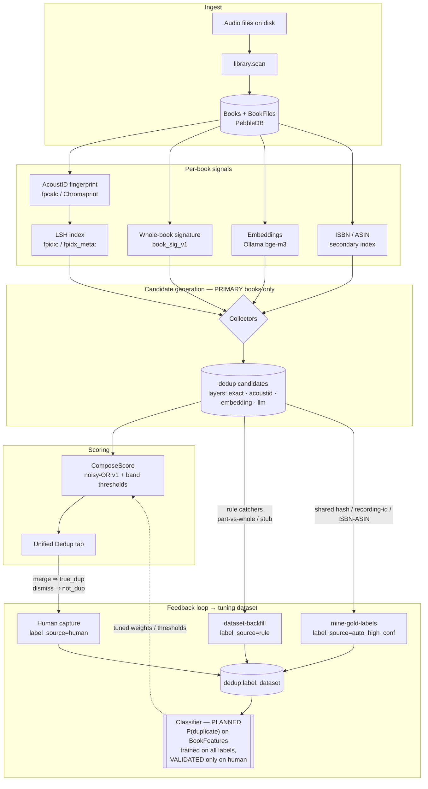
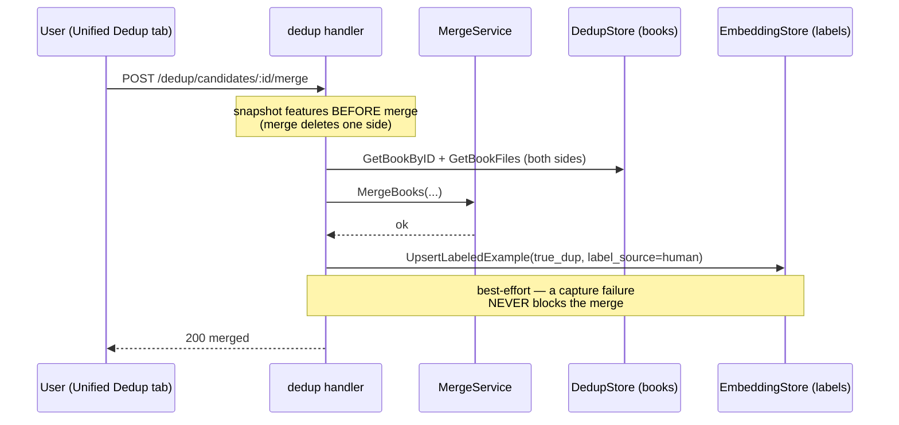

<!-- file: docs/archive/2026-07-consolidation/dedup-feedback-loop.md -->
<!-- version: 1.1.0 -->
<!-- guid: 4e1b9c27-7a30-4d85-9f62-1c8a5e0b3d74 -->
<!-- last-edited: 2026-07-17 -->

> Archived 2026-07-17 — superseded by [`docs/dedup/STATUS.md`](../../dedup/STATUS.md)
> (still-valid content folded in there). Candidate figures below (387K etc.) are
> obsolete; real 2026-07 backlog is 15,269 pending / 9,074 exact-pending.

# Dedup Feedback Loop — Architecture

How the audiobook-organizer detects duplicate books and how it is being made
**self-improving**: every signal, candidate, label, and (planned) learned model in
one place. This is the canonical reference for the dedup tuning effort.

- Signals + LSH state: [`project_fingerprint_lsh_dedup_state`](AI-REFERENCE.md)
- Tuning-dataset design: [`docs/specs/2026-06-13-dedup-tuning-dataset-design.md`](specs/2026-06-13-dedup-tuning-dataset-design.md)
- Unified pipeline spec: [`docs/specs/fable5-spec-unified-dedup-pipeline.md`](specs/fable5-spec-unified-dedup-pipeline.md)

## End-to-end pipeline

The loop **closes** when the learned classifier's output feeds back into `ComposeScore`,
so each human merge/dismiss makes the next round of candidate scoring better.

## Label provenance

The dataset (`dedup:label:<candidateID>` in PebbleDB) mixes label sources of different
trust. The training contract: **train on everything, weight by trust, and validate
ONLY on `human` labels** — otherwise a model can "win" by mimicking the rules it was
meant to beat.

| `label_source` | Produced by | Trust | Role in training |
|---|---|---|---|
| `human` | Merge / dismiss in the UI (and the planned review/override panel) | **Gold** | Trains **and** is the sole validation set |
| `auto_high_conf` | `dedup.mine-gold-labels` — shared file hash, AcoustID recording id, or ASIN/ISBN (audio-gated) | High precision, not human | Strong/weak supervision; never in validation |
| `rule` | `dedup.dataset-backfill` — deterministic catchers (part-vs-whole, stub, missing file) | Heuristic | Weak supervision (down-weighted); never in validation |
| `llm_judge` | (planned) OpenAI labeler on the borderline band | Medium | Weak supervision |

## Merge/dismiss capture sequence

Dismiss is the same minus the merge step (`not_dup`, both books still exist so timing
is free).

## Operations & endpoints

| Concern | Op / endpoint |
|---|---|
| Scan & ingest | `library.scan` · `POST /operations/scan` (`{folder_path}` scopes it) |
| Fingerprint | `acoustid.scan` · `POST /dedup/scan-acoustid` |
| LSH index | `dedup.lsh-index-build` |
| Whole-book signature | `dedup.book-signature-scan` · `POST /dedup/scan-book-signature` |
| Embeddings | `dedup.embed-scan` · `POST /dedup/scan-embed` |
| Candidate scan | `dedup.full-scan` · `POST /dedup/scan` |
| Rescore (noisy-OR) | engine `Rescore` · `POST /dedup/rescore` |
| **Rule-negative labels** | `dedup.dataset-backfill` |
| **Auto gold positives** | `dedup.mine-gold-labels` |
| **Human labels** | captured on `POST /dedup/candidates/:id/{merge,dismiss}` + bulk/cluster |
| Generic op trigger | `POST /operations/v2` `{"def_id":"…","params":{…}}` |

## Status (2026-06-18)

**Shipped & deployed**

- Per-book signals: fingerprint, LSH, whole-book signature, embeddings (Ollama/HNSW), ISBN/ASIN index.
- Candidate scoring: `ComposeScore` noisy-OR v1 + band thresholds; Unified Dedup tab.
- **Human label capture** (merge/dismiss → `human`) — `internal/server/handlers/dedup/label_capture.go`.
- **Gold miner** `dedup.mine-gold-labels` (`auto_high_conf` positives) — dry-run default.
- Rule-negative backfill `dedup.dataset-backfill`.

**Planned (not built)**

- The **classifier** itself (pure-Go `P(duplicate)` on `BookFeatures`, shadow-mode first).
- C6 review/override UI + C7 JSONL export; OpenAI borderline labeler + fine-tuned judge.
- C5 live-capture on candidate upsert.
- Cluster-merge / series-merge human capture (need pre-merge snapshot reordering).

## ⚠️ Open issue — candidate set is not the "final book" set

As of 2026-06-18 prod has **49,573 final books** (the `/audiobooks` list) but **401,968
raw `books` rows** in memdb, and **387,597 pending `exact`-layer candidates** (vs ~1.4K
across acoustid/embedding/llm combined). The exact emitters (`checkExactTitle`,
`checkExactMetadataSourceHash`, `checkDurationMatch`, …) are pairing far more than the
final-book set warrants.

The engine *intends* primary-only generation (`full_scan.go` "for every primary book";
`engine.go` "skip non-primary versions"; `is_primary_version` filter), so the explosion
means one of: non-final/version-group/**chapter-as-a-book** rows are leaking past the
primary filter (evidence: a candidate book literally titled *"Opening Credits"*), or a
stale legacy backlog predates the primary-filter + `hasPlausibleAudio` fixes.

**Consequence:** do **not** run `dedup.mine-gold-labels --apply` (or any bulk
merge/dismiss) over the current candidate set until it is rebuilt against final books —
it would seed the tuning dataset with within-version-group and chapter-artifact pairs.
Tracked as a TODO (candidate-explosion investigation).
