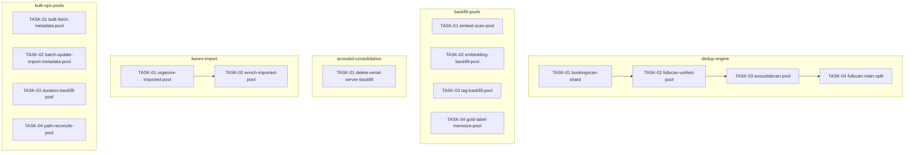

<!-- file: docs/plans/2026-07-05-concurrency-parallelization.md -->
<!-- version: 1.0.0 -->
<!-- guid: 06b6cc79-6ae5-47c0-8dc6-ae0ffd787b6a -->
<!-- last-edited: 2026-07-05 -->

# Concurrency Parallelization Implementation Plan

Companion to:
- `docs/specs/2026-07-05-concurrency-parallelization-design.md` (CONC-1..15 findings)
- `docs/audits/2026-07-05-concurrency-single-threaded-hotspots.md` (source audit)

Coordination model: the coordinator reviews and owns ALL git/gh; worker subagents
execute one task each in an isolated worktree, PR per task, rebase/FF merges,
`make ci` gates every PR. Tasks marked **⚠ review-critical** change dedup output or
delete a code path and require line-by-line coordinator review before merge.

## Dependency graph

## Model assignments (authoritative — overrides per-task `Agent:` lines)

| Model | Tasks | Rationale |
|---|---|---|
| **Haiku-class** | bulk-ops-pools/TASK-03, bulk-ops-pools/TASK-04 | fully specified mechanical N+1 mirrors; failure cheap, caught by `make ci` |
| **Sonnet-class** | dedup-engine/TASK-02, dedup-engine/TASK-03, dedup-engine/TASK-04, backfill-pools/TASK-01, backfill-pools/TASK-02, backfill-pools/TASK-03, backfill-pools/TASK-04, itunes-import/TASK-01, itunes-import/TASK-02, bulk-ops-pools/TASK-01, bulk-ops-pools/TASK-02 | pool + shared-state guarding + integration; ⚠-flagged get coordinator line-review |
| **Opus-class** | dedup-engine/TASK-01, acoustid-consolidation/TASK-01 | O(n²) sharding correctness (WS-1/T01) and delete/redirect caller-wiring (WS-3/T01) — irreversible-shaped, strongest tier |

## Parallel execution groups

| Wave | Tasks (parallel within wave) | Execution mode / notes |
|---|---|---|
| dedup-engine W1 | TASK-01 | SERIAL WAVES (coordinator-driven) |
| dedup-engine W2 | TASK-02 | SERIAL WAVES — shares internal/dedup/engine.go with wave 1 |
| dedup-engine W3 | TASK-03 | SERIAL WAVES — shares internal/dedup/engine.go with wave 2 |
| dedup-engine W4 | TASK-04 | SERIAL WAVES — shares internal/dedup/engine.go with wave 3 |
| backfill-pools W1 | TASK-01, TASK-02, TASK-03, TASK-04 | /parallel-sweep — trigger: 4 similar tasks, disjoint files |
| acoustid-consolidation W1 | TASK-01 | SINGLE-AGENT (strong model) |
| itunes-import W1 | TASK-01 | SERIAL WAVES (coordinator-driven) |
| itunes-import W2 | TASK-02 | SERIAL WAVES — shares internal/itunes/service/importer.go with wave 1 |
| bulk-ops-pools W1 | TASK-01, TASK-02, TASK-03, TASK-04 | /parallel-sweep — trigger: 4 similar tasks, disjoint files |

Same-file serialization: `internal/dedup/engine.go` (WS-1 T01→T02→T03→T04);
`internal/itunes/service/importer.go` (WS-4 T01→T02). All other files are
single-task. WS-1 (the confirmed incident) starts first.

## Coordinator protocol (verbatim)

> **Coordinator owns git. Workers never push.** Each worker operates only inside its
> assigned worktree: edit, test, commit — then stop. Workers never run `git push`,
> `gh pr`, or any merge command. The coordinator runs the gate (`make ci`) in each
> finished worktree, opens the PR, merges (rebase/FF unless the repo profile says
> otherwise), and then **rebases every open sibling worktree** before dispatching
> anything else.
>
> **Per-merge sibling-rebase loop:** after EVERY merge to `origin/main`:
> for each open sibling worktree, `git fetch origin && git rebase
> origin/main`. A sibling that skips a rebase is a future conflict.
>
> **Conflict escalation ladder** (in order, never skip a rung): 1) clean rebase;
> 2) conflict-resolver subagent (Sonnet-class, only when the conflict spans 1–3 small
> files); 3) file-copy cherry-pick fallback — re-apply the task's file states onto a
> fresh branch from HEAD; 4) mark `rebase_blocked`, stop the lane, escalate to a human.
>
> **A wave MUST NOT start** while any of: the previous wave has an unmerged PR; any
> sibling worktree is un-rebased; the gate is red on `origin/main`; or a
> `rebase_blocked` marker is unresolved.

---

### TASK-01 (dedup-engine): Shard BookSignatureScan's O(n²) pairwise loop across a bounded worker pool [⚠ review-critical]
Priority: P1 · Effort: L · Agent: Opus-class · Depends on: none

**Context.** CONC-1 in `docs/audits/2026-07-05-concurrency-single-threaded-hotspots.md`; spec C-component. Anchor: `grep -n 'for j := i + 1; j < len(booksWithSig); j++' internal/dedup/engine.go` (1 hit (~line 3638)). Shared state: The `emitted map[string]struct{}` (~line 3599, keyed by canonical pairKey) is read-check-then-written inside emit(). NOTE the triangular i<j loop already visits each unordered pair...

**Exact files to change**
- `internal/dedup/engine.go` — parallelize the audited loop via registry.RunItems (+ guard shared state)
- `internal/dedup/*_test.go` — NEW: parallel-same-as-serial + `-race` test

**Step-by-step.** See the self-contained brief `docs/agent-tasks/dedup-engine/TASK-01-booksigscan-shard.md` (worktree block, re-verify greps, guarding, tests). Final step: `make ci`.

**Acceptance criteria**
- [ ] target loop routes through `registry.RunItems`; `go test -race ./internal/dedup/...` clean.
- [ ] parallel output identical to serial (same-output test).
- [ ] `make ci` green.

**Idempotency.** Done if `grep -n "registry.RunItems" internal/dedup/engine.go` hits. **Rollback.** Revert the single commit; loop returns to sequential; no data/schema touched.

### TASK-02 (dedup-engine): Parallelize FullScan's unified-scoring pass with a bounded worker pool
Priority: P1 · Effort: M · Agent: Sonnet-class · Depends on: TASK-01

**Context.** CONC-2 in `docs/audits/2026-07-05-concurrency-single-threaded-hotspots.md`; spec C-component. Anchor: `grep -n 'runUnifiedScoringForBook(ctx, &book, authorName)' internal/dedup/engine.go` (1 hit (~line 2557)). Shared state: None in-memory at the FullScan layer. The ONLY hazard is the shared bookStore/embedStore backends (per-book reads and writes). CONFIRM those stores are goroutine-safe before enabli...

**Exact files to change**
- `internal/dedup/engine.go` — parallelize the audited loop via registry.RunItems (+ guard shared state)
- `internal/dedup/*_test.go` — NEW: parallel-same-as-serial + `-race` test

**Step-by-step.** See the self-contained brief `docs/agent-tasks/dedup-engine/TASK-02-fullscan-unified-pool.md` (worktree block, re-verify greps, guarding, tests). Final step: `make ci`.

**Acceptance criteria**
- [ ] target loop routes through `registry.RunItems`; `go test -race ./internal/dedup/...` clean.
- [ ] parallel output identical to serial (same-output test).
- [ ] `make ci` green.

**Idempotency.** Done if `grep -n "registry.RunItems" internal/dedup/engine.go` hits. **Rollback.** Revert the single commit; loop returns to sequential; no data/schema touched.

### TASK-03 (dedup-engine): Parallelize AcoustIDScan's per-book loop with a bounded pool and guard its four shared maps [⚠ review-critical]
Priority: P2 · Effort: L · Agent: Sonnet-class · Depends on: TASK-02

**Context.** CONC-3 in `docs/audits/2026-07-05-concurrency-single-threaded-hotspots.md`; spec C-component. Anchor: `grep -n 'cands, _ := lshStore.LookupAcoustIDCandidates' internal/dedup/engine.go` (1 hit (~line 3486)). Shared state: FOUR unguarded maps + a counter, ALL mutated inside emit()/the loop and ALL must be guarded when sharding: `emitted map[string]struct{}` (~3348), `boilerplateBookCache map[string]b...

**Exact files to change**
- `internal/dedup/engine.go` — parallelize the audited loop via registry.RunItems (+ guard shared state)
- `internal/dedup/*_test.go` — NEW: parallel-same-as-serial + `-race` test

**Step-by-step.** See the self-contained brief `docs/agent-tasks/dedup-engine/TASK-03-acoustidscan-pool.md` (worktree block, re-verify greps, guarding, tests). Final step: `make ci`.

**Acceptance criteria**
- [ ] target loop routes through `registry.RunItems`; `go test -race ./internal/dedup/...` clean.
- [ ] parallel output identical to serial (same-output test).
- [ ] `make ci` green.

**Idempotency.** Done if `grep -n "registry.RunItems" internal/dedup/engine.go` hits. **Rollback.** Revert the single commit; loop returns to sequential; no data/schema touched.

### TASK-04 (dedup-engine): Parallelize FullScan main-pass Layer-1 checks while keeping Layer-2 embedding batching serial [⚠ review-critical]
Priority: P2 · Effort: L · Agent: Sonnet-class · Depends on: TASK-03

**Context.** CONC-4 in `docs/audits/2026-07-05-concurrency-single-threaded-hotspots.md`; spec C-component. Anchor: `grep -n 'de.checkExactFileHash(&book, authorName)' internal/dedup/engine.go` (1 hit (~line 2482)). Shared state: Loop-carried SERIAL state that makes this NOT embarrassingly parallel: `chunkIDs []string` (appended each iter, reset in flushChunk), `chunkStart int`, `embedConsecutiveFails int`,...

**Exact files to change**
- `internal/dedup/engine.go` — parallelize the audited loop via registry.RunItems (+ guard shared state)
- `internal/dedup/*_test.go` — NEW: parallel-same-as-serial + `-race` test

**Step-by-step.** See the self-contained brief `docs/agent-tasks/dedup-engine/TASK-04-fullscan-main-split.md` (worktree block, re-verify greps, guarding, tests). Final step: `make ci`.

**Acceptance criteria**
- [ ] target loop routes through `registry.RunItems`; `go test -race ./internal/dedup/...` clean.
- [ ] parallel output identical to serial (same-output test).
- [ ] `make ci` green.

**Idempotency.** Done if `grep -n "registry.RunItems" internal/dedup/engine.go` hits. **Rollback.** Revert the single commit; loop returns to sequential; no data/schema touched.

### TASK-01 (backfill-pools): Parallelize dedup.embed-scan sync path with a rate-limited worker pool
Priority: P2 · Effort: M · Agent: Sonnet-class · Depends on: none

**Context.** CONC-5 in `docs/audits/2026-07-05-concurrency-single-threaded-hotspots.md`; spec C-component. Anchor: `grep -n "status, embedErr := p.engine.EmbedBook(ctx, book.ID)" internal/plugins/dedup/embed_scan.go` (1 hit (~line 135)). Shared state: None in-memory beyond the op status; the constraint is the embedding backend rate limit — pick a small fixed Concurrency (const knob), not NumCPU....

**Exact files to change**
- `internal/plugins/dedup/embed_scan.go` — parallelize the audited loop via registry.RunItems (+ guard shared state)
- `internal/plugins/dedup/*_test.go` — NEW: parallel-same-as-serial + `-race` test

**Step-by-step.** See the self-contained brief `docs/agent-tasks/backfill-pools/TASK-01-embed-scan-pool.md` (worktree block, re-verify greps, guarding, tests). Final step: `make ci`.

**Acceptance criteria**
- [ ] target loop routes through `registry.RunItems`; `go test -race ./internal/plugins/dedup/...` clean.
- [ ] parallel output identical to serial (same-output test).
- [ ] `make ci` green.

**Idempotency.** Done if `grep -n "registry.RunItems" internal/plugins/dedup/embed_scan.go` hits. **Rollback.** Revert the single commit; loop returns to sequential; no data/schema touched.

### TASK-02 (backfill-pools): Parallelize the startup embedding backfill loops over books and authors
Priority: P2 · Effort: M · Agent: Sonnet-class · Depends on: none

**Context.** CONC-6 in `docs/audits/2026-07-05-concurrency-single-threaded-hotspots.md`; spec C-component. Anchor: `grep -n "s.dedupEngine.EmbedBook(ctx, book.ID)\|s.dedupEngine.EmbedAuthor(ctx, author.ID)" internal/server/embedding_backfill.go` (2 hits (~lines 79, 119)). Shared state: None in-memory of concern; network rate limit is the constraint. Startup path — confirm a Reporter (or a nil-safe progress) is available here as it is in the plugin path....

**Exact files to change**
- `internal/server/embedding_backfill.go` — parallelize the audited loop via registry.RunItems (+ guard shared state)
- `internal/server/*_test.go` — NEW: parallel-same-as-serial + `-race` test

**Step-by-step.** See the self-contained brief `docs/agent-tasks/backfill-pools/TASK-02-embedding-backfill-pool.md` (worktree block, re-verify greps, guarding, tests). Final step: `make ci`.

**Acceptance criteria**
- [ ] target loop routes through `registry.RunItems`; `go test -race ./internal/server/...` clean.
- [ ] parallel output identical to serial (same-output test).
- [ ] `make ci` green.

**Idempotency.** Done if `grep -n "registry.RunItems" internal/server/embedding_backfill.go` hits. **Rollback.** Revert the single commit; loop returns to sequential; no data/schema touched.

### TASK-03 (backfill-pools): Parallelize the tag-backfill ExtractMetadata loop with a CPU-sized pool
Priority: P2 · Effort: M · Agent: Sonnet-class · Depends on: none

**Context.** CONC-7 in `docs/audits/2026-07-05-concurrency-single-threaded-hotspots.md`; spec C-component. Anchor: `grep -n "meta, merr := metadata.ExtractMetadata(f.FilePath, nil)" internal/plugins/maintenance/tag_backfill.go` (1 hit (~line 125)). Shared state: None in-memory of concern; per-item ExtractMetadata is independent. I/O-bound → NumCPU*4 is the established repo sizing....

**Exact files to change**
- `internal/plugins/maintenance/tag_backfill.go` — parallelize the audited loop via registry.RunItems (+ guard shared state)
- `internal/plugins/maintenance/*_test.go` — NEW: parallel-same-as-serial + `-race` test

**Step-by-step.** See the self-contained brief `docs/agent-tasks/backfill-pools/TASK-03-tag-backfill-pool.md` (worktree block, re-verify greps, guarding, tests). Final step: `make ci`.

**Acceptance criteria**
- [ ] target loop routes through `registry.RunItems`; `go test -race ./internal/plugins/maintenance/...` clean.
- [ ] parallel output identical to serial (same-output test).
- [ ] `make ci` green.

**Idempotency.** Done if `grep -n "registry.RunItems" internal/plugins/maintenance/tag_backfill.go` hits. **Rollback.** Revert the single commit; loop returns to sequential; no data/schema touched.

### TASK-04 (backfill-pools): Add book-lookup memoization then parallelize mine_gold_labels and dataset_backfill
Priority: P2 · Effort: L · Agent: Sonnet-class · Depends on: none

**Context.** CONC-8 in `docs/audits/2026-07-05-concurrency-single-threaded-hotspots.md`; spec C-component. Anchor: `grep -n "a, aErr := adapter.GetBook(c.EntityAID)" internal/plugins/dedup/mine_gold_labels.go` (1 hit (~line 101)). Shared state: If you share one memoization map across workers it must be mutex-guarded (or use sync.Map); simplest correct shape is a per-worker-local cache. The candidate processing itself is i...

**Exact files to change**
- `internal/plugins/dedup/mine_gold_labels.go` — parallelize the audited loop via registry.RunItems (+ guard shared state)
- `internal/plugins/dedup/dataset_backfill.go` — parallelize the audited loop via registry.RunItems (+ guard shared state)
- `internal/plugins/dedup/*_test.go` — NEW: parallel-same-as-serial + `-race` test

**Step-by-step.** See the self-contained brief `docs/agent-tasks/backfill-pools/TASK-04-gold-label-memoize-pool.md` (worktree block, re-verify greps, guarding, tests). Final step: `make ci`.

**Acceptance criteria**
- [ ] target loop routes through `registry.RunItems`; `go test -race ./internal/plugins/dedup/...` clean.
- [ ] parallel output identical to serial (same-output test).
- [ ] `make ci` green.

**Idempotency.** Done if `grep -n "registry.RunItems" internal/plugins/dedup/mine_gold_labels.go` hits. **Rollback.** Revert the single commit; loop returns to sequential; no data/schema touched.

### TASK-01 (acoustid-consolidation): Delete the serial server-side AcoustID backfill and route startup to the parallel plugin op [⚠ review-critical]
Priority: P2 · Effort: M · Agent: Opus-class · Depends on: none

**Context.** CONC-9 in `docs/audits/2026-07-05-concurrency-single-threaded-hotspots.md`; spec C-component. Anchor: `grep -n "func (s \*Server) backfillAcoustIDs" internal/server/acoustid_backfill.go` (1 hit (~line 109)). Shared state: Deletion/redirect task — the risk is a dangling reference. Grep every symbol defined in acoustid_backfill.go for external callers before removing. This is why it is Opus-class and ...

**Exact files to change**
- `internal/server/acoustid_backfill.go` — DELETE the serial `backfillAcoustIDs` duplicate (move any shared helper first)
- `internal/server/server_lifecycle.go` — remove the single `s.backfillAcoustIDs(s.bgCtx)` call site
- verification: `go build ./...` + no-caller grep (no new test file; the parallel plugin op already has coverage)

**Step-by-step.** See the self-contained brief `docs/agent-tasks/acoustid-consolidation/TASK-01-delete-serial-server-backfill.md` (worktree block, re-verify greps, guarding, tests). Final step: `make ci`.

**Acceptance criteria**
- [ ] `internal/server/acoustid_backfill.go`'s serial `backfillAcoustIDs` is gone and has no remaining caller (`grep -rn "s.backfillAcoustIDs(" --include=*.go .` → 0).
- [ ] the parallel plugin op `acoustid.backfill` is intact; `go build ./...` clean (any shared helper moved, not lost).
- [ ] `make ci` green.

**Idempotency.** Done if `! test -f internal/server/acoustid_backfill.go && ! grep -rq "s.backfillAcoustIDs(" --include=*.go .`. **Rollback.** Revert the single commit to restore the file + its call site; no data/schema touched.

### TASK-01 (itunes-import): Parallelize organizeImportedBooks file-organize + UpdateBook over imported books
Priority: P2 · Effort: M · Agent: Sonnet-class · Depends on: none

**Context.** CONC-10 in `docs/audits/2026-07-05-concurrency-single-threaded-hotspots.md`; spec C-component. Anchor: `grep -n "func (imp \*Importer) organizeImportedBooks" internal/itunes/service/importer.go` (1 hit (~line 1065)). Shared state: itunesImportStatus already has a sync.Mutex — use it for the counters. File moves must not collide on paths; per-book book directories are disjoint, but verify no two imported book...

**Exact files to change**
- `internal/itunes/service/importer.go` — parallelize the audited loop via registry.RunItems (+ guard shared state)
- `internal/itunes/service/*_test.go` — NEW: parallel-same-as-serial + `-race` test

**Step-by-step.** See the self-contained brief `docs/agent-tasks/itunes-import/TASK-01-organize-imported-pool.md` (worktree block, re-verify greps, guarding, tests). Final step: `make ci`.

**Acceptance criteria**
- [ ] target loop routes through `registry.RunItems`; `go test -race ./internal/itunes/service/...` clean.
- [ ] parallel output identical to serial (same-output test).
- [ ] `make ci` green.

**Idempotency.** Done if `grep -n "registry.RunItems" internal/itunes/service/importer.go` hits. **Rollback.** Revert the single commit; loop returns to sequential; no data/schema touched.

### TASK-02 (itunes-import): Parallelize enrichImportedBooks metadata fetch with a bounded pool preserving the rate-limit circuit-breaker [⚠ review-critical]
Priority: P3 · Effort: L · Agent: Sonnet-class · Depends on: TASK-01

**Context.** CONC-11 in `docs/audits/2026-07-05-concurrency-single-threaded-hotspots.md`; spec C-component. Anchor: `grep -n "func (imp \*Importer) enrichImportedBooks\|consecutiveErrors >= 5\|imp.mfs.FetchMetadataForBook" internal/itunes/service/importer.go` (func ~1012, breaker ~1038, fetch ~1034). Shared state: The consecutiveErrors circuit-breaker is loop-carried serial state. Under a pool, 'consecutive' loses meaning — reframe as a shared atomic fail counter that cancels the context at ...

**Exact files to change**
- `internal/itunes/service/importer.go` — parallelize the audited loop via registry.RunItems (+ guard shared state)
- `internal/itunes/service/*_test.go` — NEW: parallel-same-as-serial + `-race` test

**Step-by-step.** See the self-contained brief `docs/agent-tasks/itunes-import/TASK-02-enrich-imported-pool.md` (worktree block, re-verify greps, guarding, tests). Final step: `make ci`.

**Acceptance criteria**
- [ ] target loop routes through `registry.RunItems`; `go test -race ./internal/itunes/service/...` clean.
- [ ] parallel output identical to serial (same-output test).
- [ ] `make ci` green.

**Idempotency.** Done if `grep -n "registry.RunItems" internal/itunes/service/importer.go` hits. **Rollback.** Revert the single commit; loop returns to sequential; no data/schema touched.

### TASK-01 (bulk-ops-pools): Parallelize bulkFetchMetadataImpl over req.BookIDs with a conservative request-scoped pool
Priority: P3 · Effort: M · Agent: Sonnet-class · Depends on: none

**Context.** CONC-12 in `docs/audits/2026-07-05-concurrency-single-threaded-hotspots.md`; spec C-component. Anchor: `grep -n "for _, bookID := range req.BookIDs" internal/server/handlers/metadata/handler.go` (1 hit (~line 794)). Shared state: Request-scoped: keep concurrency low to avoid starving the server and tripping the metadata source's rate limit. Result aggregation slice needs guarding....

**Exact files to change**
- `internal/server/handlers/metadata/handler.go` — parallelize the audited loop via registry.RunItems (+ guard shared state)
- `internal/server/handlers/metadata/*_test.go` — NEW: parallel-same-as-serial + `-race` test

**Step-by-step.** See the self-contained brief `docs/agent-tasks/bulk-ops-pools/TASK-01-bulk-fetch-metadata-pool.md` (worktree block, re-verify greps, guarding, tests). Final step: `make ci`.

**Acceptance criteria**
- [ ] target loop routes through `registry.RunItems`; `go test -race ./internal/server/handlers/metadata/...` clean.
- [ ] parallel output identical to serial (same-output test).
- [ ] `make ci` green.

**Idempotency.** Done if `grep -n "registry.RunItems" internal/server/handlers/metadata/handler.go` hits. **Rollback.** Revert the single commit; loop returns to sequential; no data/schema touched.

### TASK-02 (bulk-ops-pools): Parallelize BatchUpdateMetadata and ImportMetadata per-item DB round-trips
Priority: P3 · Effort: M · Agent: Sonnet-class · Depends on: none

**Context.** CONC-13 in `docs/audits/2026-07-05-concurrency-single-threaded-hotspots.md`; spec C-component. Anchor: `grep -n "for i, update := range updates" internal/metadata/enhanced.go` (1 hit (~line 166)). Shared state: Result/error aggregation must be guarded. UpdateBook writes — confirm store goroutine-safety at the chosen concurrency....

**Exact files to change**
- `internal/metadata/enhanced.go` — parallelize the audited loop via registry.RunItems (+ guard shared state)
- `internal/metadata/*_test.go` — NEW: parallel-same-as-serial + `-race` test

**Step-by-step.** See the self-contained brief `docs/agent-tasks/bulk-ops-pools/TASK-02-batch-update-import-metadata-pool.md` (worktree block, re-verify greps, guarding, tests). Final step: `make ci`.

**Acceptance criteria**
- [ ] target loop routes through `registry.RunItems`; `go test -race ./internal/metadata/...` clean.
- [ ] parallel output identical to serial (same-output test).
- [ ] `make ci` green.

**Idempotency.** Done if `grep -n "registry.RunItems" internal/metadata/enhanced.go` hits. **Rollback.** Revert the single commit; loop returns to sequential; no data/schema touched.

### TASK-03 (bulk-ops-pools): Parallelize the duration-backfill per-book GetBookFiles loop
Priority: P3 · Effort: S · Agent: Haiku-class · Depends on: none

**Context.** CONC-14 in `docs/audits/2026-07-05-concurrency-single-threaded-hotspots.md`; spec C-component. Anchor: `grep -n "files, ferr := store.GetBookFiles(book.ID)" internal/plugins/maintenance/duration_backfill.go` (1 hit (~line 112)). Shared state: Independent per book; guard any shared counter/result via the Reporter/atomics....

**Exact files to change**
- `internal/plugins/maintenance/duration_backfill.go` — parallelize the audited loop via registry.RunItems (+ guard shared state)
- `internal/plugins/maintenance/*_test.go` — NEW: parallel-same-as-serial + `-race` test

**Step-by-step.** See the self-contained brief `docs/agent-tasks/bulk-ops-pools/TASK-03-duration-backfill-pool.md` (worktree block, re-verify greps, guarding, tests). Final step: `make ci`.

**Acceptance criteria**
- [ ] target loop routes through `registry.RunItems`; `go test -race ./internal/plugins/maintenance/...` clean.
- [ ] parallel output identical to serial (same-output test).
- [ ] `make ci` green.

**Idempotency.** Done if `grep -n "registry.RunItems" internal/plugins/maintenance/duration_backfill.go` hits. **Rollback.** Revert the single commit; loop returns to sequential; no data/schema touched.

### TASK-04 (bulk-ops-pools): Parallelize the itunes path-reconcile per-book GetBookFiles loop
Priority: P3 · Effort: S · Agent: Haiku-class · Depends on: none

**Context.** CONC-15 in `docs/audits/2026-07-05-concurrency-single-threaded-hotspots.md`; spec C-component. Anchor: `grep -n "bookFiles, _ := r.store.GetBookFiles(b.ID)" internal/itunes/service/path_reconcile.go` (1 hit (~line 89)). Shared state: Independent per book; guard any shared reconcile accumulator via mutex/atomics....

**Exact files to change**
- `internal/itunes/service/path_reconcile.go` — parallelize the audited loop via registry.RunItems (+ guard shared state)
- `internal/itunes/service/*_test.go` — NEW: parallel-same-as-serial + `-race` test

**Step-by-step.** See the self-contained brief `docs/agent-tasks/bulk-ops-pools/TASK-04-path-reconcile-pool.md` (worktree block, re-verify greps, guarding, tests). Final step: `make ci`.

**Acceptance criteria**
- [ ] target loop routes through `registry.RunItems`; `go test -race ./internal/itunes/service/...` clean.
- [ ] parallel output identical to serial (same-output test).
- [ ] `make ci` green.

**Idempotency.** Done if `grep -n "registry.RunItems" internal/itunes/service/path_reconcile.go` hits. **Rollback.** Revert the single commit; loop returns to sequential; no data/schema touched.

## Review gates for the coordinator

Line-by-line review mandatory: **dedup-engine/TASK-01, dedup-engine/TASK-03, dedup-engine/TASK-04, acoustid-consolidation/TASK-01, itunes-import/TASK-02** (O(n²) sharding correctness; file deletion + caller wiring). Standard review: all others. Every PR: `make ci` green + the task's acceptance checklist pasted and ticked in the PR description + a `-race` run + COMPLETED/REMAINING/BLOCKED counts in the final status comment.
