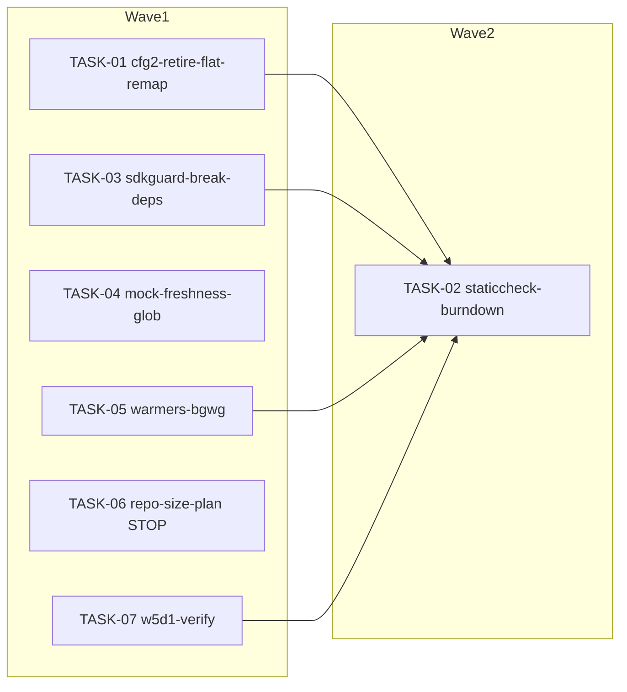

<!-- file: docs/plans/2026-07-10-bug-techdebt.md -->
<!-- version: 1.0.0 -->
<!-- guid: f466970b-8dce-4cd3-8a6b-a2fbcbb0074b -->
<!-- last-edited: 2026-07-10 -->

# Bug + Tech-Debt Cluster (INIT-9) Implementation Plan

Companion to:
- `docs/specs/2026-07-10-bug-techdebt-design.md` (items keyed by GitHub issue / TODO id:
  CFG-2-D #1536, STATICCHECK #1796, SDKGUARD #1795, MOCK-GLOB #1797, WARMERS #1794,
  REPO-SIZE-1 #1650, W5D1-VERIFY TODO.md:62)

**Initiative gate (verbatim):** PLAN -> EXECUTE AUTONOMOUSLY per item (worktree/PR/CI)
EXCEPT REPO-SIZE-1 (#1650) which is STOP-FOR-HUMAN: a git-history rewrite is
destructive and invalidates every clone/worktree — produce the migration plan
(BFG/filter-repo vs LFS options, coordination checklist, backup strategy) as a TASK
brief whose ONLY deliverable is the plan document, then STOP.

Coordination model: briefs are **standalone** — each task runs in its own worktree,
opens its own PR, and merges it (`gh pr merge <n> --rebase`) after CI. Gate for every
PR: `make ci` — staticcheck is red on main (pre-existing backlog #1796) — scope
staticcheck to files you changed; the merge gate is Minimal CI green. The `sdkguard`
step of `make ci` is ALSO red on main (#1795) until TASK-03 merges — treat a sdkguard
failure listing only `internal/logger` + `internal/dedup/unified` as pre-existing.
Tasks marked **⚠ review-critical** change the SDK backplane / op-ID log-correlation
chain and require line-by-line review before merge.

## Task skeleton (authoritative — briefs and README are projections of this table)

| Task | Item | exact_files | Polarity | Priority | Wave | Depends on |
|---|---|---|---|---|---|---|
| TASK-01 | CFG-2 Phase D (#1536/CONS-13) | internal/config/update_service.go; internal/config/persistence_test.go; internal/config/update_service_test.go; TODO.md† | removal | P2 | 1 | none (stability check inside) |
| TASK-02 | STATICCHECK (#1796) | ~30 files from fresh `staticcheck ./...` run (41 findings at plan time; NONE overlap other tasks' files — re-derive at execution) | removal | P2 | 2 | TASK-01,03,05,07 merged (TASK-04 exempt: ci.yml cannot alter Go findings) |
| TASK-03 ⚠ | SDKGUARD (#1795) | internal/operations/registry/registry.go; internal/operations/registry/worker.go; internal/operations/registry/context_decorator_test.go (NEW); internal/server/registry_wire.go; internal/dedup/unified/score.go; internal/models/dedup_score.go (NEW); internal/database/embedding_store.go | transform | P1 | 1 | none |
| TASK-04 | MOCK-GLOB (#1797) | .github/workflows/ci.yml | transform | P1 | 1 | none |
| TASK-05 | WARMERS-BGWG (#1794) | internal/server/server_lifecycle.go; internal/server/cache_warmers_bgwg_test.go (NEW) | additive | P1 | 1 | none |
| TASK-06 ⛔ | REPO-SIZE-1 (#1650) STOP-FOR-HUMAN | docs/plans/2026-07-10-repo-size-history-rewrite-plan.md (NEW; plan-only) | additive | P2 | 1 | none |
| TASK-07 | W5D1-VERIFY (TODO.md:62) | internal/organizer/organized_version_writeback_test.go (NEW) | additive (test-only) | P2 | 1 | none |

† TODO.md and CHANGELOG.md are updated by EVERY task (post-task hygiene) and are
**exempt from the collision matrix** (docs-ledger exception, spec Decision 7):
resolve rebase conflicts keep-both-sides; always rebase before merge.

## Collision matrix (computed from exact_files, code files only)

Every file above appears in exactly ONE task's list → **zero code-file collision
rows**. Two soft constraints force TASK-02 into wave 2 anyway:

| Constraint | Tasks | Resolution |
|---|---|---|
| TASK-02's file set is derived at run time (`staticcheck ./...`) and wave-1 Go merges add/remove findings (e.g. TASK-01's deletions can orphan helpers; TASK-03's type move relocates symbols) — AND its run-time file set could overlap T01/T03/T05/T07's code files (e.g. a U1000 in server_lifecycle.go). T04 (ci.yml only) can never appear in a staticcheck file set; T06 is docs-only | TASK-02 vs T01,T03,T05,T07 | serialize: wave1=T01,T03,T04,T05,T06,T07, wave2=T02; T02 may start once T01/T03/T05/T07 are merged — an outstanding T04 PR or T06's human review does not block it |
| TODO.md / CHANGELOG.md shared by all tasks | all | docs-ledger exception: keep-both rebase, no wave forcing |

Cross-initiative ownership (from the master plan, INIT-1/INIT-2 partition):
- `internal/database/embedding_store.go` — INIT-2 owns structural edits (its T4
  candidate index). TASK-03's change is a 3-reference import/type swap: land TASK-03
  before INIT-2 T4 starts, or rebase TASK-03 on top of it. Never run concurrently.
- `internal/dedup/engine.go` — INIT-2-owned; TASK-02's only touch is deleting the
  unused `bestSeg` (engine.go, U1000). If INIT-2 work is in flight at TASK-02 time,
  skip that one finding with `//lint:ignore U1000 INIT-2 in flight` and note it.
- **Hard gate (coordinator-level):** the per-executor `gh pr list --search ...` grep
  in the TASK-02/TASK-03 briefs is a point-in-time check and can miss an INIT-2 PR
  that opens mid-flight (the initiatives may run under different coordinators/
  sessions). Before dispatching TASK-03 or TASK-02, the INIT-9 coordinator MUST
  confirm no INIT-2 wave is ACTIVE (check the INIT-2 session/state or with the
  human, not merely open PRs at one instant). Worst case without the gate is a
  rebase conflict escalated up the conflict ladder — not data loss — but the gate
  removes the race. Solo (uncoordinated) executors keep the grep as the best
  available check.

## Dependency graph

(T06 has no edge to T02: it produces only a docs file and stops for human review; T02
must not wait on the human. T04 has no edge either: it touches only
`.github/workflows/ci.yml`, which can never alter a `staticcheck ./...` finding or
appear in T02's run-time-derived file set. T05/T07's edges are kept not only for
finding drift but because T02's run-time file set may overlap their code files.)

## Model assignments (authoritative — overrides per-task `Agent:` lines)

| Model | Tasks | Rationale |
|---|---|---|
| **Haiku-class** | TASK-04 | one-file mechanical pathspec swap, fully specified, caught by the gate |
| **Sonnet-class** | TASK-01, TASK-02, TASK-05, TASK-06, TASK-07 | logic + judgment (deliberate-keep vs dead-code, two-outcome test protocol, migration-plan writing) |
| **Sonnet-class ⚠ line-review** | TASK-03 | SDK backplane + op-ID log-correlation chain; wrong wiring silently breaks SLOG correlation |

## Parallel execution groups

| Wave | Tasks (parallel within wave) | Notes |
|---|---|---|
| W1 | TASK-01, TASK-03, TASK-04, TASK-05, TASK-06, TASK-07 | zero shared code files (collision matrix above). Execution mode: /parallel-sweep — trigger: 6 independent tasks (≥3 threshold), disjoint code files per collision matrix, gate = `make ci` with the red-on-main staticcheck/sdkguard caveat; merge gate = Minimal CI green. Invocation: TASK-01,03,04,05,06,07. TASK-06 ends at its STOP — do not block the wave on the human review it requests. |
| W2 | TASK-02 | Execution mode: SINGLE-AGENT (Sonnet-class) — trigger: 1 task; its file set must be recomputed from a fresh `staticcheck ./...` after TASK-01/03/05/07 have merged (run-time-derived file list, collision matrix constraint row 1). An outstanding TASK-04 PR (ci.yml cannot alter Go findings) or TASK-06's human review does not block W2. |

Same-file serialization rules: none among code files. TODO.md/CHANGELOG.md: rebase
keep-both before every merge. TASK-03 (highest-stakes, ⚠) merges first within W1 when
order is free — it also turns the `make ci` sdkguard step green for later merges.

## Coordinator protocol (verbatim)

> **Coordinator owns git. Workers never push.** Each worker operates only inside its
> assigned worktree: edit, test, commit — then stop. Workers never run `git push`,
> `gh pr`, or any merge command. The coordinator runs the gate (`make ci`) in each
> finished worktree, opens the PR, merges (rebase/FF unless the repo profile says
> otherwise), and then **rebases every open sibling worktree** before dispatching
> anything else.
>
> **Per-merge sibling-rebase loop:** after EVERY merge to `origin/main`:
> for each open sibling worktree, `git fetch origin && git rebase
> origin/main`. A sibling that skips a rebase is a future conflict.
>
> **Conflict escalation ladder** (in order, never skip a rung): 1) clean rebase;
> 2) conflict-resolver subagent (Sonnet-class, only when the conflict spans 1–3 small
> files); 3) file-copy cherry-pick fallback — re-apply the task's file states onto a
> fresh branch from HEAD; 4) mark `rebase_blocked`, stop the lane, escalate to a human.
>
> **A wave MUST NOT start** while any of: the previous wave has an unmerged PR; any
> sibling worktree is un-rebased; the gate is red on `origin/main`; or a
> `rebase_blocked` marker is unresolved.

(Note for this initiative: briefs are standalone — when run WITHOUT a coordinator,
each executor performs its own push/PR/merge exactly as its brief's "PR + merge"
section says; the protocol above governs coordinated /parallel-sweep runs, and its
"gate is red on origin/main" clause is waived for the pre-existing staticcheck (#1796,
until TASK-02) and sdkguard (#1795, until TASK-03) steps ONLY. Its "previous wave has
an unmerged PR" clause treats TASK-04 and TASK-06 as non-blocking for wave 2 — see
the dependency graph note. Additionally, the coordinator must apply the INIT-2
hard gate (collision-matrix section) before dispatching TASK-03 or TASK-02.)

---

### TASK-01: Retire the CFG-2 flat-key compat shim (Phase D)
Priority: P2 · Effort: M · Agent: Sonnet-class · Depends on: none (in-task stability check)

**Context.** #1536/CONS-13; spec §C1, Decision 3. Shim at
`internal/config/update_service.go` (grep `legacyRemapGroup\|applyLegacyRemaps` →
:70,:72,:80,:147,:150,:228). Phase B+C = PR #1514 (2026-06-19) — stability window
satisfied but re-verified in-task. TODO.md:481 cites the nonexistent
`internal/server/update_service.go` — fix it in the same PR.

**Exact files to change**
- `internal/config/update_service.go` — remove type+var+func+call; add the
  `retiredLegacyFlatKeys` detection-only warn-log (spec Decision 3); keep
  `remapScheduledKeys` call and the JSON round-trip block.
- `internal/config/persistence_test.go` — remove `applyLegacyRemaps` tests (grep
  `applyLegacyRemaps` → ~:866-:1116).
- `internal/config/update_service_test.go` — add `TestUpdateService_FlatKeysDropped` +
  `TestUpdateService_NestedKeysStillApply`.
- `TODO.md` — fix :481 path; check off CONS-13/:481 and Phase D/:542; add the
  remove-detection-log-after-one-release follow-up.

**Step-by-step / Acceptance / Idempotency / Rollback:** see
`docs/agent-tasks/bug-techdebt/TASK-01-cfg2-retire-flat-remap.md` (authoritative brief).

---

### TASK-02: Drain the staticcheck backlog to green
Priority: P2 · Effort: L · Agent: Sonnet-class · Depends on: TASK-01,03,05,07 merged (TASK-04 exempt: ci.yml cannot alter Go findings)

**Context.** #1796; spec §C2, Decision 5. 41 findings at plan time (37 U1000 +
4 SA1019); regenerate the list fresh. Brief:
`docs/agent-tasks/bug-techdebt/TASK-02-staticcheck-burndown.md`.

---

### TASK-03: Break the sdkguard dependency violations [⚠ review-critical]
Priority: P1 · Effort: M · Agent: Sonnet-class · Depends on: none

**Context.** #1795; spec §C3, Decisions 1-2. Two chains, both verified by `go list
-deps` BFS. Brief: `docs/agent-tasks/bug-techdebt/TASK-03-sdkguard-break-deps.md`.

---

### TASK-04: Fix the Mock-Freshness recursive glob
Priority: P1 · Effort: S · Agent: Haiku-class · Depends on: none

**Context.** #1797; spec §C4. Brief:
`docs/agent-tasks/bug-techdebt/TASK-04-mock-freshness-glob.md`.

---

### TASK-05: Enroll the four cache warmers in bgWG
Priority: P1 · Effort: S · Agent: Sonnet-class · Depends on: none

**Context.** #1794 (follow-up to #1781); spec §C5. Brief:
`docs/agent-tasks/bug-techdebt/TASK-05-warmers-bgwg.md`.

---

### TASK-06: REPO-SIZE-1 history-rewrite migration plan [⛔ STOP-FOR-HUMAN]
Priority: P2 · Effort: M · Agent: Sonnet-class · Depends on: none

**Context.** #1650; spec §C6, Decision 6. ONLY deliverable = the plan document; then
STOP. Brief: `docs/agent-tasks/bug-techdebt/TASK-06-repo-size-rewrite-plan.md`.

---

### TASK-07: Verify Author/Series survival in CreateOrganizedVersion write-back
Priority: P2 · Effort: M · Agent: Sonnet-class · Depends on: none

**Context.** STOREFID W5d-1, TODO.md:62-84; spec §C7, Decision 4 (two-outcome
protocol; product code untouched). Brief:
`docs/agent-tasks/bug-techdebt/TASK-07-w5d1-verify-writeback.md`.

---

## Review gates for the coordinator

Line-by-line review mandatory: **TASK-03** (SDK backplane; a wrong or missing
`SetRunContextDecorator` wiring silently severs op-ID log correlation — verify the
`registry_wire.go` line AND the decorator test exist before merge). Standard review:
all others; for **TASK-02**, spot-check that every U1000 deletion was grep-verified
dead and every SA1019 keep carries a justified `//lint:ignore`. **TASK-06** additionally
requires the coordinator to confirm NO rewrite command was executed — the diff must be
a single new docs file. Every PR: `make ci` (with the two red-on-main caveats above) +
Minimal CI green + the task's acceptance checklist pasted and ticked in the PR
description + COMPLETED/REMAINING/BLOCKED counts in the final status comment.
