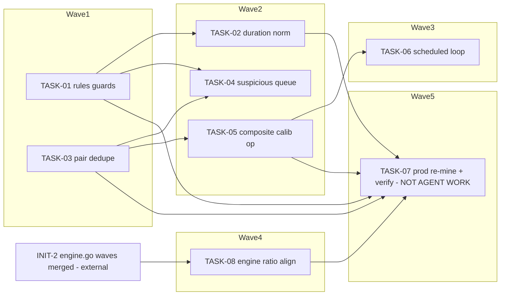

<!-- file: docs/plans/2026-07-10-dedup-label-quality.md -->
<!-- version: 1.0.0 -->
<!-- guid: b8c5ff0c-72e2-4341-93ae-057a113f619e -->
<!-- last-edited: 2026-07-10 -->

# INIT-1 Dedup Label-Quality & Training/Refinement Loop — Implementation Plan

Companion to:
- `docs/specs/2026-07-10-dedup-label-quality-design.md` (T1–T8 / C1–C7 scheme; master plan `.claude/notes/2026-07-10-remaining-work-master-plan.md` §INIT-1)

**Gate (verbatim, stamped on every task):** SPEC -> GATED APPLY. Code PRs run autonomously (worktree/PR/CI). EVERY prod-data mutation (T7 rebuild-gold-labels re-mine, any calibration threshold/config apply, prod re-runs) is dry-run FIRST, then a real AskUserQuestion apply decision — never a text-reply approval.

**File-ownership (verbatim):** INIT-2 OWNS all structural edits to `internal/dedup/engine.go`. INIT-1's single engine.go touch (align `isPartVsWholeMismatch` ratio 0.6 at engine.go:1528/const :107 with the dataset rule's 0.5) lands AFTER INIT-2's engine.go waves merge, rebased on top — never a concurrent wave on engine.go. `ListLabeledExamples` is implemented in `internal/database/dedup_label.go:139` (method on EmbeddingStore) — NOT in embedding_store.go — so INIT-1 T3 does NOT collide with INIT-2's embedding_store.go index work and needs no serialization. (This corrects the master-plan §INIT-1 locked-scope premise that placed the dedup in embedding_store.go — anchor-verified wrong; surface to the owner to amend the master plan. INIT-2's touched set also excludes `internal/database/dedup_label.go` and `internal/plugins/dedup/plugin.go`, so TASK-01's BookFeatures edit and TASK-05's op registration are collision-free.)

Coordination model: briefs are **standalone mode** — each task is its own worktree + branch + PR + `gh pr merge <n> --rebase` (rebase/FF only, never squash, never commit to main). `make ci` gates every PR — caveat (literal): staticcheck is red on main (pre-existing backlog #1796) — scope staticcheck to files you changed; the merge gate is Minimal CI green. Tasks marked **⚠ review-critical** change label-ground-truth or config-apply surfaces and require line-by-line review before merge.

## Dependency graph

(`T08 --> T07` is soft: T7 SHOULD re-verify after T8 but MAY run its first re-mine before T8 if INIT-2 is slow; see TASK-07.)

## Model assignments (authoritative — overrides per-task `Agent:` lines)

| Model | Tasks | Rationale |
|---|---|---|
| **Haiku-class** | — | none: every task here changes label ground truth, calibration math, or scheduler/config surfaces |
| **Sonnet-class** | TASK-01 ⚠, TASK-02, TASK-03, TASK-04, TASK-06, TASK-08 | logic + integration with exact specs; ⚠-flagged get line-by-line review |
| **Opus/strong-class** | TASK-05 ⚠ | calibration harness math + gated config-apply path — highest wrong-answer cost |
| **NOT AGENT WORK** | TASK-07 | operator-driven prod mutation runbook with AskUserQuestion gates |

## Parallel execution groups

| Wave | Tasks (parallel within wave) | Notes |
|---|---|---|
| W1 | TASK-01, TASK-03 | disjoint files. Execution mode: SINGLE-AGENT (strong model) per task, parallel-safe — trigger: 2 heterogeneous tasks (< the ≥3 mechanically-similar /parallel-sweep threshold), disjoint files per collision matrix |
| W2 | TASK-02, TASK-04, TASK-05 | Execution mode: /parallel-sweep — trigger: 3 tasks (≥3 threshold), disjoint files per collision matrix, gate = `make ci`. Invocation: TASK-02,04,05. TASK-02 waits on TASK-01 merge (shares `internal/dedup/dataset/builder.go` + `builder_test.go`); TASK-04 waits on TASK-01 (BookFeatures.ASIN) and TASK-03 (shares `label_review.go`); TASK-05 waits on TASK-03 (uses `dataset.DedupeByPair`) — i.e. W2 starts only after ALL of W1 merges |
| W3 | TASK-06 | Execution mode: SINGLE-AGENT (strong model) — trigger: 1 task; depends on TASK-05's op ID existing |
| W4 | TASK-08 | Execution mode: SINGLE-AGENT (strong model) — trigger: 1 task; EXTERNAL prereq: INIT-2's engine.go waves merged (file-ownership rule), rebase on top, never concurrent |
| W5 | TASK-07 | Execution mode: NOT AGENT WORK — trigger: prod-data mutation (gate: dry-run → AskUserQuestion apply); operator-driven runbook after W1+W2 deployed |

### ⚠️ Same-file collision table (computed from Exact-files lists)

| Shared file | Tasks that touch it | Resolution |
|---|---|---|
| `internal/dedup/dataset/builder.go` | TASK-01, TASK-02 | serialize: wave1=TASK-01, wave2=TASK-02 |
| `internal/dedup/dataset/builder_test.go` | TASK-01, TASK-02 | serialize: wave1=TASK-01, wave2=TASK-02 |
| `internal/server/handlers/dedup/label_review.go` | TASK-03, TASK-04 | serialize: wave1=TASK-03, wave2=TASK-04 |
| `internal/dedup/engine.go` | TASK-08, **INIT-2 (external owner)** | serialize: INIT-2 waves first, wave4=TASK-08 rebased on top |

(TASK-02 makes NO store edits — the write-boundary repair already shipped as CONS-18 in `pebble_store_bookfiles.go`; TASK-02 only verifies it by grep/test, so there is no cross-initiative collision with INIT-2's stub getters in `pebble_store.go` in either direction. TASK-05's one-line op registration in `internal/plugins/dedup/plugin.go` is outside INIT-2's touched set; even if INIT-2 later registers ops there, the def-list line is append-style and trivially rebase-resolved.)

Same-file serialization rules: `builder.go`/`builder_test.go` (TASK-01→TASK-02); `label_review.go` (TASK-03→TASK-04). Highest-stakes track (TASK-01, ground-truth rules) starts first.

## Coordinator protocol (verbatim)

> **Coordinator owns git. Workers never push.** Each worker operates only inside its
> assigned worktree: edit, test, commit — then stop. Workers never run `git push`,
> `gh pr`, or any merge command. The coordinator runs the gate (`make ci`) in each
> finished worktree, opens the PR, merges (rebase/FF unless the repo profile says
> otherwise), and then **rebases every open sibling worktree** before dispatching
> anything else.
>
> **Per-merge sibling-rebase loop:** after EVERY merge to `origin/main`:
> for each open sibling worktree, `git fetch origin && git rebase
> origin/main`. A sibling that skips a rebase is a future conflict.
>
> **Conflict escalation ladder** (in order, never skip a rung): 1) clean rebase;
> 2) conflict-resolver subagent (Sonnet-class, only when the conflict spans 1–3 small
> files); 3) file-copy cherry-pick fallback — re-apply the task's file states onto a
> fresh branch from HEAD; 4) mark `rebase_blocked`, stop the lane, escalate to a human.
>
> **A wave MUST NOT start** while any of: the previous wave has an unmerged PR; any
> sibling worktree is un-rebased; the gate is red on `origin/main`; or a
> `rebase_blocked` marker is unresolved.

(Note: briefs in this package are standalone mode — when a task is dispatched standalone, the executor performs its own push/PR/merge per the brief's PR + merge section; the protocol above governs any coordinator-driven multi-task dispatch such as W2's /parallel-sweep.)

---

### TASK-01: Guard the not_dup mining rules (partVsWhole identity guard; missingFile → unsure) [⚠ review-critical]
Priority: P0 · Effort: M · Agent: Sonnet-class · Depends on: none

**Context.** Spec C1/Decision 4-5. Jul-8 findings: every verified high-cosine `not_dup` is a real duplicate mislabeled by `partVsWhole` (rules.go:106, const 0.5 at rules.go:17) misfiring on ms/sec durations, or by `missingFile` (rules.go:62). 100% of `not_dup` labels are `source=rule`.

**Exact files to change**
- `internal/dedup/dataset/rules.go` — `missingFile` → `unsure`; new exported `SharesIdentity` guard in `partVsWhole` (TASK-04's predicate reuses it)
- `internal/dedup/dataset/rules_test.go` — regression tests with Jul-8 fixtures (B002V8MAAM / B003FCV4O6 / B005GGGC3M shapes)
- `internal/database/dedup_label.go` — `BookFeatures` + `ASIN`, `VersionGroupID` (json omitempty)
- `internal/dedup/dataset/builder.go` — populate the two fields from `database.Book` (nil → `""`)
- `internal/dedup/dataset/builder_test.go` — feature-population tests

**Acceptance criteria** — see the brief (grep-checkable). `make ci` green.
**Idempotency.** Done if `grep -n "func SharesIdentity" internal/dedup/dataset/rules.go` hits. **Rollback.** Revert PR; no stored rows change until T7's gated re-mine.

---

### TASK-02: Duration ms/sec normalization at the mining boundary (write-boundary repair verified, not re-added)
Priority: P0 · Effort: S · Agent: Sonnet-class · Depends on: TASK-01

**Context.** Spec C2/Decision 6. `buildFeatures` (builder.go:129) SUMS per-file durations into `TotalDurationSec` and `durationRatio` (builder.go:174) consumes that sum raw; live prod still holds ms-scale rows written before CONS-18 (Jul-8: 20,810,840 "sec"). ALREADY SHIPPED — verify, don't re-add and don't weaken: the store write chokepoints repair+warn via `normalizeBookFileDuration` (`duration_sanity.go:61` → `pebble_store_bookfiles.go:192`/`:785`/`:849`, CONS-18); the heuristic is already exported as `database.DurationLooksLikeMillis` (`duration_sanity.go:36`; `duration_backfill.go:33` is a thin delegating wrapper); the importer converts ms→sec (`trackDurationSeconds`, CONS-16). Normalization MUST be per-file before summing — the bitrate test is a per-file contract; a mixed clean+corrupted file set breaks aggregate-level normalization.

**Exact files to change**
- `internal/database/duration_sanity.go` (+ `duration_sanity_test.go`) — NEW exported `NormalizeDurationSec(fileSizeBytes int64, durationSec int) int` beside `DurationLooksLikeMillis`; nothing else
- `internal/dedup/dataset/builder.go` (+ `builder_test.go`) — per-file normalization of `fl.Duration` in `buildFeatures`' summing loop (incl. mixed-fixture test)

NO edits to `pebble_store_bookfiles.go`, `duration_backfill.go`, or the importer — verify-only greps in the brief.

**Acceptance criteria** — brief. `make ci` green; full `go test ./... -short`.
**Idempotency.** Done if `grep -n "NormalizeDurationSec" internal/dedup/dataset/builder.go` hits. **Rollback.** Revert PR; no store write path is touched, so zero stored-byte change either way.

---

### TASK-03: Pair-dedup the labeled-example consumption (2.7× row collapse)
Priority: P1 · Effort: M · Agent: Sonnet-class · Depends on: none

**Context.** Spec C3/Decision 3. 6,926 rows → 2,564 unique pairs (Jul-8 export); rows key on candidateID (dedup_label.go:16-17); calibration (`collectCalibrationPairs`) and export (`ExportLabeledExamples`, label_review.go:162) double-count.

**Exact files to change**
- `internal/dedup/dataset/pair_dedupe.go` (+ `pair_dedupe_test.go`) — NEW: `PairKey`, `DedupeByPair`
- `internal/plugins/dedup/calibrate_embedding_thresholds.go` — dedupe input + `rows_in`/`pairs_out` report fields
- `internal/server/handlers/dedup/label_review.go` — dedupe export (param `raw=true` opts out for debugging)

**Idempotency.** Done if `grep -n "func DedupeByPair" internal/dedup/dataset/pair_dedupe.go` hits. **Rollback.** Revert PR; store untouched.

---

### TASK-04: Suspicious-label review queue + one-click override UI
Priority: P1 · Effort: M · Agent: Sonnet-class · Depends on: TASK-01, TASK-03

**Context.** Spec C4/Decision 2. Grow human volume: surface rule-`not_dup` rows with duplicate-shaped evidence; one-click reuses `POST /dedup/labels/:id/override` (wire_dedup_routes.go:44 → `OverrideDedupLabel`, label_review.go:103, stamps human at :138).

**Exact files to change**
- `internal/server/handlers/dedup/label_review.go` — `ListSuspiciousDedupLabels` + predicate (identity arm REUSES `dataset.SharesIdentity` from TASK-01 — no second identity implementation; that arm is transitional, historical-backlog-only post-re-mine)
- `internal/server/wire_dedup_routes.go` — `GET /dedup/labels/suspicious`
- `web/src/pages/DedupLabels.tsx` (+ `web/src/pages/__tests__/DedupLabels.test.tsx`) — Suspicious tab + override buttons

**Idempotency.** Done if `grep -n "ListSuspiciousDedupLabels" internal/server/wire_dedup_routes.go` hits. **Rollback.** Revert PR; read-only surface + human-initiated single-row overrides.

---

### TASK-05: Composite (noisy-OR) calibration op — report + gated apply [⚠ review-critical]
Priority: P1 · Effort: L · Agent: Opus/strong-class · Depends on: TASK-03

**Context.** Spec C5/Decision 7. Existing op sweeps ONLY one cosine cut (calibrate_embedding_thresholds.go:64-67); ~47% of true_dup score < 0.98 → single-threshold is the wrong tool. Tune `ScoreConfig` (unified/config.go:48, defaults at :66) against the pair-deduped gold set by replaying `ComposeScore` (compose.go:47).

**Exact files to change**
- `internal/plugins/dedup/calibrate_composite.go` (+ `calibrate_composite_test.go`) — NEW op `dedup.calibrate-composite`
- `internal/plugins/dedup/plugin.go` — register the def beside `calibrateEmbeddingThresholdsDef`

**Idempotency.** Done if `grep -rn "dedup.calibrate-composite" internal/plugins/dedup/` hits. **Rollback.** Revert PR; dry-run default writes nothing. An applied config persists in the PebbleDB settings store (`SaveConfigToDatabase` → `config_blob`, survives `make deploy`); there is no feature flag — revert = a second operator-gated config-apply restoring the pre-apply values echoed in the op report. Applies affect future scoring only (stored candidate bands unchanged until re-scored).

---

### TASK-06: Scheduled refinement loop (built-in-DISABLED; WF-3-aligned)
Priority: P2 · Effort: S · Agent: Sonnet-class · Depends on: TASK-05

**Context.** Spec C6/Decision 8. Mirror the `dedup_refresh` `ScheduledTaskConfig` shape; chain dry-run re-mine → dry-run composite calibration → drift log. NO apply path on schedule. Aligns with / awaits INIT-6 WF-3 — keep minimal.

**Exact files to change**
- `internal/config/config.go` — `ScheduledTasksConfig.LabelRefinement` + viper defaults (enabled **false**, interval 10080, on_startup false)
- `internal/scheduler/tasks.go` — register `label_refinement` `TaskDefinition`
- `internal/scheduler/tasks_test.go` (or nearest scheduler test file) — disabled-by-default test

**Idempotency.** Done if `grep -n "label_refinement" internal/config/config.go` hits. **Rollback.** Revert PR or set `scheduled.label_refinement.enabled=false` (already the default).

---

### TASK-07: Prod re-mine + recalibrate + verify (runbook) — NOT AGENT WORK
Priority: P0 · Effort: M (operator) · Agent: NOT AGENT WORK — operator-driven · Depends on: TASK-01, TASK-02, TASK-03, TASK-05 merged + deployed (T8 soft)

**Context.** Spec M4. `dedup.rebuild-gold-labels` dry-run → **AskUserQuestion** → apply (human rows preserved, rebuild_gold_labels.go:214-215) → re-run `dedup.calibrate-embedding-thresholds` → run `dedup.calibrate-composite` (dry-run; any apply is a second AskUserQuestion) → confirm precision floor reachable. Every apply step is dry-run first + a real AskUserQuestion decision — never a text-reply approval.

**Exact files to change** — none (operations against prod 172.16.2.30 via the ops API).

**Idempotency.** Re-runnable on COMPLETED runs: rebuild apply is a stable no-op on unchanged state. ⚠ The apply itself is NON-ATOMIC (bulk delete of rule/auto rows, then per-row re-insert) and a partial failure is NOT healed by re-running rebuild — recovery is re-running the mining ops (`dedup.dataset-backfill` for rule rows, `dedup.mine-gold-labels` for auto_high_conf) then rebuild; see the brief. **Rollback.** Re-run rebuild after any further rule fix; human labels are never deleted; the JSONL export is NOT a restore path (no import op exists); no config is written without an approved recommendation.

---

### TASK-08: Align engine part-vs-whole ratio with the dataset rule (0.6 → 0.5)
Priority: P2 · Effort: S · Agent: Sonnet-class · Depends on: EXTERNAL — INIT-2's engine.go waves merged (file-ownership rule); no INIT-1 prereq

**Context.** Spec C7/Decision 9. `partVsWholeDurationRatioMax = 0.6` (engine.go:107) vs `partVsWholeRatioMax = 0.5` (rules.go:17); veto at `isPartVsWholeMismatch` (engine.go:1528). Narrows the veto slightly.

**Exact files to change**
- `internal/dedup/engine.go` — the one const, 0.6 → 0.5, comment citing rules.go
- engine part-vs-whole test file (locate by grep) — boundary test at 0.5

**Idempotency.** Done if `grep -n "partVsWholeDurationRatioMax = 0.5" internal/dedup/engine.go` hits. **Rollback.** Revert the single-const commit.

---

## Review gates for the coordinator

Line-by-line review mandatory: TASK-01 (changes label ground truth for all future mining) and TASK-05 (calibration math + the only config-apply path). Standard review: TASK-02, 03, 04, 06, 08. TASK-07 is operator-driven — no PR. Every PR: `make ci` green (staticcheck is red on main (pre-existing backlog #1796) — scope staticcheck to files you changed; the merge gate is Minimal CI green) + the task's acceptance checklist pasted and ticked in the PR description + COMPLETED/REMAINING/BLOCKED counts in the final status comment.
