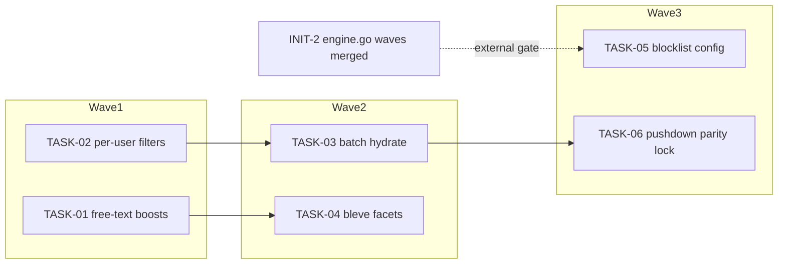

<!-- file: docs/plans/2026-07-10-filtering-search.md -->
<!-- version: 1.0.0 -->
<!-- guid: 94df9efd-1922-41ca-acae-c9f9c3db95dd -->
<!-- last-edited: 2026-07-10 -->

# Filtering & Search Pipeline (INIT-4) Implementation Plan

**Gate (verbatim):** PLAN -> EXECUTE AUTONOMOUSLY (worktree/PR/CI per task). T1/T2 are
user-visible correctness fixes — ship first.

**File-ownership:** T5 (TASK-05) moves the boilerplate blocklist OUT of
`internal/dedup/engine.go` — engine.go is INIT-2-OWNED; schedule TASK-05 after INIT-2's
engine.go waves merge, rebased on top (same partition rule as INIT-1). All other tasks: none.

Companion to:
- `docs/specs/2026-07-10-filtering-search-design.md` (INIT-4 T1–T6 from the master plan)

Coordination model: briefs are **standalone** — each task is its own worktree + branch + PR +
`gh pr merge --rebase`. `make ci` gates every PR (caveat: staticcheck is red on main
(pre-existing backlog #1796) — scope staticcheck to files you changed; the merge gate is
Minimal CI green). Tasks marked **⚠ review-critical** change result-set semantics and require
line-by-line coordinator review before merge.

## Dependency graph

## Model assignments (authoritative — overrides per-task `Agent:` lines)

| Model | Tasks | Rationale |
|---|---|---|
| **Haiku-class** | — | none: every task needs bleve/store API judgment |
| **Sonnet-class** | TASK-01, TASK-03, TASK-04, TASK-05 | bounded logic + integration; gate catches regressions |
| **Sonnet-class ⚠ (coordinator line-review)** | TASK-02, TASK-06 | change which rows a user sees (filter semantics, pagination, pushdown parity) |

## Parallel execution groups

| Wave | Tasks (parallel within wave) | Notes |
|---|---|---|
| W1 | TASK-01, TASK-02 | disjoint files. Execution mode: SERIAL WAVES (coordinator-driven) — trigger: 2 tasks (< the ≥3 /parallel-sweep threshold); disjoint file sets per collision matrix allow concurrent dispatch within the wave. Ship-first per gate. |
| W2 | TASK-03, TASK-04 | after W1 merges. Execution mode: SERIAL WAVES (coordinator-driven) — trigger: TASK-03 shares `internal/audiobooks/service_query.go` with TASK-02 (collision row 2) and TASK-04 shares `internal/search/bleve_index.go` with TASK-01 (collision row 1); TASK-03 ∥ TASK-04 are mutually disjoint. |
| W3 | TASK-05, TASK-06 | Execution mode: SERIAL WAVES (coordinator-driven) — trigger: TASK-06 shares `internal/audiobooks/service_query.go` with TASK-02/TASK-03 (collision row 2); TASK-05 is internally collision-free but externally gated on INIT-2's engine.go waves (may start earlier than W3 if INIT-2 merges earlier). |

**⚠️ Same-file collision table** (computed from the Exact-files lists):

| Shared file | Tasks that touch it | Resolution |
|---|---|---|
| `internal/search/bleve_index.go` | TASK-01, TASK-04 | serialize: wave1=T01, wave2=T04 |
| `internal/search/bleve_index_test.go` | TASK-01, TASK-04 | same serialization as `bleve_index.go` (wave1=T01, wave2=T04) — no scheduling change |
| `internal/audiobooks/service_query.go` | TASK-02, TASK-03, TASK-06 | serialize: wave1=T02, wave2=T03, wave3=T06 |
| `internal/config/config.go` | TASK-02, TASK-05 | already serialized by waves (T02=wave1, T05=wave3 external-gated) — no scheduling change |

Same-file serialization rules: `internal/search/bleve_index.go` + its `_test.go` (T01→T04);
`internal/audiobooks/service_query.go` (T02→T03→T06). Correctness track (T01/T02) starts first.

## Coordinator protocol (verbatim)

> **Coordinator owns git. Workers never push.** Each worker operates only inside its
> assigned worktree: edit, test, commit — then stop. Workers never run `git push`,
> `gh pr`, or any merge command. The coordinator runs the gate (`make ci`) in each
> finished worktree, opens the PR, merges (rebase/FF unless the repo profile says
> otherwise), and then **rebases every open sibling worktree** before dispatching
> anything else.
>
> **Per-merge sibling-rebase loop:** after EVERY merge to `origin/main`:
> for each open sibling worktree, `git fetch origin && git rebase
> origin/main`. A sibling that skips a rebase is a future conflict.
>
> **Conflict escalation ladder** (in order, never skip a rung): 1) clean rebase;
> 2) conflict-resolver subagent (Sonnet-class, only when the conflict spans 1–3 small
> files); 3) file-copy cherry-pick fallback — re-apply the task's file states onto a
> fresh branch from HEAD; 4) mark `rebase_blocked`, stop the lane, escalate to a human.
>
> **A wave MUST NOT start** while any of: the previous wave has an unmerged PR; any
> sibling worktree is un-rebased; the gate is red on `origin/main`; or a
> `rebase_blocked` marker is unresolved.

(Standalone-brief note: each brief carries its own PR+merge block; when a single agent runs a
brief end-to-end it performs that block itself, but wave ordering and sibling rebases above
still bind whoever dispatches.)

---

### TASK-01: Apply free-text field boosts at query time
Priority: P1 · Effort: M · Agent: Sonnet-class · Depends on: none

**Context.** INIT-4 T1; spec §C1, Decisions 1–2. `textAnalyzed(boost)` never reads its arg
(verify: `grep -n 'textAnalyzed := func' internal/search/bleve_index.go`); bleve v2.6.0 has no
index-time boost, so title×3.0/author×2.0/… (call sites:
`grep -n 'textAnalyzed(' internal/search/bleve_index.go`) never applied.

**Exact files to change**
- `internal/search/bleve_index.go` — add ordered `textFieldBoosts` table; remove dead `boost` param.
- `internal/search/bleve_translator.go` — `translateFreeText` default branch → boosted disjunction + unfielded child.
- `internal/search/bleve_translator_test.go` — NEW cases: boost values present; unfielded recall child; quoted/fuzzy/prefix variants unchanged.
- `internal/search/bleve_index_test.go` — end-to-end: title match outranks description match.

**Step-by-step** — see `docs/agent-tasks/filtering-search/TASK-01-freetext-field-boosts.md`.

**Acceptance criteria**
- [ ] `grep -n "textFieldBoosts" internal/search/bleve_index.go internal/search/bleve_translator.go` hits both files
- [ ] `grep -n "boost float64" internal/search/bleve_index.go` returns 0 hits (dead param gone)
- [ ] Title-match doc ranks above description-match doc in the e2e test
- [ ] Recall test: tag-only match still returned
- [ ] `make ci` green (staticcheck scoped to changed files)

**Idempotency.** Done if `textFieldBoosts` exists AND the dead param is gone (transform
polarity). If interrupted: re-run the greps; finish whichever file lacks its half.

**Rollback.** Revert the PR — ranking returns to unweighted `_all`; no index rebuild needed
(query-time only).

---

### TASK-02: Restore per-user filter application in searchWithBleve [⚠ review-critical]
Priority: P0 · Effort: M · Agent: Sonnet-class · Depends on: none

**Context.** INIT-4 T2 — the top correctness bug: `read_status:unread` returns unfiltered
results. Discard site: `grep -n 'search.Translate(ast)' internal/audiobooks/service_query.go`
(`bleveQ, _, err :=` drops `[]PerUserFilter`). Peel-off:
`grep -n 'perUserFieldSet\[n.Field\]' internal/search/bleve_translator.go`. Working evaluator
to lift: `internal/playlist/evaluator.go` (`applyPerUserFilters`/`perUserFilterMatches`).
Spec §C2, Decisions 3–5, 11.

**Exact files to change**
- `internal/search/per_user_match.go` — NEW: exported `MatchPerUserFilters` (+ moved numeric/time matchers).
- `internal/search/per_user_match_test.go` — NEW: nil-state, negation, range, AND semantics.
- `internal/playlist/evaluator.go` — delegate to the moved evaluator; delete private copies.
- `internal/audiobooks/service_query.go` — `searchWithBleve` gains `userID`; over-fetch window (+ exhaustion warn); state-error warn + zero-value eval; post-filter; slice; kill-switch check.
- `internal/config/config.go` — `DisablePerUserSearchFilters bool` (default false; Decision 11 kill switch).
- `internal/audiobooks/service_query_test.go` (or nearest existing service test file) — filter + pagination + empty-userID + state-error-warn + window-exhaustion + kill-switch cases.

**Acceptance criteria**
- [ ] `grep -n "func MatchPerUserFilters" internal/search/per_user_match.go` hits
- [ ] `grep -n "func perUserFilterMatches" internal/playlist/evaluator.go` returns 0 hits (moved)
- [ ] `grep -n "bleveQ, _, err" internal/audiobooks/service_query.go` returns 0 hits (no longer discarded)
- [ ] `read_status` filter test green; empty-userID keeps results (anti-over-suppression)
- [ ] State-read error → zero-value eval + `slog.Warn` (`TestSearchWithBleveStateErrorFailsOpen`); window exhaustion → `slog.Warn` (`TestSearchWithBleveWindowExhaustionWarns`) — Decisions 4–5
- [ ] `DisablePerUserSearchFilters=true` → filters skipped + warn (`TestSearchWithBleveKillSwitchDrops`) — Decision 11
- [ ] Full `go test ./... -short` green (playlist + audiobooks consumers) + `make ci`

**Idempotency.** Transform polarity: evaluator present in `internal/search` + absent in
playlist. If interrupted mid-move, the build fails loudly (duplicate/missing symbols) — finish
the delegation before re-running.

**Rollback.** Revert the PR; playlist evaluator returns to its private copy, search returns to
dropping filters (documented old behavior).

---

### TASK-03: Batch-hydrate Bleve hits via GetBooksByIDs
Priority: P1 · Effort: M · Agent: Sonnet-class · Depends on: TASK-02

**Context.** INIT-4 T3; spec §C3, Decision 6. Per-hit loop:
`grep -n 'GetBookByID(h.BookID)' internal/audiobooks/service_query.go`. Point-get to mirror:
`grep -n 'func (p \*PebbleStore) GetBookByID' internal/database/pebble_store.go`. No batch
getter exists (repo-wide grep for `GetBooksByIDs` = 0 hits at planning time).

**Exact files to change**
- `internal/database/iface_book.go` — add `GetBooksByIDs(ids []string) ([]Book, error)` to `BookReader`.
- `internal/database/pebble_store.go` — impl (order-preserving, skip-missing, Full rows).
- `internal/database/mocks/mock_store.go` — hand-add the mock method (scoped; do NOT regen repo-wide — mockery version drift).
- `internal/database/pebble_store_books_by_ids_test.go` — NEW: order/skip/fidelity tests.
- `internal/audiobooks/service_query.go` — replace the loop with one call.

**Acceptance criteria**
- [ ] `grep -n "GetBooksByIDs" internal/database/iface_book.go internal/database/pebble_store.go internal/database/mocks/mock_store.go internal/audiobooks/service_query.go` hits all four
- [ ] `grep -n "GetBookByID(h.BookID)" internal/audiobooks/service_query.go` returns 0 hits
- [ ] Fidelity test: returned row keeps `AcoustIDFingerprint`-class heavy fields
- [ ] Fail-open (§C3): non-not-found error returns rows-so-far ALONGSIDE the error; `searchWithBleve` warns + serves the partial page (`TestSearchWithBleveHydrationErrorPartialPage`) — never fails the whole page
- [ ] Full `go test ./... -short` green (store-getter rule) + `make ci`

**Idempotency.** Additive: done if the interface grep hits. Rollback: revert PR — behavior
identical (same reads, batched).

---

### TASK-04: Bleve facet counts with DB-distinct fallback
Priority: P2 · Effort: L · Agent: Sonnet-class · Depends on: TASK-01

**Context.** INIT-4 T4 (additive); spec §C4, Decision 7. Handler:
`grep -n 'func (h \*Handler) AudiobookFacets' internal/server/handlers/audiobooks/handler.go`.
Warmer twin writes the SAME cache key: `grep -n "facetsCacheKey" internal/server/audiobooks_helpers.go`.
Keyword fields already indexed: `grep -n 'AddFieldMappingsAt("genre"' internal/search/bleve_index.go`.

**Exact files to change**
- `internal/search/bleve_index.go` — `FacetCounts(size int)` using `bleve.NewFacetRequest`.
- `internal/search/bleve_index_test.go` — facet counts over fixture docs.
- `internal/audiobooks/service_facets.go` — NEW: service wrapper (nil-index sentinel).
- `internal/server/handlers/audiobooks/handler.go` — add `*_counts` keys; keep list keys byte-identical.
- `internal/server/audiobooks_helpers.go` — warmer emits the identical shape.

**Acceptance criteria**
- [ ] `grep -n "func (b \*BleveIndex) FacetCounts" internal/search/bleve_index.go` hits
- [ ] Response with nil index == today's shape exactly (fallback test)
- [ ] Handler and warmer build the response through ONE shared helper (grep: shared func name in both)
- [ ] `make ci` green

**Idempotency.** Additive: done if `FacetCounts` grep hits. Rollback: revert PR — facets
return to DB-distinct-only; no cache/schema impact.

---

### TASK-05: Move boilerplate title blocklist to config-extendable module
Priority: P2 · Effort: M · Agent: Sonnet-class · Depends on: EXTERNAL — INIT-2 engine.go waves merged (rebase on top)

**Context.** INIT-4 T5; spec §C5, Decisions 8, 10. Lists:
`grep -n 'var boilerplateTitlePatterns' internal/dedup/engine.go` (two slices + `isBoilerplateTitle`).
Nine call sites stay valid (same package): `grep -rn "isBoilerplateTitle" internal/dedup --include='*.go'`.

**External-gate pre-flight (coordinator, before dispatch).** "INIT-2 engine.go waves merged"
means ALL of them — merged-so-far is not enough. Verify concretely: (1) no OPEN PR still
touches engine.go —
`gh pr list --state open --json number,title,files --jq '.[] | select([.files[].path] | index("internal/dedup/engine.go")) | .number'`
must print nothing; (2) the INIT-2 dispatcher/plan confirms its engine.go wave list is
complete (check its plan doc, not just PR state). Either check failing → TASK-05 stays
BLOCKED.

**Exact files to change**
- `internal/dedup/boilerplate.go` — NEW: moved slices + func + config merge (sync.Once).
- `internal/dedup/boilerplate_test.go` — NEW: defaults-unchanged + extension + anti-over-suppression.
- `internal/dedup/engine.go` — REMOVE the moved block only (INIT-2-OWNED: minimal diff, rebase on top of INIT-2).
- `internal/config/config.go` — `DedupBoilerplateConfig` + default wiring.

**Acceptance criteria**
- [ ] `grep -n "var boilerplateTitlePatterns" internal/dedup/boilerplate.go` hits AND same grep on engine.go returns 0
- [ ] Existing `engine_exact_guard_test.go` / `engine_acoustid_test.go` pass unmodified
- [ ] "Introduction to Algorithms" not flagged (anti-over-suppression)
- [ ] `make ci` green

**Idempotency.** Transform polarity: symbol at new location + absent at old. Rollback: revert
PR; defaults were byte-identical so no behavior window.

---

### TASK-06: Parity-lock the shipped heavy-filter pushdown + narrow its fetch-all fallback [⚠ review-critical]
Priority: P2 · Effort: L · Agent: Sonnet-class · Depends on: TASK-03

**Context.** INIT-4 T6, RESCOPED in review; spec §C6, Decision 9 (inverted). The pushdown
the master plan asked for is ALREADY SHIPPED at HEAD: the `hasHeavyPostFilters` branch routes
through `buildBookSummaryFilterWithLookupCount` + `summariesPushdownFiltered` with real
limit/offset, covering LibraryState/Tag/FieldFilters/per-user/fingerprint/non-title sorts.
Verify: `grep -n "buildBookSummaryFilterWithLookupCount" internal/audiobooks/service_query.go internal/audiobooks/service_filtering.go`
(hits both); `grep -n "func (svc \*AudiobookService) summariesPushdownFiltered" internal/audiobooks/service_filtering.go`.
Residual: no parity tests exist (`grep -rn "PushdownParity" internal/audiobooks` = 0 hits),
and the `pushdownOK == false` fallback still fetches all rows. Do NOT build routing or
filter-construction — it exists; do NOT narrow the shipped `service_filtering.go` predicates.

**Exact files to change**
- `internal/audiobooks/service_filtering_pushdown_test.go` — NEW: parity tests (pushdown page == forced fetch-all evaluation) incl. fingerprint + non-title-sort anti-narrowing pins.
- `internal/audiobooks/service_query.go` — ONLY the `pushdownOK == false` fallback branch: surface the tag-resolution error OR keep fallback + add `slog.Warn` (executor decides from evidence; no other edits).

**Acceptance criteria**
- [ ] Parity tests: identical pages (IDs + order) for library_state-only, tag-only, tags-multi, field-filter, fingerprint-filter, and non-title-sort queries
- [ ] Anti-narrowing pin: fingerprint + non-title-sort queries provably still go through the shipped pushdown (Decision 9 guard)
- [ ] `git diff` shows NO changes to `buildBookSummaryFilterWithLookupCount` or the shipped predicate closures
- [ ] Fallback branch either surfaces the error or warns loudly — stated + justified in the PR description
- [ ] `make ci` green + full `go test ./... -short`

**Idempotency.** Done if `service_filtering_pushdown_test.go` exists with the parity tests
green. Rollback: revert PR — tests are pure additions; the shipped pushdown was never
modified, so behavior is unchanged either way.

---

## Review gates for the coordinator

Line-by-line review mandatory: TASK-02 (changes which books a user's search returns +
pagination-after-filtering semantics) and TASK-06 (its parity tests guard the shipped
library-page pushdown, and its fallback edit changes an error path; confirm the diff never
touches the shipped predicates — Decision 9 guard — and that the parity/fail-open assertions
match spec §C6). Standard review: TASK-01/03/04/05. Every PR:
`make ci` green (staticcheck is red on main (pre-existing backlog #1796) — scope staticcheck
to files you changed; the merge gate is Minimal CI green) + the task's acceptance checklist
pasted and ticked in the PR description + COMPLETED/REMAINING/BLOCKED counts in the final
status comment.
