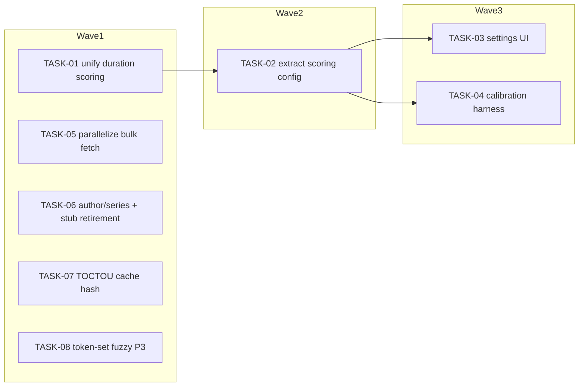

<!-- file: docs/plans/2026-07-10-metadata-matching.md -->
<!-- version: 1.0.0 -->
<!-- guid: 067843b0-8869-4946-aeb9-cb1913eb95e7 -->
<!-- last-edited: 2026-07-10 -->

# INIT-3 Metadata Matching Pipeline — Implementation Plan

**Gate (verbatim):** PLAN -> EXECUTE AUTONOMOUSLY (worktree/PR/CI per task). Config extraction
(T1) MUST default to today's literal values — zero behavior change until an operator tunes them.

Companion to:
- `docs/specs/2026-07-10-metadata-matching-design.md` (components C1–C8; source IDs INIT-3-T1..T6)
- Task briefs: `docs/agent-tasks/metadata-matching/TASK-01..08-*.md` (standalone mode — each brief
  owns its own worktree, branch, and PR; non-review-critical briefs also self-merge with
  `gh pr merge --rebase`. **TASK-05 and TASK-06 briefs contain NO merge command** — coordinator/
  human line-by-line review is a hard merge precondition for them in BOTH run modes.)

Coordination model: each task runs in an isolated worktree, PR per task, rebase/FF merges,
`make ci` gates every PR (caveat: staticcheck is red on main (pre-existing backlog #1796) — scope
staticcheck to files you changed; the merge gate is Minimal CI green). Tasks marked
**⚠ review-critical** change concurrency behavior or the store interface and require line-by-line
coordinator review before merge.

**File-ownership (cross-initiative):** none known, EXCEPT TASK-05 touches
`internal/server/metadata_ops.go` — before dispatching TASK-05, confirm no concurrent INIT-9 /
INIT-10 wave has an open worktree on that file.

## Dependency graph

## Model assignments (authoritative — overrides per-task `Agent:` lines)

| Model | Tasks | Rationale |
|---|---|---|
| **Haiku-class** | — | none: no task here is a fully-mechanical mirror; all involve semantics |
| **Sonnet-class** | TASK-01, 02, 03, 04, 07, 08 | logic + fixtures + integration; gate catches regressions |
| **Sonnet-class ⚠ (coordinator line-review, hard merge precondition in both modes)** | TASK-05, TASK-06 | T05 rewrites a prod bulk-op loop for concurrency (race stakes); T06 writes to a prod bulk-update path (starts creating author/series rows + writing book IDs — roll-forward data) |

## Parallel execution groups

| Wave | Tasks (parallel within wave) | Notes |
|---|---|---|
| W1 | TASK-01, TASK-05, TASK-06, TASK-07, TASK-08 | disjoint file sets (see collision table). Execution mode: /parallel-sweep — trigger: 5 independent tasks (≥3 threshold), disjoint files per collision matrix, gate = `make ci`. Invocation: TASK-01,05,06,07,08. TASK-08 is P3/optional — dropping it does not block anything. |
| W2 | TASK-02 | Execution mode: SINGLE-AGENT (Sonnet-class) — trigger: 1 task (<3 /parallel-sweep threshold); serialized after TASK-01 (shares `internal/metafetch/service_scoring.go` + its test file, collision rows 1–2). |
| W3 | TASK-03, TASK-04 | Execution mode: SERIAL WAVES (coordinator-driven) — trigger: 2 tasks (<3 /parallel-sweep threshold); both depend on TASK-02's merged config fields; disjoint files from each other, so the coordinator MAY dispatch both concurrently once W2 merges. |

**⚠️ Same-file collision table** (computed from the Exact-files lists below):

| Shared file | Tasks that touch it | Resolution |
|---|---|---|
| `internal/metafetch/service_scoring.go` | TASK-01, TASK-02 | serialize: wave1=T01, wave2=T02 |
| `internal/metafetch/service_scoring_test.go` | TASK-01, TASK-02 | serialize: wave1=T01, wave2=T02 |

Same-file serialization rules: `internal/metafetch/service_scoring.go` (TASK-01 → TASK-02).
TASK-01 starts first (its fixtures are also TASK-02's equivalence baseline). No other file is
shared by two tasks.

## Coordinator protocol (verbatim)

> **Coordinator owns git. Workers never push.** Each worker operates only inside its
> assigned worktree: edit, test, commit — then stop. Workers never run `git push`,
> `gh pr`, or any merge command. The coordinator runs the gate (`make ci`) in each
> finished worktree, opens the PR, merges (rebase/FF unless the repo profile says
> otherwise), and then **rebases every open sibling worktree** before dispatching
> anything else.
>
> **Per-merge sibling-rebase loop:** after EVERY merge to `origin/main`:
> for each open sibling worktree, `git fetch origin && git rebase
> origin/main`. A sibling that skips a rebase is a future conflict.
>
> **Conflict escalation ladder** (in order, never skip a rung): 1) clean rebase;
> 2) conflict-resolver subagent (Sonnet-class, only when the conflict spans 1–3 small
> files); 3) file-copy cherry-pick fallback — re-apply the task's file states onto a
> fresh branch from HEAD; 4) mark `rebase_blocked`, stop the lane, escalate to a human.
>
> **A wave MUST NOT start** while any of: the previous wave has an unmerged PR; any
> sibling worktree is un-rebased; the gate is red on `origin/main`; or a
> `rebase_blocked` marker is unresolved.

Note: the briefs are standalone-mode (each contains its own PR block) so a single agent CAN run
one end-to-end; when running as a coordinated sweep, the protocol above overrides the briefs'
PR sections — workers stop at commit. **Exception — the review gate holds in BOTH modes:**
TASK-05 and TASK-06 are ⚠ review-critical; their briefs deliberately contain no `gh pr merge`
line. In standalone mode the agent pushes, opens the PR, and STOPS — merge happens only after
coordinator/human line-by-line review. A review gate that exists in only one of two documented
run modes is not a gate.

---

### TASK-01: Unify the two duration-scoring functions (INIT-3-T2)
Priority: P1 · Effort: M · Agent: Sonnet-class · Depends on: none · Polarity: transform

**Context.** Spec C1/Decision 2-3. `durationScoreMultiplier` (`service_scoring.go:172`,
delta-second buckets, ×1.30..×0.50) vs `computeDurationScore` (`:215`, ratio buckets, +20..−20)
can disagree (100-min delta on a 40-h book: ×0.75 vs +20). Fixtures BEFORE the swap is a locked
initiative constraint.

**Exact files to change**
- `internal/metafetch/service_scoring.go` — one canonical ratio-tier table; both signatures kept.
- `internal/metafetch/service_scoring_test.go` — golden grid fixtures (pre-capture commit, then
  unification with enumerated deltas).

**Acceptance criteria**
- [ ] `TestDurationScoringGolden` exists; unknown-duration semantics preserved (0 → ×1.0 / +0).
- [ ] Call sites in `service_search.go` untouched (`git diff --stat` shows no change there).
- [ ] `make ci` green (staticcheck scoped to changed files; merge gate = Minimal CI green).

**Idempotency.** Done if `grep -n "durationTiers" internal/metafetch/service_scoring.go` hits and
the two functions share the table. **Rollback.** Revert the PR; fixtures revert with it.

---

### TASK-02: Extract hardcoded scoring literals into MetadataScoringConfig (INIT-3-T1, backend)
Priority: P1 · Effort: L · Agent: Sonnet-class · Depends on: TASK-01 · Polarity: transform

**Context.** Spec C2/Decision 1. Literals: `service_scoring.go:303,306,321,325` (×2.0/1.4/1.6/1.4
in `transcriptionBoost:292`), `:119` (×0.15), `:133-148` (+0.05 cap 0.15), `:355` (0.35),
duration tiers (from TASK-01's table); `service_search.go:368` (×1.4), `:512,514` (×2.0/×0.5).
Config struct `internal/config/config.go:219`; TWO viper population sites (`:1087`, `:1512`).
**GATE CONSTRAINT: defaults MUST equal today's literals — zero behavior change.**

**Exact files to change**
- `internal/config/config.go` — new fields (spec Data model) + defaults at both viper sites.
- `internal/metafetch/service_scoring.go` — literals → config reads via fail-open default resolver.
- `internal/metafetch/service_search.go` — series literals → config reads.
- `internal/metafetch/service_scoring_test.go` — `TestScoringConfigDefaultsMatchLegacyLiterals`.

**Acceptance criteria**
- [ ] `grep -n 'score \*= 2.0' internal/metafetch/service_scoring.go` returns 0 hits (literal gone).
- [ ] Default-equivalence test proves unset config → bit-identical scores.
- [ ] Explicit 0 honored for the pointer knobs `F1MinScore`/`CompilationPenalty`/
      `RichMetadataBonusCap` (nil → legacy default; 0 is a reachable operator value — spec C2).
- [ ] `make ci` green (staticcheck scoped; merge gate = Minimal CI green).

**Idempotency.** Done if `grep -n "TranscriptionTitleExactBoost" internal/config/config.go` hits.
**Rollback.** Revert PR; behavior was value-identical throughout, so no data implications.

---

### TASK-03: Settings UI for the new scoring knobs (INIT-3-T1, frontend)
Priority: P2 · Effort: M · Agent: Sonnet-class · Depends on: TASK-02 · Polarity: additive

**Context.** Spec C3. Existing surface: `web/src/components/settings/MetadataScoringSection.tsx`
(exists, ~119 lines) + `.test.tsx`; TS type `web/src/services/api.ts:836`; save wiring
`web/src/hooks/useSettingsHandlers.ts:494,679,800`; load `web/src/pages/Settings.tsx:611`.

**Exact files to change**
- `web/src/services/api.ts` — extend `MetadataScoringConfig` TS type (field names = Go json tags).
- `web/src/components/settings/MetadataScoringSection.tsx` + `.test.tsx` — grouped inputs +
  per-group reset-to-default.
- `web/src/hooks/useSettingsHandlers.ts` — include new fields in the `metadata_scoring` save path.

**Acceptance criteria**
- [ ] Round-trip test: render → edit → save payload contains the new keys.
- [ ] `make ci` green (runs frontend tests; merge gate = Minimal CI green).

**Idempotency.** Done if `grep -n "transcription_title_exact_boost" web/src/services/api.ts` hits.
**Rollback.** Revert PR; backend ignores absent fields (fail-open defaults).

---

### TASK-04: Read-only scoring calibration harness op (INIT-3-T1, harness)
Priority: P2 · Effort: L · Agent: Sonnet-class · Depends on: TASK-02 · Polarity: additive

**Context.** Spec C7. Mirror `internal/plugins/dedup/calibrate_embedding_thresholds.go`
(READ-ONLY, never writes config, reports sweeps). Ground truth: books with `MetadataSourceHash`
set (applied metadata) + their persisted `MetadataCandidateCache` entries.

**Exact files to change**
- `internal/plugins/metafetch/calibrate_scoring.go` — NEW op `metafetch.calibrate-scoring`.
- `internal/plugins/metafetch/calibrate_scoring_test.go` — NEW.
- `internal/plugins/metafetch/register.go` — NEW in-package `serviceregistry.Register` + `PostInit`
  op-def registration (mirror `internal/plugins/dedup/register.go`).
- `internal/plugins/plugins.go` — one blank-import line for the new package (resolved by review;
  not shared with the only wavemate TASK-03, which touches `web/src/` exclusively).

**Acceptance criteria**
- [ ] Op is registered, read-only (no store writes in the op body — grep for `Upsert|Update|Delete`
      in the new file returns only reads), and reports per-knob sweep results.
- [ ] Any whole-library loop inside uses a bounded pool (CLAUDE.md mandate).
- [ ] `make ci` green (staticcheck scoped; merge gate = Minimal CI green).

**Idempotency.** Done if `grep -rn "metafetch.calibrate-scoring" internal/` hits.
**Rollback.** Revert PR; op is read-only, no data implications.

---

### TASK-05: Parallelize the bulk metadata fetch with provider-respecting bounds (INIT-3-T3) ⚠ review-critical
Priority: P1 · Effort: L · Agent: Sonnet-class ⚠ · Depends on: none · Polarity: transform

**Context.** Spec C4/Decision 4. Serial loop `metadata_ops.go:532` (`for i, w := range work`)
inside `runBulkMetadataFetchForBookIDs:439`; twin `runBulkMetadataFetchAll:55`. Pool =
`errgroup.Group` + `SetLimit` (the CLAUDE.md-sanctioned equivalent of the `registry.RunItems`
sibling at `internal/plugins/acoustid/backfill.go:118`; RunItems itself doesn't fit the
OperationResult-resume + custom-progress contract — resolved by review). Outer loop only; provider
chain stays sequential per book; per-source semaphores (FIXED constant 2, not config) cap provider
load; `ProtectedSource` breaker + Hardcover limiter remain beneath. **Wave-1 tunability
disclosure:** worker count ships as hardcoded constant 4 (`// TODO(INIT-3-T1)`) until TASK-02/03
land — until then the only fan-out throttle is revert-PR (accepted: semaphore + breaker + provider
limiter bound the blast radius). **File-ownership: confirm no concurrent INIT-9/10 wave holds
`internal/server/metadata_ops.go` before dispatch.**

**Exact files to change**
- `internal/server/metadata_ops.go` — bounded pool (default 4 workers) + per-provider semaphores
  (fixed constant 2); counters → atomics; resume map read-only after build.
- `internal/server/metadata_ops_test.go` — `-race` tests (create if absent).

**Acceptance criteria**
- [ ] `go test ./internal/server/ -run TestBulkFetch -race` green; worker cap + per-provider cap
      asserted; resume-skip and progress counts exact.
- [ ] Ctx cancellation stops workers promptly (test).
- [ ] `make ci` green (staticcheck scoped; merge gate = Minimal CI green).

**Idempotency.** Done if `grep -n "SetLimit\|errgroup" internal/server/metadata_ops.go` hits.
**Rollback.** Revert PR; op contract (IDs/params/resume rows) unchanged either way.

---

### TASK-06: Author/series ID resolution + legacy history-stub retirement (INIT-3-T4) ⚠ review-critical
Priority: P2 · Effort: M · Agent: Sonnet-class ⚠ · Depends on: none · Polarity: transform (prod-write path)

**Context.** Spec C6/Decision 6. TODOs `internal/metadata/enhanced.go:254,256`. REUSE
`GetAuthorByName` (`pebble_store_authors.go:93`)/`CreateAuthor` (`:113`), `GetSeriesByName`
(`pebble_store_series.go:91`)/`CreateSeries` (`:116`). **Metadata-history DESCOPED to stub
retirement** — review verified the `MetadataChangeRecord` subsystem already ships end-to-end
(store + mock twins + routes + `MetadataHistory.tsx` UI); no new store methods, no mockery regen.
Store-error policy: fail-open on ID resolution (log, leave ID unset, persist other fields).
Record each ID change via the existing `RecordMetadataChange`. Hydrate full row before
`UpdateBook` (memdb-slim footgun). Full `go test ./... -short` (prod-write path discipline).

**Exact files to change**
- `internal/metadata/enhanced.go` (+`enhanced_test.go`) — resolution + change recording; delete or
  delegate the dead `MetadataHistory` stub trio (`:651-668`).
- `internal/server/handlers/metadata/handler.go` + `interfaces.go` — widen the store param passed
  to `BatchUpdateMetadata` (`BookStore` lacks the author/series/history methods).

**Acceptance criteria**
- [ ] `TestAuthorSeriesResolution` green: reuse / create-once / empty-name-skip / store-error
      fail-open; ID changes recorded as `MetadataChangeRecord` rows (old → new).
- [ ] `grep -n "metadata history not yet implemented" internal/metadata/enhanced.go` returns 0 hits.
- [ ] FULL `go test ./... -short` green (not a subset).
- [ ] `make ci` green (staticcheck scoped; merge gate = Minimal CI green).

**Idempotency.** Done if the author/series TODOs are gone from `enhanced.go` and resolution code hits.
**Rollback.** Roll-FORWARD for data (reviewed): revert stops future resolution but does NOT undo
written `AuthorID`/`SeriesID` links or created author/series rows — the recorded
`MetadataChangeRecord` old→new rows are the reversal audit trail.

---

### TASK-07: Close the metadata-cache TOCTOU window via SourceHash validation (INIT-3-T5)
Priority: P2 · Effort: M · Agent: Sonnet-class · Depends on: none · Polarity: additive

**Context.** Spec C5/Decision 5. Cache keyed by book ID only (`cache.go:41-52`); `SourceHash`
exists but diagnostic (`iface_metadata.go:31-34`); guard comment admits the window
(`server_maintenance_deps.go:382-393`). Make the hash load-bearing at apply; keep the existing
identity re-check; legacy empty-hash rows fail-open with a warn.

**Exact files to change**
- `internal/metafetch/cache.go` (+`cache_test.go`) — `ValidateCachedIdentity` +
  `ErrStaleMetadataCache`.
- `internal/server/server_maintenance_deps.go` — call it in `ApplyTranscriptionCandidate:393`.

**Acceptance criteria**
- [ ] `TestValidateCachedIdentity` (match/mismatch/legacy-empty) + apply-refusal test green;
      anti-over-suppression case: unchanged book still applies.
- [ ] `make ci` green (staticcheck scoped; merge gate = Minimal CI green).

**Idempotency.** Done if `grep -n "ErrStaleMetadataCache" internal/metafetch/cache.go` hits.
**Rollback.** Revert PR; pre-existing identity guard remains.

---

### TASK-08: Token-set fuzzy scoring upgrade (INIT-3-T6) — OPTIONAL
Priority: P3 · Effort: M · Agent: Sonnet-class · Depends on: none · Polarity: additive

**Context.** Spec C8/Decision 7. `internal/matcher/fuzzy.go` is lexical-only
(`LevenshteinDistance:20`, `ScoreMatch:54`). Add `TokenSetRatio`; blend into `ScoreMatch` only
with fixture-locked before/after evidence. Callers: `internal/matcher/matcher.go`,
`internal/scanner/scanner.go`, `internal/itunes/service/path_repair_resolver.go`. Skippable.

**Exact files to change**
- `internal/matcher/fuzzy.go` (+`fuzzy_test.go`) — additive scorer + fixture tables.

**Acceptance criteria**
- [ ] `TestTokenSetRatioNoRegression` fixture table green (anti-over-suppression).
- [ ] `make ci` green (staticcheck scoped; merge gate = Minimal CI green).

**Idempotency.** Done if `grep -n "func TokenSetRatio" internal/matcher/fuzzy.go` hits.
**Rollback.** Revert PR; `ScoreMatch` returns to pure-Levenshtein blend.

---

## Review gates for the coordinator

Line-by-line review mandatory — **a hard MERGE PRECONDITION in both run modes** (their briefs
contain no merge command; standalone agents push + open the PR and STOP): **TASK-05** (concurrency
rewrite of a prod bulk op — data races and resume-semantics regressions don't reliably show in CI)
and **TASK-06** (prod-write path: starts creating author/series rows and writing book IDs —
roll-forward data; memdb-slim footgun). Standard review: all others.
Every PR: `make ci` green (staticcheck scoped to changed files — red on main is pre-existing
backlog #1796; merge gate is Minimal CI green) + the task's acceptance checklist pasted and ticked
in the PR description + COMPLETED/REMAINING/BLOCKED counts in the final status comment.
