<!-- file: docs/audits/2026-06-22-repo-optimization-security-sweep.md -->
<!-- version: 1.0.0 -->
<!-- guid: 7bcbf9bf-1e2c-4f19-8b3c-8c92c52a7c89 -->
<!-- last-edited: 2026-06-22 -->

# Repository Optimization, Reuse, Security, and Design Sweep

**Date:** 2026-06-22
**Branch:** `codex/repo-audit-findings`
**Scope:** Full repository read-only sweep across Go backend, React frontend, storage/performance paths, security, tests, tooling, and docs.
**Method:** Coordinator static inspection plus five parallel read-only agents:
backend architecture, security, frontend, storage/performance, and tests/tooling.

No production code was changed in this branch. This document is the artifact to review
and use for follow-up implementation planning.

---

## Executive Summary

The repository has strong coverage and many good safety primitives, but there are several
high-leverage improvement areas:

1. **Security first:** a token-looking API key is committed in a report, bootstrap/read-only
   credentials are intentionally written to plaintext files, temp-login URLs trust `Host`,
   and restore/factory-reset paths need stronger guardrails.
2. **Performance next:** dedup scoring does repeated candidate scans and may miss
   candidates outside the global top 50; multi-file import hashes and writes files
   repeatedly; several list/search/backfill paths still fall back to full-library
   materialization or offset scans.
3. **Design simplification:** handler extraction reduced file size but preserved strong
   `Server` coupling through lazy providers, injected closures, typed-nil guards, and
   route/wiring centralization.
4. **Reuse and duplication:** operation enqueue flows, config legacy remaps, optional
   store capability detection, frontend `fetch`/error handling, localStorage state, and
   generated mocks are all repeated enough to justify shared abstractions.
5. **Repo hygiene:** huge audio fixtures, generated Playwright reports, stale testing docs,
   and a CI mockery gate that can pass on generator failure are increasing maintenance cost.

### Top 10 Recommended First Moves

| Rank | Area | Recommendation | Why first |
|---:|---|---|---|
| 1 | Security | Rotate and remove the committed `abk_...` API-key-looking value in `docs/FINGERPRINT_E2E_TEST_REPORT.md:141`. | Potential credential exposure. |
| 2 | Security | Make bootstrap/read-only startup credentials opt-in or local-only, and harden file permissions/backup behavior. | Reduces credential leakage blast radius. |
| 3 | Security | Use a configured canonical external URL or relative path for temp-login links. | Prevents Host-header token exfiltration links. |
| 4 | Security | Add security headers middleware and tests. | Broad browser hardening. |
| 5 | Performance | Add indexed candidate lookup for dedup `ListCandidatesForEntity`. | Fixes repeated scans and incomplete scoring. |
| 6 | Performance | Carry scanner hash/tag results forward and batch `BookFile` upserts. | Large import speedup and lower write amplification. |
| 7 | Backend design | Extract operation launch helper/service for v1/v2 op enqueue paths. | Removes repeated, error-prone operation boilerplate. |
| 8 | Frontend | Introduce a centralized `apiFetch` wrapper with credentials, CSRF support, error parsing, and abort support. | Unifies security and removes duplicated fetch code. |
| 9 | Tooling | Fix CI mockery gate: remove `|| true`, pin mockery, call Makefile target. | Prevents stale generated mocks from landing. |
| 10 | Repo hygiene | Move full Librivox corpus to optional dataset/LFS flow and untrack generated Playwright reports. | Shrinks checkouts and review noise. |

---

## Priority Map

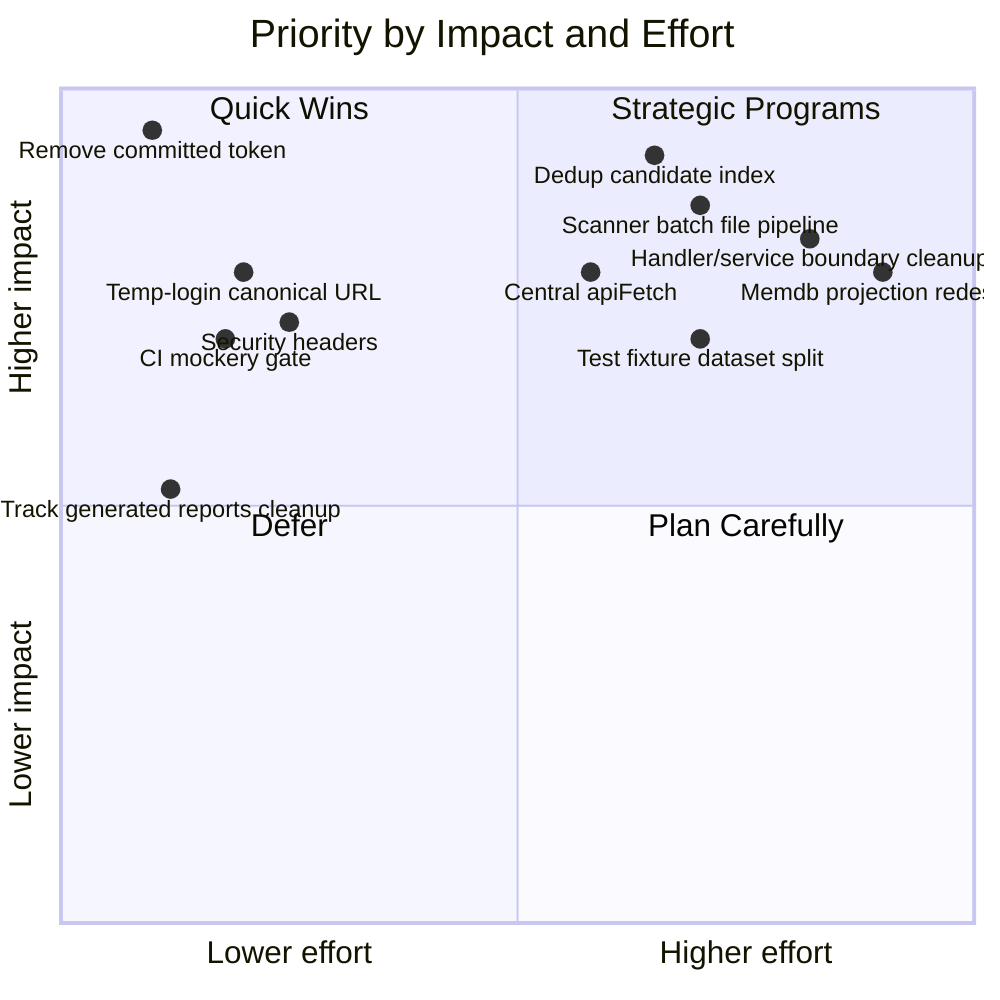

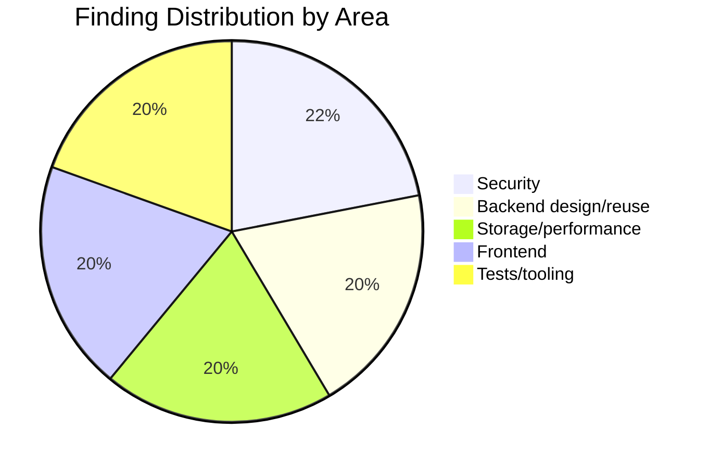

---

## System Shape and Pressure Points

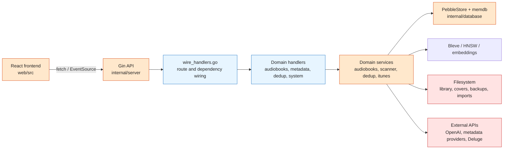

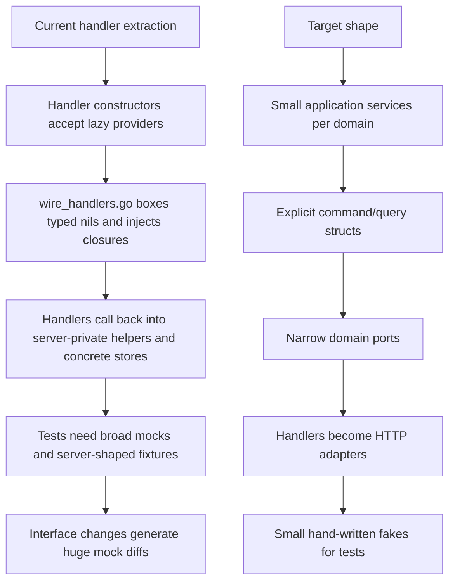

---

## Findings by Severity

### P0 / Immediate Security and Correctness

| ID | Finding | Evidence | Recommendation |
|---|---|---|---|
| SEC-1 | Token-looking API key is committed in docs. | `docs/FINGERPRINT_E2E_TEST_REPORT.md:141` contains a concrete `abk_...` value. | Revoke/rotate, replace with placeholder, remove from history if valid, add secret scanning over docs and reports. |
| PERF-1 | Dedup full scan repeatedly scans/sorts candidates and can miss most per-book candidates. | `internal/dedup/engine.go:2032`, `internal/dedup/engine.go:404`, `internal/database/embedding_store.go:608`, `internal/database/embedding_store.go:663`. | Add `ListCandidatesForEntity(entityType, bookID, status)` backed by indexes; test >100 candidates across many books. |

### P1 / High-Impact Improvements

| ID | Finding | Evidence | Recommendation |
|---|---|---|---|
| SEC-2 | Bootstrap/read-only credentials are generated into plaintext files at startup. | `internal/server/server_lifecycle.go:408`, `internal/server/bootstrap.go:107`, `internal/server/bootstrap.go:152`, `internal/server/bootstrap.go:338`. | Make recovery bootstrap opt-in, local-only, or admin-confirmed; consider disabling automatic read-only key by default. |
| SEC-3 | Temporary login URLs trust inbound `Host`. | `internal/server/auth_temp_login.go:107`. | Use configured canonical external URL, Host allowlist, or return only relative paths. |
| SEC-4 | No security-header middleware found. | Middleware setup around `internal/server/server.go:345`; CORS at `internal/server/server_middleware.go:21`. | Add CSP, `frame-ancestors`, `nosniff`, `Referrer-Policy`, and HSTS when TLS is enabled. |
| SEC-5 | Restore verification is a no-op and restore target is arbitrary absolute path. | `internal/server/handlers/system/handler.go:591`, `internal/backup/backup.go:149`. | Constrain restore targets to app roots; implement manifest/checksum verification; fail closed when `verify=true`. |
| SEC-6 | Factory reset deletes every entry under configured `RootDir`. | `internal/server/handlers/system/handler.go:428`. | Reject dangerous roots and require resolved-path confirmation for destructive operations. |
| ARCH-1 | Handler extraction preserved `Server` coupling. | `internal/server/handlers/audiobooks/handler.go:77`, `internal/server/handlers/metadata/handler.go:72`, `internal/server/handlers/dedup/handler.go:50`, `internal/server/handlers/system/handler.go:45`. | Introduce domain application services; handlers become HTTP adapters. |
| ARCH-2 | `wire_handlers.go` is an overloaded composition root and route registry. | `internal/server/wire_handlers.go:31`, typed-nil guards at `:145`, `:170`, `:226`. | Split per-domain route modules and shared provider/typed-nil helpers. |
| ARCH-3 | Operation enqueue patterns are duplicated and mixed with legacy rows. | `internal/server/handlers/operations/handler.go:110`; duplicate handlers at `internal/server/handlers/duplicates/handler.go:180`, `:388`, `:426`, `:570`. | Build one operation launch service for registry checks, body binding, v1 row policy, params, and response shape. |
| ARCH-4 | Config legacy remap machinery repeats by group. | `internal/config/update_service.go:70`, `:102`, `:138`, `:170`, `:206`; persistence migrations at `internal/config/persistence.go:150`. | Centralize remap tables and publish a deprecation inventory. |
| PERF-2 | Multi-file import hashes/tags the same files repeatedly and writes one row at a time. | `internal/scanner/scanner.go:1885`, `:1307`, `:1322`, `:1327`; batch API at `internal/database/pebble_store.go:9829`. | Carry scan hash/tag results forward, batch upserts, recompute aggregates once per book. |
| PERF-3 | Library list has full-materialization escape hatches. | `internal/audiobooks/service.go:856`, `:1092`, `:1286`; warmer notes at `internal/server/library_list_warmer.go:8`, `:40`. | Push fingerprint/status filters into summaries and add indexes/projections for common sorts. |
| PERF-4 | iTunes search calls `SearchBooks(search, 0, 0)`, which returns no rows. | `internal/server/handlers/itunes.go:693`; `internal/database/pebble_store.go:3167`. | Add bounded `SearchBooksWithITunesPID` or route through Bleve IDs plus iTunes filtering. |
| FE-1 | Cookie-auth API calls lack centralized CSRF/auth fetch layer. | Raw fetch begins around `web/src/services/api.ts:891`; credentials included only in some calls around `web/src/services/api.ts:2053`; other services at `web/src/services/activityApi.ts:141`, `web/src/services/readingApi.ts:62`. | Introduce `apiFetch` with credentials, optional CSRF header, error parsing, and abort support. |
| FE-2 | ActivityLog page-size changes can fetch with stale limit/offset. | `web/src/pages/ActivityLog.tsx:358`, deps at `:384`, effect at `:411`. | Add `pageSize` to callback deps and test page-size changes. |
| FE-3 | Legacy AcousticDedup rows-per-page changes can fetch stale data. | `web/src/pages/BookDedup.tsx:2249`, deps at `:2273`. | Add `rowsPerPage` dependency or remove legacy tab if retired. |
| FE-4 | BookDetail file/segment state can be stale across route-param changes. | `web/src/pages/BookDetail.tsx:80`, load guard at `:223`. | Reset files/segments/caches on `id` change or move to keyed hook. |
| TOOL-1 | Huge tracked/LFS test fixture footprint makes checkouts and CI expensive. | `testdata` totals about 1.7G; docs at `tests/e2e/README.md:62`, `docs/BUILD.md:219`; integration fixture use at `internal/transcode/transcode_integration_test.go:30`. | Move large corpus to optional fetched dataset or LFS-on-demand; keep tiny fixtures in repo. |
| TOOL-2 | CI mock freshness gate can pass when mockery fails. | Local target fails at `Makefile:194`; CI has `mockery ... || true` at `.github/workflows/ci.yml:77`; v3 config note at `.mockery.yaml:6`. | Remove `|| true`, pin mockery, call `make mocks-check check-mock-fresh`. |
| TOOL-3 | E2E config mixes product tests and long demo recording workflow. | `Makefile:251`; `web/tests/e2e/playwright.config.ts:37`; demo timeout at `web/tests/e2e/demo-full-workflow.spec.ts:26`. | Split demo recording into opt-in `test:e2e:demo`; keep default E2E assertion-focused. |
| TOOL-4 | Testing docs and actual gates disagree. | `README.md:222`, `README.md:229`, `Makefile:268`, `TESTING.md:18`, `CLAUDE.md:82`, `go.mod:3`. | Consolidate testing guidance and derive claims from Makefile/CI. |

### P2 / Medium Priority Cleanup

| ID | Finding | Evidence | Recommendation |
|---|---|---|---|
| SEC-7 | Public operational endpoints expose reconnaissance data. | `/metrics` at `internal/server/server_lifecycle.go:893`; cache stats at `internal/server/wire_handlers.go:599`. | Gate behind auth, internal bind rules, or Basic Auth. |
| SEC-8 | Docker build downloads unsigned third-party tarballs and uses mutable base tags. | `Dockerfile:10`, `Dockerfile:35`. | Pin base image digests and verify archive SHA256/signatures before extraction. |
| SEC-9 | Browser-side OpenAI key validation exposes the key to frontend runtime. | `web/src/components/wizard/WelcomeWizard.tsx:158`. | Move validation server-side and return masked result only. |
| ARCH-5 | `AudiobookService` is a god service with compatibility and store-adapter logic. | `internal/audiobooks/service.go:68`; pushdown/fallback probes at `:721`, `:778`. | Split query, mutation, tags, delete/purge, compatibility, and store adapters. |
| ARCH-6 | Optional store capabilities are discovered ad hoc. | `internal/server/handlers/audiobooks/handler.go:235`, `internal/server/handlers/system/handler.go:176`, `internal/server/handlers/audiobooks/interfaces.go:51`. | Add `storecap` helpers for recursive unwrap/capability detection. |
| ARCH-7 | Compatibility surfaces are scattered. | `internal/server/server_lifecycle.go:933`, `internal/audiobooks/organize.go:20`, `internal/audiobooks/organize_preview.go:17`, `internal/server/undo_engine.go:6`, `internal/config/update_service.go:394`, `internal/server/handlers/dedup/handler.go:1181`. | Create compatibility registry with owner, caller, removal condition, and tests. |
| ARCH-8 | Service registry relies on globals and panicking string lookups. | `internal/serviceregistry/container.go:24`, `internal/serviceregistry/container.go:240`. | Add typed service keys or generated accessors for core services. |
| PERF-5 | External ID/iTunes backfill uses offset pagination, N+1 file reads, and per-row writes. | `internal/itunes/backfill.go:21`, `:46`, `:73`. | Add key-cursor iteration, batch file lookup, and bulk mapping writes. |
| PERF-6 | Search-index empty-build path repeats offset-based `GetAllBooks`. | `internal/server/server_search.go:63`; skip behavior at `internal/database/pebble_store.go:1400`. | Add streaming/cursor book iteration and batch indexing. |
| PERF-7 | Monolithic memdb cache is a memory pressure center. | `internal/database/memdb_strip.go:14`, `:55`. | Split projections by query family; make memdb optional per table where possible. |
| PERF-8 | Backup walks live Pebble files directly. | `internal/backup/backup.go:298`, `:339`. | Use Pebble `Checkpoint` to a stable temp directory before archiving. |
| FE-5 | `Library.tsx` remains a page-level maintenance hotspot. | State at `web/src/pages/Library.tsx:132`, URL sync at `:442`, query orchestration at `:640`, import polling at `:1496`. | Extract `useLibraryQuery`, `useLibrarySelection`, `useImportPaths`, and `useLibraryOperations`. |
| FE-6 | Settings handlers pass too much mutable state through one hook. | `web/src/hooks/useSettingsHandlers.ts:40`, `web/src/pages/Settings.tsx:160`. | Split by domain and use reducer/actions instead of setter plumbing. |
| FE-7 | Sensitive one-time tokens remain rendered in React state. | `web/src/components/settings/TempLoginTab.tsx:32`, `:139`; `web/src/components/settings/APIKeysTab.tsx:109`. | Auto-clear after copy/timeout/close and mask after first reveal. |
| FE-8 | E2E auth tests mock auth instead of exercising cookie/CSRF semantics. | `web/tests/e2e/auth-flow.spec.ts:9`, `web/tests/e2e/utils/test-helpers.ts:478`. | Add one real-server auth/session smoke test. |
| TOOL-5 | Generated mocks are oversized and centralized. | `internal/database/mocks/mock_store.go` is about 50,297 lines; `.mockery.yaml:13`, `.mockery.yaml:19`; total mocks about 92,709 lines. | Split mocks by interface/area and prefer narrow hand-written fakes. |
| TOOL-6 | Generated Playwright HTML report is tracked. | `playwright-report/index.html:9`; ignore mismatch at `.gitignore:270`; report config at `web/tests/e2e/playwright.config.ts:20`. | Untrack `/playwright-report/` and ignore root report output. |
| TOOL-7 | Fixed sleeps remain in tests. | `web/tests/e2e/search-and-filter.spec.ts:447`, `web/tests/e2e/dynamic-ui-interactions.spec.ts:57`, `internal/realtime/events_test.go:655`. | Use locator/API waits and injected clocks/tickers. |
| TOOL-8 | Legacy/manual script test surfaces are not integrated. | `scripts/run-all-tests.sh:27`, `scripts/test-api-endpoints.py:6`, `scripts/TEST-README.md:13`. | Retire or wrap as explicit Makefile manual-smoke targets. |

---

## Security Detail

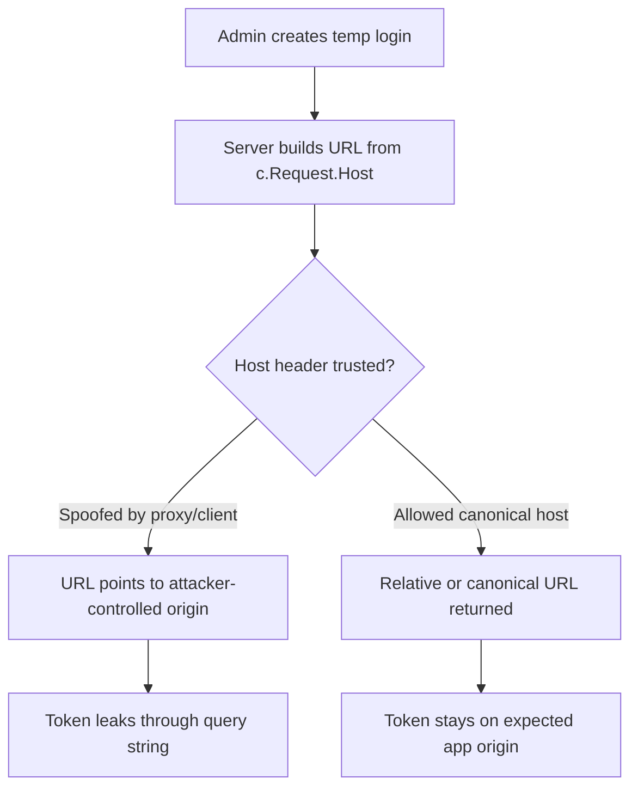

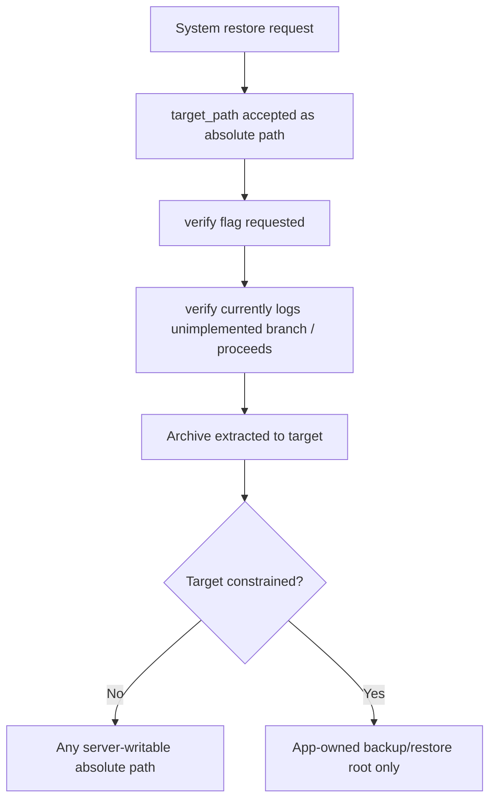

Positive security notes found during the sweep:

- Session cookies are `HttpOnly` and `SameSite=Strict`.
- Raw session tokens are not returned on login.
- API keys appear hashed and scoped in normal flows.
- CORS is restrictive by default.
- Request body limits exist.
- Archive traversal defenses are tested.
- Sampled ffmpeg/fpcalc command execution uses argument arrays instead of shell interpolation.

Security follow-up should still start with credential rotation and hardening the few
intentional bootstrap/recovery mechanisms because those are high-blast-radius features.

---

## Performance and Storage Detail

### Dedup Candidate Scan Problem

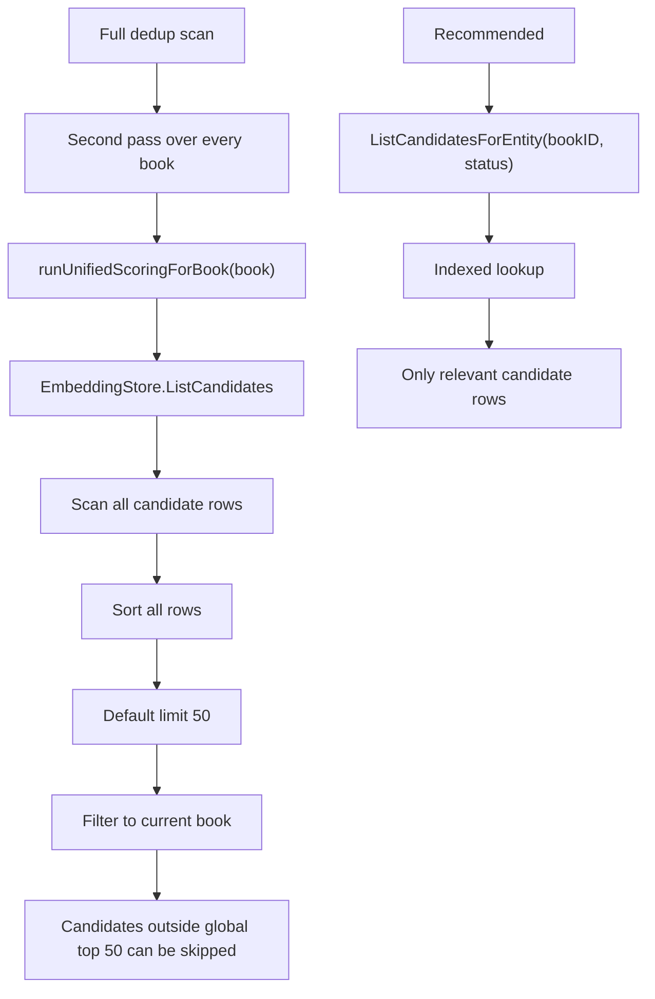

### Multi-File Import Write Amplification

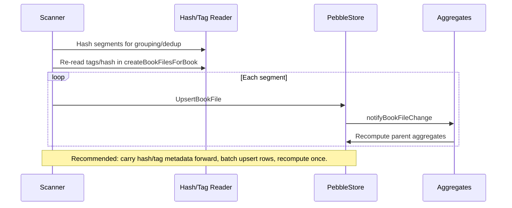

### Full-Materialization Paths to Retire

| Path | Current shape | Better shape |
|---|---|---|
| Library list filters/sorts | Some paths fall back to all summaries/books. | Push filters into `BookSummaryFilter` and memdb/Pebble indexes. |
| Search index rebuild | Offset pagination over `GetAllBooks`. | Cursor/stream iteration plus batch indexing. |
| iTunes backfill | Offset pages, N+1 `GetBookFiles`, per-row writes. | Cursor iteration, batch file lookup, bulk mapping writes. |
| Backup | Walk live Pebble files. | Pebble checkpoint, then archive stable checkpoint. |

---

## Frontend Detail

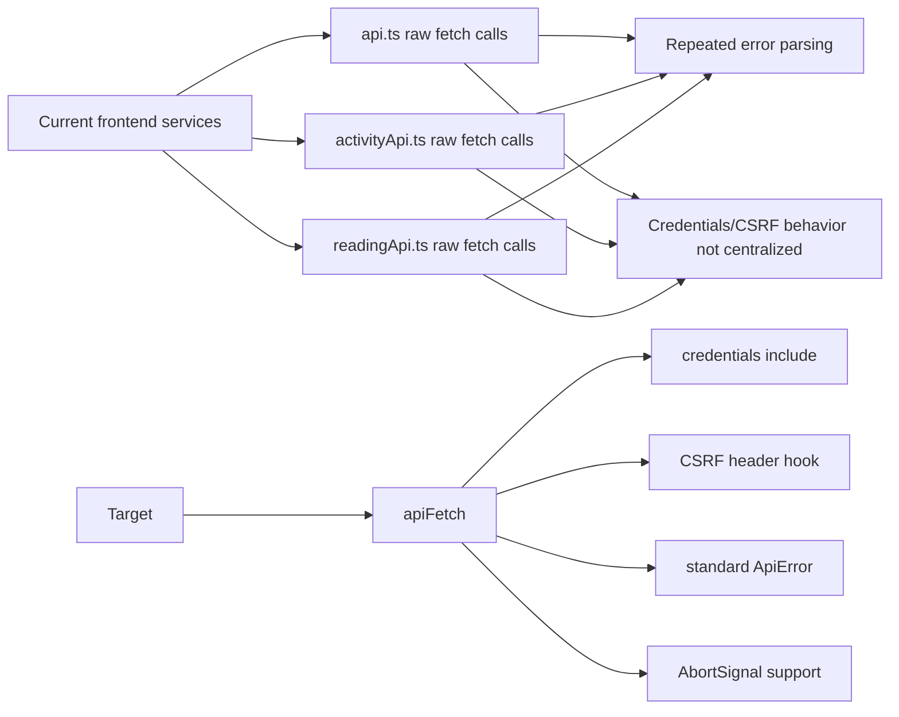

Frontend quick fixes:

- Add missing React hook dependencies in `ActivityLog.tsx` and legacy `BookDedup.tsx`.
- Reset `BookDetail` file/segment state on route `id` changes.
- Auto-clear or mask generated temp-login/API-key secrets.

Frontend structural follow-ups:

- Extract `Library.tsx` behavior into query, selection, import-path, and operation hooks.
- Split `useSettingsHandlers` by settings domain.
- Convert auth E2E mocks into at least one real-session smoke test.

---

## Test and Tooling Detail

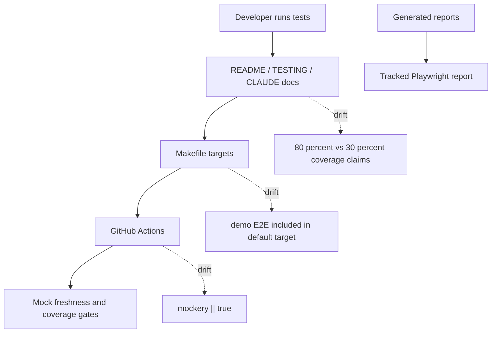

Tooling cleanup should be separated into three PRs:

1. **CI truth PR:** pin mockery, remove `|| true`, and align Makefile/CI/docs.
2. **Artifact hygiene PR:** untrack generated reports and ignore root Playwright outputs.
3. **Dataset PR:** move large audio corpus to optional dataset flow with small fixtures retained.

---

## Proposed Follow-Up Roadmap

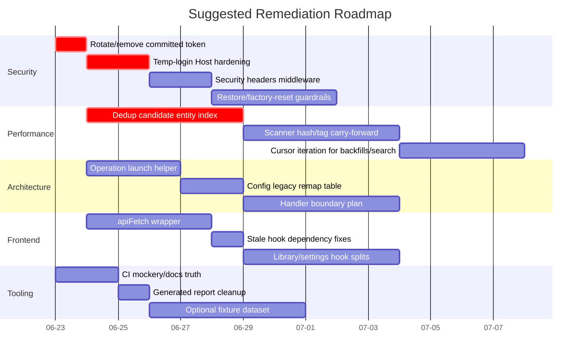

### PR Breakdown

| PR | Theme | Includes | Excludes |
|---|---|---|---|
| 1 | Security hotfixes | Token removal/rotation note, temp-login URL hardening, security headers tests. | Restore/factory-reset rewrite. |
| 2 | CI and artifact hygiene | Mockery gate, testing doc alignment, generated report ignore/untrack. | Large fixture migration. |
| 3 | Dedup correctness/performance | Candidate entity index and regression benchmark. | Scanner/import changes. |
| 4 | Scanner import performance | Hash/tag carry-forward and batch `BookFile` upserts. | Dedup scoring logic. |
| 5 | Frontend API wrapper | `apiFetch`, credentials/CSRF hook, shared error parsing. | Large page refactors. |
| 6 | Backend operation launch helper | Unified enqueue helper and duplicate handler cleanup. | Full handler boundary migration. |
| 7 | Dataset strategy | Optional large corpus fetch/LFS flow. | CI mockery/docs work. |

---

## Audit Notes and Limitations

- The sweep was read-only except for this documentation branch.
- LSP tools were requested by repo instructions but were not available in this session;
  agents used static inspection with `rg` and line-numbered file reads.
- No benchmark or test suite was run for this audit branch because there are no product
  code changes.
- Several security findings are design hardening items rather than confirmed exploits.
  They should still be treated seriously because they touch credentials, destructive
  filesystem operations, or browser token exposure.
