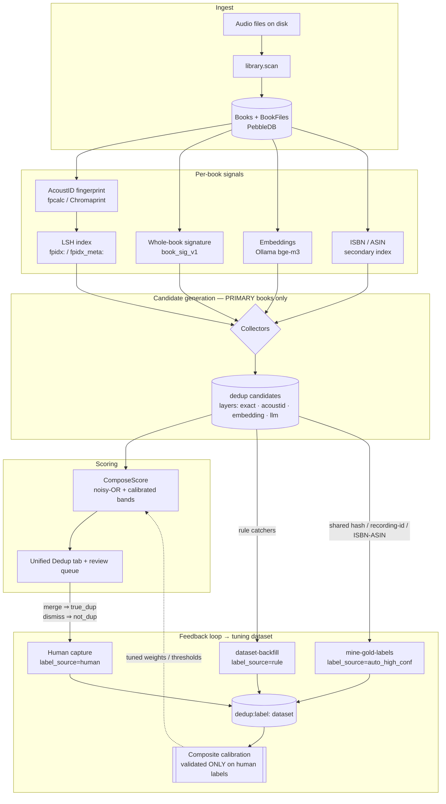

<!-- file: docs/dedup/STATUS.md -->
<!-- version: 1.3.0 -->
<!-- guid: 09dc17af-0c96-4f15-bc27-e5f48edb9e74 -->
<!-- last-edited: 2026-08-22 -->

# Dedup — Status & Architecture (single source of truth)

Consolidates and supersedes `docs/dedup-feedback-loop.md` and the dedup-state
sections of `docs/dedup-import-pipeline-audit.md` (both now under
[`docs/archive/2026-07-consolidation/`](../archive/2026-07-consolidation/)).
If a number here conflicts with an older doc, **this doc wins**.

## Real numbers — the 2026-07-17 BASELINE (historical, not current state)

> **Every figure in this section is the 2026-07-17 baseline**, i.e. the state
> *before* the 2026-07-18 drain. It is kept as the reference point the drain is
> measured against; it is **not** a description of the library today. For where
> the backlog stood most recently, see
> [Current state](#current-state--as-of-2026-08-12) below.

- 2026-07-17 baseline: **15,269** pending dedup candidates total; **9,074**
  exact-layer pending.
- Every older 380K / 384K / 387K figure is **obsolete** — that was the
  chapter-shatter + title-leak explosion, since healed (PR #1548 removed 20,247
  chapter-junk records) and prevented at the emitters.
- Exact-pending backlog composition (2026-07 sandbox analysis):
  **76% title-leak clique residue** (junk shared titles pairing unrelated books),
  **18% isolated plausible duplicates** (the real review queue),
  **6% other-signal pairs**.

### The four residual populations (PH-2 triage basis)

The backlog is four distinct populations — a blanket purge would destroy the
genuine-duplicate review signal:

1. **Genuine duplicate editions** — ratio ≈1.0, matching filesize, different
   folders. KEEP for the review UI; this is the feature working.
2. **Fragment-vs-full leftovers (~14%)** — a full `.m4b` paired with a stray
   single chapter file. Needs an absolute fragment-floor rule (purge the stray
   candidate or attach the file).
3. **Title-leak FALSE pairs** — junk leaked titles ("Opening Credits", "Intro",
   dur=0) pairing different books. Purgeable; the upstream importer bug
   (CONS-17) is fixed so they cannot regenerate.
4. **Stub/empty records** — 11–91-byte files paired with real books. Cleanup;
   never had real audio.

## Remediation path (in order) — PROVEN END-TO-END ON SANDBOX 2026-07-18

1. **Title repair** — `maintenance.title-repair` (op built, PR #1978) re-derives
   CONS-17b agreed chapter titles over stored books so exact-title cliques
   dissolve. Measured: 556 books retitled, 0 errors.
2. **ScoreBreakdown backfill** — `dedup.breakdown-backfill` (op built, PR #1982)
   populates ScoreBreakdowns on pre-T015 pending candidates so triage and
   composite calibration have real inputs (this was the "calibration blocked"
   gap; the #1926/#1927 chain took recall 0.33 → ~0.70 at 96.7% precision).
   Measured: ~9,419 candidates backfilled, 0 errors.
3. **Triage classify + purge-apply** — `maintenance.dedup-exact-triage` classifies
   the backlog into the four populations above; with **`{"apply":true}`** (op
   built, PR #2008) it **dismisses** (never hard-deletes — reversible, and the
   #1973 terminal-status guard stops resurrection) the purgeable stub/title-leak
   populations. The relaxed title-leak precondition (PR #1982) recognizes
   non-iTunes title-leak by identical normalized title.
4. **Rescan** — `dedup.purge-stale` + `dedup.full-scan` on the cleaned corpus;
   the review UI drains what genuinely remains.

### Sandbox validation (2026-07-18, full-fidelity prod replica, 0 errors) — steps 1–2 + classify ONLY

> ⚠️ **Provenance correction (2026-08-22, T13 docs truth-up).** This section
> previously carried a five-stage table headed "Sandbox validation results" whose
> purge-apply row read `purgeable=7,891, keep=278, review=2,150 → dismissed 7,891`
> over a scanned population of `10,319`. **Those are production's figures**, not the
> sandbox's — they match the prod journal line transcribed at
> [`docs/audits/2026-08-11-docs-inventory.md`](../audits/2026-08-11-docs-inventory.md)
> §1.3.1 exactly, and the sandbox purge-apply wave (**T03**) has never run
> (`grep -n '\*\*T03\*\*' TODO.md` → still `- [ ]`). The table has been split: the
> production run keeps its own numbers under
> [EXECUTED ON PRODUCTION](#-executed-on-production-2026-07-18-human-gated-go-ahead)
> below, and the sandbox rows that depend on T03 are marked **PENDING** rather than
> back-filled with the prod number.
>
> The two populations are **not** a drift and must not be merged into one number:
> sandbox scanned **10,304**, prod scanned **10,319** — the replica held 15 fewer
> candidates, and both runs' buckets sum exactly to their own totals
> (7,878+278+392+1,756 = 10,304; 7,891+278+2,150 = 10,319). A 2026-08-11 docs audit
> first reported this as a contradiction and then corrected itself in §1.3.2 of the
> same file. Note that `keep = 278` is identical in both runs, so it does **not**
> discriminate between them — only the scanned total and the purgeable count do.

Ran the chain on a fresh ZFS clone + copy of the production Pebble DB. What the
sandbox actually measured:

| Stage | Sandbox-measured result | Source |
|---|---|---|
| baseline | the 2026-07-17 baseline figures (**9,074** exact-pending / **10,319** total-pending) as recorded 2026-07-18 — see the caveat below | this doc, 2026-07-18 |
| 1. title-repair | **556** books retitled, 0 errors | `TODO.md` T02 |
| 2. breakdown-backfill | **~9,419** candidates backfilled, 0 errors | `TODO.md` T02 |
| 3a. triage **classify** | purgeable **7,878** (title-leak) / genuine **278** / fragment **392** / unknown **1,756**, **of 10,304 scanned** (was purgeable=1, unknown=9,950 pre-work) | `TODO.md` T02 |
| 3b. triage **purge-apply** (`{"apply":true}`) | **PENDING — awaiting T03 sandbox purge wave** (`grep -n '\*\*T03\*\*' TODO.md`) | — |
| 4a. `dedup.purge-stale` | **PENDING — awaiting T03 sandbox purge wave** | — |
| 4b. `dedup.full-scan` (embedding re-emission) | **PENDING — awaiting T03 sandbox purge wave** | — |

> **Caveat on the baseline row.** The recorded sandbox baseline (`10,319`
> total-pending) is the same figure as prod's, while the sandbox triage scanned
> `10,304`. Whether the replica's total-pending was genuinely 10,319 and the triage
> scanned a 10,304-row subset, or the baseline row simply copied prod's number, is
> **not resolvable from the repo at HEAD** and is left unresolved here rather than
> guessed at. T03 will settle it.

The classify pass proves the title-repair → backfill → relaxed-triage chain works
on a replica (purgeable 1 → 7,878, i.e. the ~76% title-leak share this doc
projected). What is still missing is sandbox-side **apply** parity: prod went ahead
and ran without it, so this is a validation-parity gap, not a correctness gap.

### ✅ EXECUTED ON PRODUCTION 2026-07-18 (human-gated go-ahead)

After the build was deployed to prod (`v0.217.8-rc.80-2-g0b474707`) and the prod
**dry-run matched the sandbox within 0.1%** (would_retitle 558 vs 556,
would_backfill 9,416 vs 9,419 — note this comparison covers steps 1–2 only; there
is no sandbox *apply* to compare against, see above), the same sequence was applied
live under explicit human sign-off.

**Production stage table** (2026-07-18; figures as recorded here on 2026-07-18 and
corroborated 2026-08-12 against the prod journal, transcribed at
[`docs/audits/2026-08-11-docs-inventory.md`](../audits/2026-08-11-docs-inventory.md)
§1.3.1 — `scanned=10319 purgeable=7891 keep=278 review=2150 lookup_errors=0
apply=true dismissed=7891 dismiss_errors=0`, `outcome=completed`. **Not
re-measured since; do not read as current state.**):

| Stage | exact-pending | total-pending | dismissed |
|---|---|---|---|
| baseline (2026-07-17 baseline figures) | 9,074 | 10,319 | 1,351 |
| after title-repair (555) + breakdown-backfill (9,421) | 9,074 | 10,319 | 1,351 |
| **after triage purge-apply** (classified purgeable=**7,891**, keep=278, review=2,150 → **dismissed=7,891**, `dismiss_errors=0`) | **1,183** | 2,428 | 9,242 |
| after purge-stale | 1,181 | 2,426 | 9,242 |
| **final** after full-scan (embedding re-emission) | **1,311** | 2,554 | 9,242 |

**Net on prod, 2026-07-18: exact-pending 9,074 → 1,311 (−85.5%); total-pending
10,319 → 2,554 (−75%); 7,891 title-leak/stub junk candidates dismissed, 0 errors.**
Prod healthy post-run. The dismissals are reversible; no books or files were
deleted.

### Current state — as of 2026-08-12

The 1,311 above is a **2026-07-18** figure and has not held. Measured on prod
2026-08-12 via `GET /api/v1/dedup/stats` and recorded at
[`docs/audits/2026-08-11-docs-inventory.md`](../audits/2026-08-11-docs-inventory.md)
§1.3.3:

| | post-run 2026-07-18 | 2026-08-12 |
|---|---|---|
| exact **pending** | 1,311 | **5,947** |
| exact **dismissed** | 9,242 | 8,258 |

The drain did what it claimed, but exact-pending regrew **~4.5×** in 3.5 weeks — so
the source that produces these candidates still needs a fix; a repeat drain would
only be a re-drain. **Nothing newer than 2026-08-12 has been measured**, so treat
even 5,947 as an as-of figure rather than today's count.

High-risk steps validated on **the dedup sandbox** first — a disposable replica of
prod; isolation is proven (a destructive test at the prod path left prod
byte-identical). Mechanics are deliberately not documented here: **private runbook
in falkcorp/infra-docs**.

## What's fixed (recent)

- **PR #1973** — dismissed candidates no longer resurrect on rescan/import
  (terminal status can't be overwritten back to pending). Closes the
  human-rejected-pair-reaches-auto-merge escalation (2026-07-17 review F1).
- **PR #1972** — quarantine-chapter-artifacts op hardening (quarantine op
  mutates no files; only purge does).
- **PR #1953** (+ off-switch 6f2f7ce0) — review-queue apply path
  (ApplyVersionGroup / ApplyMultidisc) merged, globally OFF by default; flipping
  it on is a recorded human decision.
- **#1944–#1952** — review-queue A1/A2/B1, reconcile purge, multidisc classifier
  fix, anthology tuning (dry-run anthology 29 → 8).
- **#1926/#1927** — rescore-labeled-examples + calibrate-composite chain (see
  step 2 above).
- **#1956–#1962** (2026-07-16 bug-hunt) — whole-library truncation class,
  split-book merge orphan, AI author-merge delete guard, apply-guard hardening.
- Importer prevention — title-leak (CONS-17/17b) and chapter-shatter
  (cross-directory grouping) bugs fixed upstream; exact emitters gated.

## What's DONE (2026-07-18) and what's open

- ✅ **CONS-10 / INIT-2 T6 / PH-2 / PH-2b — the prod drain ran** (see the
  "EXECUTED ON PRODUCTION" section above): exact-pending 9,074 → 1,311, 7,891
  purgeable dismissed, 0 errors.
- ✅ **2026-07-17 review findings F2–F7 fixed** (F2 ApplyVersionGroup integrity
  #1976, F3/F4/F5 index/Rescore-cap #1977, F6 legacy MergeBooks rerouted off
  hard-delete #2007, F7 quarantine RunItems #2004) — full map in
  [`docs/audits/2026-07-17-multi-discipline-review.md`](../audits/2026-07-17-multi-discipline-review.md).
- ✅ **Differentiated residual-disposition op built + shipped + run on prod**
  (`dedup-exact-triage {"apply":true}` dismisses title-leak/stub, PR #2008); the
  Rescore/purge whole-backlog caps were raised to 1M (#1977).

Still open (fast-follows, not blockers):

- The remaining **~1,311 exact-pending** are the genuine review backlog — the
  review UI drains these; a **REVIEW-band producer**, **AI-enrichment tier**, and
  **cover recovery** are the fast-follows (TODO #3, #11, #12).
- **`review_apply_enabled` flip** — human decision
  ([DECISIONS-PENDING](../plans/DECISIONS-PENDING.md)).
- A **fragment-floor rule** for the fragment-vs-full population (not yet a triage
  purgeable class).

## Architecture — the feedback loop

How detection works and how it is made **self-improving**: every signal,
candidate, label, and learned threshold in one pipeline.

The loop **closed** with the #1926/#1927 calibration chain: labels now feed
calibrated composite thresholds back into scoring.

### Label provenance

The dataset (`dedup:label:<candidateID>` in PebbleDB) mixes label sources of
different trust. Training contract: **train on everything, weight by trust,
validate ONLY on `human` labels.**

| `label_source` | Produced by | Trust | Role |
|---|---|---|---|
| `human` | Merge / dismiss in the UI | **Gold** | Trains AND sole validation set |
| `auto_high_conf` | `dedup.mine-gold-labels` — shared file hash, AcoustID recording id, ASIN/ISBN (audio-gated) | High precision, not human | Strong supervision; never validation |
| `rule` | `dedup.dataset-backfill` — deterministic catchers (part-vs-whole, stub, missing file) | Heuristic | Weak supervision (down-weighted) |
| `llm_judge` | LLM labeler on the borderline band | Medium | Weak supervision |

Known label-quality caveat (2026-07-08 finding): the `not_dup` gold labels were
100% rule-mined, which contaminated the precision floor — precision measurements
must exclude or re-source them (fix belongs at the mining layer).

### Merge/dismiss capture

Human-label capture on `POST /dedup/candidates/:id/{merge,dismiss}` (+ bulk /
cluster) snapshots features **before** merge (merge deletes one side); capture
failure never blocks the merge
(`internal/server/handlers/dedup/label_capture.go`).

### Operations & endpoints

| Concern | Op / endpoint |
|---|---|
| Scan & ingest | `library.scan` · `POST /operations/scan` |
| Fingerprint | `acoustid.scan` · `POST /dedup/scan-acoustid` |
| LSH index | `dedup.lsh-index-build` |
| Whole-book signature | `dedup.book-signature-scan` · `POST /dedup/scan-book-signature` |
| Embeddings | `dedup.embed-scan` · `POST /dedup/scan-embed` |
| Candidate scan | `dedup.full-scan` · `POST /dedup/scan` |
| Rescore | engine `Rescore` · `POST /dedup/rescore` |
| Rule-negative labels | `dedup.dataset-backfill` |
| Auto gold positives | `dedup.mine-gold-labels` |
| Exact-backlog triage | `maintenance.dedup-exact-triage` |
| Human labels | `POST /dedup/candidates/:id/{merge,dismiss}` + bulk/cluster |
| Generic op trigger | `POST /operations/v2` `{"def_id":"…","params":{…}}` |

## Related docs

- Tuning-dataset design (archived):
  [`2026-06-13-dedup-tuning-dataset-design.md`](../archive/2026-07-consolidation/specs/2026-06-13-dedup-tuning-dataset-design.md)
- Unified pipeline spec (archived):
  [`fable5-spec-unified-dedup-pipeline.md`](../archive/2026-07-consolidation/specs/fable5-spec-unified-dedup-pipeline.md)
- Import-pipeline recurrence audit (archived; residual-population analysis
  folded into this doc):
  [`dedup-import-pipeline-audit.md`](../archive/2026-07-consolidation/dedup-import-pipeline-audit.md)
- Live hardening plan:
  [`2026-07-10-dedup-pipeline-hardening.md`](../plans/2026-07-10-dedup-pipeline-hardening.md)
