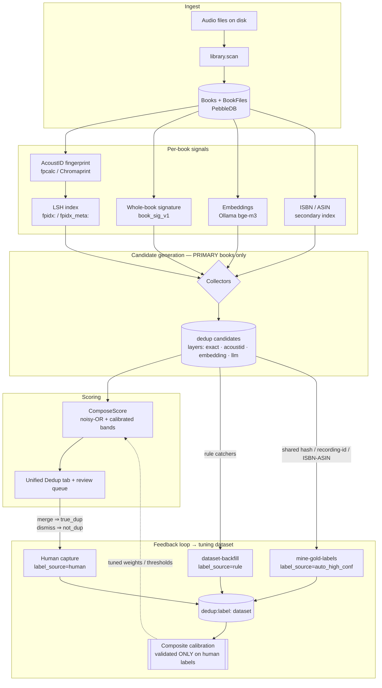

<!-- file: docs/dedup/STATUS.md -->
<!-- version: 1.0.0 -->
<!-- guid: 09dc17af-0c96-4f15-bc27-e5f48edb9e74 -->
<!-- last-edited: 2026-07-17 -->

# Dedup — Status & Architecture (single source of truth)

Consolidates and supersedes `docs/dedup-feedback-loop.md` and the dedup-state
sections of `docs/dedup-import-pipeline-audit.md` (both now under
[`docs/archive/2026-07-consolidation/`](../archive/2026-07-consolidation/)).
If a number here conflicts with an older doc, **this doc wins**.

## Real numbers (2026-07-17)

- **15,269** pending dedup candidates total; **9,074** exact-layer pending.
- Every older 380K / 384K / 387K figure is **obsolete** — that was the
  chapter-shatter + title-leak explosion, since healed (PR #1548 removed 20,247
  chapter-junk records) and prevented at the emitters.
- Exact-pending backlog composition (2026-07 sandbox analysis):
  **76% title-leak clique residue** (junk shared titles pairing unrelated books),
  **18% isolated plausible duplicates** (the real review queue),
  **6% other-signal pairs**.

### The four residual populations (PH-2 triage basis)

The backlog is four distinct populations — a blanket purge would destroy the
genuine-duplicate review signal:

1. **Genuine duplicate editions** — ratio ≈1.0, matching filesize, different
   folders. KEEP for the review UI; this is the feature working.
2. **Fragment-vs-full leftovers (~14%)** — a full `.m4b` paired with a stray
   single chapter file. Needs an absolute fragment-floor rule (purge the stray
   candidate or attach the file).
3. **Title-leak FALSE pairs** — junk leaked titles ("Opening Credits", "Intro",
   dur=0) pairing different books. Purgeable; the upstream importer bug
   (CONS-17) is fixed so they cannot regenerate.
4. **Stub/empty records** — 11–91-byte files paired with real books. Cleanup;
   never had real audio.

## Remediation path (in order)

1. **Title repair** — fix leaked/junk titles on affected books so exact-title
   cliques dissolve instead of being purged blind. (Code merged; prod run
   pending.)
2. **ScoreBreakdown backfill** — populate ScoreBreakdowns on labeled/pending
   pairs so composite calibration has real inputs (this was the "calibration
   blocked" gap, resolved by the #1926/#1927 chain: recall 0.33 → ~0.70 at
   96.7% precision, auto-merge tier 98.3%).
3. **Triage** — `maintenance.dedup-exact-triage` classifies the backlog into the
   four populations above (read-only); review the report.
4. **Rescan** — full-scan/rescore on the cleaned corpus; then PH-2b runs the
   per-population purge wave and the review UI drains what remains.

Prod execution of this path is tracked in
[`docs/operations/pending-prod-actions.md`](../operations/pending-prod-actions.md)
(rows 1–2). High-risk steps validate on **the dedup sandbox** first — a
disposable replica of prod; isolation is proven (a destructive test at the prod
path left prod byte-identical). Mechanics are deliberately not documented here:
**private runbook in falkcorp/infra-docs**.

## What's fixed (recent)

- **PR #1973** — dismissed candidates no longer resurrect on rescan/import
  (terminal status can't be overwritten back to pending). Closes the
  human-rejected-pair-reaches-auto-merge escalation (2026-07-17 review F1).
- **PR #1972** — quarantine-chapter-artifacts op hardening (quarantine op
  mutates no files; only purge does).
- **PR #1953** (+ off-switch 6f2f7ce0) — review-queue apply path
  (ApplyVersionGroup / ApplyMultidisc) merged, globally OFF by default; flipping
  it on is a recorded human decision.
- **#1944–#1952** — review-queue A1/A2/B1, reconcile purge, multidisc classifier
  fix, anthology tuning (dry-run anthology 29 → 8).
- **#1926/#1927** — rescore-labeled-examples + calibrate-composite chain (see
  step 2 above).
- **#1956–#1962** (2026-07-16 bug-hunt) — whole-library truncation class,
  split-book merge orphan, AI author-merge delete guard, apply-guard hardening.
- Importer prevention — title-leak (CONS-17/17b) and chapter-shatter
  (cross-directory grouping) bugs fixed upstream; exact emitters gated.

## What's open

- **CONS-10 / INIT-2 T6** — the actual prod drain run (operator-gated; TODO #1).
- **PH-2 / PH-2b** — triage run + per-population purge wave (TODO #2).
- **REVIEW-band producer** for the review queue; **AI-enrichment tier** and
  **cover recovery** fast-follows (TODO #3, #11, #12).
- **`review_apply_enabled` flip** — human decision
  ([DECISIONS-PENDING](../plans/DECISIONS-PENDING.md)).
- **2026-07-17 review findings F2–F7** (ApplyVersionGroup group-integrity bugs,
  status-index bypass, Rescore 100K truncation, legacy MergeBooks op gaps) — see
  [`docs/audits/2026-07-17-multi-discipline-review.md`](../audits/2026-07-17-multi-discipline-review.md).
- Audit-carryover code items still relevant: differentiated residual-disposition
  op (fragment-floor; purge title-leak/stub) and raising the purge-stale 100K
  cap to 1M with chunked deletes.

## Architecture — the feedback loop

How detection works and how it is made **self-improving**: every signal,
candidate, label, and learned threshold in one pipeline.

The loop **closed** with the #1926/#1927 calibration chain: labels now feed
calibrated composite thresholds back into scoring.

### Label provenance

The dataset (`dedup:label:<candidateID>` in PebbleDB) mixes label sources of
different trust. Training contract: **train on everything, weight by trust,
validate ONLY on `human` labels.**

| `label_source` | Produced by | Trust | Role |
|---|---|---|---|
| `human` | Merge / dismiss in the UI | **Gold** | Trains AND sole validation set |
| `auto_high_conf` | `dedup.mine-gold-labels` — shared file hash, AcoustID recording id, ASIN/ISBN (audio-gated) | High precision, not human | Strong supervision; never validation |
| `rule` | `dedup.dataset-backfill` — deterministic catchers (part-vs-whole, stub, missing file) | Heuristic | Weak supervision (down-weighted) |
| `llm_judge` | LLM labeler on the borderline band | Medium | Weak supervision |

Known label-quality caveat (2026-07-08 finding): the `not_dup` gold labels were
100% rule-mined, which contaminated the precision floor — precision measurements
must exclude or re-source them (fix belongs at the mining layer).

### Merge/dismiss capture

Human-label capture on `POST /dedup/candidates/:id/{merge,dismiss}` (+ bulk /
cluster) snapshots features **before** merge (merge deletes one side); capture
failure never blocks the merge
(`internal/server/handlers/dedup/label_capture.go`).

### Operations & endpoints

| Concern | Op / endpoint |
|---|---|
| Scan & ingest | `library.scan` · `POST /operations/scan` |
| Fingerprint | `acoustid.scan` · `POST /dedup/scan-acoustid` |
| LSH index | `dedup.lsh-index-build` |
| Whole-book signature | `dedup.book-signature-scan` · `POST /dedup/scan-book-signature` |
| Embeddings | `dedup.embed-scan` · `POST /dedup/scan-embed` |
| Candidate scan | `dedup.full-scan` · `POST /dedup/scan` |
| Rescore | engine `Rescore` · `POST /dedup/rescore` |
| Rule-negative labels | `dedup.dataset-backfill` |
| Auto gold positives | `dedup.mine-gold-labels` |
| Exact-backlog triage | `maintenance.dedup-exact-triage` |
| Human labels | `POST /dedup/candidates/:id/{merge,dismiss}` + bulk/cluster |
| Generic op trigger | `POST /operations/v2` `{"def_id":"…","params":{…}}` |

## Related docs

- Tuning-dataset design (archived):
  [`2026-06-13-dedup-tuning-dataset-design.md`](../archive/2026-07-consolidation/specs/2026-06-13-dedup-tuning-dataset-design.md)
- Unified pipeline spec (archived):
  [`fable5-spec-unified-dedup-pipeline.md`](../archive/2026-07-consolidation/specs/fable5-spec-unified-dedup-pipeline.md)
- Import-pipeline recurrence audit (archived; residual-population analysis
  folded into this doc):
  [`dedup-import-pipeline-audit.md`](../archive/2026-07-consolidation/dedup-import-pipeline-audit.md)
- Live hardening plan:
  [`2026-07-10-dedup-pipeline-hardening.md`](../plans/2026-07-10-dedup-pipeline-hardening.md)
