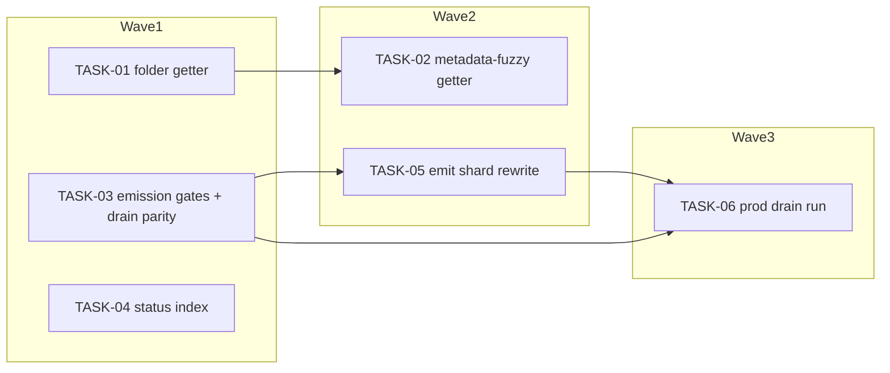

<!-- file: docs/plans/2026-07-10-dedup-pipeline-hardening.md -->
<!-- version: 1.0.0 -->
<!-- guid: f5b48279-c1c9-4496-9927-be5ea4ca6fad -->
<!-- last-edited: 2026-07-10 -->

# INIT-2 Deduplication Pipeline Hardening — Implementation Plan

Companion to:
- `docs/specs/2026-07-10-dedup-pipeline-hardening-design.md` (components C1–C6 map to tasks T1–T6)
- Task briefs: `docs/agent-tasks/dedup-pipeline-hardening/`

**Gate (verbatim, applies to every task):** PLAN -> EXECUTE AUTONOMOUSLY (worktree/PR/CI per
task). EXCEPTIONS: T3's 387k-backlog drain and T6's CONS-10 prod drain are prod-data mutations
-> dry-run FIRST, then a real AskUserQuestion apply gate.

**File-ownership (verbatim):** INIT-2 OWNS all structural edits to `internal/dedup/engine.go`
and `internal/database/embedding_store.go`. INIT-1 rebases its single engine.go touch on top
AFTER INIT-2's engine.go waves merge. Never schedule INIT-1+INIT-2 waves touching engine.go
concurrently.

Coordination model: briefs are **standalone mode** — each task is its own worktree + branch +
PR + `gh pr merge <n> --rebase`. `make ci` gates every PR, with the caveat: staticcheck is red
on main (pre-existing backlog #1796) — scope staticcheck to files you changed; the merge gate
is Minimal CI green. Tasks marked **⚠ review-critical** change emission-suppression or
concurrency invariants and require line-by-line coordinator review before merge. Store-getter
tasks (T1/T2) additionally run the FULL `go test ./... -short` (never a subset).

## Dependency graph

(`T05 --> T06` is a deploy-batching edge, not a code dependency: T6 ideally deploys once,
after both engine.go waves merged. **T6's only HARD prerequisite is T03 merged + deployed.**
T6 is P1 and T05 is P2 — if T05 is blocked or delayed, T6 deploys on T03 alone and accepts a
second deploy later; never let the P2 perf task stall the P1 prod remediation.)

## Model assignments (authoritative — overrides per-task `Agent:` lines)

| Model | Tasks | Rationale |
|---|---|---|
| **Haiku-class** | — | no task here is mechanical enough; every one touches dedup correctness or concurrency |
| **Sonnet-class** | TASK-01, TASK-02 ⚠, TASK-03 ⚠, TASK-04 | store/logic + integration; ⚠-flagged get coordinator line-review (T2: fuzzy grouping precision; T3: wrong guard suppresses real dups) |
| **Opus/strong-class** | TASK-05 ⚠ | lock-sharding invariant (per-pair check-then-set atomicity) — a subtle race here double-emits or deadlocks a 44k-book prod scan; latent-race precedent: CONC-4's MergeBooks race |
| **Human + coordinator (no subagent)** | TASK-06 | prod-data mutation behind an AskUserQuestion gate — not delegable |

## Parallel execution groups

Collision matrix (computed from the Exact-files lists below):

| Shared file | Tasks that touch it | Resolution |
|---|---|---|
| `internal/database/pebble_store.go` | TASK-01, TASK-02 | serialize: wave1=T01, wave2=T02 |
| `internal/database/memdb_reads.go` | TASK-01, TASK-02 | serialize: wave1=T01, wave2=T02 |
| `internal/database/mock_store.go` | TASK-01, TASK-02 | serialize: wave1=T01, wave2=T02 |
| `internal/dedup/engine.go` | TASK-03, TASK-05 | serialize: wave1=T03, wave2=T05 |

| Wave | Tasks (parallel within wave) | Notes |
|---|---|---|
| W1 | TASK-01, TASK-03, TASK-04 | disjoint file sets (see collision matrix). Execution mode: /parallel-sweep — trigger: 3 independent tasks (≥3 threshold), disjoint files per collision matrix, gate = `make ci`. Invocation: TASK-01,03,04. **Dispatch precondition (enforces the cross-initiative partition):** before starting, confirm no INIT-1 PR/worktree touching `internal/dedup/engine.go` or `internal/database/embedding_store.go` is open (`gh pr list` + `git worktree list`); if one is live, hold T03/T04 until it lands or is parked. |
| W2 | TASK-02, TASK-05 | disjoint from each other. Execution mode: SERIAL WAVES (coordinator-driven) — trigger: TASK-02 shares `internal/database/pebble_store.go` (+ `memdb_reads.go`, `mock_store.go`) with TASK-01; TASK-05 shares `internal/dedup/engine.go` with TASK-03 (all four collision rows). Starts only after W1 fully merges + siblings rebase. **Same dispatch precondition as W1** — re-check no INIT-1 engine.go PR/worktree is live before dispatching T05. |
| W3 | TASK-06 | Execution mode: NOT AGENT WORK — trigger: prod-data mutation (387k-row drain apply) behind the AskUserQuestion gate; 0 code files; runs after W2 merges and one deploy. |

Same-file serialization rules: `internal/database/pebble_store.go`/`memdb_reads.go`/`mock_store.go`
(T01→T02); `internal/dedup/engine.go` (T03→T05). The engine.go track (T03) starts first — it
blocks both T05 and T06, and INIT-1's engine.go rebase waits on this whole track.

Why T01/T02 stay two tasks (stated, since the file collision alone would not justify it): the
split isolates the ⚠ review-critical fuzzy-precision change (T02's bucketing + similarity
grouping, which needs coordinator line-review of the loop shape) from the mechanical folder
getter (T01), keeping each PR's review surface small and letting T01 land in W1 alongside
T03/T04. The T02→T01 dependency is an artifact of sharing the three store files, not a logical
dependency — if a coordinator prefers one combined getter PR, that is acceptable, but the
review then covers both changes at once and W1 loses a parallel slot.

## Coordinator protocol (verbatim)

> **Coordinator owns git. Workers never push.** Each worker operates only inside its
> assigned worktree: edit, test, commit — then stop. Workers never run `git push`,
> `gh pr`, or any merge command. The coordinator runs the gate (`make ci`) in each
> finished worktree, opens the PR, merges (rebase/FF unless the repo profile says
> otherwise), and then **rebases every open sibling worktree** before dispatching
> anything else.
>
> **Per-merge sibling-rebase loop:** after EVERY merge to `origin/main`:
> for each open sibling worktree, `git fetch origin && git rebase
> origin/main`. A sibling that skips a rebase is a future conflict.
>
> **Conflict escalation ladder** (in order, never skip a rung): 1) clean rebase;
> 2) conflict-resolver subagent (Sonnet-class, only when the conflict spans 1–3 small
> files); 3) file-copy cherry-pick fallback — re-apply the task's file states onto a
> fresh branch from HEAD; 4) mark `rebase_blocked`, stop the lane, escalate to a human.
>
> **A wave MUST NOT start** while any of: the previous wave has an unmerged PR; any
> sibling worktree is un-rebased; the gate is red on `origin/main`; or a
> `rebase_blocked` marker is unresolved.

(Note: briefs are standalone-mode — when a task is dispatched as a lone standalone agent
rather than a coordinated wave, that agent runs its own PR + `gh pr merge --rebase` per its
brief; the protocol above governs multi-task waves.)

---

### TASK-01: Implement GetFolderDuplicatesCore (Pebble + MemStore twin); revive tier 2
Priority: P2 · Effort: M · Agent: Sonnet-class · Depends on: none

**Context.** Spec §C1. Both getters are documented no-op stubs in
`internal/database/pebble_store.go` (`return nil, nil`; verify:
`grep -n 'func (p \*PebbleStore) GetFolderDuplicatesCore' internal/database/pebble_store.go`).
Consumers already wired: `internal/dedup/book_dedup.go` tier 2 (verify:
`grep -n 'GetFolderDuplicatesCore' internal/dedup/book_dedup.go`) and
`internal/audiobooks/service_single.go` (verify:
`grep -n 'GetFolderDuplicatesCore' internal/audiobooks/service_single.go`).

**Exact files to change**
- `internal/database/pebble_store.go` — replace stub body: memdb delegation + paged Core scan bucketed by (normalizedTitle, parentDir)
- `internal/database/memdb_reads.go` — NEW: `func (m *MemStore) GetFolderDuplicatesCore()`
- `internal/database/mock_store.go` — add `GetFolderDuplicatesCoreFunc` hook
- `internal/database/pebble_store_folder_dups_test.go` — NEW: both-backend tests

**Step-by-step** → brief `TASK-01-folder-duplicates-getter.md`. Gate: `make ci` + FULL
`go test ./... -short`.

**Acceptance criteria**
- [ ] Stub comment "known-unimplemented stub" gone from the folder getter; groups returned on fixture
- [ ] MemStore twin exists and passes the same fixture
- [ ] `make ci` green; full `go test ./... -short` green.

**Idempotency.** Done if `grep -n "func (m \*MemStore) GetFolderDuplicatesCore" internal/database/memdb_reads.go` hits. If interrupted: re-run the brief's re-verify greps and resume.

**Rollback.** Revert PR — tiers return to empty (today's behavior); no data written.

---

### TASK-02: Implement GetDuplicateBooksByMetadataCore (Pebble + MemStore twin); revive tier 3 [⚠ review-critical]
Priority: P2 · Effort: L · Agent: Sonnet-class · Depends on: TASK-01

**Context.** Spec §C2, Decision 3. Same stub file as T1 (collision → wave 2). Threshold caller:
`grep -n 'metadataBorderlineFloor' internal/dedup/book_dedup.go` (0.80). Downstream fuzzy logic
never fed today: `grep -n 'func metadataPairSimilarity\|func applyTranscriptionMetadataTiebreaker' internal/dedup/book_dedup.go`.
O(N²) guard mandatory — bucket by normalized author + title token, cap bucket size; the
ISBN-path precedent is PR #1451/#1857.

**Exact files to change**
- `internal/database/pebble_store.go` — replace stub body (bucketed fuzzy grouping)
- `internal/database/memdb_reads.go` — NEW: MemStore twin
- `internal/database/mock_store.go` — verify existing `GetDuplicateBooksByMetadataFunc` hook feeds the new default path
- `internal/database/pebble_store_metadata_dups_test.go` — NEW: threshold + bucket-cap tests

**Step-by-step** → brief `TASK-02-metadata-fuzzy-getter.md`. Gate: `make ci` + FULL
`go test ./... -short`.

**Acceptance criteria**
- [ ] Groups at ≥ threshold on fixture; none below; oversized bucket skipped with log, run completes
- [ ] No all-pairs loop over the whole library (reviewer checks the loop shape)
- [ ] `make ci` green; full `go test ./... -short` green.

**Idempotency.** Done if `grep -n "func (m \*MemStore) GetDuplicateBooksByMetadataCore" internal/database/memdb_reads.go` hits.

**Rollback.** Revert PR — tier 3 returns to empty; no data written.

---

### TASK-03: Exact-layer explosion #1512 — verify/close emission gates, drain parity, v2 flag [⚠ review-critical]
Priority: P1 · Effort: L · Agent: Sonnet-class · Depends on: none

**Context.** Spec §C3. Chokepoint: `grep -n 'func (de \*Engine) upsertExactCandidate' internal/dedup/engine.go`.
Drain: `grep -n 'CONS-16\|CONS-17\|part_vs_whole\|staleDrainStatus' internal/dedup/drain_stale.go`.
Done-flag: `grep -n 'drainStaleDoneFlag = ' internal/plugins/dedup/drain_stale.go`. Pair-dedupe
already exists in `UpsertCandidateNew` — verify, don't rebuild. The prod drain run is TASK-06,
NOT here.

**Exact files to change**
- `internal/dedup/engine.go` — chokepoint gate audit; additive guard only if a gap is proven
- `internal/dedup/drain_stale.go` — gate parity + reason buckets
- `internal/plugins/dedup/drain_stale.go` — flag `dedup_stale_drain_v1_done` → `..._v2_done`
- `internal/dedup/engine_exact_guard_test.go` / `drain_stale_test.go` — parity + anti-over-suppression tests

**Step-by-step** → brief `TASK-03-exact-explosion-gates-drain-parity.md`. Gate: `make ci`.

**Acceptance criteria**
- [ ] Table-driven parity test: drain verdict == chokepoint verdict per gate
- [ ] Anti-over-suppression: known-good dup pair still emits
- [ ] v2 flag constant present; `make ci` green.

**Idempotency.** Done if `grep -n "dedup_stale_drain_v2_done" internal/plugins/dedup/drain_stale.go` hits.

**Rollback.** Revert PR; forward-only code, no data touched.

---

### TASK-04: Status secondary index over dedup candidates; de-magic the both_unmatched limit (ceiling KEPT)
Priority: P2 · Effort: L · Agent: Sonnet-class · Depends on: none

**Context.** Spec §C4, Decision 5. Full scan: `grep -n 'func (s \*EmbeddingStore) ListCandidates' internal/database/embedding_store.go`.
Forced limit: `grep -n 'filter.Limit = 1_000_000' internal/server/handlers/dedup/handler.go`.
Sibling patterns: entity index `dedup:e:` in the same file; flag pattern
`grep -n 'isbnIndexBuiltFlagKey' internal/database/pebble_store_isbn_index.go`. NoSync lesson
(PR #1855): index rows join the EXISTING batch, committed with `candidateWriteOpts`.

**Exact files to change**
- `internal/database/embedding_store.go` — `dedup:s:` keyspace + maintenance in UpsertCandidateNew/UpdateCandidateStatus/DeleteCandidate + indexed ListCandidates path
- `internal/plugins/dedup/build_candidate_index.go` — NEW: backfill op + flag
- `internal/plugins/dedup/plugin.go` — append `buildCandidateStatusIndexDef()` to the central ops slice (registration — without this the op is un-runnable)
- `internal/server/handlers/dedup/handler.go` — rename the forced limit to a named const `bothUnmatchedScanLimit` (≥ max candidate population); KEEP the ceiling unconditionally — the perf win comes from the indexed read, not from shrinking the limit
- `internal/database/embedding_store_status_index_test.go` — NEW: parity + maintenance tests

**Step-by-step** → brief `TASK-04-candidate-status-index.md`. Gate: `make ci`.

**Acceptance criteria**
- [ ] Indexed status query == full-scan parity on fixture; unset flag falls back to scan
- [ ] `grep -n 'filter.Limit = 1_000_000' internal/server/handlers/dedup/handler.go` → 0 hits (satisfied by the RENAME to `bothUnmatchedScanLimit`; the ceiling itself must remain — deleting it is a defect, see spec §C4)
- [ ] `grep -n 'buildCandidateStatusIndexDef' internal/plugins/dedup/plugin.go` hits (op registered in the central slice, not just present on disk)
- [ ] `make ci` green.

**Idempotency.** Done if `grep -n "dedupStatusIdxPfx" internal/database/embedding_store.go` hits.

**Rollback.** Flag-gated dormant; unset flag = instant disable; revert PR + optional `dedup:s:` prefix delete.

---

### TASK-05: CONC-3 — shard emit() off the single global mutex; -race test [⚠ review-critical]
Priority: P2 · Effort: M · Agent: Opus/strong-class · Depends on: TASK-03 (same-file wave order)

**Context.** Spec §C5, Decision 6. Anchor: `grep -n 'var mu sync.Mutex' internal/dedup/engine.go`
(the CONC-3 comment block above it documents the four maps + counter). Per-pair check-then-set
atomicity MUST survive sharding (same pair ⇒ same shard). Store lookups leave the emit lock.
`registry.RunItems` pool already present — untouched.

**Exact files to change**
- `internal/dedup/engine.go` — shard rewrite inside the full-scan emit section only
- `internal/dedup/engine_emit_shard_race_test.go` — NEW: `-race` collision test

**Step-by-step** → brief `TASK-05-emit-mutex-sharding.md`. Gate: `make ci` (+ explicit
`go test -race ./internal/dedup/...`).

**Acceptance criteria**
- [ ] `-race` test green with colliding + disjoint pair keys; no double-emit (counts == serial)
- [ ] No `GetBookByID`/`GetBookFiles` call under a shard lock (reviewer checks)
- [ ] `make ci` green.

**Idempotency.** Done if `grep -n "emitShards" internal/dedup/engine.go` hits AND
`grep -c "var mu sync.Mutex" internal/dedup/engine.go` shows the old single-mutex emit block gone at that site.

**Rollback.** Revert PR restores single-mutex emit(); no persisted state.

---

### TASK-06: Prod drain run — dry-run → AskUserQuestion → apply → verify shrink [NOT AGENT WORK]
Priority: P1 · Effort: S · Agent: human + coordinator · Depends on: TASK-03 merged + deployed (ONLY hard prerequisite). Deploy-batching preference: deploy once after TASK-05 also merges — but if T05 (P2) is blocked/delayed, deploy on T03 alone and accept a second deploy; never stall this P1 drain on a P2 perf task.

**Context.** Spec §C6. Op `dedup.drain-stale` (verify:
`grep -n '"dedup.drain-stale"' internal/plugins/dedup/drain_stale.go`) is dry-run by default,
soft-reclassifies to `stale-drain` on apply, checkpoints via `drainStaleCheckpointID`, and the
T3 v2 flag prevents double-apply. **Prod-data mutation: the AskUserQuestion gate is mandatory —
a text-reply approval does not count** (memory: feedback_prod_apply_review_gate).

**Exact files to change** — none (ops only: `make deploy`, op API calls against 172.16.2.30).

**Step-by-step** → brief `TASK-06-prod-drain-run.md`.

**Acceptance criteria**
- [ ] Dry-run report (inspected/would_purge/kept + reason buckets) presented before any apply
- [ ] A real AskUserQuestion decision recorded before `apply=true`
- [ ] Post-apply: pending exact-candidate count reported before vs after (exact numbers)
- [ ] Post-drain: `dedup.build-candidate-status-index` run on prod AFTER shrink verification (activates T4's index when `pending` is small — spec §C4/C6; never pre-drain)

**Idempotency.** The op's v2 done-flag makes a second apply a no-op; dry-runs are always safe.

**Rollback.** Roll-forward only. The drain is soft reclassify (`stale-drain`, no deletes), so the data survives — but NO status-restore op exists today; recovery requires building one (routed through `UpdateCandidateStatus` so the T4 index stays in sync), itself dry-run + AskUserQuestion gated. See spec §Rollback T6.

---

## Review gates for the coordinator

Line-by-line review mandatory: TASK-02 (fuzzy grouping precision — a loose bucket merges
distinct books), TASK-03 (an over-broad guard silently suppresses real duplicates), TASK-05
(lock-sharding correctness — double-emit/deadlock risk on prod-scale scans). Standard review:
TASK-01, TASK-04. TASK-06 is human-executed by definition. Every PR: `make ci` green
(staticcheck is red on main (pre-existing backlog #1796) — scope staticcheck to files you
changed; the merge gate is Minimal CI green) + the task's acceptance checklist pasted and
ticked in the PR description + COMPLETED/REMAINING/BLOCKED counts in the final status comment.
