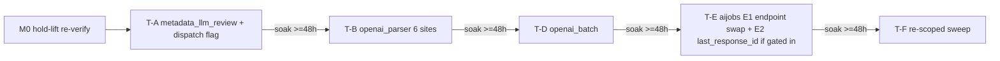

<!-- file: docs/plans/2026-07-10-responses-api-migration.md -->
<!-- version: 1.0.0 -->
<!-- guid: 8deb310a-ea30-4304-b135-b6bc9f89493f -->
<!-- last-edited: 2026-07-10 -->

# OpenAI Responses API Migration (AI-RESP-A..F) Implementation Plan — [hold]

**Status:** BLOCKED — awaiting hold-lift on #1260-#1265

> **Gate (verbatim):** CONFIRM-HOLD — blocked-on-hold-lift. Issues #1260-#1265 are all marked
> [hold]. NOTHING executes until the user explicitly lifts the hold. When lifted: sequenced
> lowest-risk-first (A -> B -> D -> E -> F), each phase SOAKS in prod before the next; embeddings
> (/v1/embeddings) are NEVER migrated (AI-RESP-C guard).

> **For agentic workers:** this plan is a WRAPPER. ⚠️ **Package layout — TWO sibling directories
> that differ only by the `ai-` prefix; read paths carefully:**
> 1. `docs/agent-tasks/ai-responses-migration/` — the PRE-EXISTING 2026-07-01 briefs
>    (`TASK-01..05`, README, orchestration.md, run.sh). Do not regenerate or move them; they are
>    reused as-is with corrections applied.
> 2. `docs/agent-tasks/responses-api-migration/` — the **canonical package directory** for this
>    2026-07-10 planning package; it holds only `HOLD-STATUS.md` (the freshness audit + per-brief
>    staleness corrections).
>
> These are the ONLY two brief/correction directories in play — treat any other similarly-named
> path as an error. Before dispatching any brief, apply that brief's staleness corrections from
> `HOLD-STATUS.md`. On any conflict between HOLD-STATUS.md and the spec's locked Decisions, the
> **spec wins** — HOLD-STATUS is a per-brief projection of the spec, not a second authority. Steps
> use checkbox (`- [ ]`) syntax for tracking.

**Goal:** migrate every OpenAI-backend Chat Completions call in `internal/ai` to `/v1/responses`,
one soaked phase at a time, without touching embeddings or breaking the local Ollama backend.

**Architecture:** six milestones (M0 hold-lift re-verify, then phases A, B, D, E, F), one PR per
phase, strictly serial with a ≥48 h prod soak between phases. Every phase's behavior change is
confined to the OpenAI backend arm of a `useResponsesAPI` dispatch flag (default **false** —
fail-safe to Chat Completions); the local Ollama backend keeps Chat Completions permanently.
Additive until F, and F is dead-code-only.

**Tech Stack:** Go 1.24 (`go.mod`), `github.com/openai/openai-go/v3 v3.41.0` (has the `responses`
package + `BatchNewParamsEndpointV1Responses`; verify: `grep -n 'openai-go' go.mod`), PebbleDB
untouched.

**Spec:** `docs/specs/2026-07-10-responses-api-migration-design.md`. This plan covers
AI-RESP-A/B/D/E/F + GAP-1 (backend-dispatch flag). AI-RESP-C is a permanent guard, never executed.

---

## Task skeleton (authoritative — briefs and HOLD-STATUS are projections of this table)

| Task | Source brief | ID | Exact files | Depends on | Polarity | Priority | Wave |
|---|---|---|---|---|---|---|---|
| M0 | (none — this plan §M0) | HOLD-LIFT | none (read-only re-verify) | user lifts hold | n/a | P0 | 0 |
| T-A | `ai-responses-migration/TASK-01` + GAP-1 | AI-RESP-A | `internal/ai/metadata_llm_review.go`, `internal/ai/openai_parser.go` (struct+ctor only), `internal/ai/register.go` | M0 | additive | P3(hold) | 1 |
| T-B | `ai-responses-migration/TASK-02` | AI-RESP-B | `internal/ai/openai_parser.go` | T-A soaked | transform | P3(hold) | 2 |
| T-D | `ai-responses-migration/TASK-03` | AI-RESP-D | `internal/ai/openai_batch.go` | T-B soaked | transform | P3(hold) | 3 |
| T-E | `ai-responses-migration/TASK-04` | AI-RESP-E | `internal/ai/aijobs/aijobs.go` | T-D soaked | transform | P3(hold) | 4 |
| T-F | `ai-responses-migration/TASK-05` (re-scoped) | AI-RESP-F | sweep: exactly FOUR files — `internal/ai/metadata_llm_review.go`, `internal/ai/openai_parser.go`, `internal/ai/openai_batch.go`, `internal/ai/aijobs/aijobs.go`. `register.go` is EXCLUDED (A-only: it has no Chat call site, only the flag-set line) | T-E soaked | removal | P3(hold) | 5 |

Test files accompany each task (`*_test.go` twins of the exact files). `internal/ai/embedding_client.go`
appears in NO task's file list — that is the AI-RESP-C guard, enforced per-PR via `git diff --stat`.

## ⚠️ Same-file collision matrix (computed from Exact files)

| Shared file | Tasks that touch it | Resolution |
|---|---|---|
| `internal/ai/openai_parser.go` | T-A, T-B, T-F | serialize: wave1=T-A, wave2=T-B, wave5=T-F |
| `internal/ai/metadata_llm_review.go` | T-A, T-F | serialize: wave1=T-A, wave5=T-F |
| `internal/ai/openai_batch.go` | T-D, T-F | serialize: wave3=T-D, wave5=T-F |
| `internal/ai/aijobs/aijobs.go` | T-E, T-F | serialize: wave4=T-E, wave5=T-F |

Every collision resolves by the soak sequence itself: all waves are single-task and strictly
serial, so no two tasks are ever in flight together.

**Execution mode (every wave 1–5):** SERIAL WAVES (coordinator-driven) — trigger: the INIT-7 gate
mandates prod soak between every phase (no wave may start before the previous phase's soak passes),
AND T-B/T-F share `internal/ai/openai_parser.go` with T-A (collision matrix rows 1–2). NOT
/parallel-sweep: 0 parallelizable tasks (below the ≥3 mechanically-similar threshold — every wave
has width 1). Each task runs as a SINGLE-AGENT (Sonnet-class) dispatch of its existing brief,
standalone mode (own worktree + branch + PR + `gh pr merge --rebase`), with the coordinator owning
the soak decision between waves.

---

## Milestone M0 — Hold-lift + re-verification (no code)

**Why:** the briefs were written 2026-07-01; the Ollama cutover (2026-07-02) and the SDK bump to
`openai-go/v3` both post-date them. Executing them unaudited would break the local backend.

- [ ] Confirm the user has EXPLICITLY lifted the hold on #1260-#1265. **The explicit user statement
      is the SOLE authorization.** Issue/label state is corroboration only and must NEVER
      substitute for it: run `gh issue view 1260 --json labels,state` as a cross-check, but label
      removal or issue closure alone is NOT authorization — if no explicit user statement exists,
      STOP and ask. (Same failure class as the prod-apply review gate: a gate needs a real user
      decision, not an inferred one.)
- [ ] **OpenAI-backend precondition (hard blocker, not a skip).** The OpenAI `/v1/responses` arm is
      the ONLY new/behavior-changing code in every phase, and D/E are OpenAI-only surfaces — a soak
      that cannot exercise the OpenAI arm proves nothing. Verify a working, funded OpenAI backend
      exists in prod BEFORE M1: confirm prod's `EffectiveLLMMode` config can select the OpenAI arm,
      then run one real probe against the prod key (a minimal Chat or Responses call) — Expected:
      HTTP 200, no quota/billing error. Context: prod cut over to local Ollama on 2026-07-02 after
      an OpenAI quota-out, so this may currently FAIL. If prod is local-only or the key is
      unfunded, the sequence must NOT start — record it as a hard blocker in HOLD-STATUS.md and
      report to the user; do NOT proceed with local-arm-only soaks.
- [ ] Re-run every re-verify grep block in the spec and in
      `docs/agent-tasks/responses-api-migration/HOLD-STATUS.md`. Run:
      `grep -n 'Chat.Completions.New' internal/ai/metadata_llm_review.go internal/ai/openai_parser.go`
      — Expected: 1 hit in metadata_llm_review.go, 6 in openai_parser.go (counts drifting means
      re-audit before dispatch).
- [ ] Re-anchor the two files behind Decisions 3 and 5 (absent from the original verified-anchors
      set). Run: `grep -n 'EffectiveLLMMode\|NewOpenAIParserWithBaseURL' internal/ai/register.go`
      — Expected: the mode switch (~lines 99-113) + both constructor calls. Run:
      `grep -n 'BatchNewParamsEndpointV1ChatCompletions' internal/ai/openai_batch.go` — Expected:
      3 hits (~lines 76, 216, 378). Run:
      `grep -n '/v1/chat/completions' internal/ai/openai_batch.go` — Expected: 2 hits (~lines
      184, 348, JSONL `url` fields). Drift → re-audit before dispatch.
- [ ] Re-verify SDK support. Run: `grep -n 'openai-go' go.mod` — Expected: `openai-go/v3` at
      ≥ v3.41.0; then confirm in the modcache for the pinned version that `responses/` exists AND
      the symbol `BatchNewParamsEndpointV1Responses` is defined (e.g.
      `grep -rn 'BatchNewParamsEndpointV1Responses' "$(go env GOMODCACHE)/github.com/openai/openai-go/v3@v3.41.0/"`
      — Expected: ≥1 hit). D and E both hinge on that single symbol (spec Decision 5 caveat);
      absent → D/E take TASK-03's blocked-path handling.
- [ ] Re-audit HOLD-STATUS.md verdicts against HEAD; update that file (version bump) if drifted.

## Milestones M1–M5 — phase execution (post-hold-lift only)

Each milestone = dispatch the mapped brief (see skeleton table) with the HOLD-STATUS corrections
applied, then the shared per-phase loop:

- [ ] **Worktree + PLAN.md**: per the brief's ⛔ START HERE block (worktree + branch off
      `origin/main`; never the primary checkout; never commit to main).
- [ ] **Implement per brief + corrections.** House rules: bump version headers on every touched
      file; conventional commits; keep the change additive to the Chat arm (waves 1–4).
- [ ] **Gate.** Run: `make ci` — Expected: PASS. staticcheck is red on main (pre-existing backlog
      #1796) — scope staticcheck to files you changed; the merge gate is Minimal CI green.
- [ ] **Full suite.** Run: `go test ./... -short` — Expected: PASS (full suite, never a subset).
- [ ] **Guard check.** Run: `git diff --stat main... | grep embedding_client` — Expected: no output
      (AI-RESP-C).
- [ ] **PR + merge.** Run: `gh pr create --fill && gh pr merge <n> --rebase` — Expected: rebase/FF
      merge, Minimal CI green.
- [ ] **Baseline snapshot (BEFORE `make deploy` — mandatory).** The soak pass criterion is a diff
      against a pre-deploy baseline, so the baseline must be captured and saved as an artifact
      before deploying. Run:
      `ssh <server> "journalctl -u audiobook-organizer --since '-48h' | grep -i 'llmparser\|internal/ai' | sed 's/^[^ ]* [^ ]* [^ ]* //' | sort | uniq -c | sort -rn" > .claude/state/soak-baseline-<phase>.txt`
      — Expected: file written and committed to the worktree's `.claude/state/` (or otherwise
      preserved for the full soak window). This saved artifact is the ONLY baseline the soak-pass
      diff may use — a soak grep with no recorded pre-deploy baseline is automatically a FAIL.
- [ ] **Deploy.** Run: `make deploy` — Expected: service active/running, 0 restarts.
- [ ] **SOAK (blocking, per spec §Soak protocol).** Minimum 48 h AND ≥1 real op through the
      migrated surface per applicable backend mode — **and the OpenAI arm MUST be among them**:
      the OpenAI `/v1/responses` arm is the only changed code in every phase, so a soak that
      exercised ONLY the local (Ollama) arm is a FAIL regardless of how clean the logs are (it
      soaked unchanged code). Run:
      `ssh <server> "journalctl -u audiobook-organizer --since '-48h' | grep -i 'llmparser\|internal/ai' | sed 's/^[^ ]* [^ ]* [^ ]* //' | sort | uniq -c | sort -rn" > .claude/state/soak-post-<phase>.txt`
      then diff against `.claude/state/soak-baseline-<phase>.txt` — Expected: no NEW error
      signatures vs. the saved pre-deploy baseline (compare, don't zero-check).
      Fail → revert + `make deploy` + record in HOLD-STATUS.md + STOP the sequence.

### Per-phase deltas and soak specifics

> **Rollback window (applies to every phase's Rollback line below):** "revert the single PR" is a
> clean rollback ONLY during that phase's own soak window, before any later phase — in particular
> F — has shipped. T-F edits the same four files as A/B/D/E and deletes helpers those phases made
> unreachable, so a post-F single-phase revert of A/B/D/E will conflict and can reference deleted
> symbols. Any post-F incident uses the reverse-order full rollback (F→A) per spec §Rollback.

- **M1 / T-A (wave 1, additive).** Includes GAP-1: add `useResponsesAPI bool` to `OpenAIParser`
  + set it in `register.go`'s OpenAI-mode arm (`grep -n 'EffectiveLLMMode' internal/ai/register.go`).
  Brief correction: implement as a two-arm dispatch, NOT a replacement (HOLD-STATUS §TASK-01).
  Soak must exercise metadata LLM review in BOTH modes (OpenAI + local qwen2.5 on <gpu-host>).
  Rollback: revert the single PR (within the soak window — see rollback-window note) — flag
  defaults false, so partial revert still fails safe to Chat.
- **M2 / T-B (wave 2, transform).** 6 sites, each read individually; incremental
  `go build ./internal/ai/...` per site — Expected: clean after each. Soak: parsing ops in both
  modes. Rollback: revert PR (within the soak window — see rollback-window note).
- **M3 / T-D (wave 3, transform, OpenAI-only).** TWO distinct swap surfaces, verified separately:
  (1) the SDK endpoint constant — THREE call sites, not one
  (`grep -n 'BatchNewParamsEndpointV1ChatCompletions' internal/ai/openai_batch.go` — Expected
  pre-edit: 3 hits, ~lines 76, 216, 378; post-edit: 0); (2) the JSONL `url` fields
  (`grep -n '/v1/chat/completions' internal/ai/openai_batch.go` — Expected pre-edit: 2 hits,
  ~lines 184, 348; post-edit: 0). Both greps must hit 0 post-edit — passing only the url grep can
  leave endpoint(chat)/url(responses)-mismatched batch bodies. Brief correction: the "verify
  allowlist" blocker check now expects SUPPORT (HOLD-STATUS §TASK-03) — still run the check.
  Soak: one real batch round-trip. Rollback: revert PR (within the soak window — see
  rollback-window note), **but FIRST drain in-flight new-endpoint batches**: batches SUBMITTED to
  `/v1/responses` during the soak are still in flight on OpenAI's side at revert time, and
  reverted (Chat-shape) result-parsing would silently mis-parse their `/v1/responses` result JSONL
  when they complete post-revert. Before `git revert`: await/cancel every in-flight batch created
  since deploy, or ship the fail-closed guard from spec §C4 (record the endpoint per submitted
  batch; refuse to parse results whose recorded endpoint != the running code's endpoint). Never
  revert with new-endpoint batches pending and no endpoint guard. (In-flight batches created on
  the OLD endpoint still parse fine after revert — that direction was already covered.)
- **M4 / T-E (wave 4, transform, OpenAI-only) — SPLIT E1/E2 per spec §C5.**
  **E1 (unconditional):** endpoint swap on the aijobs batch-body builder
  (`/v1/chat/completions` → `/v1/responses` in the JSONL bodies). **E2 (conditional — the
  "biggest token win" is contingent, not established):** `LastResponseID` /
  `PreviousResponseID` threading + the multi-turn test, dispatched ONLY if the M0/execution
  re-validation (HOLD-STATUS §TASK-04) proves aijobs is, or is being refactored into, a
  turn-sequenced loop. Today the file is a batch-submission helper with NO sequential turns
  (verified anchor), so if re-validation finds no turns: implement E1 only, record the descope,
  and do NOT invent job state or a test with no subject. Soak: E1 = one real batch round-trip;
  E2 (only if dispatched) = a 2+-turn job shows shrinking per-turn payload in logs. Rollback:
  revert PR (within the soak window — see rollback-window note) with the SAME in-flight-batch
  drain requirement as M3; if E2 shipped, `LastResponseID` is additive in job state and stale
  values are ignored by reverted code.
- **M5 / T-F (wave 5, removal — RE-SCOPED).** Dead-code-only sweep per spec Decision 4: retained
  Chat arms get `// AI-RESP-F: retained for local (Ollama) backend` comments; deletion allowed only
  for symbols with zero remaining references. Run:
  `grep -rn 'Chat.Completions.New' internal/ai/ internal/ai/aijobs/` — Expected AFTER: every
  surviving hit is inside a `useResponsesAPI` dispatch's local arm (manually confirm each).
  Rollback: revert PR restores deleted helpers. Note F is the phase that ENDS the clean
  single-phase revertability of A/B/D/E (rollback-window note above).

## Task final: Full verification + close-out

- [ ] Run: `gofmt -l internal/ai && go vet ./internal/ai/... ./internal/ai/aijobs/...` — Expected: clean.
- [ ] Run: `make ci` — Expected: PASS (caveat line above applies).
- [ ] Final soak passes → close #1260-#1265 with links to the five PRs; update TODO.md (fix the
      dangling `2026-04-29-responses-api-migration-design.md` link — point it at
      `docs/specs/2026-07-10-responses-api-migration-design.md`) and CHANGELOG.md; mark
      HOLD-STATUS.md and the old `orchestration.md` superseded (version-bump both).
- [ ] Reconcile the master plan (`.claude/notes/2026-07-10-remaining-work-master-plan.md`,
      §INIT-7): (a) its F wording "delete remaining Chat Completions call sites" is superseded by
      spec Decision 4's re-scope (dead-code-only; Chat arm is load-bearing for the Ollama backend
      — blanket deletion would break local mode) — update it so nobody derives the
      Ollama-breaking F scope from the master plan alone; (b) fix its spec reference (~line 305)
      from the nonexistent `docs/superpowers/specs/2026-04-29-responses-api-migration-design.md`
      to `docs/specs/2026-07-10-responses-api-migration-design.md`.

## Deployment / runtime validation (after each merge)

1. `make deploy` (literal — never an SSH/scp workaround); confirm `systemctl is-active` and 0 restarts.
2. Exercise the phase's surface with a real op per applicable backend mode (the OpenAI arm is
   mandatory — see the SOAK step); read counts/telemetry; compare error signatures to the saved
   pre-deploy baseline; only then declare soak-pass. No destructive or mass-mutation prod-data op
   (no backfill/overwrite/delete) is involved in any phase, therefore no dry-run + AskUserQuestion
   apply gate is needed — but note phase E2 (if dispatched) adds an additive, forward-only
   persisted field (`LastResponseID`) written as part of normal job operation. The soak-pass
   decision is still coordinator-explicit.

## Self-Review

**Spec coverage:** Decision 1 → skeleton waves 1–5 ✓; Decision 2 → guard check in the shared loop ✓;
Decision 3 → GAP-1 in T-A ✓; Decision 4 → M5 re-scope ✓; Decision 5 → T-D + T-E1 unconditional
(E2 conditional per spec §C5) ✓; soak protocol (incl. pre-deploy baseline + OpenAI-arm-mandatory
pass criteria) → shared loop + per-phase deltas ✓. AI-RESP-C deliberately has no task.
**Placeholder scan:** no code steps in this plan by design — implementation code lives in the
existing briefs; the only normative snippets are in the spec.
**Type consistency:** `useResponsesAPI` produced in T-A, consumed in T-B/T-F; `LastResponseID`
produced+consumed inside T-E only, and only if E2 dispatches.
**Known follow-up:** possible future Ollama `/v1/responses` support (new initiative, not here);
TODO.md dangling-link fix rides M5's close-out.
