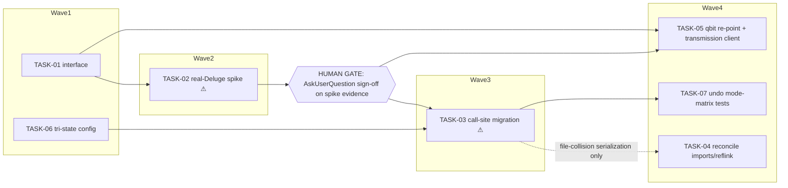

<!-- file: docs/plans/2026-07-10-torrent-relocation.md -->
<!-- version: 1.0.0 -->
<!-- guid: 4a413eb3-a477-4204-8ac2-a5ac66398784 -->
<!-- last-edited: 2026-07-10 -->

# INIT-5 Torrent Hardening + Client-Agnostic Relocation — Implementation Plan

Companion to:
- `docs/specs/2026-07-10-torrent-relocation-design.md` (task IDs T1-T7 from the master plan
  `.claude/notes/2026-07-10-remaining-work-master-plan.md` §INIT-5)
- Briefs: `docs/agent-tasks/torrent-relocation/`

**GATE (verbatim, governs every task):** SPEC -> EXECUTE with a hard human gate: T2 is a
REAL-DELUGE SPIKE with STOP-FOR-HUMAN sign-off REQUIRED before T3's call-site migration may
start. The new relocation mode is config-gated (tri-state: off / physical-move / re-point-only);
defaults STAY on today's behavior until the T2 spike is human-approved.

**File-ownership:** none cross-initiative; internally T3 (call-site migration) touches 6 files
across 3 packages — its own collision matrix decides waves (resolved below: T3 is ONE PR).

Coordination model: briefs are MODE=standalone — each task is its own worktree + branch + PR +
`gh pr merge --rebase`. When a coordinator dispatches multiple briefs concurrently (W1, W4), the
protocol block below takes precedence over the briefs' own push/PR sections. Gate for every PR:
`make ci` — staticcheck is red on main (pre-existing backlog #1796) — scope staticcheck to files
you changed; the merge gate is Minimal CI green. Tasks marked **⚠ review-critical** change the
torrent-client-facing surface and require line-by-line coordinator review before merge.

## Dependency graph

**Fallback re-parenting (spike REJECTED / both mechanisms disqualified):** the spec's
hardening-only fallback (T4, T6-as-documented, docs) must stay reachable. The T03→T04 edge exists
ONLY to serialize shared-file edits (`internal/plugins/deluge/centralization.go`,
`internal/deluge/import.go`) — it is not semantic. If the spike REJECTS re-point, T03 is BLOCKED
per spec §T2(3); T04 then **re-parents: branch directly from `origin/main`** and proceeds (its
files have no unmerged sibling edits once T03 is off the board). T05 and T07's re-point cells are
skipped; T07 may still land its closure note + existing-coverage documentation with the re-point
cells dropped.

## Model assignments (authoritative — overrides per-task `Agent:` lines)

| Model | Tasks | Rationale |
|---|---|---|
| **Sonnet-class** | TASK-01, TASK-04, TASK-05, TASK-06, TASK-07 | logic + integration, fully specified; gate catches failures |
| **Opus/strong-class** | TASK-02, TASK-03 | T2: real-Deluge spike, operator-in-loop, irreversible-if-careless (payload deleted); NEVER weak-tier. T3: one PR changing relocation semantics at 6 sites / 3 packages — ⚠ line-by-line review |

## Parallel execution groups

| Wave | Tasks (parallel within wave) | Notes |
|---|---|---|
| W1 | TASK-01, TASK-06 | disjoint files (see collision table). Execution mode: SERIAL WAVES (coordinator-driven) — trigger: 2 tasks (< the ≥3 mechanically-similar /parallel-sweep threshold); disjoint files permit concurrent dispatch within the wave |
| W2 | TASK-02 | Execution mode: SINGLE-AGENT (strong model) — trigger: real-Deluge spike against live daemon, operator-in-loop mandated by the initiative payload; ends at the HUMAN GATE (AskUserQuestion) |
| — | **HUMAN GATE** | STOP-FOR-HUMAN: T3 may not start until the T2 spike evidence gets a real AskUserQuestion sign-off, recorded as a `DECISION: APPROVED ...` line in the spike report (see TASK-02 step 8 / TASK-03 precondition) |
| W3 | TASK-03 | Execution mode: SINGLE-AGENT (strong model) — trigger: 6 files / 3 packages carry ONE shared semantic change that must land atomically (mixed-semantics main between merges otherwise); 6 call sites is below the ≥20-callsite parallel-refactor-sweep threshold |
| W4 | TASK-04, TASK-05, TASK-07 | Execution mode: SERIAL WAVES (coordinator-driven) — trigger: 3 tasks but NOT mechanically similar (fails the /parallel-sweep ≥3-similar trigger); disjoint files per collision matrix permit concurrent dispatch within the wave. TASK-05 is SKIPPED if the spike rejected re-point |

### ⚠️ Same-file collision table (computed from Exact-files lists)

| Shared file | Tasks that touch it | Resolution |
|---|---|---|
| `internal/download/deluge.go` | TASK-01, TASK-02 | serialize: wave1=T01 (stub), wave2=T02 (real impl) (also a dependency edge) |
| `internal/download/qbittorrent.go` | TASK-01, TASK-05 | serialize: wave1=T01 (stub), wave4=T05 (guarded impl) (also a dependency edge) |
| `internal/plugins/deluge/centralization.go` | TASK-03, TASK-04 | serialize: wave3=T03, wave4=T04 (collision-only edge — see fallback re-parenting) |
| `internal/deluge/import.go` | TASK-03, TASK-04 | serialize: wave3=T03, wave4=T04 (collision-only edge — see fallback re-parenting) |

(`internal/plugins/deluge/import.go` is touched by TASK-03 ONLY — TASK-04 does not edit it: the
plugin package's sole `reflinkCopy` caller is `centralization.go:132`. `internal/config/config.go`
is touched by TASK-06 ONLY — TASK-05 adds no config key; the client type reuses the existing
`cfg.DownloadClient.Torrent.Type`.)

T3-internal note (per the initiative payload): T3's 6 files span `internal/deluge`,
`internal/plugins/deluge`, `internal/maintenance/jobs` — all edited in ONE worktree by ONE agent,
so no cross-agent collision exists inside T3; its "collision matrix" collapses to the single-PR
decision (spec Decision 5). The 7th master-plan call site, `internal/download/deluge.go`, is
handled by T01 (PHYSICAL doc-comment) + T02 (real re-point impl) — not part of T3's diff.

Same-file serialization rules: `internal/plugins/deluge/centralization.go` +
`internal/deluge/import.go` (T03→T04, collision-only); `internal/download/deluge.go` (T01→T02);
`internal/download/qbittorrent.go` (T01→T05). The spike track (T01→T02→gate) starts first.

## Coordinator protocol (verbatim)

> **Coordinator owns git. Workers never push.** Each worker operates only inside its
> assigned worktree: edit, test, commit — then stop. Workers never run `git push`,
> `gh pr`, or any merge command. The coordinator runs the gate (`make ci`) in each
> finished worktree, opens the PR, merges (rebase/FF unless the repo profile says
> otherwise), and then **rebases every open sibling worktree** before dispatching
> anything else.
>
> **Per-merge sibling-rebase loop:** after EVERY merge to `origin/main`:
> for each open sibling worktree, `git fetch origin && git rebase
> origin/main`. A sibling that skips a rebase is a future conflict.
>
> **Conflict escalation ladder** (in order, never skip a rung): 1) clean rebase;
> 2) conflict-resolver subagent (Sonnet-class, only when the conflict spans 1–3 small
> files); 3) file-copy cherry-pick fallback — re-apply the task's file states onto a
> fresh branch from HEAD; 4) mark `rebase_blocked`, stop the lane, escalate to a human.
>
> **A wave MUST NOT start** while any of: the previous wave has an unmerged PR; any
> sibling worktree is un-rebased; the gate is red on `origin/main`; or a
> `rebase_blocked` marker is unresolved.

(Briefs are MODE=standalone: an agent executing a brief solo follows the brief's own PR+merge
section; under coordinator dispatch the block above wins.)

---

### TASK-01: Extend download.TorrentClient with UpdateStoragePath + fail-closed stubs
Priority: P1 · Effort: S · Agent: Sonnet-class · Depends on: none

**Context.** The interface home is the EXISTING `internal/download.TorrentClient`
(`internal/download/client.go:54`) — real Deluge + qBittorrent implementors, config-keyed factory,
ctx-aware plumbing. NOT `internal/plugin.DownloadClient` (vestigial: zero implementors, embeds the
WRONG plugin framework's base interface — the Deluge plugin implements `pkg/plugin/sdk.Plugin`,
not `internal/plugin.Plugin`, so a compile-assert against it can never hold). Spec §C1, Decision 2.

**Exact files to change**
- `internal/download/client.go` — add `UpdateStoragePath(ctx context.Context, id, newPath string) error`
  + `ErrRePointUnsupported`; doc-harden `SetDownloadPath` as PHYSICAL
- `internal/download/deluge.go` — fail-closed stub returning `ErrRePointUnsupported`
- `internal/download/qbittorrent.go` — fail-closed stub returning `ErrRePointUnsupported`
- `internal/download/download_test.go` — stub-error tests (interface-satisfaction test
  `TestTorrentClientInterface` already exists at :18 and enforces the extension at compile time)
- `internal/plugin/plugin.go` — doc-comment ONLY: mark `DownloadClient` vestigial, point at
  `internal/download.TorrentClient`; do NOT extend it

**Acceptance criteria**
- [ ] `grep -n "UpdateStoragePath(ctx context.Context" internal/download/client.go` hits; both implementors compile (existing `TestTorrentClientInterface` green)
- [ ] Both stubs return `ErrRePointUnsupported` (`errors.Is` asserted in tests)
- [ ] `make ci` green (staticcheck scoped to changed files; merge gate = Minimal CI)

**Idempotency.** Additive — done if `grep -n "UpdateStoragePath" internal/download/client.go` hits.
**Rollback.** Revert the PR; the interface returns to its prior shape; nothing consumes the new method yet.

---

### TASK-02: Deluge re-point spike + UpdateStoragePath implementation [⚠ review-critical]
Priority: P0 · Effort: L · Agent: Opus/strong-class + OPERATOR-IN-LOOP · Depends on: TASK-01

**Context.** Deluge has no update-path-only RPC. Spec §"T2 spike protocol" is normative: two
candidate mechanisms (remove+re-add-with-recheck vs move_completed_path+resume), a REQUIRED
pre-execution AskUserQuestion echoing the exact throwaway-torrent hash before any destructive
RPC, 4-point validation checklist against REAL Deluge with a throwaway torrent, fail-closed on
RPC errors (crash-in-remove-window orphan risk is a residual, mechanism-A-only failure mode —
recorded, not claimed away), then **STOP-FOR-HUMAN** (real AskUserQuestion) before anything
downstream.

**Exact files to change**
- `internal/download/deluge.go` — `UpdateStoragePath` via the validated mechanism (replace the
  T1 stub), reusing the existing ctx-aware `d.call` plumbing
- `internal/download/download_test.go` (or a new `deluge_repoint_test.go` in the package) —
  fail-closed + happy-path against a mock RPC server
- NEW `docs/reports/2026-07-torrent-repoint-spike.md` — spike evidence (RPC transcripts, inode
  proof, failure-injection result, recommendation, canonical DECISION line)

**Acceptance criteria**
- [ ] All 4 spike checklist items evidenced in the report; zero physical move proven
- [ ] Pre-execution AskUserQuestion (throwaway hash echoed) recorded in the report BEFORE the first destructive RPC transcript
- [ ] Fail-closed test: injected mid-sequence failure leaves the old path registered
- [ ] STOP: sign-off recorded as `DECISION: APPROVED mechanism <A|B> via AskUserQuestion YYYY-MM-DD`
      (or `DECISION: REJECTED — hardening-only fallback ...`) — written ONLY after the human
      answers the AskUserQuestion; the question's outcome, not option-label text, is the source
      of truth. This line gates W3.
- [ ] `make ci` green (staticcheck scoped to changed files)

**Idempotency.** Additive — done if `grep -n "func (d \*DelugeClient) UpdateStoragePath" internal/download/deluge.go` hits (non-stub body) AND the spike report file exists.
**Rollback.** Revert the PR; nothing calls `UpdateStoragePath` until T3, so behavior is unchanged.

---

### TASK-03: Route the MoveStorage call sites through mode-aware relocation [⚠ review-critical]
Priority: P1 · Effort: M · Agent: Opus/strong-class (single agent, ONE PR) · Depends on: TASK-02 (human-approved: `^DECISION: APPROVED` in the spike report) + TASK-06

**Context.** 6 T3 call sites (spec §Motivation lists 7; the 7th, `internal/download/deluge.go`,
is handled by T01/T02): `internal/deluge/import.go:123`, `internal/plugins/deluge/import.go:51`,
`internal/plugins/deluge/centralization.go:165`, `internal/plugins/deluge/path_update.go:130`,
`internal/deluge/integration.go:106` (fan-out hub, callers :148/:174/:186/:193),
`internal/maintenance/jobs/bulk_deluge_import.go:233`. Switch on `cfg.TorrentRelocation()`;
default resolves to today's behavior; physical-move branch = today's concrete call byte-for-byte;
re-point-only branch = client-agnostic dispatch via a new `deluge.GetRelocationClient()`
(`download.NewTorrentClientFromConfig` on `cfg.DownloadClient.Torrent.Type`) with the
validated-client hard guard (spec Decision 7). Bulk job gets dry-run/canary/aggregate counts +
pre-re-point save_path recording (spec §C3). Preserve hydrate-before-write
(`centralization.go:141-157`) and the nil-client guard (`internal/deluge/protected_paths.go:96-111`).

**Exact files to change** — the 6 files above + tests (`internal/deluge/import_test.go`, etc.)

**Acceptance criteria**
- [ ] Mode-matrix test: off→no RPC, physical-move→MoveStorage, re-point-only→UpdateStoragePath
- [ ] Anti-over-suppression: physical-move mode still issues MoveStorage (`TestRelocationHappyPathStillMoves`)
- [ ] Hard guard test: re-point-only + non-allowlisted client type → skip + Warn, zero RPCs, no physical fallback (`TestRePointGuardRejectsUnvalidatedClient`)
- [ ] Bulk safety: dry-run issues zero RPCs + reports counts; real run emits start/progress/complete/skip + aggregate success/skip/fail; per-torrent pre-re-point save_path recorded; failures log the `relocation-failed` marker (hash + old/new path)
- [ ] `grep -rn 'DelugeMoveEnabled &&' internal/` returns 0 hits in the migrated call-site files
- [ ] `make ci` green + full `go test ./... -short`

**Idempotency.** Transform — done if `grep -rn "TorrentRelocation()" internal/deluge internal/plugins/deluge internal/maintenance/jobs` hits at the call sites AND the old `DelugeMoveEnabled &&` guards are gone from them.
**Rollback.** Revert the PR; or operationally set `torrent_relocation_mode: "physical-move"`/`"off"` (no deploy). NOTE: config revert is forward-only — it cannot un-re-point already-processed torrents (spec §Rollback).

---

### TASK-04: Reconcile the two import impls — make plugin reflink real
Priority: P1 · Effort: M · Agent: Sonnet-class · Depends on: TASK-03 (file-collision serialization ONLY — if the spike REJECTS re-point and TASK-03 is blocked, re-parent: branch from `origin/main` and proceed; this task is the hardening-only fallback's core)

**Context.** Plugin `reflinkCopy` (`internal/plugins/deluge/centralization.go:199-203`) is an
always-fail stub; only legacy `reflinkCopyOS` (`internal/deluge/import_unix.go:23`) is real. The
plugin package's only stub caller is `centralization.go:132` — `internal/plugins/deluge/import.go`
has no reflink call and is NOT in scope. Spec §C4.

**Exact files to change**
- `internal/plugins/deluge/centralization.go` — remove stub, call the shared real impl
- `internal/deluge/import.go`, `internal/deluge/import_unix.go`, `internal/deluge/import_windows.go` — export/share the platform reflink
- `internal/plugins/deluge/centralization_test.go` — reflink + fallback tests

**Acceptance criteria**
- [ ] `grep -n 'reflink not available' internal/plugins/deluge/centralization.go` returns 0 hits
- [ ] Hydrate-before-write block byte-identical (`grep -n 'Hydrate the full row before writing back' internal/plugins/deluge/centralization.go` still hits)
- [ ] `make ci` green

**Idempotency.** Removal(stub)+transform — done if the stub grep above returns 0 AND the shared impl is referenced from the plugin package.
**Rollback.** Revert the PR; plugin path returns to always-fallback-copy (slower, not incorrect).

---

### TASK-05: qBittorrent re-point + Transmission client in internal/download (additive, guarded)
Priority: P2 · Effort: M · Agent: Sonnet-class · Depends on: TASK-01 + TASK-02 (human-approved — SKIP this task entirely if the spike rejected re-point)

**Context.** Spec §C5. REUSE the existing `internal/download` family — the repo already has a
working qBittorrent WebAPI client with the exact `setLocation` call
(`internal/download/qbittorrent.go:181`) and a config-keyed factory
(`internal/download/factory.go:14`, `cfg.DownloadClient.Torrent.Type`). Do NOT create
`internal/plugins/qbittorrent/` or `internal/plugins/transmission/`; do NOT add a new client-type
config key. Both re-point paths stay behind TASK-03's validated-client hard guard until a
T2-class validation per client.

**Exact files to change**
- `internal/download/qbittorrent.go` — `UpdateStoragePath` via the existing `setLocation` shape
  (replace the T1 stub); code-comment caveat: setLocation MAY physically move when source data
  exists — guard-locked until validated against a real qBittorrent
- NEW `internal/download/transmission.go` (+ `transmission_test.go`) — full `TorrentClient`:
  session-id handshake, `torrent-get`, `torrent-set-location` `move:true` (SetDownloadPath) /
  `move:false` (UpdateStoragePath)
- `internal/download/factory.go` — add the `"transmission"` case

**Acceptance criteria**
- [ ] `grep -n 'case "transmission"' internal/download/factory.go` hits; `TestTorrentClientInterface` extended to cover the Transmission client
- [ ] `grep -rn '"move": *false\|"move":false' internal/download/transmission.go` hits (native no-move re-point)
- [ ] httptest-mock tests: transmission `UpdateStoragePath` body carries `move:false`; qbittorrent posts to `/api/v2/torrents/setLocation`; non-2xx ⇒ error (fail-closed)
- [ ] NO new config key: `git diff origin/main -- internal/config/config.go` is empty for this task
- [ ] `make ci` green

**Idempotency.** Additive — done if `test -f internal/download/transmission.go` AND the qbittorrent `UpdateStoragePath` is non-stub.
**Rollback.** Revert the PR; the transmission factory case disappears and qbittorrent re-point returns to the stub; nothing is reachable past the hard guard by default.

---

### TASK-06: Tri-state relocation config + Settings UI + docs
Priority: P1 · Effort: M · Agent: Sonnet-class · Depends on: none

**Context.** Spec §Data model. `TorrentRelocationMode` + `TorrentRelocation()` fallback derived
from `DelugeMoveEnabled` (`internal/config/config.go:498`). Defaults STAY on today's behavior.
Add the deprecation note to `DelugeMoveEnabled`'s doc comment (deprecated; removal is a named
future cleanup once `TorrentRelocationMode` is the sole knob — spec Decision 4).

**Exact files to change**
- `internal/config/config.go` — field + enum + resolver + `DelugeMoveEnabled` deprecation
  comment + tests (`internal/config/config_test.go`)
- `web/src` settings component (locate: `grep -rn 'deluge_move_enabled' web/src`) — tri-state selector
- `docs/` — mode documentation

**Acceptance criteria**
- [ ] `TestTorrentRelocationModeFallback`: unset→legacy mapping; explicit wins; unknown→legacy
- [ ] `grep -n 'Deprecated' internal/config/config.go | grep -i deluge` hits (deprecation note present)
- [ ] `make ci` green (includes frontend build)

**Idempotency.** Additive — done if `grep -n "TorrentRelocationMode" internal/config/config.go` hits.
**Rollback.** Revert the PR; field absent ⇒ resolver never existed; no data migration.

---

### TASK-07: Close the deferred undo re-point item — mode-matrix cells in the EXISTING suites
Priority: P2 · Effort: S · Agent: Sonnet-class · Depends on: TASK-03

**Context.** The deferred bullet is "Torrent move_storage on undo"
(`docs/archive/superpowers/plans/2026-04-15-bulk-organize-undo.md:97,100` — note: undo, NOT
organize). Wiring already exists (`NotifyDelugeAfterUndo` via `internal/server/undo_engine.go`).
**Happy/skip/error coverage of the fan-out helpers ALSO already exists** —
`TestNotifyDelugeAfterUndo_{Enabled,Disabled,NoHash,DelugeError}`,
`TestNotifyDelugeAfterVersionSwap` (`internal/server/deluge_integration_test.go`) and
`TestNotifyDelugeAfterOrganize_*` (`internal/server/deluge_centralization_test.go`). What is
missing is ONLY the tri-state MODE dimension. Extend those suites; do NOT create a duplicate
suite in `internal/deluge`. Spec §C6.

**Exact files to change**
- `internal/server/deluge_integration_test.go` + `internal/server/deluge_centralization_test.go`
  — add mode-matrix cells (3 flows × 3 modes) reusing the suites' existing client fakes
- `docs/archive/superpowers/plans/2026-04-15-bulk-organize-undo.md` — mark Task 7 closed (header bump)

**Acceptance criteria**
- [ ] `TestUndoOrganizeVersionSwapModeMatrix` covers 9 cells; re-point cells assert `UpdateStoragePath`
- [ ] No duplicate happy/skip/error tests added (the existing `TestNotifyDeluge*` cases stay the authority for those)
- [ ] `make ci` green

**Idempotency.** Additive — done if `grep -rn "TestUndoOrganizeVersionSwapModeMatrix" internal/server` hits.
**Rollback.** Revert the PR; tests-only + doc closure note, zero runtime surface.

---

## Review gates for the coordinator

Line-by-line review mandatory: TASK-02 (live-daemon spike; payload-destroying if fail-open) and
TASK-03 (relocation semantics at 6 sites — a wrong branch physically moves or orphans seeding
data). Standard review: all others. Every PR: `make ci` green (staticcheck scoped to changed
files — red on main per #1796; merge gate is Minimal CI green) + the task's acceptance checklist
pasted and ticked in the PR description + COMPLETED/REMAINING/BLOCKED counts in the final status
comment. The HUMAN GATE between W2 and W3 is a real AskUserQuestion decision, never a text reply;
its machine-checkable record is the `^DECISION: APPROVED` line in the spike report (the bare word
"Approve" also appears in option labels and in rejection records — never gate on it).
