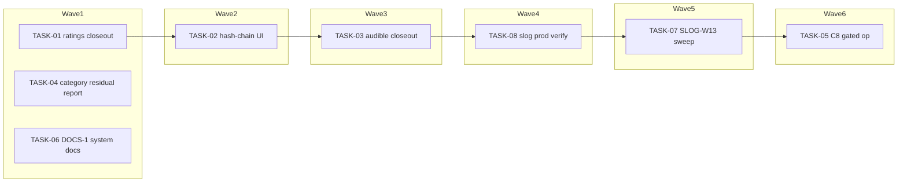

<!-- file: docs/plans/2026-07-10-ux-small-items.md -->
<!-- version: 1.0.0 -->
<!-- guid: 22f94eec-ddc5-40c9-a428-ff423ca6eff1 -->
<!-- last-edited: 2026-07-10 -->

# INIT-10 Small Open UX/Feature Items — Implementation Plan

Companion to:
- `docs/specs/2026-07-10-ux-small-items-design.md` (item IDs: RATE-5, HASH-CHAIN-2/#1270, DUR-*, CAT-*, C8/#1447, DOCS-1/#1276, SLOG-W13/#1254, SLOG-PROD-VERIFY/#1255)
- Briefs: `docs/agent-tasks/ux-small-items/`

**Gate (initiative, verbatim):** PLAN -> EXECUTE AUTONOMOUSLY where cheap (worktree/PR/CI per item); defer with a written note where not. SLOG-PROD-VERIFY (#1255) is read-only prod verification — allowed autonomously via SSH per house rules, but any prod file/data change discovered as needed -> AskUserQuestion.

**Gate command (every PR):** `make ci` — staticcheck is red on main (pre-existing backlog #1796) — scope staticcheck to files you changed; the merge gate is Minimal CI green.

Coordination model: the coordinator reviews and owns ALL git/gh for coordinator-driven waves; briefs are MODE=standalone (each brief is its own worktree + branch + PR + `gh pr merge --rebase`). Tasks marked **⚠ review-critical** change outward-acting or prod-facing surface and require line-by-line coordinator review before merge. Anchor provenance (two tiers, labeled): (1) anchors from `scratchpad/anchors-init-10.json` (verified at HEAD `fce58498`) — every brief carries the anchor's grep verbatim; (2) anchors marked **[this-session verified]** were introduced during planning/repair and each carries the grep that proves it at HEAD `fce58498`. Anchor reconciliation: the anchors JSON names `web/src/components/bookdetail/BookDetailFilesTab.tsx` as the book-file detail view; **[this-session verified]** FilesTab delegates all per-file expanded rendering to `BookDetailVersionGroup.tsx` (`grep -n "BookDetailVersionGroup" web/src/components/bookdetail/BookDetailFilesTab.tsx` — FilesTab passes `bookFiles={bookFiles}` down at ~:156), so TASK-02's render site is VersionGroup, sourced from its `bookFiles: BookFile[]` prop. Two anchors previously cited without verification are corrected in this revision: the duration-mismatch scan is a maintenance JOB dispatched via `POST /api/v1/maintenance/jobs/scan-duration-mismatch` (**[this-session verified]** `grep -n "maintenance/jobs/:job_id" internal/server/server_lifecycle.go` → :1249; job `internal/maintenance/jobs/scan_duration_mismatch.go`, only param `dry_run`, threshold HARDCODED 120s — there is no `GET .../scan-duration-mismatch` route and no `max_delta_min` param), and `GET /api/v1/operations/:id/activity` exists (**[this-session verified]** `grep -n "operations/:id/activity" internal/server/wire_library_routes.go` → :39, handler `ListOperationActivity`).

**File-ownership (initiative):** verify no file overlap with INIT-3's `internal/server/metadata_ops.go` work before dispatching any wave that touches `internal/server/` — this binds TASK-07 (SLOG sweep), whose candidate file set includes `internal/server/metadata_ops.go` (contains `runBulk*` slog calls). **ALSO (INIT-1/INIT-2 dedup partition, same treatment):** the master plan (`2026-07-10-remaining-work-master-plan.md` §INIT-1 locked decisions) names `internal/dedup/engine.go` (76 `slog.Info/Warn/Error/Debug` sites at HEAD `fce58498` — **[this-session verified]** `grep -c "slog\.\(Info\|Warn\|Error\|Debug\)(" internal/dedup/engine.go`) and `internal/database/embedding_store.go` as INIT-2-OWNED for structural edits, with INIT-1's rules.go/dataset/calibration/label-review work layered on top — the explicitly-called-out "overlapping-wave rebase trap". TASK-07 therefore EXCLUDES `internal/dedup/**`, `internal/plugins/dedup/**`, and `internal/database/embedding_store.go` from all shards until BOTH INIT-1 and INIT-2 have merged their work in those files; a trailing shard covers them afterwards. (TASK-05's files are NEW paths under `internal/plugins/dedup/` and do not collide.)

## Task skeleton (authoritative — briefs and README are projections of this table)

| Task | Source | exact_files | Polarity | Pri | Effort | Wave | Depends on |
|---|---|---|---|---|---|---|---|
| TASK-01 ratings-closeout | TODO.md:1857/1868-1872 | `TODO.md` | transform | P2 | S | 1 | none |
| TASK-02 hash-chain-detail-view | #1270, TODO.md:2057 | `web/src/types/index.ts`, `web/src/components/bookdetail/BookDetailVersionGroup.tsx`, `TODO.md` | additive | P2 | M | 2 | TASK-01 (TODO.md serialization only) |
| TASK-03 audible-runtime-closeout | TODO.md:1876-1888 | `TODO.md` (+ read-only prod scan) | transform | P2 | S | 3 | TASK-02 (TODO.md serialization only) |
| TASK-04 category-ladders-residual | TODO.md:1940-1950 | none (report-only) | n/a — report | P3 | S | 1 | none |
| TASK-05 c8-autofile-notdup-issues ⚠ | #1447, TODO.md:810 | `internal/plugins/dedup/autofile_notdup_issues.go` (NEW), `internal/plugins/dedup/autofile_notdup_issues_test.go` (NEW), `TODO.md` | additive | P3 | M | 6 | TASK-07 (TODO.md serialization) + EXTERNAL: INIT-1 mining-rule PR merged AND applied on prod AND explicit human go-ahead |
| TASK-06 docs-1-system-docs | #1276 | `docs/system/*.md` (NEW) | additive | P2 | L | 1 | none |
| TASK-07 slog-w13-sweep | #1254, TODO.md:1408 | `internal/**` shard lists pinned at dispatch (EXCLUDING `internal/server/metadata_ops.go` until INIT-3 ownership check clears; EXCLUDING `internal/dedup/**`, `internal/plugins/dedup/**`, `internal/database/embedding_store.go` until INIT-1 + INIT-2 merge), `TODO.md` | transform | P2 | L | 5 | TASK-08 (TODO.md serialization) + INIT-3 ownership check + INIT-1/INIT-2 dedup-partition check |
| TASK-08 slog-prod-verify | #1255, TODO.md:1409 | none (operational; coordinator checks off `TODO.md` after) | transform (checkoff) | P2 | S | 4 | TASK-03 (TODO.md serialization only) |

## Dependency graph

Edges are TODO.md same-file serialization (T2 waits for T1's merge), not logical dependencies —
except T05, which additionally waits on the EXTERNAL INIT-1 re-mine + human confirmation.
The 6-deep critical path is serialization-driven, not inherent: Wave 1 (TASK-01/-04/-06) is the
only genuinely parallel work, and TASK-04 (report-only, zero files) may run out-of-band at any
time since it touches nothing. Do not "flatten" waves to shorten the chain — that reintroduces
the parallel-TODO.md write collision this ordering deliberately avoids.

## Model assignments (authoritative — overrides per-task `Agent:` lines)

| Model | Tasks | Rationale |
|---|---|---|
| **Haiku-class** | TASK-01, TASK-04, TASK-07 sweep shards | fully specified text edits / grep-report / mechanical reroute; failure cheap, caught by the gate |
| **Sonnet-class** | TASK-02, TASK-03, TASK-05, TASK-07 sweep coordinator | UI integration, prod-report interpretation, gated op logic; ⚠-flagged get coordinator line-review |
| **Opus/strong-class** | TASK-06 (SINGLE-AGENT) | whole-system docs synthesis needs cross-subsystem context a weak model cannot hold |
| **NOT AGENT WORK** | TASK-08 | operational read-only SSH prod smoke-test run by the coordinator session itself |

## ⚠️ Same-file collision matrix (computed from exact_files)

| Shared file | Tasks that touch it | Resolution |
|---|---|---|
| `TODO.md` | TASK-01, TASK-02, TASK-03, TASK-08, TASK-07, TASK-05 | serialize: wave1=T01, wave2=T02, wave3=T03, wave4=T08, wave5=T07, wave6=T05 |
| `internal/server/metadata_ops.go` (potential — TASK-07 candidate set) | TASK-07 vs EXTERNAL INIT-3 | exclude from TASK-07 shards until INIT-3's metadata_ops.go work is merged; re-include in a trailing shard |
| `internal/dedup/**` (incl. `engine.go`, 76 slog sites), `internal/plugins/dedup/**`, `internal/database/embedding_store.go` (TASK-07 candidate set) | TASK-07 vs EXTERNAL INIT-2 (owns `engine.go`/`embedding_store.go` structural edits per master plan §INIT-1) and EXTERNAL INIT-1 (rules.go/dataset/calibration/label-review) | exclude from ALL TASK-07 shards until BOTH INIT-1 and INIT-2 merge their work in those files; re-include in a trailing shard (identical treatment to the metadata_ops.go/INIT-3 row) |

TASK-04 (no files) and TASK-06 (`docs/system/` NEW, disjoint) collide with nothing → wave 1.

## Parallel execution groups

| Wave | Tasks (parallel within wave) | Notes |
|---|---|---|
| W1 | TASK-01, TASK-04, TASK-06 | disjoint file sets. Execution mode: SERIAL WAVES (coordinator-driven) — trigger: 3 dissimilar tasks (below the ≥3 *mechanically-similar* /parallel-sweep threshold); TASK-06 runs inside the wave as SINGLE-AGENT (strong model) per DOCS-1 constraint; TASK-04 is read-only report |
| W2 | TASK-02 | Execution mode: SERIAL WAVES (coordinator-driven) — trigger: shares `TODO.md` with TASK-01 (collision row 1) |
| W3 | TASK-03 | Execution mode: SERIAL WAVES (coordinator-driven) — trigger: shares `TODO.md` with TASK-02; includes a read-only prod scan (allowed autonomously per gate) |
| W4 | TASK-08 | Execution mode: NOT AGENT WORK — operational read-only SSH smoke-test by the coordinator session; trigger: prod access + judgment call, no repo edit until the one-line checkoff (shares `TODO.md` with TASK-03) |
| W5 | TASK-07 | Execution mode: /parallel-sweep — trigger: 1162 `slog.Info/Warn` call sites across 212 files measured at HEAD `fce58498` (≥20-call-site threshold), disjoint per-package shards, gate = `make ci`. PRECONDITIONS: INIT-3 ownership check on `internal/server/` clears (`metadata_ops.go` excluded until then) AND INIT-1/INIT-2 dedup-partition check (`internal/dedup/**`, `internal/plugins/dedup/**`, `internal/database/embedding_store.go` excluded until both merge — trailing shard after) |
| W6 | TASK-05 | Execution mode: SERIAL WAVES (coordinator-driven), ⚠ review-critical — trigger: outward action (GitHub issue creation) requires dry-run + real AskUserQuestion; BLOCKED until INIT-1's mining-rule PR is merged AND applied on prod AND a human explicitly confirms dispatch |

Same-file serialization rules: `TODO.md` (T01→T02→T03→T08→T07→T05). Closeouts start first — cheapest-first, and they de-noise TODO.md for everything after.

## Coordinator protocol (verbatim)

> **Coordinator owns git. Workers never push.** Each worker operates only inside its
> assigned worktree: edit, test, commit — then stop. Workers never run `git push`,
> `gh pr`, or any merge command. The coordinator runs the gate (`make ci`) in each
> finished worktree, opens the PR, merges (rebase/FF unless the repo profile says
> otherwise), and then **rebases every open sibling worktree** before dispatching
> anything else.
>
> **Per-merge sibling-rebase loop:** after EVERY merge to `origin/main`:
> for each open sibling worktree, `git fetch origin && git rebase
> origin/main`. A sibling that skips a rebase is a future conflict.
>
> **Conflict escalation ladder** (in order, never skip a rung): 1) clean rebase;
> 2) conflict-resolver subagent (Sonnet-class, only when the conflict spans 1–3 small
> files); 3) file-copy cherry-pick fallback — re-apply the task's file states onto a
> fresh branch from HEAD; 4) mark `rebase_blocked`, stop the lane, escalate to a human.
>
> **A wave MUST NOT start** while any of: the previous wave has an unmerged PR; any
> sibling worktree is un-rebased; the gate is red on `origin/main`; or a
> `rebase_blocked` marker is unresolved.

(NOTE for this initiative: briefs are MODE=standalone, so for W1–W3/W6 the "worker" and PR
opener are the same agent following its brief's PR + merge block; the protocol above still
governs wave sequencing, sibling rebases, and the W5 /parallel-sweep run.)

---

### TASK-01: Verify RATE-5 shipped; fix stale User Ratings header (RATINGS-CLOSEOUT)
Priority: P2 · Effort: S · Agent: Haiku-class · Depends on: none

**Context.** TODO.md:1857 header reads "DB + schema done, API + UI pending" but all five sub-items RATE-1..RATE-5 (TODO.md:1868-1872) are `[x]`. RATE-1..4 cite PRs #542/#552/#553/#554; RATE-5 is checked with no citation. Verified THIS SESSION: `web/src/components/audiobooks/BulkRatingDialog.tsx` exists at HEAD; commits `399ea3f9`/`bd6848e2` ("feat(ui): bulk rating dialog from library row selection (RATE-5)"), TODO checked by `cd2b3eb8`. Anchor grep: `grep -n 'User Ratings UI' TODO.md`.

**Exact files to change**
- `TODO.md` — header text at the `User Ratings UI` section: drop "API + UI pending", mark shipped; append citation `— BulkRatingDialog.tsx, commits 399ea3f9/bd6848e2` to the RATE-5 line.

**Step-by-step**
1. Re-run the verification greps (in brief); confirm `BulkRatingDialog.tsx` exists at HEAD.
2. Edit the two TODO.md lines; bump TODO.md header version.
3. `make ci` (staticcheck caveat above; docs-only change — Minimal CI green suffices).

**Acceptance criteria**
- [ ] `grep -n "API + UI pending" TODO.md` → 0 hits in the User Ratings section.
- [ ] `grep -n "RATE-5" TODO.md` line now carries `399ea3f9` citation.
- [ ] `make ci` / Minimal CI green.

**Idempotency.** transform — done if `grep -n "BulkRatingDialog" TODO.md` hits AND `grep -c "API + UI pending" TODO.md` is 0 for that section. If interrupted: re-run greps, finish the missing edit.

**Rollback.** Revert the commit; TODO.md returns to the stale-but-harmless header. No data.

---

### TASK-02: Show hash chain in book-file detail view (HASH-CHAIN-2 #1270)
Priority: P2 · Effort: M · Agent: Sonnet-class · Depends on: TASK-01 (TODO.md serialization only)

**Context.** All four hash fields ship with JSON tags in `internal/database/store.go` (anchor: `DownloadHash ... json:"download_hash,omitempty"` — grep `grep -n 'HASH-CHAIN-2' TODO.md` for the TODO item; `grep -n "DownloadHash\|PostMetadataHash" internal/database/store.go` for fields). Frontend `BookFile` type has `file_hash`/`original_file_hash`/`post_metadata_hash` but NOT `download_hash`; zero hash rendering anywhere under `web/src` (verified: `grep -rn 'OriginalFileHash\|PostMetadataHash\|DownloadHash' web/src` → no matches; spec C1). **DATA-SOURCE RULE (the load-bearing detail):** the chain fields live on `BookFile`, NOT on `Book` — the frontend `Book` interface has `file_hash`/`original_file_hash`/`organized_file_hash` but NO `download_hash` and NO `post_metadata_hash`, so rendering off `version` (a `Book`, e.g. `version.download_hash`) yields `undefined` forever and the fail-open dashes would silently conceal it. Render off the component's `bookFiles: BookFile[]` prop. Anchor reconciliation: the anchors JSON names `BookDetailFilesTab.tsx` as the detail view; **[this-session verified]** FilesTab delegates per-file expanded rendering to `BookDetailVersionGroup` and passes `bookFiles={bookFiles}` (~:156), and VersionGroup maps `bookFiles` into per-file rows on its `isCurrent` branch (~:207) — that per-BookFile mapping is where the chain hooks in.

**Exact files to change**
- `web/src/types/index.ts` — add `download_hash?: string;` to `interface BookFile` (NOT to `Book`).
- `web/src/components/bookdetail/BookDetailVersionGroup.tsx` — hash-chain line per FILE, sourced from the `bookFiles: BookFile[]` prop (the `isCurrent && bookFiles.length > 0` per-file mapping), NEVER from `version.*` (a `Book`); truncated hashes + Tooltip; `—` for missing. Note `bookFiles` only populates for the current version — non-current versions' segment rows have no hash data and are out of scope.
- `TODO.md` — check `[x]` HASH-CHAIN-2 with PR number; close #1270 via PR body `Closes #1270`.

**Step-by-step**
1. Re-verify anchors (briefs carry greps). 2. Type addition on `BookFile`. 3. UI render per spec C1: per-BookFile chain off the `bookFiles` prop (fail-open dashes for genuinely-missing values). 4. Frontend test: a `BookFile` fixture WITH all four hashes renders four truncated values (positive case), plus the no-hashes dash case. 5. `npm run build` + `make ci`. 6. TODO checkoff.

**Acceptance criteria**
- [ ] `grep -n "download_hash" web/src/types/index.ts` hits — inside `interface BookFile`.
- [ ] `grep -n "download_hash\|hash-chain\|hashChain" web/src/components/bookdetail/BookDetailVersionGroup.tsx` hits, AND the render reads from `bookFiles`/a `BookFile`-typed value — `grep -n "version\.download_hash\|version\.post_metadata_hash" web/src/components/bookdetail/BookDetailVersionGroup.tsx` → 0 hits (a `version.*` read compiles against `Book` only by accident and renders nothing).
- [ ] POSITIVE render test green: a file WITH a `download_hash` actually renders its truncated value (not just the string `download_hash` appearing in source).
- [ ] Files tab renders for a book whose files have NO hashes (anti-over-suppression — dashes, not crash/blank).
- [ ] `make ci` green; headers bumped.

**Idempotency.** additive — done if the two greps above hit. **Rollback.** Revert the commit; display-only, no data.

---

### TASK-03: Close out Audible runtime-mismatch section + fresh read-only prod scan (AUDIBLE-RUNTIME-MISMATCH)
Priority: P2 · Effort: S · Agent: Sonnet-class · Depends on: TASK-02 (TODO.md serialization only)

**Context.** TODO.md:1876-1888 all `[x]` (PR numbers #549/#561 are TODO.md's own citations, not anchors-JSON entries); the scan is a maintenance JOB, not a bespoke GET — **[this-session verified]** `internal/maintenance/jobs/scan_duration_mismatch.go` registers job ID `scan-duration-mismatch` via `maintenance.Register`, its only param is `dry_run` (the job is read-only regardless — it only reads `GetAllBooksCore` and logs), the mismatch threshold is HARDCODED at 120s (there is NO `max_delta_min` param), and the count is emitted via slog (`"scan-duration-mismatch complete mismatches"`) — not in an HTTP JSON body. Dispatch route: `POST /api/v1/maintenance/jobs/scan-duration-mismatch` (`server_lifecycle.go:1249`, requires settings.manage), which returns `{operation_id}`. DUR-1 line cites drifted `MetadataReviewDialog.tsx:604`; actual chip now ~:774 (grep `grep -n "runtime differs by" web/src/components/audiobooks/MetadataReviewDialog.tsx`). Master plan listed this as open — verified SHIPPED; task is closeout + report.

**Exact files to change**
- `TODO.md` — fix the DUR-1 citation (symbol-based: "the `runtime differs by` chip in MetadataReviewDialog.tsx"), append a dated closeout note with the prod scan counts.

**Step-by-step**
1. Re-verify greps. 2. Run the READ-ONLY prod scan via the real dispatch route (server-bootstrap for token, then `POST /api/v1/maintenance/jobs/scan-duration-mismatch` with body `{"dry_run": true}` against 172.16.2.30; capture `operation_id`) — the job is read-only per gate; if anything suggests a prod write is needed → AskUserQuestion, do not act. 3. Capture the mismatch count from the op's log output — `journalctl` over SSH grepping `scan-duration-mismatch complete mismatches`, or `GET /api/v1/operations/<operation_id>/logs` — and record it in the TODO closeout note (note the fixed 120s threshold in the note; do NOT invent a `max_delta_min` figure). 4. `make ci`.

**Acceptance criteria**
- [ ] `grep -n "MetadataReviewDialog.tsx:604" TODO.md` → 0 hits.
- [ ] Closeout note with a numeric mismatch count present in TODO.md.
- [ ] `make ci` / Minimal CI green.

**Idempotency.** transform — done if `:604` absent AND dated closeout note present. **Rollback.** Revert commit; prod untouched (read-only scan).

---

### TASK-04: Confirm no category-ladders residual (CATEGORY-LADDERS-RESIDUAL)
Priority: P3 · Effort: S · Agent: Haiku-class · Depends on: none

**Context.** TODO.md:1940-1950 all five items `[x]` (PRs #548/#561/#1728); code anchors in `internal/metadata/audible.go` (grep `grep -n 'CategoryLadders\|audibleCategoryLadder' internal/metadata/audible.go` → :81, :143, :323, :326 at HEAD).

**Exact files to change** — NONE (report-only).

**Step-by-step**
1. Re-run anchor greps. 2. Confirm zero unchecked `[ ]` items in the section. 3. `gh issue list --search "category ladder"` for open residuals. 4. Report exact grep outputs + COMPLETED/REMAINING/BLOCKED counts. No edits, no PR.

**Acceptance criteria**
- [ ] Report delivered with verbatim grep outputs and an explicit residual verdict.
- [ ] Zero repo file changes (`git status --porcelain` empty in the checkout used).

**Idempotency.** report-only — re-running is harmless. **Rollback.** N/A (nothing changed).

---

### TASK-05: C8 — auto-file GitHub issue per not_dup cluster, dry-run + AskUserQuestion gated (#1447) ⚠ review-critical
Priority: P3 · Effort: M · Agent: Sonnet-class · Depends on: EXTERNAL — (a) INIT-1's mining-rule fix + gold-label re-mine merged AND applied on prod, (b) explicit human go-ahead for dispatch; plus TASK-07 merged (TODO.md serialization). All three parts required (brief is authoritative).

**Context.** TODO.md:810 unchecked (grep `grep -n '\*\*C8\*\*' TODO.md`); zero implementation in `internal/` (verified: `grep -rln 'CreateIssue\|issues\.Create\|gh issue create' internal/` → 0 files). Prior design brief `docs/agent-tasks/dedup-dataset/TASK-05-autobug-not-dup-clusters.md` (marked DEFERRED) — reuse its design. Label-quality dependency: Jul 8 calibration proved `not_dup` labels contaminated; filing issues from them = garbage issues. Spec C2 defines the confirm-hash apply refusal.

**Exact files to change**
- `internal/plugins/dedup/autofile_notdup_issues.go` — NEW op `dedup.autofile-notdup-issues`, registered like sibling `dedup.cleanup-orphan-author-embeddings`.
- `internal/plugins/dedup/autofile_notdup_issues_test.go` — NEW: dry-run read-only, unconfirmed-apply refusal, threshold happy path.
- `TODO.md` — check `[x]` C8 with PR number.

**Step-by-step** (summary — brief has full detail)
1. Confirm external preconditions (STOP if not). 2. Implement per spec C2 (dry-run default; apply requires `confirm` = dry-run report hash). 3. Cluster loop uses `registry.RunItems` bounded pool (find the sibling pattern; never a bare `for range`). 4. Tests. 5. `make ci`. 6. ACTUAL issue creation happens only later, via dry-run report → real AskUserQuestion → apply run.

**Acceptance criteria**
- [ ] `grep -n "dedup.autofile-notdup-issues" internal/plugins/dedup/autofile_notdup_issues.go` hits.
- [ ] Refusal test proves `apply=true` without matching `confirm` files zero issues.
- [ ] Threshold happy-path test (anti-over-suppression: an above-threshold cluster IS reported).
- [ ] `make ci` green; full `go test ./... -short` green; headers on new files.

**Idempotency.** additive — done if the op-ID grep hits. **Rollback.** Revert commit (op unregistered); any filed issues closed via `gh issue close` using the op report's issue list.

---

### TASK-06: DOCS-1 — comprehensive system documentation (#1276)
Priority: P2 · Effort: L · Agent: Opus/strong-class — SINGLE-AGENT (strong model), NOT a weak-model brief · Depends on: none

**Context.** Issue #1276 (verified OPEN). Existing partial docs: `docs/architecture.md`, `docs/database-pebble-schema.md`, `docs/developer-guide.md`, `docs/system/` (grep `ls docs/system/` at dispatch). Synthesis across subsystems (dedup, matching, ops registry, stores, frontend) — requires whole-system context.

**Exact files to change**
- `docs/system/*.md` — NEW/extended documentation set (index + per-subsystem pages); no product code.

**Step-by-step**
1. Inventory existing docs; define the doc map in the PR's PLAN.md. 2. Author; every file gets the 4-line header. 3. Cross-link from `docs/architecture.md`. 4. `make ci` (docs-only). 5. `Closes #1276` in PR body.

**Acceptance criteria**
- [ ] Doc set exists with headers (`test -f docs/system/README.md` or index equivalent).
- [ ] Issue #1276 closed by the merged PR.
- [ ] Minimal CI green.

**Idempotency.** additive — done if the index file exists. **Rollback.** Revert commit; docs-only.

---

### TASK-07: SLOG-W13 — wire op-context raw slog to logging.* (#1254)
Priority: P2 · Effort: L · Agent: Sonnet-class coordinator + Haiku-class shards via /parallel-sweep · Depends on: TASK-08 merged (TODO.md serialization); INIT-3 ownership check on `internal/server/`; INIT-1/INIT-2 dedup-partition check on `internal/dedup/**` + `internal/plugins/dedup/**` + `internal/database/embedding_store.go`

**Context.** TODO.md:1408 (grep `grep -n 'SLOG-W13' TODO.md`): scope = op-context flows (below `logging.WithOp`); startup/background code stays raw slog. Fresh count at HEAD `fce58498`: 1162 `slog.Info/Warn` across 212 files (`grep -rn "slog\.\(Info\|Warn\)(" internal/ --include="*.go" | wc -l`) — TODO's ~1363/193 is stale. API: `logging.Info(ctx, msg, attrs...)` in `internal/logging/structured.go` (grep `grep -n "func Info(ctx context.Context" internal/logging/structured.go`). Prior partial waves: #1715 (writeback+ISBN), #1724 (scanner deep paths), commit 7f5c28f1 (batch poller).

**Exact files to change**
- Per-package shard lists pinned at dispatch from a fresh grep, filtered to op-context files with a `ctx` in scope; **EXCLUDE `internal/server/metadata_ops.go`** until INIT-3's work there merges (file-ownership rule), then a trailing shard covers it; **EXCLUDE `internal/dedup/**`, `internal/plugins/dedup/**`, and `internal/database/embedding_store.go`** until BOTH INIT-1 and INIT-2 merge (dedup partition — `engine.go` alone has 76 slog sites and is INIT-2-owned for structural edits; rules.go/dataset/calibration are INIT-1's battleground), then a trailing shard covers them.
- `TODO.md` — update the SLOG-W13 note with post-sweep residual count.

**Step-by-step**
1. Fresh count + in-scope filter (no-ctx call sites are OUT — never thread new ctx params). 2. INIT-3 ownership check AND INIT-1/INIT-2 dedup-partition check (STOP the affected shards if unresolved — excluded paths go to trailing shards). 3. `/parallel-sweep` with per-package shards, each: mechanical reroute + import fix, `make ci`. 4. Post-sweep residual count into TODO.md. 5. Full `go test ./... -short` after the last shard.

**Acceptance criteria**
- [ ] In every swept file: `grep -n "slog\.\(Info\|Warn\|Error\|Debug\)(" <file>` → 0 hits for in-scope call sites (out-of-scope ones documented in the sweep report).
- [ ] No function signatures changed (`git diff --stat` shows no `*_test.go`-breaking API churn; full short suite green).
- [ ] Anti-over-suppression: N/A (no filter/guard added — behavior-preserving reroute).
- [ ] TODO.md:1408 note updated with the measured residual.

**Idempotency.** transform — per file: `logging.` present at converted sites AND raw `slog.` absent there. Re-dispatching a converted shard is a no-op (grep first). **Rollback.** Revert per-shard PRs independently; zero behavior change either way.

---

### TASK-08: SLOG-PROD-VERIFY — prod smoke-test the op-ID chain (#1255) — NOT AGENT WORK
Priority: P2 · Effort: S · Agent: NOT AGENT WORK (coordinator session, operational) · Depends on: TASK-03 merged (TODO.md serialization)

**Context.** TODO.md:1409 (grep `grep -n 'SLOG-PROD-VERIFY' TODO.md`): code/endpoint exist — `GET /api/v1/operations/:id/activity` **[this-session verified]** at `internal/server/wire_library_routes.go:39` (handler `ListOperationActivity`; it is NOT in `wire_operations_routes.go`, which carries `/status`/`/logs`/`/result`/`/changes`). Procedure doc `docs/slog-prod-verify.md` exists BUT its op choice is NOT read-only: it triggers a `metadata-fetch` op, and **[this-session verified]** `fetchAudiobookMetadataImpl` (`internal/server/handlers/metadata/handler.go:421`) is fetch+APPLY — "fetch+apply rewrites book identity (title, author, etc)" per its own comment, plus an iTunes write-back enqueue. That is a prod-data write and is NOT covered by the gate's read-only lane.

**Exact files to change** — none during the test; afterwards `TODO.md` one-line checkoff.

**Step-by-step**
1. `server-bootstrap` for token. 2. **Read-only chain check (autonomous):** trigger the read-only `scan-duration-mismatch` maintenance job (`POST /api/v1/maintenance/jobs/scan-duration-mismatch`, body `{"dry_run": true}` — the job only reads `GetAllBooksCore` and logs); capture the returned `operation_id`. Do NOT trigger `metadata-fetch` autonomously — it writes (see Context). 3. `journalctl` via SSH: opID present in log lines (op start/complete lines from the op registry). 4. `GET /api/v1/operations/<opID>/activity` (route verified above) returns non-empty rows. 5. **If the metadata-domain tags from `docs/slog-prod-verify.md`'s checklist (`action: metadata-apply` etc.) must also be verified:** that requires the metadata-fetch WRITE path — AskUserQuestion FIRST, naming a designated throwaway test book and the revert (capture the book's full metadata JSON before the run; revert = restore it). Never fire it on the read-only lane. 6. Any other needed prod file/data change discovered → AskUserQuestion, do not act. 7. Check off TODO.md:1409 with the dated evidence in a tiny PR (if step 5 was skipped, say so in the checkoff note: chain verified with a read-only op; metadata-domain tags deferred pending human-gated run).

**Acceptance criteria**
- [ ] Evidence captured: opID in journalctl AND non-empty `/activity` rows (both pasted in the PR body), produced by a READ-ONLY op.
- [ ] Zero prod writes performed on the autonomous path (steps 2–4); any step-5 write happened only after an explicit AskUserQuestion approval with a named test book + documented revert.
- [ ] `grep -n "SLOG-PROD-VERIFY" TODO.md` shows `[x]` after merge.

**Idempotency.** done if TODO line is `[x]` with a 2026-07 date. **Rollback.** Revert the checkoff commit; prod untouched by the autonomous path. If the human-gated step-5 metadata-fetch ran, revert = restore the test book's pre-run metadata JSON (captured before the run, per the gate).

---

## Review gates for the coordinator

Line-by-line review mandatory: TASK-05 (⚠ outward GitHub issue creation; verify the confirm-hash refusal path in the diff, not just tests). Standard review: all others. Every PR: `make ci` green (staticcheck scoped to changed files — main's staticcheck backlog #1796 is pre-existing; merge gate is Minimal CI green) + the task's acceptance checklist pasted and ticked in the PR description + COMPLETED/REMAINING/BLOCKED counts in the final status comment.
