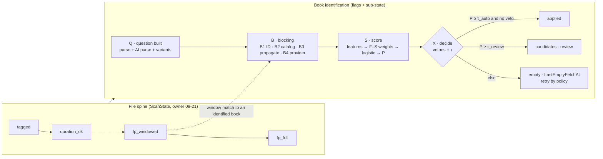

<!-- file: docs/proposals/2026-10-holistic/02-filter-identification-pipeline.md -->
<!-- version: 1.2.0 -->
<!-- guid: 7244e5a7-f9c2-4d5a-9260-ecfcc99e7585 -->
<!-- last-edited: 2026-10-08 -->

# 02 — Filtering, search and the identification pipeline

Analyst: `search`. Reviewed at HEAD `f7211eb39` in the `aorg-holistic` worktree.
This is a planning document only. No code was changed.

Appendices are in [`02-filter-identification-pipeline/`](02-filter-identification-pipeline/):

- [`A-stage-inventory.md`](02-filter-identification-pipeline/A-stage-inventory.md): every
  stage, with its algorithm, complexity, how often it runs, its cache, and its `file:line`.
- [`B-complexity-and-measurements.md`](02-filter-identification-pipeline/B-complexity-and-measurements.md):
  the benchmarks I ran, the derivations, and complexity before and after.
- [`C-goal-bucket-map.md`](02-filter-identification-pipeline/C-goal-bucket-map.md): each
  bucket of missing-metadata books, mapped to the stage that can move it.

**Population figures used throughout.** They are labelled as derived because no production
call was made:
- about 100k book rows and about 40.6k primary books (census of 2026-10-06);
- about 742k `book_file` rows (comment in `internal/audiobooks/filter_duration_test.go:268`);
- about 11,233 books with missing metadata (the figure in the task brief; the 2026-10-06 PM
  census said 11,597).

---

## 1. Summary

1. **The goal of fewer than 1,000 missing is a recall problem, not a decision problem.**
   - The owner counts "fetched but not approved" as not missing.
   - So the auto-apply gate (`applygate`, score floor 0.90) is off the critical path.
   - The stages that move the number are three: the question that gets asked (parse and
     query variants), where candidates come from (blocking), and grouping (fragments).
   - About 4,700 of the missing are chapter fragments. Better scoring or indexing cannot
     move those. Only grouping can (appendix C).
2. **There are at least five separate "identify this book" algorithms, and they do not share a
   scorer, a stopping rule or a cache.**
   - `WalkSourceChain` stops at the first hit.
   - `FetchMetadataForBook` walks the chain and applies.
   - `searchMetadataForBook` fans out query variants across sources and scores them.
   - `metafetch.asin-backfill` runs its own Audible search and its own gate, uncached.
   - `metadata.upgrade` re-runs the full search.
   - Each has its own rules about when it calls a provider.
3. **The harvested Audible author catalog is unused by bulk identification.**
   - `catalog.harvest-authors` stores every Audible title for every library author.
   - Only the interactive "Search again" reads it (`internal/server/handlers/metadata/browse.go:38`).
   - Matching locally, blocked by author, would produce candidates with **zero provider
     calls**. That is the cheapest lever available for the zero-candidate bucket, about 8.9k
     books on 2026-10-05.
4. **The provider response cache is keyed per book, not per question, and empty answers are
   never cached.**
   - Key: `metadata_fetch_cache:<bookID>:<provider>#q<hash>`.
   - Duplicate copies, track rows and re-runs of the same question each pay for their own
     provider call.
   - Every pass over a zero-candidate book asks the providers again.
   - A title change still **deletes** the candidate row (`internal/database/pebble_store.go:3392`).
     That is how 1,180 books lost their candidates on 2026-10-06.
5. **Scores are not probabilities, but the gate treats them as if they were.**
   - The fan-out score is a product of multipliers with no clamp. The comment at
     `internal/metafetch/service_scoring.go:982` says tail scores "routinely 1.5-4.0".
   - `applygate.MinScore = 0.90` (`internal/applygate/applygate.go:56`) is a fixed floor on
     that unbounded scale.
   - "Author missing" is scored ×0.75, so a missing value counts as disagreement.
   - Dedup's noisy-OR treats embedding and metadata-fuzzy as independent evidence, though
     both are derived from the same title and author text.
6. **Two collected signals are still never scored. One older note is out of date.**
   - Windowed fingerprints (`fpwin:`) are written by the Mac workers, but
     `fingerprint.WindowSetSimilarity` has **no caller** outside `internal/fingerprint/`.
     None of the window work reaches a score.
   - Transcription, narrator and file size are still not dedup signals.
   - Chapter structure **is** now scored (`SigChapterStructure`,
     `internal/dedup/collectors_chapters.go:126`), so the 09-21 note is out of date on that
     point.
7. **Library filters are a full scan, a few times per settled keystroke.** Each filter change
   triggers:
   - a page walk, which stops early only for broad filters;
   - a full count walk;
   - a full scoped-facets walk;
   - a full match-set walk for "select all N".

   The search result cache, which already supports incremental patches, is skipped for every
   query with no free text (`internal/audiobooks/service_search_cache.go`, `searchCacheKey`).
   So the most common chip queries get no reuse. Measured at 5k books: 6.2 ms with the
   primary filter only, 21.8 ms with a `library_state` filter added. Scaled linearly to the
   ~100k-row library that is about 0.15–0.55 s per walk (appendix B).
8. **The Review page and the Library run the same grammar on two engines.**
   - The Library runs it in Go with RE2 on the server.
   - The Review page runs it in TypeScript on the client, over a full snapshot, after an
     RE2-to-JS translation.
   - Nothing tests the two for agreement.
9. **Dedup candidate generation still has quadratic blocks.**
   - `BookSignatureScan` compares every pair of signed books (`internal/dedup/engine.go:5012`):
     O(n²/2), parallel but quadratic.
   - Exact-title and duration checks re-fetch the author's whole block once per book. They
     compare every pair from both sides, run Levenshtein before cheap integer checks, and
     **skip every book with no `AuthorID`**, which is a recall hole.
10. **Target.** A per-file and per-book identification state machine: the owner's 2026-09-21
    decision, extended with identification sub-states. Over it run three steps:
    - **blocking**, cheapest source first: ID lookup, local catalog, propagation from
      siblings and fingerprints, then the provider fan-out through a shared query cache with
      negative TTLs;
    - **one calibrated scorer**: Fellegi–Sunter feature weights, then a logistic fit on owner
      decisions;
    - **a probability-space decision**, with the applygate legs kept as vetoes.

    The plan is 15 phased PRs (section 4; PR 5 is split into 5a and 5b). An `ident:` filter makes the goal number a
    clickable, O(1) count.

---

## 2. Findings

Confidence: **H** = verified at HEAD by reading code or by a grep, **M** = verified in code
with an estimated effect, **L** = an inference that needs a production measurement.

### 2a. Filtering and search

| ID | Finding | Evidence | Conf. | Impact |
|---|---|---|---|---|
| F1 | A filter query is a linear walk over memdb. The only index used is `is_primary_version`, or a sort index. `library_state`, review status, metadata-applied and every field filter are in-loop predicates. No posting list exists for any enum field. | `internal/database/memdb_summaries.go:84-200` (index choice), `:406-480` (count walk); `internal/database/memdb_schema.go:26-69` (index list: no library_state or review index) Command: `grep -n 'memIdx' internal/database/memdb_schema.go`. | H | Each walk is O(N_primary) ≈ 40.6k rows. Counts cannot be cheap. |
| F2 | The search result cache is used only when there is free text. `searchCacheKey` returns `false` when `strings.TrimSpace(search) == ""`. Chip and field-filter queries re-walk on every page, every count, every facet request and every "select all". | `internal/audiobooks/service_search_cache.go` `searchCacheKey` (the `TrimSpace(search) == ""` early return); `GetAudiobooksPage` falls through to `queryAudiobooks` | H | 3–4 full walks per settled filter change: page (early exit only when the filter is broad), `CountAudiobooksFiltered`, `ScopedTagFacets`→`MatchingBookIDs`, and select-all. |
| F3 | One filter change costs 6.2 ms (primary only) and 21.8 ms (primary plus `library_state`) at 5k books, measured by `BenchmarkScopedTagFacets_Cold`. The heavy-pushdown branch costs 3.5× the light one even with a trivial predicate. | `go test -run '^$' -bench ScopedTagFacets -benchtime 5x -benchmem ./internal/audiobooks/` (appendix B) | H measured, M scaled | Linear scaling to ~40k primary rows gives ≈ 60–220 ms per walk. At ~100k rows (with `is_primary_version=false`) it is ≈ 150–550 ms per walk, times 3–4 walks. |
| F4 | `BenchmarkOwnerQuery_100k` (50 ms, 123 MB, 560k allocs per pass) measures the **per-row-compiling convenience path** `matchesFieldFiltersRT`, not the production path, which compiles once (`compileFieldFilters`). No benchmark covers the production predicate. | `internal/audiobooks/filter_duration_test.go:237-266`; `internal/audiobooks/service_filtering.go:267-287` ("compiles per call") | H | The only filter benchmark gives an upper bound that does not apply. Regressions in the real path are invisible. |
| F5 | Avoidable per-row work in the compiled path. **(a)** `durationMatches` re-parses the expression for every row: `parseDurationExpr(expr)` in `internal/audiobooks/filter_duration.go:186-190`, although `compileFieldFilter` already validated it and threw the result away (`filter_compiled.go` duration case). **(b)** `matchesCompiledFilters(book database.Book, …)` and `hydrateAuthorSeriesNames` take and return `Book` by value, which BookSummary's own comment sizes at 904 B. **(c)** Every per-user filter does a Pebble `GetUserBookState` per row (`service_filtering.go` predicate). | file:line as cited Command: `grep -n 'parseDurationExpr' internal/audiobooks/*.go`. | H | A constant-factor cost on every walk. (c) is a point read per row. |
| F6 | Stripped fields (`description`, `version_notes`, `book_sig_v1`) cost one Pebble `GetBookByID` for every row that survives the cheap filters. | `internal/audiobooks/service_types.go:210-214`; `service_filtering.go:314-350` (`matchesFieldFiltersWithStrippedFallback`) Command: `grep -n 'strippedMemdbFields' internal/audiobooks/*.go`. | H | `description:/x/` alone means about 40k point reads per walk, times 3–4 walks. Bleve already indexes description but cannot run RE2 over a whole field. |
| F7 | `author:` and `series:` field filters compare only the **denormalized** `Book.AuthorID` name. Co-authors from the `book_authors` junction are not seen. Free-text Bleve and the `author_id=` scope both include co-authors. | `service_filtering.go:376-402` (`buildAuthorSeriesNameMaps` keys on `a.ID` and joins through `AuthorID`); `bookFieldValue` "author" case uses `book.Author.Name` Command: `grep -n 'GetAllAuthors\|AuthorID' internal/audiobooks/service_filtering.go`. | M | `author:x` misses co-authored books. This contradicts the owner's rule that credits are always ordered lists. |
| F8 | No filter exists for identification state (never fetched / empty / candidates / applied) or for `asin`. The owner's goal number is computed by scratchpad scripts, not from the product. | `service_filtering.go:671-685` (`allFilterFieldNames`: has `isbn10`, `isbn13`, `metadata`; no `asin`, nothing about candidates) | H | The goal count cannot be clicked through, against the standing "every count must click through" rule. |
| F9 | Review page versus Library. Review filters the full reviewable index (about 16k rows, derived from the 10-06 fetched-unapproved census) on the client with `compileTitleFilter` (an RE2-to-JS translation). The Library filters on the server with Go RE2. No shared conformance corpus exists, and Review has no debounce, so it re-filters the whole array on every keystroke. | `web/src/components/review/lanes/useMetadataLane.ts:960-975` (full index load), `:1208-1238` (filter chain); `web/src/utils/queryGrammar.ts`; `internal/querygrammar/querygrammar_test.go` (Go-only cases) | H | Drift between the two engines would be silent. That is exactly the "two syntaxes is a trap" failure the owner rejected on 2026-10-06. |
| F10 | Free text plus post-filters over-fetches `searchPostFilterWindow` (10,000) Bleve hits per uncached request, then filters them in Go. Past the window, the count is a logged lower bound. | `internal/audiobooks/service_query.go:253-300` | H | Already mitigated by the result cache on the free-text path. It is a residual cost only on a cache miss or a busy queue. |
| F11 | The handler's `hasFilters` ignores `FieldFilters`, and the heavy-pushdown branch never sets `resultTotal`. A request with field filters only, `show_quarantined=true` and no primary filter therefore reports the whole-library `CountAudiobooks()`. | `internal/server/audiobooks_helpers.go:117-127`; `service_query.go:174` (`resultTotal` set only at `:251`, `:293`, `:736`) | M | Latent: the default UI always sets `ExcludeQuarantined`, so `hasFilters` is true. |

### 2b. Identification pipeline

| ID | Finding | Evidence | Conf. | Impact |
|---|---|---|---|---|
| I1 | **Five identification algorithms.** (1) `WalkSourceChain`: first source with any result wins, keyed per provider (`internal/metafetch/source_chain_walk.go:192`). (2) `FetchMetadataForBook`: chain plus apply (`service_fetch.go:71`). (3) `searchMetadataForBook`: up to 4 variants × sources, scored (`service_search.go:1107`, `search_variants.go:27`). (4) `metafetch.asin-backfill`: its own `SearchIdentities` calls (`internal/plugins/metafetch/asin_backfill.go:809-827`) and its own gate (`asin_match.go`). (5) `metadata.upgrade`: re-runs (3) (`internal/metabatch/upgrade.go` header). | grep `WalkSourceChain(` gives 3 callers; grep `SearchIdentities` | H | A fix to scoring, query parsing or caching lands in one path and leaves the others. The comment at `source_chain_walk.go` header records that this already happened three times. |
| I2 | **The local author catalog is not used by bulk identification.** `catalog.Search` has one non-test caller, the interactive browse handler. `GetEntryByProviderID` (a local ASIN lookup) is not used by the search's ASIN step either. | `grep -rn "catalog\.Search" internal` → `internal/server/handlers/metadata/browse.go:38` only; `internal/database/catalog_entry_store.go:608`. `grep -rn 'GetEntryByProviderID\|internal/catalog"' internal --include='*.go' \| grep -v _test` finds that only the harvest op, the catalog routes, the authority builder and `browse.go` import `internal/catalog`, and that `GetEntryByProviderID` has no caller outside its own file. | H | Every book whose author is harvested could be matched locally. That costs 0 provider calls and no quota. Catalog coverage cannot be measured from here (see Q3). |
| I3 | **The provider cache is keyed per book.** `metadata_fetch_cache:<bookID>:<provider>` (chain walk) and `…:<provider>#q<sha8(query)>` (fan-out variants). An identical question asked for another book, such as a duplicate copy, a track row, a version, or a re-import, misses the cache. | `internal/database/metadata_fetch_cache.go:101-103`; `internal/metafetch/search_fanout.go:162-165` (`variantCacheSource`) Command: `grep -n 'metadata_fetch_cache:\|#q' internal/database/metadata_fetch_cache.go internal/metafetch/search_fanout.go`. | H | Repeated provider calls. On a 301-track book split into one row per track, the same question is asked up to 301 times. |
| I4 | **No negative caching.** `askVariant` writes the cache only `if len(rs) > 0`, and the source comment says "never an empty one". Only the candidate-cache layer records `LastEmptyFetchAt`. | `search_fanout.go:287-299` | H | Each fetch pass over the ~8.9k zero-candidate books re-asks every provider for every variant: up to 4 Audible asks + 2 Open Library asks + Google per book. |
| I5 | **`asin-backfill` duplicates Audible searches.** It searches Audible by title and author for every book with no ASIN, outside the fetch cache, while `candidate-fetch` searches Audible for the same books. | `asin_backfill.go:159-161`, `:809-827`; no `CachedMetadataFetch` reference in the file | H | Doubled Audible spend on the same books every 6 h, limited only by its retry-after marker. |
| I6 | **A title change deletes candidates.** `candidateSearchIdentityChanged` → `stageDeleteIfPresent(metadataCacheKey(id))` runs in the storage layer on any change to `Title`, or to `AuthorID` by name. | `internal/database/pebble_store.go:3392-3400`, `:3496-3510` Command: `grep -n 'candidateSearchIdentityChanged\|stageDeleteIfPresent' internal/database/pebble_store.go`. | H | This is the shape behind the 1,180 rows lost on 2026-10-06 (dated note). The candidates could have been kept as stale and rescored. Instead they are lost, and the providers are asked again. |
| I7 | **The score scale and the gate do not match.** Base F1 (0–1) × author 1.5 × narrator 1.3 × "has narrator" 1.15 × series boost × ASIN 2.0, unclamped ("intentionally NOT clamped", `service_scoring.go:551`; "routinely 1.5-4.0", `:982`). The bulk gate compares that **raw** number with 0.90: `if c.Score < floor` at `internal/applygate/applygate.go:199`, with the floor set at `:56`. No normalization happens between the two. `grep -rn '\.Score = ' internal/metafetch` finds only the LLM-rerank rescale (`service_scoring.go:1001-1005`), which keeps the unbounded scale on purpose. An F1 of 0.60 with an author match (0.60 × 1.5 = 0.90) passes the score leg. | file:line as cited | H | The score leg filters almost nothing. The evidence leg (`CheckEvidence`) does the real work, and it is a hand-tuned rule set. |
| I8 | **Missing values are scored as disagreement.** `"Author missing" ×0.75` (`service_search.go`, the `bookAuthor != ""` branch); `"No narrator" ×0.85`. | grep `Author missing` in `internal/metafetch/service_search.go` Command: `grep -n 'Author missing\|No narrator' internal/metafetch/service_search.go`. | H | Open Library and Google rows, which have no narrator by construction, are pushed down whatever their title match. Fellegi–Sunter models "missing" as its own level. |
| I9 | A calibration harness exists, but it measures **top-1 accuracy of a re-implementation** of the scorer. It does not measure probability calibration, and it states the circularity bias itself. | `internal/plugins/metafetch/calibrate_scoring.go:1-55` | H | Useful as a test harness, but it cannot produce a confidence. |
| I10 | **Window fingerprints are collected and never compared.** `fingerprint.WindowSetSimilarity` has no production caller. The dedup acoustid collector reads head prints only. | `grep -rn WindowSetSimilarity internal --include=*.go \| grep -v _test` → only `internal/fingerprint/*`; `internal/dedup/collectors_acoustid.go` (no window reference) | H | All the Mac decode time on windowed prints produces no signal. It is also the natural evidence for linking fragments to their parent. |
| I11 | Transcription, narrator and file size are still not unified dedup signals. Chapter structure now is. | `grep SigTranscript\|SigNarrator\|SigFileSize` → none; `internal/dedup/unified/score.go:70` (`SigChapterStructure`) | H | Corrects `project_signals_collected_but_never_scored` for chapters. |
| I12 | **`BookSignatureScan` is O(n²/2)** over books that have a signature. It is sharded across workers but has no LSH banding. | `internal/dedup/engine.go:5012`+ (nested `for j := i + 1`) | H | At 40k signed books that is 8×10⁸ masked Hamming compares. Book signatures stay garbage until the re-fingerprint (dated note), so this compares noise today. |
| I13 | **Exact-title and duration checks block on author, inefficiently.** Each book calls `GetBooksByAuthorIDCore` itself, twice (title and duration), and compares against every other book in the block. Each pair is therefore evaluated from both sides. `allNormalizedTitleForms(other)` is recomputed for every (book, other) pair. Levenshtein runs before the cheap series-number check. | `internal/dedup/engine.go:1661-1720` (`checkExactTitle`), `:1794-1880` (`checkDurationMatch`) Command: `grep -n 'GetBooksByAuthorIDCore\|allNormalizedTitleForms' internal/dedup/engine.go`. | H | Work is 2 × 2 × Σₐ kₐ² × forms². One prolific or junk author with k in the thousands dominates the run. |
| I14 | **Books with no `AuthorID` never get title or duration dedup.** Both checks return early on `book.AuthorID == nil`. | `engine.go:1662`, `:1795` Command: `grep -n 'book.AuthorID == nil' internal/dedup/engine.go`. | H | A recall hole. The scale is roughly 5,756 books with no author link, a figure derived from the author-data note and not measured at HEAD. Those books are only reachable through embedding top-K or LSH. |
| I15 | **Noisy-OR double-counts correlated text evidence.** `SigEmbedHigh` and `SigMetaFuzzy` are both functions of title and author, but `ComposeScore` multiplies their complements as if they were independent. | `internal/dedup/unified/compose.go` (noisy-OR loop) | M | Inflated dedup confidence on text-only pairs. That is the shape of the "same title, different book" false positive. |
| I16 | **A scheduled candidate fetch exists now.** `candidate_fetch`, every 6 h, selects unfetched or invalidated books. It is one stage polled on a timer, not a pipeline. | `internal/scheduler/tasks.go:71-92`, `:717-781` | H | It closes the "613 never fetched" bucket. A book still waits up to 6 h. The 6 h tick re-reads the library to find its work. |
| I18 | **Scores are computed and then discarded.** Fan-out candidates at or below `minScore` are dropped with only a debug log (`internal/metafetch/service_search.go:1351-1355`). Dedup pairs that score below `BandReviewMin` get band `""` and are not persisted (`internal/dedup/unified/compose.go`, `bandFor`). Command: `grep -n 'score <= minScore' internal/metafetch/service_search.go`. | H | These rows are exactly the negative examples that a Fellegi–Sunter or Platt fit needs. PR 9 persists a sampled shadow copy, `matchscore:neg:`, capped and with a TTL, so calibration has true negatives. |
| I17 | The global 10 rps limiter mentioned in the 09-30 note is gone. The gate is now the sum of the enabled sources' budgets, and the worker count is derived (`metadata_candidate_op.go:425-470`). | file:line | H | Out-of-date note, corrected. Audible at 8/s is now the real bound. |

---

## 3. Proposed specification

### 3.1 Principles

1. **Ask each question once per TTL, across the whole library.** A provider answer belongs to
   the *question*, not to the book.
2. **Generate candidates from the cheapest source first**, the way a query planner applies
   its most selective predicate first: an identifier lookup, then the local catalog, then
   propagation from a sibling or a fingerprint match, then a live provider call.
3. **One scorer and one probability.** Every path (bulk, single, upgrade, ASIN backfill) calls
   the same `Score(book, candidate) → P(match)`.
4. **Decisions are thresholds on P, and the hard vetoes stay vetoes.** The four applygate legs
   remain. Only the score leg changes, from 0.90 on an unbounded scale to τ on a calibrated one.
5. **State is an index, and every handler re-derives it.** This is the owner's 2026-09-21
   rule, and it holds here unchanged.

### 3.2 Pipeline (target)

**Book identification sub-state.** This is a book flag group, not a chain, which matches the
owner's ruling that "provider matching is a branch, never a gate":

`ident ∈ {unasked, asked_empty, has_candidates, applied, held}`, plus `ident_reason` (for
example `no_usable_title`, `fragment`, `manual_only`, `quota_deferred`) and `ident_question_fp`
(the search fingerprint the state answers).

- **Stored as an index** and re-derived by the handler from the candidate cache and the
  book's `MetadataReviewStatus`.
- **Maintained by write-through**, so a count is O(1): a counter per state, updated in the
  same batch as the change.
- **Filterable** with `ident:` in the Library and Review grammar. **This is the goal number.**

**The driver.** `identification.advance` is a low-priority continuous op. It drains a durable
dirty set (`ident:dirty:<bookID>`), using the same pattern as the search index's dirty-set
reconciler (`idx:sidx:dirty:`) that already works in production. Writers mark books dirty:
- a scan that changes a book's identity fields;
- a new primary book;
- an applied merge;
- a fetched catalog harvest for that book's author.

The 6-hour `candidate_fetch` tick becomes the safety net instead of the trigger. The driver
should be an ops-v3 pipeline; section 6 lists what it needs from workstream 05.

### 3.3 Stage specs

**Q — Question construction.** Unchanged in substance: `resolveSearchInputs`,
`ResolveCandidateSearchQueryMemo` and `buildQueryVariants`. Three changes:
- **One function builds the question for all five algorithms (I1).** It returns `Question{
  titles[], author credits[], narrator, series, position, asin, isbn, runtime, fp }`.
- `fp` is the existing search fingerprint (`searchInputs.fingerprint`). It is the cache key
  for every stage below.
- The folder parse (`foldernames`) supplies a variant whenever the stored title is a person's
  name or equals the author. Census bucket "author==title", about 1,272 books.

**B — Blocking and candidate generation.** Each sub-stage records what it produced, and a
later sub-stage runs only if the earlier ones produced no candidate with P ≥ τ_strong. This is
the "strong match stops the fan-out" rule (`poolHasStrong`, `search_fanout.go:223`), applied
across all sources.

| Sub-stage | Index used | Cost per book | Provider calls |
|---|---|---|---|
| B1 Identifier | `CatalogStore.GetEntryByProviderID` (local); otherwise a global per-ASIN product cache `pcache:asin:<ASIN>` | O(1) point read | 0 on a hit |
| B2 Local catalog | `cat_author:name:<fold>` exact key (`catalog_entry_store.go:563`). For each author credit, titles in that block are scored with trigram Jaccard on folded titles, then a bounded Levenshtein on the top few. Bulk use must not take the substring fallback walk (it scans every author key), so B2 requires an exact folded-credit key or an `author_alias` hit. | O(k_author) titles per credit, typically under a few hundred (`SearchLimit`) | 0 |
| B3 Propagation | Version group (`memIdxVersionGroupID`), exact file hash, and the window-print inverted index (new, §3.5). An already-identified book's applied candidate is offered to the unidentified copy as a candidate (never auto-applied without the vetoes). | O(1)–O(log n) | 0 |
| B4 Provider fan-out | Today's `runSearchFanout`, with every ask going through the **query-keyed cache** (§3.4) | Up to 4 variants × sources, until the first strong match | Only on a cache miss |

**S — Scoring (one scorer).**

- **Features.** Each one is discretized into levels, and `missing` is always its own level:

  | Feature | Levels |
  |---|---|
  | title similarity | exact / ≥0.9 / ≥0.7 / ≥0.5 / lower, by token-F1 or Jaro–Winkler, the larger of the two |
  | author | agree / co-author-agree / narrator-swap / disagree / missing |
  | narrator | agree / disagree / missing |
  | series name | agree / disagree / missing |
  | series position | equal / differ / missing |
  | runtime ratio | the existing `durationTier` bands, plus missing |
  | ASIN | equal / conflict / missing |
  | transcription | confirms / contradicts / missing |
  | source | the rank from `source_rank.go` |
  | B-stage of origin | B1 / B2 / B3 / B4 |

- **Weights.** Fellegi–Sunter: for each feature level, `w = log(m/u)`.
  - m and u are estimated by EM over the candidate cache: about 28k books with candidates,
    derived from the 10-06 census (applied plus fetched-unapproved).
  - Seeds come from labelled pairs:
    - positives: books whose `MetadataSourceHash` equals a cached candidate's hash;
    - negatives: `LoadRejectedCandidateKeys` (`internal/metabatch/candidates.go:433`) and the
      owner's manual overrides.
- **Calibration.** `P = σ(a·Σw + b)`, a Platt fit on the labelled pairs. Use isotonic
  regression instead if the reliability diagram is not monotone.
  - The fit reports expected calibration error and a reliability table, split into the
    manual segment and the auto segment. This reuses the existing harness's circularity
    segmentation (`calibrate_scoring.go`).
  - **Circularity guard:** labels chosen by today's scorer get a lower weight. The manual
    segment is the acceptance set.
- **The LLM reranker** (`RerankTopK`) becomes one more feature, `llm_score_bucket`, instead of
  rescaling scores in place.

**X — Decision.** Two thresholds, both in probability space and both set by the owner (Q1):
- **auto-apply:** `P ≥ τ_auto` and every applygate veto passes. `CheckSequence`,
  `CheckEvidence`, identity, review-only source and manual-only are unchanged.
- **review:** `P ≥ τ_review`. This threshold is what moves the goal number. It must be low
  enough to keep a plausible candidate in front of the owner, and high enough that the review
  queue stays useful.

  The suggested way to choose it is precision at a fixed recall on the manual segment.

### 3.4 Cache policy

| Layer | Key | Value | TTL | Invalidation |
|---|---|---|---|---|
| P1 provider answer | `pcache:q:<provider>:<endpoint>:<sha256(normalized question)>` | Raw results, including **empty** | Positive: `MetadataFetchCacheTTLDays` (today's knob). Negative: per provider (suggest 14 d for Audible and Audnexus, 30 d for Open Library, 7 d for Google). Errors are **never** cached. | TTL, or a manual bust |
| P2 product by id | `pcache:asin:<ASIN>` / `pcache:isbn:<ISBN>` | Product | 30 d | Re-harvest |
| C book candidates | `metadata_cache:<bookID>` (today's) plus `question_fp` | The scored candidate list | No TTL. **Stale** when the book's question fingerprint changes. | Becomes **stale, not deleted** (replaces I6). The driver rescores it from P1/P2 with no provider call; only a missing P1 entry costs a call. |
| L local catalog | `cat_*` (today's) | Harvested entries | The harvest's own 30-day due rule | `MarkUnseen` (today's) |

- The book-scoped `metadata_fetch_cache:<bookID>:…` rows become **pointers**
  (`bookID → [P1 keys]`) during migration. Readers try P1 first and fall back to the legacy
  per-book row. This follows the same "read old, write new" convergence pattern
  `CachedMetadataForProvider` already uses (`metadata_fetch_cache.go:105-120`).
- **Quota-aware scheduling.** A day-quota provider (Google, 1,000 per day) gets a daily
  budget. The driver spends it on the books with the highest expected gain, which is
  `P(no Audible match) × P(Google answers)`, estimated per `ident_reason` bucket.

### 3.5 Index structures

| Need | Structure | Why this one | Size at this scale |
|---|---|---|---|
| Enum filter fields (library_state, review status, `ident`, has_cover, metadata applied, quarantine, primary) | Per-value posting lists as **roaring bitmaps** over a dense book ordinal, maintained in the memdb write-through | Intersection of the most selective lists first is O(N/64) per AND, with popcount for counts. That turns the count walk into microseconds. | ~100k ordinals: a few KB per value |
| Field text filters (title, author credits, narrator, series) | **None new.** RE2 full scan over the survivors of the bitmap intersection | At 40k primary rows, with an assumed ~40 B average title, that is about 1.6 MB of text. RE2 over that should take single-digit ms. This is derived, not measured; PR 1 adds the benchmark. A trigram index in codesearch style pays off only at 10⁶+ docs or with long fields. | — |
| `description:` regex | Route plain words to Bleve (already indexed). Run a regex as a bounded-concurrency verify over survivors, never over 40k point reads in one goroutine. | Avoids the per-row Pebble read in F6 | — |
| Filter-only result reuse | Extend `searchcache` to queries with no free text, so one evaluation serves page, count, facets and select-all, with incremental patches from the change log | The cache already exists, with patching, singleflight and byte caps | 128 MiB cap today |
| Author catalog title match (B2) | Exact folded-credit key, then an in-block trigram set per entry (computed on read; k is small) | Blocking on author makes the block small. A global title index is not needed. | — |
| Window-print candidate generation | An inverted index `fpwinidx:<band>:<hash> → fileID`, built by **MinHash/LSH over each window's 32-bit sub-fingerprint values** (b bands × r rows). It mirrors the existing head-print `fpidx` (`internal/database/pebble_store_lsh.go`). | Candidate pairs in O(n·b), followed by `WindowSetSimilarity` for verification | ~742k files × windows × b bands of key-only rows. Size it in PR 11. |
| Book-signature pairs (I12) | LSH banding over the masked signature bits (SimHash-style bands), replacing the nested loop | O(n·b + candidate pairs), instead of O(n²) | — |
| Title dedup without an author (I14) | A sorted-neighbourhood block on `normalizeTitle(title)` prefix plus duration bucket, or a **SymSpell** delete-dictionary at d≤2 over normalized titles | Restores recall without going quadratic | ~40k titles × deletes at d≤2 |

### 3.6 Complexity before and after (derived; details in appendix B)

| Operation | Before | After |
|---|---|---|
| Library filter change (page + count + facets + select-all) | 3–4 × O(N_primary) predicate walks, with each stripped-field row doing a Pebble read | 1 × O(N/64) bitmap AND, plus O(survivors) residual predicate, served from the result cache with O(Δ) patches |
| Count of "missing metadata" (the goal) | An offline script over every cache row | O(1) counter |
| Provider calls per bulk pass over the zero-candidate books | ≈ 8.9k books × (≤4 Audible + ≤2 Open Library + Google) per pass, repeated every pass | Calls only for questions not yet in P1, plus negative-TTL expiries. A repeat pass inside the negative TTL costs 0 calls. |
| Retitle → candidates | Deleted, so a provider call is needed | Kept as stale and rescored from P1/P2, so 0 calls when the question is unchanged |
| `BookSignatureScan` | O(n²/2) ≈ 8×10⁸ at n = 40k | O(n·b) + pairs, ≈ 10⁶ for b ≈ 20 |
| Exact-title and duration dedup | 4 × Σₐ kₐ² × forms² Levenshtein | Σₐ kₐ²/2 cheap integer prefilter, then bounded Levenshtein (Ukkonen, cutoff 3 or 6) on survivors, with forms memoized O(k) |

---

## 4. Implementation plan

Phases are ordered by goal impact per unit of risk. Sizes are S under 300 lines, M 300–1,000
and L over 1,000. Every PR also adds a `changelog.d/` fragment (headerless) and updates
version headers.

### Phase 1: quick wins with no behaviour change

**PR 1 (S): measure the real filter path.**
- Files: `internal/audiobooks/filter_duration_test.go` (keep the old benchmark, renamed
  `…_ConveniencePath`); a new `internal/audiobooks/filter_compiled_bench_test.go`
  (`BenchmarkCompiledPredicate_100k`, `BenchmarkHeavyPushdownWalk_40kPrimary`).
- Tests: the benchmarks themselves, plus a test that fails if the production path ever calls
  `mustCompileForPredicate` per row.
- Rollback: revert.

**PR 2 (S): remove per-row waste (F5).**
- Files: `internal/audiobooks/filter_compiled.go` (store the parsed `durationExpr` on
  `compiledFilter`); `internal/audiobooks/filter_duration.go` (`durationMatchesExpr(b, e, rt)`);
  `internal/audiobooks/service_filtering.go` (pointer receivers for
  `matchesCompiledFilters`, and `hydrateAuthorSeriesNames` writes into a reused scratch
  `Book`).
- Tests: the existing conformance tests plus PR 1's benchmarks, before and after.
- Rollback: revert.

**PR 3 (S): one grammar, two engines, one corpus (F9).**
- Files: new `internal/querygrammar/testdata/conformance.json` (pattern, input, expected,
  error); `internal/querygrammar/querygrammar_test.go` (reads the corpus);
  `web/src/utils/queryGrammar.test.ts` (reads the same JSON); a 150 ms debounce on the Review
  title field in `web/src/components/review/QueueRail.tsx`.
- Tests: both suites run on the same corpus.
- Rollback: revert.

### Phase 2: make the goal measurable, and stop losing work

**PR 4 (M): `ident` state index with `ident:` and `asin:` filters (F8).**
- Files: new `internal/database/ident_state.go` (derive, counters, dirty set);
  `internal/database/pebble_store_metadata_cache.go` (write-through on put and delete);
  `internal/database/pebble_store.go` (write-through on review-status change);
  `internal/audiobooks/service_filtering.go` (`bookFieldValue` cases `ident` and `asin`, plus
  `allFilterFieldNames`); `web/src/utils/searchParser.ts` and the help text in `web/src/components/audiobooks/SearchBar.tsx`;
  `internal/server/handlers/metadata_cache.go` (summary counts read the counters).
- Tests: the counter equals a full recount on randomized fixtures; a filter test for each
  state.
- Rollback: revert. The index is derived and rebuilds on boot.

**PR 5a (S): the gate refuses stale rows (ships first).**
- Files: `internal/metafetch/cache.go` (a `Stale` flag on `MetadataCandidateCache`, and
  readers treat stale as "rescore, do not apply"); `internal/applygate/applygate.go` (a
  stale row fails `identity_stale`); `internal/server/metadata_ops.go`
  (`unfetchedCandidateBookIDs` selects stale rows).
- Tests: a row flagged stale is never bulk-applied and is selected for refetch.
- Rollback: revert. No rows are flagged until PR 5b lands.

**PR 5b (S): stale, not deleted, on retitle (I6).**
- Files: `internal/database/pebble_store.go` (the `candidateSearchIdentityChanged` caller
  stamps `Stale=true` and the old `question_fp`, instead of calling `stageDeleteIfPresent`).
- Tests: a retitle keeps the row and marks it stale; the bulk apply refuses it; a refetch
  replaces it.
- Rollback: revert 5b alone. 5a stays, so the reader still honours the flag on rows already
  marked. If 5a must also go, first run a one-shot cleanup that deletes the rows flagged
  stale. That restores the old behaviour exactly.

**PR 6 (M): query-keyed provider cache with negative TTL (I3, I4, I5).**
- Files: `internal/database/metadata_fetch_cache.go` (P1/P2 keys and a negative-entry
  type); `internal/database/keyfamilies.go` (`pcache:` family);
  `internal/metafetch/search_fanout.go` (`askVariant` and `cachedLookupASIN` read and write
  P1/P2, and cache empty answers); `internal/metafetch/source_chain_walk.go` (same);
  `internal/plugins/metafetch/asin_backfill.go` (route `SearchIdentities` through P1);
  `internal/config/config.go` (per-provider `negative_ttl_days`).
- Tests: the same question from two books makes one live call; an empty answer is replayed
  inside its TTL; an error is never cached; legacy per-book rows are still read.
- Key safety: the P1 key hashes **every parameter of the provider call**:
  - provider id, endpoint and region/marketplace;
  - title and author for `SearchByTitle` and `SearchByTitleAndAuthor` (these are the only
    calls `askVariant` makes);
  - the full `SearchContext` (ISBN, series, narrator) for `SearchByContext`, which
    `FetchMetadataForBook` uses (`internal/metafetch/service_fetch.go:188-189`).

  A key that omitted context fields would serve one book another book's answer.
- Rollback: a config flag `metadata_fetch.shared_cache=false` restores per-book keys.

### Phase 3: candidate recall for the goal

**PR 7 (M): local catalog blocking stage, B1 and B2 (I2).**
- Files: `internal/catalog/search.go` (bulk `MatchBook(question) []BookMetadata`, exact key
  only); `internal/database/catalog_entry_store.go` (an `EntriesForAuthorKey` exact-only
  variant); `internal/metafetch/service_search.go` (a B1/B2 stage ahead of
  `runSearchFanout`, with candidates tagged by stage of origin);
  `internal/server/metadata_candidate_op.go` (per-run counters: candidates from the catalog
  versus providers).
- Tests: a synthetic catalog plus a book with a literal series-decorated title yields a
  candidate with zero provider calls; a homonym author produces no cross-match (reuse
  `disambig.go`).
- Rollback: a config flag `metadata_fetch.catalog_stage=false`.

**PR 8 (M): window-print index plus a `SigWindowAcoustID` signal plus fragment containment
evidence (I10).**
- Files: `internal/database/fingerprint_window.go` (`fpwinidx:` write-through on window
  save); new `internal/dedup/collectors_window.go`; `internal/dedup/unified/score.go` and
  `config.go` (the new kind and its weight); `internal/dedup/store.go` (interface);
  `internal/plugins/maintenance/fragment_consolidation_fixer.go` (the fragment fixer reads
  containment as extra evidence; the owner-approval-by-id flow is unchanged).
- Tests: synthetic window sets with the same and different content; the provenance mismatch
  stays incomparable.
- Rollback: the signal weight set to 0 in config.
- No server decode: the prints already exist.

### Phase 4: one scorer and calibrated confidence

**PR 9 (L): the `matchscore` package.**
- Files: new `internal/matchscore/features.go`, `weights.go` (Fellegi–Sunter m/u tables,
  versioned), `calibrate.go` (Platt and isotonic, ECE), `matchscore_test.go`;
  `internal/plugins/metafetch/calibrate_scoring.go` (fits and reports, writes no config);
  `internal/metafetch/service_search.go` (computes `P` alongside today's score and stores
  both on `MetadataCandidate`; **shadow mode**).
- Tests: weights recovered from synthetic labelled data; ECE on a held-out split; a golden
  test that shadow mode does not change ranking.
- Rollback: shadow mode has no effect on decisions.

**PR 10 (M): decide on P.**
- Files: `internal/applygate/applygate.go` (`ScoreGate` uses `P ≥ τ_auto` when present;
  vetoes unchanged); `internal/metabatch/upgrade.go` and
  `internal/plugins/metafetch/asin_match.go` (call `matchscore`); `internal/config/config.go`
  (`tau_auto`, `tau_review`).
- Tests: the existing applygate suites pass with P provided; a regression corpus of
  owner-rejected pairs never auto-applies.
- Rollback: `scoring.mode=legacy`.

### Phase 5: dedup blocking

**PR 11 (S): exact-title and duration blocking (I13, I14).**
- Files: `internal/dedup/engine.go` (`checkExactTitle` and `checkDurationMatch` take a
  per-author block prepared once per author in `FullScan`, compare i<j once, memoize forms,
  run the integer prefilters first, and use a bounded Levenshtein; a new no-author block
  keyed on normalized title prefix plus duration bucket).
- Tests: `engine_fullscan_layer1_parallel_test.go` stays green, and candidate sets are
  identical to serial on fixtures, apart from the added no-author pairs.
- Rollback: revert.

**PR 12 (M): `BookSignatureScan` LSH (I12).**
- Files: `internal/dedup/engine.go` (`BookSignatureScan`); `internal/fingerprint/lsh.go`
  (`BookSigBands`).
- Tests: recall ≥ 0.99 against brute force on synthetic signatures at the
  `FuzzyMinSimilarity` threshold.
- Rollback: a config flag selects brute force.
- Gate: run this only after the re-fingerprint, per the dated note.

**PR 13 (S): correlated text evidence in noisy-OR (I15).**
- Files: `internal/dedup/unified/compose.go` (group `SigEmbedHigh`, `SigEmbedMedium` and
  `SigMetaFuzzy` into one "text" factor using the max within the group);
  `internal/dedup/unified/config.go`; `FormulaVersion` bumped to `noisy-or-v2`.
- Tests: `compose_test.go` tables.
- Rollback: revert. **Bumping `FormulaVersion` triggers a corpus-wide rescore**, which the
  owner must schedule.

### Phase 6: orchestration

**PR 14 (L): `identification.advance` driver.** This depends on workstream 05.
- Files: `internal/database/scan_state.go` (per-stage `StageStatus` with `omitzero`, as in
  the owner-approved Part II); new `internal/plugins/identification/advance.go` and
  `register.go`; `internal/scheduler/tasks.go` (`candidate_fetch` becomes the safety-net
  tick); the dirty-set marks in `internal/scanner/scanner.go` (`applyScannerFields`, `:4753`),
  `internal/merge/service.go` (`MergeBooks`) and
  `internal/database/pebble_store_metadata_cache.go` (cache writes).
- Tests: drift re-derivation; a surfaced file does not block its book; dirty-set drain under
  restart.
- Rollback: disable the op. The 6-hour tick still runs.

---

## 5. Risks and what must not break

- **The bulk-apply gate's vetoes.** PR 10 changes only the score leg. Identity, sequence,
  evidence, review-only source and manual-only must pass their existing suites unchanged.
  Bulk apply still requires a dry run, then a list, then owner approval by id.
- **The stale-not-deleted change** is split into PR 5a (the gate refuses stale rows, ships
  first) and PR 5b (stop deleting). Reverting 5b alone is safe. Reverting 5a needs the
  stale-row cleanup first. Otherwise a retitled book could have a candidate for its old
  identity applied.
- **The shared cache (PR 6)** must not share a P1 entry across marketplaces, languages or
  search contexts. The key hashes every call parameter, `SearchContext` included. Errors and throttle responses are never
  cached; that is the silent-failure shape in the 09-03 quota incident.
- **Negative TTLs** delay rescue after a provider adds a title. That is why the per-provider
  values are owner-visible config, and why there is a manual bust per book.
- **The catalog stage (PR 7)** must not cross homonym authors. It uses only exact
  folded-credit keys and the existing `disambig.go` author-ASIN resolution.
- **`FormulaVersion` bump (PR 13)** forces a rescore of every candidate pair. Schedule it,
  and never run it alongside a scan.
- **Bans honoured.** No server decode (window prints already exist, and PR 8 only compares
  them). No iTunes writes. No `book_file` deletes. The scan ConcurrencyKey is untouched. The
  `internal/writeback/` package is untouched.
- **Search index.** No mapping change is proposed. Any future one must go through the marker
  file and coverage-seeded rebuild (`search_coverage.go`), never the empty-index bulk build.

## 6. Dependencies on other workstreams

- **05 (ops v3).** `identification.advance` should be an ops-v3 *pipeline*. It needs:
  1. stage handlers declared with data prerequisites per subject (the unused
     `ReqOpCompleted`/`ReqFieldSet` idea, done right);
  2. a durable per-subject dirty-set source instead of "select all books" (the
     `idx:sidx:dirty:` pattern);
  3. per-provider budget tokens shared across ops (candidate-fetch, asin-backfill and catalog
     harvest all spend Audible's 8/s today, coordinated only through `DependsOn` mutual
     exclusion);
  4. a "surfaced" terminal state per subject, with a reason, that the UI can count.

  The assumption, if 05 does not provide these: PR 14 ships as a v2 op with its own dirty
  set, and migrates later.

  I tried to send this list to `opsv3` on 2026-10-08, but no agent by that name was
  reachable. The coordinator should pass it on.

  *Coordinator (08): relayed and resolved in 05 §3.9 v1.2.0. (1) is met. (2) is added as `ops.DirtySet`. (3) names the existing process-wide provider limiter instead of adding a second one. (4) lives in this doc's `ident_reason` index, not in run state. PR 14 ships first as a v2 op, using the fallback above, so the goal does not wait for ops v3.*
- **03 (dedup page retirement).** PRs 8, 11, 12 and 13 change dedup candidate sets and
  scores. Parity tests in 03 should pin the candidate set **before** these land, or be
  re-baselined afterwards. The fragment-containment evidence in PR 8 would feed the Review
  page's fragment fixer.
- **07 (design decisions).** The `pcache:` key family, the roaring-bitmap index in memdb,
  and moving candidate-row deletion out of the storage layer (PR 5) are design-level changes.
  Workstream 07 should rule on whether storage-layer side effects (delete on write) belong in
  the store at all.
- **01 (legacy and dead code).** Once PRs 9 and 10 land, `WalkSourceChain` and
  `FetchMetadataForBook` become thin wrappers over one search, which is a dead-code
  candidate for 01. `BenchmarkOwnerQuery_100k` is misleading as it stands (F4).
- **04 (operations census).** `library.bulk-metadata-fetch`, `metadata.candidate-fetch`,
  `metafetch.asin-backfill` and `metadata.upgrade` overlap (I1). The census should list them
  as one family to merge into the driver.

## 7. Open questions for the owner

| # | Question | Recommended answer |
|---|---|---|
| Q1 | What should τ_auto and τ_review be, as calibrated probabilities? | Shadow mode first (PR 9) for two weeks. Then **τ_auto = 0.98** (at most 1 wrong apply in 50 on the manual segment) and **τ_review = the lowest P whose review-queue precision on the manual segment is ≥ 0.5**. The goal counts reviewable candidates, so τ_review is the threshold that matters. |
| Q2 | Negative-cache TTL per provider? | Audible and Audnexus 14 d, Open Library 30 d, Google 7 d (its quota makes asking again expensive anyway, so a short TTL lets the budget planner choose). There is a per-book "search again" bust. |
| Q3 | May candidate-fetch use the harvested catalog before asking Audible, as review-only candidates first? | **Yes.** Catalog candidates start review-only, like Open Library and Google today, until the calibration shows that B2-origin candidates are as precise as B4 ones. Catalog coverage of the missing books should be measured on production first: the share of missing books whose author has a harvested catalog. |
| Q4 | A retitle should mark candidates stale instead of deleting them. Agreed? | **Yes.** It is the root shape of the 1,180-row loss. Stale rows are never applied, only rescored. |
| Q5 | Should `author:` filter on every credited author, not only the primary one (F7)? | **Yes.** It is consistent with the 10-04 "credits are always ordered lists" rule and with Bleve free text. |
| Q6 | Should window-print similarity become a dedup signal and fragment-to-parent evidence? | **Yes, at a supporting weight**, until a calibration on the owner's merge decisions sets a primary weight. |
| Q7 | Should the Review page's filtering stay client-side? | **Yes for now**, with the shared conformance corpus (PR 3). Move it server-side only if the snapshot grows past what the client can filter in under 50 ms. |
