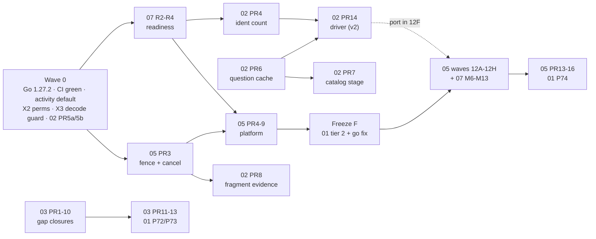

<!-- file: docs/proposals/2026-10-holistic/08-integrated-roadmap.md -->
<!-- version: 1.0.0 -->
<!-- guid: f3d3677e-6cfb-45d6-a87e-a81fdbaaaefa -->
<!-- last-edited: 2026-10-08 -->

# 08: Integrated roadmap

- **Author:** `coordinator`.
- **HEAD:** `f7211eb39`.
- **Scope:** planning only. No code was changed and no git state was changed.
- **Inputs:** docs 01 to 07 and their appendices, re-read after the analysts finished, plus spot checks against the code at HEAD.
- **Appendix:** [`08-integrated-roadmap/collision-matrix.md`](08-integrated-roadmap/collision-matrix.md), the full file-collision matrix generated by script.

## 1. Executive summary

1. **The seven plans fit together as one program.** It has about 206 planned PRs in five waves, plus three open-ended series of small PRs. The overlap between plans is mostly the same work described twice, not real conflict. Each overlap now has one owner (§3).
2. **Safe fixes come first, in "wave 0," all small:**
   - the Go 1.27.2 security update, confirmed released today;
   - a green CI on `main`;
   - the activity-storage default that could silently send prod back to the retired backend;
   - backup files possibly deleted too early;
   - a "running operations" list that is always empty.
3. **New security gap, found while checking the census.** About three-quarters of all operations (147 of 198) declare no permission. Any editor account can start them from the generic "run operation" endpoint, including ones that delete or retire data. One small PR closes this in wave 0 (X2).
4. **New ban risk.** Three existing jobs can still decode audio on the server if someone presses the button: fingerprint rescan, intro transcription and WAV clip extraction. Only one fingerprint job has a "Macs only" guard today. A small PR adds the same guard to the other three (X3).
5. **The two scheduling checks are safe.** The orphan-file report cannot delete or change file rows, so it can go on the nightly schedule. The "repair library state" op is not the banned fix-library-states job. That job was deleted in September, and no plan proposes running or scheduling either one.
6. **Metadata goal (fewer than 1,000 books missing metadata; about 11,233 today).** The number does not move through better scoring. It moves through three levers:
   - grouping chapter fragments, about 4,700 books;
   - asking providers better questions and caching the answers;
   - matching against the Audible author catalog you already harvested, which costs no provider calls.

   Waves 1 and 2 carry these levers (§6). The goal number also becomes a clickable count early, in wave 1.
7. **Stop losing work first.** Renaming a book today deletes its fetched candidates; that is how 1,180 were lost on 2026-10-06. A two-PR fix keeps them as "stale" instead. It is in wave 0.
8. **The operations rebuild (ops v3) is the longest track.** It takes about 29 PRs. It keeps the proven job runner and replaces only how jobs are written, and it is built so the library scan keeps a single lock. The goal work does not wait for it: the identification driver ships first on the current system.
9. **About 15,900 lines of dead production code can go, measured by 01.** About 4,700 of them are safe now. The rest are tiered behind per-item checks or your decisions. The old `/dedup` page retires only after its 45 missing capabilities have a home in Review.
10. **Three items were "owned by someone else" in every doc, so nobody planned them:**
    - the stale `Book.FilePath` field (483 code references), now 07-S6;
    - about 700 lines of dead dedup merge code, now 01 P73;
    - the last of the old v1 operations table, now 01 P74.
11. **Collision hotspots** are `pebble_store.go`, the frontend `api.ts`, `server_lifecycle.go`, the scheduler task file, the maintenance plugin registry, `config.go` and the fragment fixer. PRs that touch them merge one at a time, in the order in §5.
12. **The two biggest refactors are merged into one track.** 07's split of the 78k-line maintenance package happens inside 05's port waves, so each operation moves once.
13. **The `go fix` modernization (997 hunks in 364 files) runs in one quiet window.** It goes after the dead-code deletions, so it rewrites less code and does not collide with other work.
14. **There are 51 decisions for you in §7, merged from about 60 questions across the seven docs.** Each has a recommended answer. Twenty-two of them block a wave-0 or wave-1 PR.
15. **Rough effort:** about 320 engineer-days of planned PRs, using a rule of thumb, not a measurement (§8). Of that, ops v3 is about a third and dead-code removal about a sixth.

## 2. Coordinator checks a to h

### a. `maintenance.orphan-book-files-cleanup` on a schedule (05 Q2, 04 Q2)

**It cannot delete or modify `book_file` rows. The recommendation stands.** Proof at HEAD:

1. `runOrphanBookFilesCleanup` (`internal/plugins/maintenance/orphan_book_files.go:59-93`) uses the store only to call `findOrphanBookFiles(ctx, store)`, then logs. It makes no other store call.
2. `findOrphanBookFiles` takes an `orphanFileScanner` (`internal/plugins/maintenance/store_slices.go:205-209`). That interface has exactly three methods, all reads: `GetAllBookFilesCore`, `GetAllBooksCoreComplete` and `ListSoftDeletedBooks`.
3. `{"delete": true}` returns an error before any read (`orphan_book_files.go:66-68`). The delete mode was removed on 2026-09-19.
4. A search for every `book_file` delete call finds none in this op or its sibling `orphan-book-files-repoint-plan`, which declares `Capabilities: CapLibraryRead` only. Command: `grep -rn "DeleteBookFilesByIDs(\|DeleteBookFilesForBook(\|\.DeleteBookFile(" internal cmd`, excluding tests and mocks.

Two follow-ups:

- **Add `Permissions: settings.manage` when scheduling it.** It has none today.
- **Stale comments.** The comments inside `findOrphanBookFiles` still say its "caller feeds … DeleteBookFilesByIDs". No caller does any more. Fix the comments in the same PR as 04 P1.

**Related finding: four delete sites exist elsewhere in the code.** No plan proposes any of them:

| Site | What it deletes |
|---|---|
| `dedupe_book_file_rows_crossfolder.go:230` | a journaled exact duplicate |
| `itunes_clone_into_library.go:1274` | rows removed by a clone undo |
| `merge/combine_journal.go:1478` | rows removed by a combine undo |
| the admin-only `POST /maintenance/wipe`, `maintenance_fixups.go:354` | every `book_file` row |

- 05's "the Writer has no delete" rule and its wave 12E3 line "never a delete" did not account for these. 05's briefs are amended: the bodies port unchanged under a declared, lint-flagged `Deletes(ResBookFiles)` effect, and no new delete is added.
- The wipe route belongs in 01 Q6's retire list (decision D9).

### b. `repair-library-state` versus fix-library-states

**It is not the banned path, and no doc proposes running or scheduling it.**

- The banned `fix-library-states` was a maintenance job. It was **deleted** on 2026-09-10, and `internal/maintenance/jobs/fix_library_states_test.go` pins its absence.
- `maintenance.repair-library-state` (`library_state_repair.go:173`) is a different op:
  - it is dry-run by default (`DryRun *bool`, nil means preview, `:113`);
  - it is API-only and has no schedule;
  - it changes a row only when the evidence gate `OrganizedFileHash` passes;
  - it excludes iTunes roots.
- A grep of all seven docs finds it only in 04's census row (verdict `keep`, API-only) and in 05's frozen allowlist, where it has no schedule and is not ported.
- 05 §5 described fix-library-states as something "the census could keep pruned". That row is corrected.
- Whether to port `repair-library-state` at all is decision D41.

### c. Go 1.27.2 (06 F1)

**Verified.** The go.dev release history (`go.dev/doc/devel/release`), read on 2026-10-08, says:

- "go1.27.2 (released 2026-10-08) includes security fixes to the `go` command, and the `crypto/tls`, `html/template`, `net/http`, `net/textproto`, and `os` packages";
- it also has bug fixes to the compiler, the linker, the runtime, `go fix`, vet, `encoding/json` and `encoding/json/v2`.

06's summary file count was inconsistent with its own P1 list. P1 lists 18 files (13 functional and 5 docs), not "15 (12 + 6)". It is corrected in 06 v1.2.0.

### d. The 01 and 03 handover

Before this review, three files and four wrappers were deleted twice, and one cluster was deleted by nobody.

| Item | Before | After |
|---|---|---|
| `FingerprintVisualsColumn.tsx`, `dedup/BulkActionBar.tsx` and its test | 01 P7 **and** 03 PR 11 | **01 P7 only**; 03 PR 11 edited |
| `api.ts` `triggerDedupRefresh`, `requestAIAuthorReview`, `applyAIAuthorReview`, `getReconcilePreview` | 01 P7 **and** 03 PR 11 | **01 P7 only** |
| Dead dedup routes and verb aliases (`wire_dedup_routes.go` 16 lines, `wire_media_routes.go:48-49`) | 01 P72 | 01 P72 (unchanged) |
| The 5 `/audiobooks/duplicates*` routes plus 2 aliases the old page alone uses | 03 PR 12 | 03 PR 12 (unchanged) |
| `pages/BookDedup.tsx`, `pages/DedupLabels.tsx`, the rest of `components/dedup/` | 03 PR 11 | 03 PR 11 (unchanged) |
| Dedup category C, 15 funcs and 705 lines (`MergeBooks`, `guardKeeperAudioRoute`, `retireMergedLoser`, …) | 01: "see 03"; 03: never mentioned | **New 01 P73**, with a guard-parity precondition |

How the route deletions were checked:

- The line sets of 01 P72 and 03 PR 12 in `wire_dedup_routes.go` are **disjoint**, checked against the file. They share the file, so they merge one after the other: P72 first.
- 01 P36 (`ddMergeDuplicateBook`) moves into P73.

### e. 02's §6 requests to 05

The four requests never reached 05. Checked against 05's SDK sketch:

| 02 needs | In 05 v1.1.0? | Resolution, written into 05 §3.9 v1.2.0 |
|---|---|---|
| Per-subject data prerequisites for stages | **Yes**: `AfterFor`, `FieldSet`, Pipeline `After` | none |
| A durable per-subject dirty-set source | **No** | Add `ops.DirtySet(prefix)`, a `Source` with `Order: Unordered` that clears an item only after it succeeds. `identification.advance` becomes a **Batch** over it, not a per-subject Pipeline, because about 11k child rows would bring back the batch-poller noise. |
| Per-provider budget tokens shared across ops | **Partly** | `internal/metadata/throttle_registry.go` is already process-wide and checked at call time, but it is a hold-off for errors, not a rate budget. Declare `ops.Budget("audible")` against the existing limiter. Do not add a second limiter. |
| A countable "surfaced" state per subject, with a reason | **No** | Belongs in 02's `ident` / `ident_reason` index, where the goal count lives, not in run state |

02 PR 14 ships **first as a v2 op**, using 02's own stated fallback, so the goal is not gated on the ops v3 platform. It moves to v3 in wave 12F.

### f. Twin-merge permissions

**Every twin-merge PR now carries `settings.manage` over:**

- 04 P4a to P4i: already stated, and blocking.
- 05 migration-guide §3: already stated.
- 04 P5, the series twins: the survivors `dedup.series-*` already hold `library.edit_metadata`, so this is not needed.

**The gap is much wider than the twins.** A brace-matching scan of every non-test `OperationDef{` literal that has an `ID:` (scratchpad script) found:

| Package | Literals | Declaring `Permissions` |
|---|---:|---:|
| `internal/plugins/maintenance` | 102 | 0 |
| `internal/plugins/dedup` | 30 | 0 |
| `internal/plugins/acoustid` | 8 | 0 |
| `internal/plugins/deluge` | 3 | 0 |
| `internal/plugins/itunes` | 2 | 0 |
| `internal/plugins/metafetch` | 2 | 0 |
| `internal/scheduler` | 12 | 12 |
| `internal/server` | 39 | 39 |

- Of 198 literals, **147 declare no permission**.
- `defPermissionsHeld` (`internal/server/handlers/operations_v2.go:648-662`) loops over an empty list and allows the request.
- So the seeded editor role, which holds `scan.trigger`, can run every plugin op through `POST /operations/v2`. The comment in that function even names the 37 maintenance jobs as the class it was written to stop.
- 05 R19 ("startup refuses an empty Permission") would therefore refuse to boot once the adapter wraps these defs.

Resolution:

- **New wave-0 PR X2:** on the generic trigger route, an empty list means `settings.manage`. This fails closed, and scheduled runs are unaffected because they do not go through the handler.
- R19 is scoped to native v3 defs (05 amended).
- Decision D1.

### g. Bans, grepped across all eight docs and the appendices

| Ban | Result |
|---|---|
| Proposals that delete `book_file` rows | **None.** Four existing delete sites were found in code (see a); 05's port rule is amended so no new path is added. |
| `internal/writeback/` | **None.** Every mention is an exclusion ("untouched", "0 files", "never"). 06's go-fix census measured 0 files there. |
| iTunes writes | **None.** The iTunes ops keep their bodies (05 12E5). 03's iTunes chip is read-only. 01 leaves the dead iTunes XML export alone. |
| Server-side decoding | **None proposed.** But 05 12E5 would have ported three in-process decoders "where they run today", and 03 Q5 deferred the Library "Fingerprint Books" button to 04, which never answered. Resolved: 05 amended (`LaneMac` or frozen), new wave-0 guard PR X3, decision D2. |
| fix-library-states | **None** (see b). |
| Splitting the scan ConcurrencyKey | **None.** 05, 07 M6 to M13 and 04 each assert that the key set does not change. |
| `go work init` | **None.** It is mentioned only as banned or rejected (07 D9 rejects multi-module for this reason). |
| The banned word from the charter | **0 hits** outside the charter's own rule line. |
| Private-range IP prefixes | **0 hits.** |
| Email addresses | **0 hits.** |
| Hostnames | Role names only (`rpiserv*` as arm64 runners in 06). |
| Real-looking book titles or library paths | **0 hits** for the known library names from memory notes, or for library root paths. |
| One home-directory path | In 01 appendix A, already partly elided. Replaced with "the analysis worktree" (01-A v1.2.0). |

### h. Claims that conflicted between docs, decided against the code

| Claim | Docs | What HEAD says | Verdict |
|---|---|---|---|
| "RootDir gates 105 ops" (memory note) | 04, 05: stale | `server.go:748-760` registers the maintenance plugin unconditionally; the comment explains the old RootDir drop | **The note is stale.** 04 and 05 are right. |
| Signals "never scored" | 02: chapters now scored | `SigChapterStructure` is emitted at `dedup/collectors_chapters.go:126` and weighted at `unified/config.go:112`. `WindowSetSimilarity` has no caller outside `internal/fingerprint`. | **02 is right.** Chapters are scored; windows, transcripts, narrator and size are not. |
| v1 readers | 01 M3 vs 05 F9 | No v1 reads in `handlers/system/handler.go`, `diagnostics/service.go` or `reconcile_ops_index.go`. Readers are at `server_lifecycle.go:1687,1719`, `pause.go:124`, `handler.go:201`, `sysinfo/service.go:324`, three bridges, the retention purge, `legacy_op_status.go` and `legacy_backfill.go`. | **01 is right.** 05 F9 is annotated. |
| `UpdateBook` sites | 01: 10; 07: 11 | `grep -rn '\.UpdateBook(' internal cmd`, excluding tests and mocks, gives **10** | **01 is right.** 07 is corrected. |
| Vitest thresholds | 01 "25/20/20/30" vs 06 "30/20/20/25" | `vitest.config.ts:22-27`: lines 30, functions 20, branches 20, statements 25 | **Both right.** The orders differ. |
| Cron-declared defs | 04: 20; 05: 19 (+1) | 19 literal `Schedule: &` sites; both docs agree on **14** with no timer | Agreed on 14. 04's 20 comes from a registry dump that includes one def built outside a literal. |
| TaskScheduler size | 04: 33 tasks; 05: 31 | 31 `TaskDefinition` names and 33 `EnqueueOp(` calls in `tasks.go` | **Both right.** Use "31 tasks, 33 enqueue targets". |
| Sequential `RunItems` | 01 M9, 04, 05 F7 | All three name the same 5 sites | Agreed. One owner: 04 P11. |
| AudioBooth calls `/api/v1/*` | 01 Q6 and 05 Q6: unknown; 03 F19: none | `tests/audiobooth-decode/manifest.json` lists the **45 call-site strings from the pinned AudioBooth source**, and none contains `api/v1` | **03 is right.** This answers 05 Q6 and leaves 01 Q6 to curl and tooling only. The manifest is a decode-test list pinned to a source revision, so re-check it when AudioBooth is updated. |
| Missing-metadata count | Brief 11,233; 02 cites the 10-06 census, 11,597 | Not measurable without a prod call | Use **about 11,233**, labelled as of the brief. 02 PR 4 makes it an exact, clickable count. |

## 3. Overlap and conflict resolution

One owner and one resolution for each overlap. "Absorbs" means the other doc's PR is dropped and its content folded in.

| # | Topic | Docs involved | Owner | Resolution |
|---|---|---|---|---|
| R1 | **Activity backend default** | 01 P1/P2/Q2, 07 R1/D4, 04 P8 | **01** | 01 P1 flips the default and absorbs 07 R1. 01 P2 ports the NutsDB tests (07 R1's test list). 07 R1's rollback ("set sqlite") is struck, because the rollback is asymmetric (01 Q2). 04 P8 (SQLite migration as an op) is **gated on D11**: if the SQLite backend is deleted, P8 is dropped. |
| R2 | **Ops v1 retirement** | 01 P3/P4/§6, 04 F8/D1/Q6, 05 F9/§6 | **01** | 01 P3 removes the reaper, fixes `pause.go` and removes `CancelOperation`. 01 P4 removes the params side table. **New 01 P74** takes everything 01 and 05 each handed to the other: the history bridges, `legacy_op_status.go`, the v1 retention purge that 04 handed off and nobody took, `backfill-legacy-status`, and the keyspace methods. P74 is gated on D17, because pre-2026-08-23 op history stops being readable. `operation_timeout_minutes` survives until `/operations/stale` goes (05 PR 15). |
| R3 | **`Book.FilePath`** | 01 M6 → 07 | **07** | It was never picked up. Added as **07-S6**: one "real files of a book" helper, then a read-site sweep per package, then stopping the writes at a storage cut-over. It precedes 05 waves 12E3/12E4 where possible, because those ports touch the same read sites. |
| R4 | **`indexedStore` deletion vs 05 R21** | 07 S3/M14, 05 R21/PR 5 | **07** | 07 S3 deletes the decorator; it is independent of the storage releases and of 05. 05 R21's `oplint` rule (no `database.Store` in op `Deps`) applies to native v3 defs from PR 5 on. The wide `plugins/maintenance/deps.go` disappears as the 05 waves port each domain with narrow deps, which makes 07 M14 smaller. Order: S3 before 05 PR 7, so the catalog never wires the decorator. |
| R5 | **02 pipeline vs 05 Pipeline kind** | 02 §3.2/PR 14, 05 §3.9 | **02** owns the driver; **05** owns the SDK primitive | See check e. The driver is a v2 op first, then a v3 Batch over `ops.DirtySet`, ported in wave 12F. |
| R6 | **03 new Repairs fixers vs 05 Fixer kind** | 03 PR 9, 05 PR 12D/14 | **03** writes them; **05** ports them | 03 PR 9 writes three v2 `repairs.Fixer`s now. Shape them Evaluate-style (one function for plan and re-plan) so the port is mechanical. 05 12D grows from 19 to 22 fixers (amended). The page retirement does not wait on ops v3. |
| R7 | **07 maintenance split vs 05 port waves** | 07 M6 to M13, 05 12A to 12E | **05** | They are the same PRs. Each wave PR moves its ops into the domain package and ports them, so each op moves once (07 amended). There are no separate M6 to M13 PRs. |
| R8 | **06 go fix batches vs everyone** | 06 P5 to P8 (364 files) | **06** | Run in **freeze window F** (§5): after 01's tier-2 sweep (P10 to P71) and P73, before 05 wave 12A and 07 S1b. Regenerate each batch at PR time (`go fix -diff`); do not rebase old diffs. Split P6 (220 files) by top-level package. One batch merges at a time, and nothing else merges in those packages while it is open. P7 (newexpr, tests only) may also run later, because it touches only `_test.go` files. |
| R9 | **The vite `test:` block** | 01 P7/D9, 06 P11/F13 | **01** | 01 P7 deletes it; 06 P11 no longer touches `vite.config.ts` (06 amended). |
| R10 | **Twin merges and the cron schedule** | 04 P1/P4/P5/Q2, 05 F1/Q2/PR 8 | **04** for v2; **05** for v3 | 04 merges the twins first (P4a to P4i, one at a time) and wires the two report-only schedules (P1). 05 wave 12B starts only after P4i. 05 PR 8 ports today's cadence; declared crons that never ran stay disabled (D24). |
| R11 | **Backup retention** | 04 F4/P3/Q4 | **04** | Split P3. **P3a** (wave 0, S) changes only `extra_ops.go:686` to `BackupRetentionDays`, after the prod check in D5. **P3b** (consolidating the three cleaners) stays after P4f. |
| R12 | **Sequential `RunItems`** | 01 M9, 04 P11, 05 F7 | **04** P11 | 05's Batch default (`CPU()`) prevents the class from coming back. |
| R13 | **Boot goroutines and service loops** | 04 §2.4, 05 R16/§3.10, 07 D11/R3 | **04** for conversions (P6, P7, P9, P13); **07** for lifecycle (R3) | 04 P6 and P7 need 07 R2's readiness signal for the memdb-warm gate (C5, C6). The service-loop registry is 05's (PR 5, `sdk-api.md` §11). |
| R14 | **Row-version guard (`UpdateBook`)** | 01 M5/Q4, 07 D5/S2 | **07** S2 | 07 S2 lands with storage release B. By then its site list is 7, not 10: S3 removes `indexed_store.go:104`, 01 Q4 removes `rename.go:226` and P73 removes `book_dedup.go:693`. |
| R15 | **Server-side decoding** | 03 Q5/C55, 05 12E5, 04 (unanswered) | **Coordinator X3** now; **05** at port time | X3 adds the `window_backfill.go` style refusal (`allow_server_decode`) to `intro_transcribe.go`, `extract_wav_clips.go` and `acoustid/fingerprint_rescan.go`. 05 ports them as `LaneMac` only. 03 removes the button from the dedup surfaces. D2 decides the Library button. |
| R16 | **`api.ts`** (8,266 lines, touched by 7 PRs) | 01 P7/P8, 03 PR 3/11, 05 PR 1/10, 06 P4, 07 F1/F2 | serial order | 01 P7 → 03 PR 3 → 05 PR 1 → 03 PR 11 → 05 PR 10 → 07 F1 → **07 F2 (split) last**. Nothing edits `api.ts` while F2 is open. |
| R17 | **Toolchain pin single source** | 06 P1/P2, 07 U1/D17 | **06** now, **07** later | 06 P1 and P2 bump the pin and widen the drift check in wave 0. 07 U1 (`GO_VERSION` file) replaces the drift check with one source in wave 3. Both touch the six Woodpecker files, so U1 goes after P1/P2. |
| R18 | **CI on `main`** | 07 F23/G4/Q7 | **07**, plus coordinator X4 | X4 (wave 0) re-baselines `.errcheck-baseline` (779 → measured) and fixes the one interface-width breach, so `main` is green. 07 G4 then makes the ratchets fail only on a rise (D47). 01 P9, the deadcode ratchet, is built one-way from the start. |
| R19 | **Dedup candidate scoring vs 03 parity** | 02 PR 8/11/12/13, 03 | **03** pins first | 03's parity tests pin candidate sets before 02 PRs 11 to 13 land. 02 PR 13 bumps `FormulaVersion`, which forces a corpus rescore; schedule it outside a scan (D33). |
| R20 | **Route deletions** | 01 D8/Q6/P72, 03 PR 12, 05 Q6 | **01** for orphan routes, **03** for page-only routes | AudioBooth uses no `/api/v1` (check h), so the remaining risk is curl tooling only. Add `POST /maintenance/wipe` (deletes every `book_file` row) to the retire list. |

## 4. File-collision summary

Full matrix: [`08-integrated-roadmap/collision-matrix.md`](08-integrated-roadmap/collision-matrix.md).

- It parses 191 PR rows and 1,458 referenced files.
- **316 files** are touched by PRs from two or more workstreams.
- **385** cross-workstream PR pairs share at least one file.

The parser was validated against the hotspots the docs predicted (`server_lifecycle.go`, `scheduler/tasks.go`, `plugins/maintenance/plugin.go`, `api.ts`); all four appear.

**Hotspots (3 to 5 workstreams), and the merge order that resolves each:**

| File | PRs | Merge order |
|---|---|---|
| `internal/database/pebble_store.go` | 01 P10, 02 PR 4/5b, 03 PR 12, 06 P5, 07 R2/S2 | 02 PR 5b → 07 R2 → 02 PR 4 → 01 P10 → 06 P5 (freeze window) → 03 PR 12 → 07 S2 (release B) |
| `web/src/services/api.ts` | 7 PRs | see R16 |
| `internal/plugins/maintenance/fragment_consolidation_fixer.go` | 01 P22, 02 PR 8, 05 12D, 06 P6, 07 M6-13 | 01 P22 → 02 PR 8 → 06 P6 slice → 05 12D (moves the file) |
| `internal/server/server_lifecycle.go` | 01 P3, 04 P6/P7/P13, 05 PR 7, 07 R2/R3/R4/S3 | 01 P3 → 07 R2 → R3 → R4 → 04 P6 → P7 → P13 → 07 S3 → 05 PR 7 |
| `internal/config/config.go` | 01 P1, 02 PR 6/10, 04 P10, 07 M2/R1 | 01 P1 (absorbs R1) → 02 PR 6 → 04 P10 → 02 PR 10 → 07 M1/M2 (moves the file's halves) |
| `internal/plugins/maintenance/plugin.go` | 03 PR 9, 04 P2/P5/P8, 05 12D | 04 P2 → P5 → 03 PR 9 → 04 P8 (if kept) → 05 12D |
| `internal/scheduler/tasks.go` | 02 PR 14, 04 P1/P4/P9/P12, 05 PR 8/12B/15 | 04 P1 → P4a…i → P9 → P12 → 02 PR 14 → 05 PR 8 → 12B → 15 |
| `web/src/components/review/ReviewWorkspace.tsx` | 03 PRs 2 to 10, 05 PR 10, 06 P10 | 03 in its own order, then 06 P10 (react-router), then 05 PR 10 |
| `Makefile` | 14 PRs across 01, 05, 06, 07 | small, independent hunks. Serialize only 06 P3/P12 and 07 G4/U1, which edit the same targets. |

**By workstream pair**, counting shared files (matrix §3):

- **05 and 07 share 113 files.** Almost all are the maintenance split. R7 merges those into one PR stream.
- **06 and 07 share 84**: go fix vs 07 S1b (test-store sweep) and M6 to M13. Freeze window F puts 06 first.
- **01 and 06 share 35**: tier-2 deletions vs go fix. 01 goes first, so go fix rewrites less.

**Same-file pairs that are fine in parallel.** Some pairs share a file but edit different functions in different PRs:

- 01 P72 and 03 PR 12, which are disjoint route lines;
- 04 P11 and 05 12E1, where P11 lands first and 12E1 rewrites the body anyway.

Because the CI gate is single-threaded (memory notes: one Woodpecker run at a time), "parallel" below means **developed in parallel, merged one at a time**.

## 5. Sequenced program

Each wave lists PRs that can be developed in parallel. Arrows are hard dependencies. Within a wave, PRs that share a hotspot merge in the §4 order.

### Wave 0: cheap, safe, high value (all S; about 2 weeks)

| PR | What | Why now | Depends on |
|---|---|---|---|
| 06 P1 | Go 1.27.2 (18 files) | security fixes in `net/http`, `os`, `crypto/tls`, `html/template` | Docker images published |
| 06 P2 | drift check covers Woodpecker and `ci_remote.py` | stops the P1 drift recurring | 06 P1 |
| X4 | `main` CI green: re-baseline errcheck (779 → measured), fix the 1 interface-width breach | a red `main` hides every other signal | — |
| 01 P1 | activity default → `pebble` (absorbs 07 R1) | a lost conf file silently re-engages SQLite | — |
| 04 P3a | scheduled backup cleanup reads `BackupRetentionDays` | backups may be deleted early | D5 (check the two prod values first) |
| 01 P3 | `pause.go` reads v2; delete the v1 reaper and `CancelOperation` | the pause banner's running list is always empty; 1,440 useless full scans a day | D16 |
| X2 | empty `Permissions` means `settings.manage` on `POST /operations/v2` | an editor can run 147 plugin ops, deletes included | D1 |
| X3 | refuse in-process decode in three ops unless `allow_server_decode` | closes a live ban risk | D2 |
| 02 PR 5a → 5b | a retitle marks candidates stale instead of deleting them | stops the 1,180-row loss class | D29 |
| 04 P2 | retire the two ISBN stubs | dead defs | — |
| 04 P1 | schedule-has-driver guard; schedule the two report-only checks with `settings.manage` | §2 a proves them safe | D23 |
| 02 PR 1, 2, 3 | real filter benchmark; remove per-row waste; one grammar corpus | no behaviour change | — |
| 01 P4, P5, P6 | params side table; server shims; dead tag-write, retire and scanner helpers | tier 1, build-proven | — |

### Wave 1: enablers (about 4 to 6 weeks)

| Track | PRs (in order) | Notes |
|---|---|---|
| Readiness | 07 R2 → R3 → R4 | R4 needs you to install the unit (D44). Gates 04 P6/P7 and 05 PR 5's `NeedsReady`. |
| Gates | 07 G1, G2, G3 (parallel) → 01 P9 → 07 G4 (D47) | Ratchets fail only on a rise. |
| Goal measurement | 02 PR 4 (`ident` index, `ident:`/`asin:` filters) | **Makes the goal number clickable.** After 07 R2 on `pebble_store.go`. |
| Provider cache | 02 PR 6 (question-keyed cache, negative TTL) | D30 sets the TTLs. Saves Audible calls on every later pass. |
| Ops v3 platform, part 1 | 05 PR 0 → PR 1 → **PR 3 (fence and per-row cancel)** → PR 4 → PR 2 → PR 5 → PR 6 → PR 7 → PR 8 → PR 9 | PR 3 is pulled forward: it stops the 2026-10-01 "apply keeps writing after cancel" shape, which wave 2's fragment applies depend on. PR 2 lands after PR 4, as 05 recommends. |
| Census | 04 P5 → P4a…P4i (one at a time) → P3b → P11 → P6 → P7 → P9 → P12 → P13 → P10 | P6/P7 after 07 R2. P10 after its soak decision (D27). |
| Dead code, tier 1 | 01 P2 (NutsDB) → P7 (web) → P8 (apiFetch) | P2 after P1. P7 before P8 (they share `playlistApi.ts`). |
| Search index | 07 S3 (`ChangeObserver`; delete `indexedStore`) | Before 05 PR 7. D43. |
| Identity states | 07 S1 (test store), 07-S6 helper | Lay the ground for the wave-3 sweeps. |

### Wave 2: goal levers and page retirement (about 6 weeks)

| Track | PRs | Notes |
|---|---|---|
| Recall | 02 PR 7 (local catalog stage, B1/B2) | D31: catalog candidates start review-only. **Add the folder-parse "title equals author" variant from 02 §3.3 to this PR**: the spec has no PR for it. |
| Fragments | 02 PR 8 (window-print index plus fragment containment evidence) | Needs 05 PR 3 live. Feeds the existing fragment fixer; owner approval by id is unchanged. D34. |
| Driver | 02 PR 14 (`identification.advance` as a v2 op over a dirty set) | Needs 02 PR 4 and PR 6. The 6-hour `candidate_fetch` becomes the safety net. |
| Dedup page, phases 0 to 2 | 03 PR 1 → PR 2 → (PR 3, 4, 5, 7 in parallel) → PR 6 → PR 8 → PR 9 → PR 10 | PR 9's fixers are v2 (R6). PR 10 needs 2, 5, 7, 8 and 9. |
| Dead code | 01 P72 → 03 PR 11 → 03 PR 12 → 01 P73 → 03 PR 13 | P73 after its guard-parity test passes. |
| Owner-gated | 01 P-Q items as answered (D11 to D15) | — |

### Freeze window F: modernization (about 2 weeks; nothing else merges in Go packages)

01 P10…P71 (tier-2 deletions, about 62 small PRs, ordered by package), then 06 P5 → P6 (split by top-level package) → P7 → P8. Each go fix batch is **regenerated** at its PR's base. 06 P14+ (synctest) starts after F, one package per PR.

### Wave 3: large migrations (about 3 to 4 months)

| Track | PRs | Notes |
|---|---|---|
| Ops v3 ports | 05 12A → 12B (after 04 P4i) → 12C → 12D (22 fixers) → 12E1 to 12E6 → 12F (includes 02 PR 14 → Batch) → 12G → 12H (`library.scan` last) | **07 M6 to M13 happen inside these PRs** (R7). 12E5 decoders go `LaneMac` only (R15). 12E3 delete sites keep their bodies under a declared effect. |
| Ops v3 UI | 05 PR 10 → PR 11 | After 03 PR 10 (shared Repairs files). |
| Data model | 07 S1b (4 groups) → S2 (with storage release B) → S4 (after release A) → S4b → S5 (D42) → 07-S6 sweeps (8 PRs) | S6 sweeps go before the 12E3/12E4 waves of the same packages where possible. |
| Config | 07 M1 → M2 → M3 (D45) → M4 → M5 | M2 after 02 PR 10 and 04 P10 (`config.go`). |
| Scoring | 02 PR 9 (shadow mode) → 2 weeks of shadow → PR 10 (D28) | — |
| Dedup blocking | 02 PR 11 → PR 13 (D33: schedule the rescore) → PR 12 (after the re-fingerprint) | After 01 P73 (`engine.go`). |
| Frontend | 06 P9 (TS 7) → 06 P10 (react-router, after 03 PR 11) → 06 P11 (Vitest 5) → 07 F1 → **07 F2 (api.ts split)** → 07 F3 → 06 P13+ | R16 order on `api.ts`. |
| Observability | 06 P3 (pprof tag) → P4 (flight recorder) → P12 (PGO, after profiles exist) | P4's watchdog hook moves into the v3 liveness checker if it lands after 05 PR 5. |

### Wave 4: retirements

05 PR 13 → PR 14 → PR 15 → (30-day soak, D25) → PR 16; 01 P74 (after 05 PR 4, D17); 07 M14; 07 F4; 07 U1 and U2.

### Dependency edges and the critical path

- **Critical path for the goal:** wave 0 (02 PR 5a/5b) → 07 R2 → 02 PR 4 → 02 PR 6 → 02 PR 7 and PR 14. In parallel, 05 PR 3 → 02 PR 8 → the owner-approved fragment applies. That is about 8 to 10 weeks to have every lever in place.
- **Critical path for the whole program:** the 05 chain, PR 1 → 4 → 5 → 7 → freeze F → waves 12A to 12H (serial on shared files) → PR 15 → 30-day soak → PR 16. That is about 6 to 8 months at one merge stream.

## 6. Goal tie-in: fewer than 1,000 books missing metadata

Source: 02 appendix C.

- The bucket sizes are **dated census estimates** (2026-10-05 and 2026-10-06). They were **not measured at HEAD**.
- They overlap, so they must not be summed.
- 02 PR 4 (wave 1) turns them into exact, clickable `ident:` counts. Re-plan after it lands.

| Bucket (dated size) | Moved by | Wave | Expected movement |
|---|---|---|---|
| Chapter fragments, about 4,700 | 02 PR 8 (window-print containment) feeding the existing fragment fixer; the owner approves by id; 05 PR 3 makes cancel safe | 2 | **The largest lever.** Its upper bound is the bucket. Real yield depends on how many fragments have window prints and on your approval lists; not measured. |
| No cache row, 3,386 | the `candidate_fetch` already shipped; 02 PR 5a/5b stops new losses; 02 PR 14 replaces the 6-hour poll with a dirty set | 0, 2 | Should fall to roughly its overlap with other buckets after one full fetch pass. 02 gives no number. |
| Zero candidates with literal or series-decorated titles (part of about 8.9k zero-candidate) | 02 PR 7 (local catalog, 0 provider calls); 02 PR 6 (re-asks are free) | 1, 2 | Bounded by how many of these authors have a harvested catalog. **D31 asks for that coverage to be measured first.** |
| Author equals title, about 1,272 | the folder-parse question variant (added to 02 PR 7 by the coordinator); the catalog block on the author credit | 2 | A recall gain; size unknown until measured. |
| Not on Audible, about 930 | Google's 1,000 calls a day, spent by the quota planner inside 02 PR 14 | 2 | At most about 400 a day through Google (09-05 note); review-only candidates. |
| Retitled by scan (1,180 on 10-06) | 02 PR 5a/5b plus rescoring with no calls | 0 | Prevents recurrence; it does not recover the past. |

**What does not move the number:** wave 3's calibrated scorer (02 PR 9/10) and the new auto-apply gate. 02 appendix C defines the goal as books with **no fetched candidate and no applied metadata**, so a book with unapproved candidates already counts as not missing. Those PRs change how much review work you get, not the goal count.

**Reading of the evidence:** no single wave reaches the goal by itself. Fragments plus the zero-candidate levers are both needed. The first point at which the goal could be reached is the end of wave 2, and only if the fragment approvals keep pace.

## 7. Consolidated owner decisions

Merged from about 60 questions across the seven docs, plus the coordinator's new ones (marked **new**). Duplicates are folded:

- 04 Q2 + 05 Q2;
- 03 Q5 + the decode check;
- 01 Q6 + 05 Q6 + the wipe route;
- 04 Q6 + the v1 history question;
- 07 Q5 + 05 waves.

"Unblocks" names the PRs that wait on the answer.

### Safety and security

| # | Decision | Recommended | Unblocks |
|---|---|---|---|
| D1 | **new.** On the generic trigger route, an op with no declared permission requires `settings.manage`. | **Yes.** Fail closed. Scheduled and internal enqueues are not affected: they call `registry.EnqueueOp` directly, and only the handler (`operations_v2.go:611`, retry at `:735`) calls `defPermissionsHeld`. **Side effect:** the web UI triggers one undeclared plugin op through this route, `maintenance.library-optimize` (`api.ts:7542`), so editors lose that button unless its def declares a permission they hold; its other generic triggers (`library.scan`, `.organize`, `.transcode`, `.import`, `.bulk-metadata-fetch`) are server defs that already declare one. | X2; 05 R19 |
| D2 | **new** (+ 03 Q5). The three in-process decoders refuse to run on the server unless `allow_server_decode` is passed. The Library "Fingerprint Books" button routes to the Mac workers or is hidden. | **Yes; route to the Macs** (the `window_backfill` remote-only pattern). Remove the button from the dedup surfaces. | X3; 03 PR 4; 05 12E1/12E5 |
| D3 | **new.** The four existing `book_file` delete sites (exact-duplicate dedupe, clone undo, combine undo, wipe) keep their bodies in v3 under a declared and lint-flagged `Deletes` effect. | **Yes for the three journaled undo and dedupe paths; retire the wipe route (D9).** | 05 12E3, 12E5 |
| D4 | 04 Q1. Which ID survives for the 9 `scheduler.*` twins? | `maintenance.*`, with `scheduler.*` as `FormerIDs`, carrying `settings.manage` and the larger timeout | 04 P4a…i; 05 12B |
| D5 | 04 Q4. Backup retention follows `backup_retention_days`. | **Yes**, after checking whether the two prod values differ | 04 P3a |
| D6 | 05 Q11. Hold a zombie's exclusive key until its goroutine exits. | **Yes**, with a 10-minute zombie alert | 05 PR 3 |
| D7 | 05 Q9. Manual bulk metadata apply requires an approved plan; the nightly upgrade stays on `applygate`. | **Yes** | 05 12F |
| D8 | 05 Q5. Scheduled writers must declare `.Live()`; otherwise they preview. | **Yes** | 05 PR 8 |

### Dead code and routes (01, 03)

| # | Decision | Recommended | Unblocks |
|---|---|---|---|
| D9 | 01 Q6 + 05 Q6 + **new**. Retire the 72 triage routes and `POST /maintenance/wipe`. AudioBooth calls no `/api/v1` (check h). | Mark what your curl tooling uses; delete the rest per handler group with a 410 stub for one release. **Retire wipe.** Keep the `/api/v1/operations/*` adapters until 05 PR 15. | 01 P-Q, P72; 05 PR 15 |
| D10 | 01 Q1. Flip the activity default to `pebble`. | **Yes** | 01 P1 |
| D11 | 01 Q2. Delete the SQLite activity backend (5,181 prod lines and 5,373 test lines) after one release on the new default. | **Yes**, keeping a tagged restore point. **This also drops 04 P8.** | 01 P-Q; 04 P8 |
| D12 | 01 Q3. Delete `internal/download` (built, never wired). | **Yes** | 01 P-Q |
| D13 | 01 Q4. Delete the rename preview/apply routes, which hold the last unconverted whole-row write. | **Delete** | 01 P-Q; 07 S2 shrinks |
| D14 | 01 Q5. The unwired features. | Delete version swap and the cover-embed pair. Keep the window and transcript signals for 02 (D34). Leave the iTunes export alone. Delete the Prometheus handler only if 05 PR 11 replaces it. | 01 P-Q |
| D15 | 01 Q8. Fourteen Config fields shown in Settings that nothing reads. | Remove the memory-limit, log-format, language, auth-rate-limit and review-default-view fields. **You decide** on `create_backups`, `verify_after_write` and `embed_cover_art`. | 01 P-Q; 07 M2 |
| D16 | 01 Q7. The pause-state `running_*` fields. | **Repoint to v2** | 01 P3 |
| D17 | **new** (+ 04 Q6). Retire the v1 `operation:` keyspace. Op history from before 2026-08-23 stops being readable in the UI; the rows stay on disk until a purge. | **Yes, after 05 PR 4.** `backfill-legacy-status` stays as a detector until then. | 01 P74 |
| D18 | 01 Q9. A `deadcode` ratchet in CI. | **Yes** (about 11 s) | 01 P9 |
| D19 | 03 Q1. Author and series dedup go into a new "Authors & series" lane in Review. | **Yes** | 03 PR 7, 8 |
| D20 | 03 Q2. Gold Labels becomes a sub-view of the Dupes lane. | **Yes** | 03 PR 5 |
| D21 | 03 Q3. Port split-book as a fixer, then compare it with the fragment fixer. | **Port, measure, then decide** | 03 PR 9 |
| D22 | 03 Q4 + 03 Q6. The per-page cluster view now; a server-side keep "recommended" later. | **Yes to both** | 03 PR 6; follow-up |

### Operations (04, 05)

| # | Decision | Recommended | Unblocks |
|---|---|---|---|
| D23 | 04 Q2 + 05 Q2. Schedule `file-integrity-check` and `orphan-book-files-cleanup`; the other 12 declared crons stay disabled. | **Yes.** Both are proven report-only (check a). | 04 P1; 05 PR 8 |
| D24 | 05 Q2 (rest). Each other cron that never ran is listed for you individually. | Keep disabled by default | 05 PR 8 |
| D25 | 05 Q4. The rollback window for dual-writing `opv2:`. | **30 days** after the last wave | 05 PR 16 |
| D26 | 04 Q3. The batch poller stays an inline service loop; delete `maintenance.batch-poller`. | **Yes** | 04 P12 |
| D27 | 04 Q5 + 04 P10. The eight near-duplicates, one small PR each; dedup-on-import always goes through the op. | Keep the newer op (it holds the stand-down); retire the flag after a 2-week soak | 04 table C; P10 |
| D28 | 05 Q1, Q3, Q7, Q8, Q10: SDK at `pkg/ops`; Batch parallel by default; no history row for no-op re-saves; resume from the watermark; drop `Isolate`. | **Yes to all** | 05 PR 5, 12A to 12H, 15 |

### Search and identification (02)

| # | Decision | Recommended | Unblocks |
|---|---|---|---|
| D29 | 02 Q4. A retitle marks candidates stale instead of deleting them. | **Yes** | 02 PR 5a/5b |
| D30 | 02 Q2. Negative-cache TTLs. | Audible and Audnexus 14 days, Open Library 30, Google 7, plus a per-book "search again" | 02 PR 6 |
| D31 | 02 Q3. Candidate-fetch uses the harvested catalog first, as review-only candidates. | **Yes.** Measure catalog coverage of the missing books in prod first. | 02 PR 7 |
| D32 | 02 Q5. `author:` matches every credited author. | **Yes** | 02 PR 4 (or a follow-up) |
| D33 | 02 PR 13. A `FormulaVersion` bump forces a corpus-wide dedup rescore. | Schedule it in a window with no scan | 02 PR 13 |
| D34 | 02 Q6. Window-print similarity becomes a dedup signal and fragment evidence. | **Yes, at a supporting weight** | 02 PR 8 |
| D35 | 02 Q1. τ_auto and τ_review. | Run shadow mode for 2 weeks, then τ_auto = 0.98 and τ_review = the lowest P with precision ≥ 0.5 on the manual segment | 02 PR 10 |
| D36 | 02 Q7. Review filtering stays client-side, with a shared corpus. | **Yes, for now** | 02 PR 3 |

### Tooling and platform (06, 07)

| # | Decision | Recommended | Unblocks |
|---|---|---|---|
| D37 | 06 Q1, Q2, Q7. Ship the `pprof` tag in every deploy (listener off by default); drop `-N -l` from `deploy-debug`; move generic build flags into the committed Makefile. | **Yes to all** | 06 P3, P12 |
| D38 | 06 Q3, Q4. The PGO profile is a plain committed file built with `-trimpath`; the flight recorder gets 32 MiB and 10 files. | **Yes** | 06 P4, P12 |
| D39 | 06 Q5. TS 7 for typechecking now, side by side with TS 6. | **Now** | 06 P9 |
| D40 | 06 Q6. Keep `omitzero` out of all sweeps. | **Yes** | 06 P5 to P8 |
| D41 | **new.** Port `maintenance.repair-library-state` to v3, or keep it frozen. | **Keep it frozen, API-only, never scheduled.** Revisit only if the ABS-invisible count rises again. | 05 PR 15 |
| D42 | 07 Q1. A version-group record that holds the primary. | **Yes**, in a storage cut-over window | 07 S5 |
| D43 | 07 Q2. Index search from `ChangeObserver`; delete `indexedStore`. | **Yes** | 07 S3, M14 |
| D44 | 07 Q3. `Type=notify` and readiness in `/health`; ops wait for the warm index. You install the unit. | **Yes** | 07 R4; 05 PR 5 |
| D45 | 07 Q4. Persist only changed config keys. | **Yes** | 07 M3 |
| D46 | 07 Q6. Delete `openapi.json` now. | **Delete** | 07 F4 |
| D47 | 07 Q7. Ratchets fail only on a rise, and a bot lowers the baseline. | **Yes** | 07 G4 |
| D48 | 07 Q8. A server-state library, piloted on the Repairs lane. | **Pilot.** Keep it only if it removes code. | 07 F3 |
| D49 | 07 Q5 (as merged). The maintenance split by domain happens inside the 05 port waves. | **Yes** | 05 12A to 12E |
| D50 | **new.** Run the go fix batches only in freeze window F, regenerated, after 01's tier-2 sweep. | **Yes** | 06 P5 to P8 |
| D51 | **new.** The 07-S6 `Book.FilePath` migration: a helper now, read-site sweeps in wave 3, and the writes stop at a storage cut-over. | **Yes** | 07-S6 |

**Total: 51 decisions.** Twenty-two block a wave-0 or wave-1 PR (each D's Unblocks column joined to the §5 wave tables): D1, D2, D4, D5, D6, D8, D10, D16, D18, D23, D24, D26, D27, D28, D29, D30, D32, D36, D43, D44, D47 and D51.

## 8. Totals

Size weights for effort are a **rule of thumb**, not a measurement: S = 0.5 day, M = 2 days, L = 5 days. Owner-gated 01 P-Q items and the open-ended series (06 P13+, 06 P14+, 01 P-Q) are excluded from the PR count.

| Workstream | PRs planned | S / M / L | Effort (rule of thumb) | Production lines deleted (measured where stated) |
|---|---:|---|---:|---|
| 01 legacy | 74 (P1 to P9, P10 to P71, P72, P73, P74) | 66 / 8 / 0 | about 49 days | **15,883 measured** by 01 across four tiers (tier 1, safe now: 4,674; tier 2: 3,162; tier 3, owner: 7,342; dedup cluster: 705), plus about 6,360 test lines |
| 02 search | 15 | 7 / 6 / 2 | about 26 days | Mostly additive. Deletion candidates (old identification paths) appear only after PR 9/10; not measured. |
| 03 dedup page | 13 | 6 / 4 / 3 | about 26 days | Page plus `components/dedup/` is 912 + 9,898 lines by `wc -l`, of which 8 files move rather than being deleted. Net not measured. |
| 04 census | 22 (P1, P2, P3a, P3b, P4a to i, P5 to P13) | 8 / 13 / 1 | about 35 days | 13 defs pruned. Twin bodies in the 1,116-line `extra_ops.go`; net not measured. |
| 05 ops v3 | 29 | 4 / 8 / 17 | about 103 days | Retires `pkg/plugin/sdk` (662), subprocess isolation (327), the `internal/maintenance` framework, `childop` and `TaskDefinition`. Net not measured. |
| 06 bleeding edge | 12 (plus the P13+ and P14+ series) | 5 / 6 / 1 | about 19.5 days | 0 (rewrites; P7 deletes now-unused helpers) |
| 07 design | 38 (M6 to M13 counted in 05) | 13 / 24 / 1 | about 60 days | Eventually the 4,119-line hand `MockStore`, the 133-case `applySetting` switch and `indexed_store.go`; not measured as a total |
| 08 coordinator | 3 (X2, X3, X4) | 3 / 0 / 0 | about 1.5 days | 0 |
| **Total** | **206** | 112 / 69 / 25 | **about 320 engineer-days** | **15,883 measured (01)**, plus unmeasured removals in 03, 04, 05 and 07 |

## 9. Edits made to other docs

Every edit bumps that file's version header and adds a "Coordinator note".

| File | Version | Change |
|---|---|---|
| `01-legacy-and-dead-code.md` | 1.1.0 → 1.2.1 | Note; new P73 (dedup category C) and P74 (v1 retirement); order lines; §6 v1 handoff resolved |
| `01-legacy-and-dead-code/A-method-and-totals.md` | 1.1.0 → 1.2.0 | Home-directory path replaced with "the analysis worktree" |
| `02-filter-identification-pipeline.md` | 1.1.0 → 1.2.0 | §6: the requests were relayed and resolved; PR 14 ships as a v2 op first |
| `03-dedup-page-retirement.md` | 1.0.0 → 1.1.0 | Note; PR 11 no longer deletes the 01 P7 files; §6 confirms the 01 ownership |
| `04-operations-census.md` | 1.1.0 → 1.2.0 | Note (permissions scope, P3 split, P8 gate, v1 purge owner); Q2 proof |
| `05-operations-v3.md` | 1.1.0 → 1.2.0 | Note; F9 annotated as stale; R19 scoped to native defs; §3.9 has the 02 requirements; the §5 fix-library-states row corrected; Q2 proof |
| `05-operations-v3/implementation-briefs.md` | 1.2.0 → 1.3.0 | PR 5 permission scope; 12D adds 3 fixers; 12E3 delete sites; 12E5 decode rule |
| `06-bleeding-edge-go-node.md` | 1.1.0 → 1.2.0 | P1 file count corrected and release verified; P11 no longer touches `vite.config.ts` |
| `07-design-decisions-and-modularity.md` | 1.0.1 → 1.1.0 | Note; `UpdateBook` 11 → 10; R1 folded into 01; new 07-S6 (`Book.FilePath`); M6 to M13 merged into 05 waves |

No analyst was messaged. Every fix was small enough to make directly.
