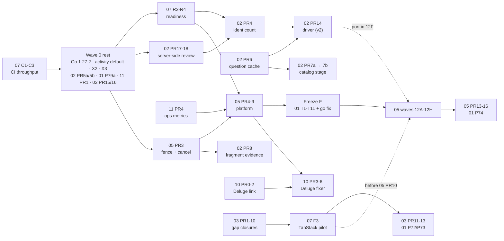

<!-- file: docs/proposals/2026-10-holistic/08-integrated-roadmap.md -->
<!-- version: 1.1.2 -->
<!-- guid: f3d3677e-6cfb-45d6-a87e-a81fdbaaaefa -->
<!-- last-edited: 2026-10-09 -->

# 08: Integrated roadmap

- **Author:** `coordinator`.
- **HEAD:** `ebda30d47` (round 2, 2026-10-09). The code is byte-identical to the round-1 measured HEAD `f7211eb39`; only `docs/` and two `changelog.d/` fragments moved. Every `file:line` anchor in docs 01 to 07 still holds.
- **Scope:** planning only. No code was changed and no git state was changed.
- **Inputs:** docs 01 to 07 after their round-2 reviews (each has a "Round-2 review" section near its top), the two new specs 10 (Deluge cleanup, D52) and 11 (metrics, D14d), the new appendix `07-design-decisions-and-modularity/C-server-state-library.md` (D48), and `09-owner-decisions.md` (D1 to D52, fixed).
- **Appendix:** [`08-integrated-roadmap/collision-matrix.md`](08-integrated-roadmap/collision-matrix.md), the full file-collision matrix regenerated by script for round 2.
- **Round 2 in one paragraph:** the plan has ten workstreams now, 192 PRs after the tier-2 regrouping (§5, §8), and the first thing to land is CI throughput (07 C1 to C3), because the measured CI is 0 green runs in the last 12 and 22 to 24 minutes per PR run, and every later "green" claim is meaningless until it is fixed. The ten most important changes are in §10.

## 1. Executive summary

1. **The ten plans fit together as one program.** It has **192 planned PRs** in five waves plus a freeze window, plus three open-ended series (01 P81 per route group, 06 P13+, 06 P14+). Round 1 counted 206 with 62 one-package tier-2 deletions; round 2 groups those into 11 build-proven PRs (§5, freeze F) and adds docs 10 and 11. The overlap between plans is mostly the same work described twice, not real conflict. Each overlap has one owner (§3).
2. **CI throughput is the critical path until 07 C1 to C3 land.** Measured by 07 on 2026-10-09: the last 12 `ci.yml` runs all failed or were cancelled, two of them docs-only; a PR run is 22 to 24 minutes across 16 jobs; a merge to `main` costs 39 to 49 minutes because `auto-revert.yml` grants one free re-run. At 191 PRs that is about 70 hours of PR runs landing red. C1 makes `main` green on all four inherited causes (it absorbs round 1's X4), C2 adds path filtering, C3 replaces two full short-test runs with one 4-shard run. Target: under 10 minutes per Go PR, under 2 minutes for docs-only. **These go at the very front of wave 0.**
3. **Safe fixes follow in wave 0, all small:** Go 1.27.2 (reconfirmed from `go.dev/dl` on 2026-10-09); the activity-storage default; backup retention; the always-empty "running operations" list; the two security and ban guards (X2, X3); the retitle-loses-candidates fix (02 PR 5a/5b); the cover-embed gate with its default flipped (01 P79a, new); the dead metrics placeholder deletion and the `/metrics` series contract (11 PR 1); and the Chrome heap snapshot plus payload trim for the Review tab (02 PR 15/16).
4. **New in round 2: cover embedding is live and was about to be switched off.** 01 round 1 (and D14) said the cover-embed pair was inert. It is not: `tagger.EmbedCoverArtSafe` runs on every apply and every write-back. The `embed_cover_art` toggle is unread and defaults to `false`. Wiring it as D14e says, without flipping the default, would silently stop cover embedding in prod. 01 P79a does both in one commit (D56).
5. **New in round 2: the Deluge link does not exist today.** 10 found that nothing live writes `BookVersion.TorrentHash` or `BookFile.DelugeHash`; the only durable link is a path (`DelugeOriginalPath`). 10 PR 0 (client fields and `remove_torrent`), PR 1 (write the hash on import) and PR 2 (backfill) are useful on their own and go in wave 1. The fixer itself (PR 3) needs the ops v3 Fixer kind and goes in wave 3 after 05 PR 5 to 7. The one real hazard, `deluge_move_enabled` pointing a torrent's `save_path` at the library, is closed by refusing any torrent under `RootDir` (E3) and by D57.
6. **New in round 2: metrics are 69 families, not 25.** 11 measured 69 `client_golang` series families (34 + 5 + 25 Pebble + 5 aidispatch). The strategy: one `telemetry.Meter`, OTel for everything new (including every ops v3 instrument, 11 PR 4 before 05 PR 2), an optional OTLP metric reader off by default (D61), the Prometheus names kept byte-identical by rule and pinned by a contract golden, and a constructor ratchet that only forbids a rise. No big-bang migration.
7. **Ops v3 changed shape, not direction.** D28a's chunk leasing replaced the prefix watermark; the state machine is **10 states**, not 12; the Pipeline kind lost three unused sub-kinds; the port counts are **209 ported, 21 pruned, 4 frozen** (234 total). 05 PR 3 (fence and per-row cancel) is independent and stays pulled forward. One new owner question, D53: wrap the four frozen ops as native Tasks over untouched bodies so `v2compat` can be deleted in PR 15.
8. **Review → Metadata goes server-side (D36) as 02 PR 15 to 19.** The snapshot prerequisite the coordinator asked about is settled: the incremental review snapshot already shipped (`d9463d669`, `df23cbe95`), so PR 17 inherits it. PR 15 (heap snapshot, no code) and PR 16 (drop the score breakdown from the index payload, 103 MB → 47 MB at 40k rows) are wave 0; PR 17 to 19 are wave 1 behind the `review_metadata_server_query` flag.
9. **Dedup blocking gained a second pass** (02 PR 11, now M): rarest title token × duration bucket over all books, because the title-prefix block misses the number-leading and article-leading shapes this library is full of. PR 12 (signature LSH) is parked until the re-fingerprint. PR 13's `FormulaVersion` bump rides on PR 8's, so the corpus is rescored once.
10. **The server-state library pick is made:** TanStack Query v5 on the Repairs lane (07 F3, D59), measured at 10.7 KB gzip, with a hard acceptance bar (at least 150 of 215 server-state lines removed, 22 tests green, bundle at most 650 KB). It **moves from wave 3 to wave 2**: it must land before 05 wave 12D re-points the lane, or the lane is rewritten twice.
11. **Metadata goal (fewer than 1,000 books missing metadata; about 11,233 today).** Unchanged levers: fragments, better questions with a cached answer, the harvested catalog. Round 2 adds 02 PR 7a (a read-only coverage report, D31 "measure first") ahead of PR 7b, and 02 PR 9a (a missing author or narrator is no longer a disagreement), which ships alone so its effect is measurable. §6.
12. **Collision hotspots** are `api.ts` (11 PRs from 7 workstreams), `config.go` (13 PRs from 6), `pebble_store.go`, `Makefile`, `ReviewWorkspace.tsx`, `server_lifecycle.go`, `go.mod`/`go.sum`, `keyfamilies.go` and `useRepairsLane.ts`. PRs that touch them merge one at a time in the §4 order.
13. **There are 67 decisions**: D1 to D52 are answered in `09-owner-decisions.md`; **D53 to D67 are new** (§7) and are appended to 09 as "pending owner" with recommended answers. Four of the new ones block a wave-0 or wave-1 PR: D55 (since answered: AI metrics, keep the file), D56, D60, D61.
14. **Rough effort:** about 326 engineer-days of planned PRs by the rule of thumb in §8, not a measurement. Ops v3 is about a third; 07 (with CI, readiness, data model, frontend) about a fifth.

## 2. Coordinator checks a to h (round 1, still valid)

These checks were made against the code at `f7211eb39` on 2026-10-08. The code has not changed since, so they stand. Round-2 additions are marked.

### a. `maintenance.orphan-book-files-cleanup` on a schedule (05 Q2, 04 Q2)

**It cannot delete or modify `book_file` rows. The recommendation stands (D23).** Proof at HEAD:

1. `runOrphanBookFilesCleanup` (`internal/plugins/maintenance/orphan_book_files.go:59-93`) uses the store only to call `findOrphanBookFiles(ctx, store)`, then logs. It makes no other store call.
2. `findOrphanBookFiles` takes an `orphanFileScanner` (`internal/plugins/maintenance/store_slices.go:205-209`). That interface has exactly three methods, all reads: `GetAllBookFilesCore`, `GetAllBooksCoreComplete` and `ListSoftDeletedBooks`.
3. `{"delete": true}` returns an error before any read (`orphan_book_files.go:66-68`). The delete mode was removed on 2026-09-19.
4. A search for every `book_file` delete call finds none in this op or its sibling `orphan-book-files-repoint-plan`, which declares `Capabilities: CapLibraryRead` only. Command: `grep -rn "DeleteBookFilesByIDs(\|DeleteBookFilesForBook(\|\.DeleteBookFile(" internal cmd`, excluding tests and mocks.

Two follow-ups, both now in 04 P1: add `Permissions: settings.manage` when scheduling it; fix the stale "caller feeds … DeleteBookFilesByIDs" comments inside `findOrphanBookFiles`.

**Related finding: four delete sites exist elsewhere in the code.** No plan proposes any of them:

| Site | What it deletes |
|---|---|
| `dedupe_book_file_rows_crossfolder.go:230` | a journaled exact duplicate |
| `itunes_clone_into_library.go:1274` | rows removed by a clone undo |
| `merge/combine_journal.go:1478` | rows removed by a combine undo |
| the admin-only `POST /maintenance/wipe`, `maintenance_fixups.go:354` | every `book_file` row |

05's briefs are amended: the bodies port unchanged under a declared, lint-flagged `Deletes(ResBookFiles)` effect, and no new delete is added (D3). The wipe route is retired first in 01 P81's series (D9).

*Round 2:* 10's fixer declares `Writes(Deletes(ResExternalData))` for the Deluge data it removes. It writes no `book_file` row and no library file; its only store writes are its journal and its `delugecleanup:` ledger. That is consistent with D3's rule: a declared, lint-flagged effect, never an undeclared delete.

### b. `repair-library-state` versus fix-library-states

**It is not the banned path, and no doc proposes running or scheduling it.** The banned `fix-library-states` was a maintenance job, deleted on 2026-09-10, and `internal/maintenance/jobs/fix_library_states_test.go` pins its absence. `maintenance.repair-library-state` (`library_state_repair.go:173`) is dry-run by default, API-only, has no schedule, changes a row only when `OrganizedFileHash` passes, and excludes iTunes roots. D41 keeps it frozen. *Round 2:* 05 PR 15's frozen allowlist is now exactly four IDs (the two write-back ops, `backfill-legacy-status` until 01 P74, and `repair-library-state`); D53 asks whether those four may be wrapped as native Tasks over untouched bodies.

### c. Go 1.27.2 (06 F1)

**Verified twice.** On 2026-10-08 from `go.dev/doc/devel/release` and on 2026-10-09 by 06 from `go.dev/dl/?mode=json` (current stable set `go1.27.2`, `go1.26.9`). It includes security fixes to the `go` command, `crypto/tls`, `html/template`, `net/http`, `net/textproto` and `os`. 06 P1's file list is 18 files (13 functional, 5 docs), re-counted in round 2. 06 P2 also pins `ci.yml`'s floating `go-version: '1.27'` (new F24).

### d. The 01 and 03 handover

Settled in round 1 and unchanged: 01 P7 owns `FingerprintVisualsColumn.tsx`, `dedup/BulkActionBar.tsx` and the four dead `api.ts` wrappers; 01 P72 and 03 PR 12 delete disjoint route lines in `wire_dedup_routes.go` (P72 first); 01 P73 owns the dead dedup category C cluster (705 lines) with a guard-parity precondition; 01 P36's `ddMergeDuplicateBook` moved into P73. *Round 2:* 03 split PR 7 into 7a/7b and PR 9 into 9a/9b/9c; 9b is gated on 04 P14c (the reconcile pair, D27) because its plan source reads the saved results that only the loser writes today.

### e. 02's §6 requests to 05

Resolved in round 1 (05 §3.9 v1.2.0): per-subject prerequisites exist; `ops.DirtySet` added; `ops.Budget` names the existing process-wide limiter; the "surfaced" state lives in 02's `ident` index. 02 PR 14 ships as a v2 op first. *Round 2:* 02 raised three further gaps and 05 r3 closed them in `sdk-api.md` §1.5: `DirtySet` clears by compare-and-delete on a mark epoch; `Budget` is a rate budget and does **not** model Google's day quota (02 keeps that planner); one 256-key page is one chunk, matching D28a. 02 PR 14 is now written in the v3 shape (`Pages`/`Item`/`Finish`/`PartitionBy`) so wave 12F is a constructor swap.

### f. Twin-merge permissions

Unchanged: 147 of 198 `OperationDef` literals declare no permission, `defPermissionsHeld` passes an empty list, and X2 (wave 0) makes an empty list mean `settings.manage` on `POST /operations/v2` (D1). 05 R19 is scoped to native v3 defs. *Round 2:* 04 notes that once X2 lands, an undeclared `Permissions` on a twin survivor is no longer an editor-can-delete hole; P4 still declares it explicitly because the def is the documentation.

### g. Bans, grepped across the whole folder (re-run in round 2)

Re-run on 2026-10-09 over every file in `docs/proposals/2026-10-holistic/`, including 10, 11, the new appendix C and the census CSV:

| Ban | Result |
|---|---|
| Proposals that delete `book_file` rows | **None.** 10's fixer never writes a `book_file` row (its §3.6 says so and `opstest.Conformance` proves Preview performs zero writes). |
| `internal/writeback/` | **None.** 10 and 11 do not touch it; D53's wrapping proposal explicitly leaves it alone. |
| iTunes writes | **None.** |
| Server-side decoding | **None proposed.** 10's hashing is head+tail SHA-256 (`filehash.BookFileHash`), no decode; its fingerprint lane is "future, `LaneMac` only". |
| fix-library-states | **None** (see b). |
| Splitting the scan ConcurrencyKey | **None.** 10 §3.7 says so explicitly. |
| `go work init` | **None.** |
| The banned word from the charter | **0 hits** outside the charter's own rule line. |
| Private-range IP prefixes (the three RFC 1918 blocks) | **0 hits.** |
| Email addresses | **0 hits.** |
| `/Users/`, `/mnt/` paths | **0 hits.** |
| Hostnames | Role names only. 11 makes `service.instance.id` a per-process ULID so no hostname reaches a dashboard. |
| Real-looking book titles or library paths | **0 hits** for the library names in the memory notes. 02 PR 15 states that heap snapshots are never committed because they contain titles; 02 PR 7a keeps author names out of the repo. |

### h. Claims that conflicted between docs, decided against the code

Round-1 verdicts stand (RootDir gate note is stale; chapters are scored; 01 is right on v1 readers; 10 `UpdateBook` sites; Vitest thresholds; 14 timer-less crons; 31 tasks / 33 enqueue targets; AudioBooth calls no `/api/v1`; use about 11,233 for the missing-metadata count). **Round-2 conflicts, decided here:**

| Claim | Docs | What the code or the docs say | Verdict |
|---|---|---|---|
| The cover-embed pair is inert | 01 round 1, D14 | `tagger.EmbedCoverArtSafe` is called from `metafetch/service.go:652` on every write-back (`service_writeback.go:909`) and every apply (`service_files.go:740`); only the unsafe `EmbedCoverArt` (`embed_cover.go:18`) is dead | **01 round 2 is right.** D14e is executed as P79a with the default flipped (D56). |
| `client_golang` series count | 09 D14d "about 25" | 11 F3: 34 + 5 + 25 + 5 = **69** families by grep | **11 is right.** 09's "about 25" was an estimate; 11's ratchet baseline is 69. |
| The review snapshot is "NOT built" | a memory note; the round-1 coordinator question | 02 r2: `d9463d669` and `df23cbe95` shipped it (`metadata_cache_snapshot.go` v2.1.0) | **Shipped.** The memory note is stale (not a file in this folder; see §10 follow-ups). |
| D27 near-duplicate pairs | 04: 7 pairs (C1 to C7; C8 is "not a prune"); 05 briefs: "8 D27 retirements", including `maintenance.author-title-fragment-scan` in 12E4 | 04 table C row C8 keeps `author-title-fragment-scan` ("nothing older overlaps it; D27's rule keeps it") | **04 is right.** 05 now keeps `author-title-fragment-scan` in 12E4; the counts are 209 ported, 21 pruned, 4 frozen (fixed in follow-up F4). |
| Ops v3 state count | round-1 08 and 05: 12; 05 r3: 10 | 05 §3.4 now says ten states (`pending` folded into `queued{wait_reason}`, `superseded` into `dropped{successor_id}`) | **10 states.** This doc uses 10 throughout. |
| 04 P4 PR count | 04 round 1 and 08: P4a to P4i (9); 04 r2: P4a to P4f (6) | the four no-body-diff twins ship as one PR (P4a); `cleanup-old-backups` keeps the letter P4f | **6 PRs.** 05's "census P4a-P4i" precondition is now P4a to P4f (§10 follow-ups). |
| Tier-2 deletions as "62 small PRs" | 01 appendix F: one PR per package | 01 round 2 did not regroup | **Regrouped here** into 11 build-proven PRs by package family (§5, freeze F), with 01's per-package file lists as the input. |
| `ai/telemetry.go` (01 Q10) | 01: "delete unless 11 uses it" | `grep -rn "WithOpenAISpan\|RecordOpenAIMetric" internal cmd pkg` finds no caller outside the file today; 11 PR 7 now references and wires it | **Keep and wire it (D55, owner answer):** 11 PR 7 adds AI call metrics and traces and renames `WithOpenAISpan` to `WithAISpan`. 01 P6 does not delete it. |

## 3. Overlap and conflict resolution

One owner and one resolution for each overlap. "Absorbs" means the other doc's PR is dropped and its content folded in. R1 to R20 are from round 1 and are restated only where round 2 changed them; R21 onward are new.

| # | Topic | Docs involved | Owner | Resolution |
|---|---|---|---|---|
| R1 | **Activity backend default** | 01 P1/P2, 07 R1 (cut), 04 P8 | **01** | 01 P1 flips the default, P2 ports the NutsDB tests. 07 R1 is struck in 07 v1.2.0. 01 **P75** (new) deletes the SQLite backend one release after P1 (D11) and drops 04 P8. |
| R2 | **Ops v1 retirement** | 01 P3/P4/P74, 04, 05 PR 15 | **01** | Unchanged. P74 is gated on D17 and lands after 05 PR 4; 05 PR 15's allowlist shrinks from 4 to 3 if P74 lands first. |
| R3 | **`Book.FilePath`** | 01 M6, 07 S6 | **07** | 07 S6 is now a real row in 07 (D51): helper S, then about 8 sweep PRs of size M, writes stop at a storage cut-over. |
| R4 | **`indexedStore` deletion vs 05 R21** | 07 S3, 05 PR 7 | **07** | Unchanged: S3 before 05 PR 7. |
| R5 | **02 driver vs 05 Pipeline kind** | 02 PR 14, 05 §3.9 | **02** owns the driver; **05** the primitive | See check e. 05 r3 trimmed the Pipeline kind to what 02 needs; PR 14 is a Batch over `DirtySet`, written v3-shaped, v2 adapter first. |
| R6 | **03 new Repairs fixers vs 05 Fixer kind** | 03 PR 9a/9b/9c, 05 12D | **03** writes them; **05** ports them | Three PRs now, one fixer each. 12D is 22 fixers. 9b waits for 04 P14c. |
| R7 | **07 maintenance split vs 05 port waves** | 07 M6 to M13 (cut), 05 12A to 12E | **05** | 07 v1.2.0 struck M6 to M13; the domain list and the invariant test are requirements on 05's wave briefs (D49). |
| R8 | **06 go fix batches vs everyone** | 06 P5 to P8 | **06** | Unchanged (D50): freeze window F, after the tier-2 deletions, regenerated at PR time. |
| R9 | **The vite `test:` block** | 01 P7, 06 P11 | **01** | Unchanged. |
| R10 | **Twin merges and the cron schedule** | 04 P1/P4a to P4f/P14a to P14f, 05 PR 8/12B | **04** for v2; **05** for v3 | 04 P4 is **6 PRs** (P4a bundles the four no-diff twins; P4b to P4f one each). 05 12B's precondition reads "P4a to P4f". 04 P14a to P14f (D27 pairs) land after P4; P14c before 03 PR 9b. |
| R11 | **Backup retention** | 04 P3a/P3b, 01 P79b | **04** | P3a in wave 0 after the prod-value check (D5). **New:** 01 P79b (honour `create_backups`) depends on P3a, because the `.bak-*` siblings it creates must be swept by `backup_retention_days`; the write-back ops set `KeepBackup=false` explicitly. |
| R12 | **Sequential `RunItems`** | 04 P11, 05 F7, 10 PR 2 | **04** P11 | **New:** 10 PR 2 (`deluge.link-backfill`) may ship on v2 `RunItems` only with `Concurrency` set explicitly (CLAUDE.md rule), as 02 PR 14 does. |
| R13 | **Boot goroutines and service loops** | 04 P6/P7/P9/P12/P13, 07 R2 to R4 | **04**; **07** for lifecycle | Unchanged. 04 r2: 10 whole-library boot goroutines, 7 exact twins (C1 to C7). |
| R14 | **Row-version guard (`UpdateBook`)** | 07 S2, 01 P77/P73 | **07** S2 | 01 **P77** (new, D13) deletes the rename routes and takes one site away before S2. |
| R15 | **Server-side decoding** | X3, 05 12E5, 03 G5 | **Coordinator X3** now; **05** at port time | **New:** 03 r2 found that "Reset all audio fingerprints" enqueues `acoustid.fingerprint-rescan` after the reset; under D2 that is whole-library work for the Mac workers, so the confirm dialog must say so and the command hides while no worker has checked in (03 PR 4). |
| R16 | **`api.ts`** (8,266 lines; 11 PRs from 7 workstreams) | 01 P7/P77/P80, 02 PR 18, 03 PR 3/11, 05 PR 1/10, 06 P4, 07 F2, 10 PR 5 | serial order | 01 P7 → 03 PR 3 → 05 PR 1 → 01 P77 → 02 PR 18 → 03 PR 11 → 01 P80 → 05 PR 10 → 10 PR 5 → 07 F1 → **07 F2 (split) last**. 07 F3 does not touch `api.ts` (appendix C §4.1). Nothing edits `api.ts` while F2 is open. |
| R17 | **Toolchain pin single source** | 06 P1/P2, 07 U1 | **06** now, **07** later | Unchanged, plus `ci.yml` order in R26. |
| R18 | **CI on `main`** | X4 (dropped), 07 C1 to C4, G4 | **07** | **X4 is absorbed by 07 C1**, which fixes all four inherited causes (gofmt, the two-way slog ratchet inside `go test`, errcheck 779 → measured, the one `interfacebloat` breach) and makes the two scripts one-way (D47). G4's manifest waits for C3. |
| R19 | **Dedup candidate scoring vs 03 parity** | 02 PR 8/11/12/13, 03 | **03** pins first | **Changed:** PR 12 is parked until the re-fingerprint; PR 13 rides on PR 8's `FormulaVersion` bump so the corpus is rescored once (D33 schedules it). PR 11 gained a second blocking pass. |
| R20 | **Route deletions** | 01 P72/P81, 03 PR 12 | **01** / **03** | 01 **P81** (new, D9) is one PR per handler group with the existing UOS-14 410 pattern (`server_lifecycle.go:1495-1501`) lifted into a `gone(replacement)` helper; the wipe route is its first PR. After P72 and 03 PR 12 on the wiring files. The owner still has to mark appendix C. |
| R21 | **10 Deluge PR 0 to 2 vs 01 Q10's category-B Deluge files** | 10 PR 1/2, 01 Q10 (`deluge/importer_adapter.go`, `plugins/deluge/import.go`) | **10** | 10 PR 1 edits `internal/deluge/import.go` (`ImportToLibraryWith`), not the two category-B files; but `plugins/deluge/import.go:44` is today's only caller of `MarkFileImportedFromDeluge`, which PR 2's backfill may reuse to set `DelugeHash`. **Keep both files until 10 PR 2 lands**; PR 2 then either calls them or deletes them in the same PR. `ai/telemetry.go` is kept and wired by 11 PR 7 (D55). Decision D55. |
| R22 | **11 metrics vs 05 ops metrics, and the placeholder double-delete** | 11 PR 1/4, 05 PR 2/11, 01 P6 | **11** for instruments; **01** for the delete | **11 PR 4 must land before 05 PR 2 starts**, or 05 PR 2 writes `client_golang` and 11 PR 5's ratchet blocks it; 05 PR 2 and PR 11 consume `internal/opsmetrics`. 05's landing order already puts PR 2 after PR 4, so the edge is 11 PR 4 → 05 PR 2. **`internal/telemetry/metrics_handler.go` is deleted by both 01 P6 and 11 PR 1**: 01 P6 owns it (wave 0, smaller); 11 PR 1 drops that file from its list if P6 landed first. |
| R23 | **07 F3 TanStack pilot vs 05 PR 10/14 on the Repairs lane** | 07 F3, 05 PR 10, 05 PR 14, 03 PR 10, 02 PR 18 | **07** | Round 1 placed F3 after F2 in wave 3. Appendix C §3.6 shows that is too late: 05 PR 10 re-points `useRepairsLane.ts` to `/api/v3/ops/*` and PR 14 retires `/api/v1/repairs`. **F3 moves to wave 2**, right after 03 PR 10 (which adds the `?fixer=` seed to the same file). Order on `useRepairsLane.ts`: 03 PR 10 → 07 F3 → 05 PR 10. 02 PR 18 only cites the lane's `collectApplicableIds` shape; it does not edit the file. |
| R24 | **02 PR 15 to 19 (D36) vs 03's Review PRs** | 02 PR 18/19, 03 PR 2 to 10, 05 PR 10, 06 P10 | **03** owns `ReviewWorkspace.tsx` in wave 2; **02** owns `useMetadataLane.ts` | 02 PR 18 edits `ReviewWorkspace.tsx` ("select all N") and `QueueRail.tsx`; 03 PRs 2 to 10 edit `ReviewWorkspace.tsx` throughout wave 2. **02 PR 18 lands in wave 1, before 03 PR 2**, since the flagged page mode is independent of the Dupes and Authors lanes; 03 then rebases once. `api.ts` follows R16. 02 PR 19 (retire the index mode) waits one release and lands after 03 PR 10. |
| R25 | **01 P79a cover-embed default flip** | 01 P79a/P80, 07 M2 | **01** | P79a ships the gate and the `true` default in one commit (D56). P80 (remove the other 11 fields) after P76 and P79a on `config.go`; 07 M2 (the field table) after P80, so the table is built from the surviving fields only. |
| R26 | **07 C1 to C4 (CI throughput) absorb X4; `ci.yml` order** | 07 C2/C3/G4/F1/U1, 06 P2, 01 P9 | **07** | X4 is gone. `ci.yml` merge order: **C2 → C3 → 06 P2 → 01 P9 → G4 → F1 → U1**. C3's upstream `run-go-tests` input is requested from `falkcorp/github-common` the same day as C1; if refused, C3 inlines the two Go jobs. D60. |
| R27 | **04 P4 is 6 PRs; 04 P14a to P14f** | 04, 05 12B, 03 PR 9b | **04** | See R10. D54 picks `dedup.llm-review` as the survivor of pair C2 (D4 wins over the date). 04 r2 also flags `scheduler.metadata-upgrade` (the twelfth `scheduler.*` def, no twin): it is renamed to `maintenance.metadata-upgrade` with a `FormerIDs` alias in 05 wave 12F, not pruned. |
| R28 | **05's 10 states and 209/21/4** | 05 §3.4, briefs, this doc | **05** | This doc uses 10 states and 209/21/4 everywhere, matching 05 v1.3.1 after follow-up F4 (12E4 keeps `author-title-fragment-scan`, as 04 table C does). |
| R29 | **`config.go`** (13 PRs from 6 workstreams) | 01 P1/P75/P76/P79a/P80, 02 PR 6/10/18/19, 04 P10, 07 M2, 10 PR 3, 11 PR 2 | serial order | 01 P1 → 11 PR 2 → 02 PR 6 → 02 PR 18 → 01 P79a → 01 P76 → 04 P10 → 02 PR 10 → 01 P80 → 02 PR 19 → 01 P75 → 10 PR 3 → 07 M1/M2 (moves the file's halves). Small, disjoint hunks; the order only avoids rebases. |
| R30 | **`keyfamilies.go` and the Pebble schema doc** | 01 P10 (now T1), 02 PR 6/7b, 05 PR 4, 10 PR 3, 07 S4 | serial order | 02 PR 6 → 02 PR 7b → 05 PR 4 → T1 (freeze F) → 10 PR 3 → 07 S4 (the owner field and ratchet, after release A). Each adds a family; none removes another's. |

## 4. File-collision summary

Full matrix: [`08-integrated-roadmap/collision-matrix.md`](08-integrated-roadmap/collision-matrix.md), regenerated for round 2.

- It parses **225 PR rows** (01 still as 82 one-package rows; 04 P4b to P4f and P14a to P14f as one row each; 05 waves 12E1 to 12E6 separately; 10 and 11 new) and **1,668 referenced files**.
- **283 files** are touched by PRs from two or more workstreams (316 in round 1; the drop is 07 M6 to M13 and X4 leaving, offset by 10, 11, 01 P75 to P81 and 02 PR 15 to 19 arriving).
- **562** cross-workstream PR pairs share at least one file (385 in round 1; the rise is the finer PR split in 02, 03, 04 and 07 plus the two new docs).
- **40 hotspot files** are touched by three or more workstreams (46 before the hand overrides that removed four wrong bare-name resolutions and two over-expanded globs; the overrides are listed in the script header).

**Hotspots (3 to 7 workstreams), and the merge order that resolves each:**

| File | PRs | Merge order |
|---|---|---|
| `web/src/services/api.ts` | 11 PRs, 7 workstreams | R16 |
| `internal/config/config.go` | 13 PRs, 6 workstreams | R29 |
| `internal/database/pebble_store.go` | 01 T1, 02 PR 4/5b, 03 PR 12, 06 P5, 07 R2/S2 | 02 PR 5b → 07 R2 → 02 PR 4 → 03 PR 12 → 01 T1 (freeze F) → 06 P5 (freeze F) → 07 S2 (release B) |
| `Makefile` | 12 PRs across 01, 05, 06, 07 | small, independent hunks. Serialize only **07 C3 → 06 P3/P12 → 07 G4/U1**, which edit the same targets; 06 P1 before C3 is fine (different lines). |
| `web/src/components/review/ReviewWorkspace.tsx` | 02 PR 18, 03 PRs 2 to 10, 05 PR 10, 06 P10 | 02 PR 18 (wave 1) → 03 in its own order → 06 P10 (react-router) → 05 PR 10 (R24) |
| `internal/server/server_lifecycle.go` | 01 P3/P81, 04 P6/P7/P13, 05 PR 7, 07 R2/R3/R4/S3 | 01 P3 → 07 R2 → R3 → R4 → 01 P81 (wipe) → 04 P6 → P7 → P13 → 07 S3 → 05 PR 7 |
| `go.mod` / `go.sum` | 01 P2/P75, 05 PR 8, 07 F1, 11 PR 2 | 01 P2 → 11 PR 2 → 05 PR 8 → 01 P75 → 07 F1 (each a `go mod tidy`; trivial rebases) |
| `internal/database/keyfamilies.go` | 01 T1, 02 PR 6/7b, 05 PR 4, 10 PR 3 | R30 |
| `web/src/components/review/lanes/useRepairsLane.ts` | 03 PR 10, 07 F3, 05 PR 10 (02 PR 18 is a reference only) | 03 PR 10 → **07 F3** → 05 PR 10 (R23) |
| `internal/plugins/maintenance/fragment_consolidation_fixer.go` | 01 P22 (T5b), 02 PR 8, 05 12D, 06 P6 | 02 PR 8 → 01 T5b → 06 P6 slice (freeze F) → 05 12D (moves the file) |
| `internal/applygate/evidence.go` | 01 P53 (T5b), 02 PR 9a, 05 12F, 06 P5 | 02 PR 9a (wave 1) → 01 T5b → 06 P5 → 05 12F |
| `internal/plugins/maintenance/plugin.go` | 03 PR 9a/9b/9c, 04 P2/P5/P12, 05 12D | 04 P2 → P5 → P12 → 03 PR 9a → 9c → 9b (after 04 P14c) → 05 12D |
| `internal/scheduler/tasks.go` | 02 PR 14, 04 P1/P4a/P9/P12, 05 PR 8/12B/15 | 04 P1 → P4a → P9 → P12 → 02 PR 14 → 05 PR 8 → 12B → 15 |
| `.github/workflows/ci.yml` | 07 C2/C3/G4/F1/U1, 06 P2, 01 P9 | R26 |
| `internal/server/handlers/metadata_cache.go` | 02 PR 4/16/17/19, 06 P6, 07 C1/F1 | 07 C1 (slog ratchet entry) → 02 PR 16 → 17 → 4 → 06 P6 (freeze F) → 02 PR 19 → 07 F1 |
| `deploy/prometheus/alert-rules.yml` | 05 PR 2/11, 10 PR 4, 11 PR 4 | 11 PR 4 → 05 PR 2 → 05 PR 11 → 10 PR 4 |
| `docs/AI-REFERENCE.md` | 03 PR 13, 05 PR 0, 10 PR 6, 11 PR 1 | docs only; any order, rebase on conflict |

**By workstream pair**, counting shared files (matrix §3):

- **06 and 07 share 85.** Almost all are 06 P6/P7/P14+ against 07 S1b..n (the test-store sweep). Freeze window F puts 06 first; S1b..n follows.
- **01 and 06 share 42**: tier-2 deletions vs go fix. 01's T1 to T11 go first inside F, so go fix rewrites less.
- **05 and 06 share 38**: go fix vs the port waves. F ends before 12A.
- **01 and 07 share 35**: mostly the tier-2 server and database PRs vs 07 F1 (tygo over `handlers/**`) and S2. T1/T2 before F1.
- **04 and 05 share 30**: the scheduler and maintenance files; R10's order.
- **05 and 07 now share only 12** (113 in round 1), because M6 to M13 are gone.
- **10 and 11 share 4** (`alert-rules.yml`, the overnight dashboard, `AI-REFERENCE.md`, `config.go`): 11 PR 4 before 10 PR 4.

**Same-file pairs that are fine in parallel:** 01 P72 and 03 PR 12 (disjoint route lines); 04 P11 and 05 12E1 (P11 first, 12E1 rewrites the body); 02 PR 18 and 07 F3 (18 does not edit the lane file).

Because the CI gate is single-threaded on Woodpecker (one run at a time) and `ci.yml` is 22 to 24 minutes per PR until C3, "parallel" below means **developed in parallel, merged one at a time**.

## 5. Sequenced program

Each wave lists PRs that can be developed in parallel. Arrows are hard dependencies. Within a wave, PRs that share a hotspot merge in the §4 order.

### Wave 0: CI first, then cheap, safe, high value (about 2 to 3 weeks)

**The front of wave 0 is CI throughput.** Nothing else merges until C1 is green on `main` at attempt 1; C2 and C3 follow immediately. Everything after them is cheaper, and "green" means something.

| Order | PR | What | Why now | Depends on |
|---|---|---|---|---|
| 0.1 | **07 C1** | `main` green on all four inherited causes; both script ratchets one-way (absorbs X4) | 0 green runs in 12; every merge pays twice | — (D60) |
| 0.2 | **07 C2** | path filtering: docs-only PRs run only the fragment and header lints | docs-only PRs cost 22 min today | C1 |
| 0.3 | **07 C3** | one 4-shard short-test run replaces two full ones; `run-go-tests` input upstream | PR wall 22–24 min → under 10 | C2; the upstream input (fallback: inline) |
| 0.4 | 07 C4 | measure the next 10 merges (`docs/ci/`) | proves the target | alongside |
| 0.5 | 06 P1 → P2 | Go 1.27.2 (18 files); drift check covers Woodpecker, `ci_remote.py` and the `ci.yml` floating minor | security fixes | Docker images; P2 after C3 on `ci.yml` |
| 0.6 | 01 P1 | activity default → `pebble` | a lost conf file silently re-engages SQLite | — |
| 0.7 | 04 P3a | scheduled backup cleanup reads `BackupRetentionDays` | backups may be deleted early | D5 (prod check by the owner) |
| 0.8 | 01 P3 | `pause.go` reads v2; delete the v1 reaper and `CancelOperation` | the running list is always empty; 1,440 useless scans a day | D16 |
| 0.9 | X2 | empty `Permissions` means `settings.manage` on `POST /operations/v2` | editors can run 147 plugin ops | D1 |
| 0.10 | X3 | refuse in-process decode in three ops unless `allow_server_decode` | closes a live ban risk | D2 |
| 0.11 | 02 PR 5a → 5b | a retitle marks candidates stale instead of deleting them | stops the 1,180-row loss class | D29 |
| 0.12 | **01 P79a** | honour `embed_cover_art` **and** flip its default to `true` in the same commit | the feature is live today; gating it without the flip stops embedding silently | D56 |
| 0.13 | **11 PR 1** | `telemetry.Meter`, views table, `WithoutScopeInfo`, version from build info, the `/metrics` series contract golden (69 families); the placeholder delete is 01 P6's | small; pins every Prometheus name before anything migrates | — |
| 0.14 | **02 PR 15** | Chrome heap snapshot of the Review tab (owner runs it; figures only, snapshots never committed) | finds where the reported 16 GB sits; this lane explains at most 0.25 GB | the owner |
| 0.15 | **02 PR 16** | drop `ScoreBreakdown` (and `CategoryTags` if unread) from the index view | 103 MB → 47 MB at 40k rows, no behaviour change | — |
| 0.16 | 04 P2, 04 P1 | retire the two ISBN stubs; schedule-has-driver guard; the two report-only checks with `settings.manage` | §2 a proves them safe | D23 |
| 0.17 | 02 PR 1, 2, 3 | real filter benchmark; remove per-row waste; one grammar corpus | no behaviour change | — |
| 0.18 | 01 P4, P5, P6 | params side table; server shims; dead tag-write, retire, scanner and metrics helpers (P6 deletes `metrics_handler.go`; `ai/telemetry.go` is kept, D55) | tier 1, build-proven | none |

### Wave 1: enablers (about 4 to 6 weeks)

| Track | PRs (in order) | Notes |
|---|---|---|
| Readiness | 07 R2 → R3 → R4 | R4 needs the owner to install the unit (D44). Gates 04 P6/P7 and 05 PR 5. |
| Gates | 07 G1, G2, G3 (parallel; Go tests now) → 01 P9 → 07 G4 (after C3; D47) | Ratchets fail only on a rise. |
| Goal measurement | 02 PR 4 (`ident` index, `ident:`/`asin:` filters) | **Makes the goal number clickable.** After 07 R2 on `pebble_store.go`; after 02 PR 17 so the filter is added once, on the server. |
| Review on the server (D36) | **02 PR 17 → PR 18** (behind `review_metadata_server_query`, default off) | PR 18 before 03 PR 2 on `ReviewWorkspace.tsx` (R24). PR 19 is wave 2, one release later. |
| Provider cache | 02 PR 6 (question-keyed cache, negative TTL; D30) | Saves Audible calls on every later pass. |
| Scorer bug | **02 PR 9a** (a missing author or narrator is not a disagreement) | S; ships alone so its effect is measurable; the applygate regression is in the PR. |
| Catalog coverage | **02 PR 7a** (read-only `catalog.coverage-report`) | D31 "measure first"; the number it produces is the ceiling for PR 7b. |
| Metrics | 11 PR 2 ‖ PR 3 ‖ PR 5 → **11 PR 4** → **11 PR 7** | PR 4 (`internal/opsmetrics`, the `op_id` cardinality fix, alert and recording rules) **before 05 PR 2** (R22). PR 2's OTLP keys are off by default (D61). PR 7 (AI call metrics and traces, D55) after PR 4: it touches `alert-rules.yml`, `AI-REFERENCE.md` and `views.go` that PR 4 also edits; it does not gate 05. |
| Deluge link | **10 PR 0 → PR 1 → PR 2** | Useful alone: the client gains `remove_torrent` and the status fields; the import writes `DelugeHash`/`TorrentHash` for the first time; the backfill links existing rows. PR 2 on v2 `RunItems` with `Concurrency` set, or waits for 05 PR 5/6. PR 1's regression test: `MoveStorage` is not called while `deluge_move_enabled=false` (D57). |
| Ops v3 platform, part 1 | 05 PR 0 → PR 1 → **PR 3 (fence and per-row cancel; independent)** → PR 4 → (11 PR 4) → PR 2 → PR 5 → PR 6 → PR 7 → PR 8 → PR 9 | PR 3 stops the 2026-10-01 "apply keeps writing after cancel" shape. PR 5 needs X2 (D1) and 07 R2 to R4 (D44). |
| Census | 04 P5 → **P4a → P4b → P4c → P4d → P4e → P4f** (one at a time) → P3b → P11 → **P14a to P14f** (P14c before 03 PR 9b) → P6 → P7 → P9 → P12 → P13 → P10 | 6 twin PRs now, not 9. P6/P7 after 07 R2. P10 after its soak decision (D27). P8 is dropped (D11, 01 P75). |
| Dead code, tier 1 and owner-gated | 01 P2 (NutsDB) → P7 (web) → P8 (apiFetch); **P76** (`internal/download`); **P77** (rename routes, before 07 S2); **P79b, P79c** (after 04 P3a and 01 P6); **P81 wipe** (first of its series) | P2 after P1. P7 before P8 (`playlistApi.ts`). P79b's write-back ops set `KeepBackup=false`. |
| Search index | 07 S3 (`ChangeObserver`; delete `indexedStore`; D43) | Before 05 PR 7. |
| Identity states | 07 S1 (test store), 07 S6 helper | Lay the ground for the wave-3 sweeps. |

### Wave 2: goal levers, page retirement, pilot (about 6 weeks)

| Track | PRs | Notes |
|---|---|---|
| Recall | 02 PR 7b (local catalog stage, B1/B2; after 7a's number) | D31: catalog candidates start review-only. **The folder-parse "title equals author" variant from 02 §3.3 rides in this PR**; the spec has no PR of its own for it. |
| Fragments | 02 PR 8 (window-print index plus fragment containment evidence) | Needs 05 PR 3 live. Feeds the existing fragment fixer; owner approval by id is unchanged. D34. Its `FormulaVersion` bump also carries PR 13 (R19). |
| Driver | 02 PR 14 (`identification.advance`, v2 adapter over a v3-shaped body) | Needs 02 PR 4 and PR 6. The 6-hour `candidate_fetch` becomes the safety net. |
| Dedup page, phases 0 to 2 | 03 PR 1 → PR 2 → (PR 3, 4, 5 in parallel) → PR 6 → **PR 7a → PR 7b** → PR 8 → **PR 9a, 9c (parallel), 9b (after 04 P14c)** → PR 10 | PR 10 needs 2, 5, 7a, 7b, 8, 9a, 9b and 9c. |
| **Server-state pilot** | **07 F3** (TanStack Query v5 on the Repairs lane) right after 03 PR 10 | D59. Acceptance bar in appendix C §4.6; miss it and the PR is reverted. **Before 05 PR 10** (R23). |
| Review index retirement | 02 PR 19 (one release after PR 18 ran with the flag on; after 03 PR 10) | `view=index` returns 410 for one release. |
| Dead code and routes | 01 P72 → 03 PR 11 → 03 PR 12 → 01 P73 → 03 PR 13; then **01 P81 per handler group** (after the owner marks appendix C); **01 P80** (after P76, P79a); **01 P75** (one release after P1, D11; tags `activity-sqlite-last`) | P73 after its guard-parity test passes. |

### Freeze window F: modernization (about 2 weeks; nothing else merges in Go packages)

**Tier-2 deletions, regrouped by the coordinator from 01 appendix F into 11 build-proven PRs** (01 round 2 kept the 62 one-package rows; the file lists there are the input to each group; `go build ./... && go vet ./...` and the group's package tests gate each PR; 01's "re-check each function for reflection/JSON use" rule applies per function). 01 P36 is not in any group: its one function moved to P73.

| PR | Packages (01 rows) | Funcs / lines | Size | Order constraints |
|---|---|---|---|---|
| **T1** | `internal/database` (P10) | 40 / 505 | M | after 01 P4 and 05 PR 4; before 06 P5 and 07 S2; touches both mock files |
| **T2** | `internal/server`, `server/middleware`, `handlers`, `handlers/abs`, `handlers/operations`, `handlers/aibackends` (P13, P32, P50, P42, P45, P59) | 28 / 281 | M | after 01 P3, P72 and 03 PR 12; before 07 F1 |
| **T3a** | `internal/metadata`, `metadata/providerhttp`, `openlibrary`, `authority` (P11, P39, P43, P20) | 32 / 363 | S | after 02 PR 6 |
| **T3b** | `internal/metafetch`, `metabatch`, `catalog`, `matcher`, `personname`, `franchise` (P15, P66, P63, P48, P65, P55) | 17 / 205 | S | after 02 PR 7b and PR 9a |
| **T4a** | `internal/scanner`, `organizer`, `undo`, `backup` (P12, P31, P46, P28) | 20 / 282 | S | after 01 P77 |
| **T4b** | `internal/fileops`, `audioutil`, `tagger`, `mediainfo`, `audioext`, `pathutil` (P17, P18, P19, P41, P70, P30) | 26 / 377 | S | after 01 P6 and P79b/c (`safe_write.go`) |
| **T5a** | `internal/operations`, `operations/freshness`, `operations/registry`, `operations/opmode`, `scheduler` (P29, P21, P34, P68, P57) | 20 / 171 | S | after 01 P4 and 04's scheduler PRs; before 05 12A |
| **T5b** | `internal/plugins/maintenance`, `repairs`, `applygate`, `applycap` (P22, P27, P53, P69) | 13 / 131 | S | after 02 PR 8 and PR 9a; before 05 12D |
| **T6a** | `internal/errhandling`, `logger`, `httputil`, `util`, `config`, `security/pathvalidation`, `security/safepath`, `sysinfo`, `appdirs`, `policy` (P14, P16, P23, P33, P35, P37, P58, P38, P40, P60) | 49 / 522 | M | after 01 P80 (`config`) and 07 C1 (`logger` ratchet) |
| **T6b** | `internal/cache`, `searchcache`, `search`, `realtime`, `serviceregistry`, `syncapi/progress`, `activity`, `merge`, `versionprimary`, `metrics` (P56, P61, P54, P49, P51, P52, P62, P64, P71, P67) | 11 / 105 | S | after 01 P75 (`activity`); P67 before 11 PR 6 (`pipeline_metrics.go`) |
| **T7** | `internal/ai`, `aidispatch`, `fingerprint`, `diagnosis`, `audiobooks` (P44, P47, P26, P24, P25) | 22 / 190 | S | after 11 PR 3 (`aidispatch`) and 02 PR 1 (`audiobooks` benches) |

Totals: 278 funcs, 3,132 lines (01's 279 / 3,162 minus P36's 1 / 30, which is P73's). Then **06 P5 → P6 (split by top-level package) → P7 → P8**, each regenerated with `go fix -diff` at its base (D50, D40). **06 P14+** (synctest) starts after F, one package per PR, and **07 S1b..n** (4 groups) follows it, since they share 26 test files with P6 and 15 with P14+.

### Wave 3: large migrations (about 3 to 4 months)

| Track | PRs | Notes |
|---|---|---|
| Ops v3 ports | 05 12A → 12B (after 04 P4f) → 12C → 12D (22 fixers) → 12E1 to 12E6 → 12F (includes 02 PR 14 → Batch, and the `scheduler.metadata-upgrade` rename) → 12G → 12H (`library.scan` last) | The domain split of `plugins/maintenance` happens inside these PRs (D49). 12E5 decoders go `LaneMac` only. 12E3 delete sites keep their bodies under a declared effect. 12E4: 33 defs (keeps `author-title-fragment-scan`, R28). |
| Ops v3 UI | 05 PR 10 → PR 11 | After 07 F3 and 03 PR 10 (shared Repairs files); PR 11 consumes 11 PR 4's instruments. |
| **Deluge cleanup fixer** | **10 PR 3** (the fixer, L; after 05 PR 5, 6, 7) → **10 PR 4** (metrics, alert, panel; after 11 PR 1) → **10 PR 5** (row parts and the six settings; after 05 PR 10) → **10 PR 6** (docs, executive summary) | `deluge_cleanup_enabled` defaults off; the first trial runs on the sandbox before prod. D57, D58, D62 to D65. |
| Data model | 07 S1b..n (4 groups, after F) → S2 (with storage release B; after 01 P77) → S4 (after release A) → S4b → S5 (D42) → 07 S6 sweeps (8 PRs) | S6 sweeps go before the 12E3/12E4 waves of the same packages where possible. |
| Config | 07 M1 → M2 → M3 (D45) → M4 → M5 | M2 after 01 P80, 02 PR 10/19 and 04 P10 (`config.go`, R29). |
| Scoring | 02 PR 9 (shadow mode, logged as 02 PR 9 now states) → 2 weeks of shadow → PR 10 (D35) | — |
| Dedup blocking | 02 PR 11 (two passes) → PR 13 (rides PR 8's bump; D33 schedules the rescore) ; PR 12 **parked** until the re-fingerprint | After 01 P73 (`engine.go`). |
| Frontend | 06 P9 (TS 7) → 06 P10 (react-router, after 03 PR 11) → 06 P11 (Vitest 5) → 07 F1 (tygo) → **07 F2 (api.ts split, last on `api.ts`)** → 06 P13+ | R16 order. F3 already landed in wave 2. |
| Observability | 06 P3 (pprof tag; committed Makefile owns the flags, D37) → P4 (flight recorder) → P12 (PGO, after profiles exist) ; 11 PR 6 (pipeline metrics migration, dashboard-pinned proof) | P4's watchdog hook moves into the v3 liveness checker if it lands after 05 PR 5. |

### Wave 4: retirements

05 PR 13 → PR 14 (after 07 F3 and 12D) → PR 15 (allowlist of 4, or 0 if D53 is yes) → (30-day soak, D25) → PR 16; 01 P74 (after 05 PR 4, D17); 07 M14; 07 F4 (D46); 07 U1 and U2; 01 P81's 410 stubs removed one release after each group; 02 PR 19's 410 removed.

### Dependency edges and the critical path

- **Critical path for everything: CI throughput until 07 C1 to C3 land.** At 22 to 24 minutes per PR run and two runs per merge, nothing else in this program is cheaper than fixing that first.
- **Critical path for the goal:** wave 0 (02 PR 5a/5b) → 07 R2 → 02 PR 17 → PR 4 → PR 6 → PR 7a → PR 7b and PR 14. In parallel, 05 PR 3 → 02 PR 8 → the owner-approved fragment applies. About 8 to 10 weeks after C3 to have every lever in place.
- **Critical path for the whole program:** the 05 chain, PR 1 → 4 → (11 PR 4) → 5 → 7 → freeze F → waves 12A to 12H (serial on shared files) → PR 15 → 30-day soak → PR 16. About 6 to 8 months at one merge stream, less once C3 cuts the per-PR cost.

## 6. Goal tie-in: fewer than 1,000 books missing metadata

Source: 02 appendix C (v1.1.0, PR references renumbered in round 2).

- The bucket sizes are **dated census estimates** (2026-10-05 and 2026-10-06), **not measured at HEAD**, and they overlap, so they must not be summed.
- 02 PR 4 (wave 1) turns them into exact, clickable `ident:` counts. Re-plan after it lands.

| Bucket (dated size) | Moved by | Wave | Expected movement |
|---|---|---|---|
| Chapter fragments, about 4,700 | 02 PR 8 (window-print containment) feeding the existing fragment fixer; the owner approves by id; 05 PR 3 makes cancel safe | 2 | **The largest lever.** Upper bound is the bucket. Real yield depends on how many fragments have window prints and on the approval lists; not measured. |
| No cache row, 3,386 | the `candidate_fetch` already shipped; 02 PR 5a/5b stops new losses; 02 PR 14 replaces the 6-hour poll with a dirty set | 0, 2 | Should fall to roughly its overlap with other buckets after one full fetch pass. 02 gives no number. |
| Zero candidates with literal or series-decorated titles (part of about 8.9k) | **02 PR 7a measures catalog coverage first (D31)**; 02 PR 7b (local catalog, 0 provider calls); 02 PR 6 (re-asks are free, and a question change bypasses the negative entry) | 1, 2 | Bounded by how many of these authors have a harvested catalog; 7a's report is that bound. |
| Author equals title, about 1,272 | the folder-parse question variant (in 02 PR 7b); the catalog block on the author credit | 2 | A recall gain; size unknown until measured. |
| Not on Audible, about 930 | Google's 1,000 calls a day, spent by the quota planner that **stays in 02** (05's `Budget` is a rate budget only; check e) | 2 | At most about 400 a day through Google; review-only candidates. |
| Retitled by scan (1,180 on 10-06) | 02 PR 5a/5b plus rescoring with no calls | 0 | Prevents recurrence; does not recover the past. |

**What changed in round 2 for the goal:**

- **02 PR 9a** (wave 1) removes the ×0.75 penalty for a missing author or narrator. It changes which fetched candidates clear review, not whether a candidate is fetched, so it does not move the goal count by 02's definition; it does make the review queue more useful for the title-only shapes this library has. Its applygate regression keeps auto-apply unchanged.
- **02 PR 11's second blocking pass** is a dedup lever (duplicates and fragments found), not an identification lever. **PR 12 is parked** (the signatures it would index are noise until the re-fingerprint) and **PR 13 rides the next `FormulaVersion` bump** so the corpus-wide rescore (D33) happens once.
- **D36 (02 PR 15 to 19)** does not move the goal count either; it makes the Review page usable at 40k rows, which is what the owner needs to work the buckets above.

**What does not move the number:** wave 3's calibrated scorer (02 PR 9/10) and the new auto-apply gate. 02 appendix C defines the goal as books with **no fetched candidate and no applied metadata**, so a book with unapproved candidates already counts as not missing.

**Reading of the evidence:** unchanged. No single wave reaches the goal by itself; fragments plus the zero-candidate levers are both needed; the first point at which the goal could be reached is the end of wave 2, and only if the fragment approvals keep pace.

## 7. Consolidated owner decisions

**D1 to D52 are answered** in [`09-owner-decisions.md`](09-owner-decisions.md) (recorded 2026-10-08) and are treated as fixed by every doc. The round-1 tables are not repeated here; each doc's §7 now carries the decision beside its question. Two owner **actions** (not decisions) remain open from that set: mark the appendix C routes your tooling uses (D9, blocks 01 P81's per-group series) and compare the two backup-retention values in prod (D5, blocks 04 P3a).

**New in round 2: D53 to D67.** Each has a recommended answer; "Unblocks" names the PRs that wait on it. They are appended to 09 as "pending owner".

| # | Decision | Recommended | Unblocks |
|---|---|---|---|
| D53 | **05 r3.** Wrap the four frozen ops (`library.bulk-write-back`, `maintenance.bulk-write-back`, `operations.backfill-legacy-status` until 01 P74, `maintenance.repair-library-state`) as native v3 Tasks whose `Run` calls the untouched v2 body (as 12E5 does for iTunes), so `v2compat` shrinks to zero and is deleted in 05 PR 15. | **Yes.** "Frozen" means the body, its behaviour, its schedule (none) and `internal/writeback/` are untouched; the registration glue is not what the ban protects. The wrapper is one function per op, and the PR 15 smoke test runs each. | 05 PR 15 |
| D54 | **04 Q5a.** Pair C2: `scheduler.dedup-llm-review` is three days newer than `dedup.llm-review`, but D4 retires the `scheduler.*` namespace. | **`dedup.llm-review` survives**; the scheduler ID becomes its `FormerIDs` alias; the `dedup_llm_review` task retargets. D4 wins over the date. | 04 P14b; 05 12F |
| D55 | **01 Q10.** The three category-B files with no decision: `internal/deluge/importer_adapter.go` (67 func-lines), `internal/plugins/deluge/import.go` (42), `internal/ai/telemetry.go` (29). | **Answered by the owner: add AI metrics, keep the file.** `internal/ai/telemetry.go` is kept and wired by 11 PR 7 (OTel instruments per provider/model/task on `/metrics`, `WithOpenAISpan` renamed `WithAISpan` and called at the AI call sites). 01 P6 does not delete it. Keep the two Deluge files until 10 PR 2 lands (`plugins/deluge/import.go:44` is the only caller of `MarkFileImportedFromDeluge`, which the backfill may reuse; PR 2 keeps or deletes them in the same PR). | 11 PR 7; 10 PR 2 |
| D56 | **01 P79a.** Flip the `embed_cover_art` default to `true` in the same PR that gates `embedCoverInBookFiles` on it. | **Yes.** Covers are embedded on every apply today; gating without the flip would stop that silently on the next deploy. | 01 P79a (wave 0) |
| D57 | **10 Q6.** Copy model (the fixer) versus seed-from-library model (`deluge_move_enabled`, `path-update`, swap notify); they exclude each other per torrent. | **Copy model.** Keep `deluge_move_enabled=false` (its current value), mark it deprecated in Settings with "torrents moved into the library are never cleaned up", keep the notify code per D14c behind that key. Seeding from the library would make it a Deluge save path and protect it from tag writes. | 10 PR 1, PR 3 |
| D58 | **10 Q7.** Add `deluge_cleanup_min_age_hours` (24 h) beyond the two owner thresholds. | **Yes.** A torrent that hits ratio 1.0 within hours of completing is common on a seeded tracker; 24 h lets the import, scan and hash backfill settle so the trial verifies a finished import. | 10 PR 3 |
| D59 | **07 F3 / appendix C.** Adopt TanStack Query v5 (5.104.1, 10.7 KB gzip) for the Repairs pilot, with the bar: at least 150 of 215 server-state lines removed, the 22 tests green in at most 3.5 s, bundle at most 650 KB, compiler bailouts not higher; miss it and revert, closing D48 as "no". | **Yes.** It is the only candidate with abort on supersede, typed keys, infinite queries and devtools in one package; SWR has no `AbortSignal` contract; RTK Query needs a second state container beside zustand. | 07 F3 (wave 2) |
| D60 | **07 Q9.** CI throughput first: 07 C1 to C3 at the very front of wave 0, ahead of X4 (absorbed) and the Go 1.27.2 bump, with the `run-go-tests` input requested from `falkcorp/github-common`. | **Yes.** 0 green runs in 12; 22–24 min per PR run; 39–49 min per merge; 191 PRs planned. If the upstream input is refused, C3 inlines the two Go jobs. | 07 C1 to C3; everything after |
| D61 | **11 §3.3.** OTLP metric exporter behind new config keys (`otel_metrics_otlp_endpoint`, `_interval`, `_insecure`, `telemetry_environment`), **off by default**, never fatal at startup, and **no fallback** to the trace endpoint (11 Q4). | **Yes.** The 10-03 Tempo crash loop is the rule: a broken endpoint costs the OTLP copy and nothing else. | 11 PR 2 |
| D62 | **10 Q1 + Q3.** Eligibility: only the torrent's audio files must be verified (sidecars `.nfo`/`.jpg`/`.cue` are listed as "discarded with the data"); "moved into the library" means every file is under `RootDir`, not that the book's state flag says `organized`. | **Yes to both.** State flags have reverted before (scanner-reverts-state note) and must not gate a deletion. | 10 PR 3 |
| D63 | **10 Q2.** Scope: only torrents with the discovery label by default (`deluge_cleanup_label` = `deluge_discovery_label`), empty meaning all. | **The label by default.** The trial report shows the count either way. | 10 PR 3 |
| D64 | **10 Q4 + Q8.** When Deluge removes the entry but leaves data, the app never deletes the directory (rows are listed as `orphan_data`, held); a fingerprint lane (Mac workers only) for rows with no pristine hash is a later v2, only if the `unverifiable` count after the hash backfill is still large. | **Yes to both.** The app deletes nothing on disk itself; measure first. | 10 PR 3 |
| D65 | **10 Q5.** Build the fixer as a v2 `repairs.Fixer` now, or wait for 05 PR 5 to 7. | **Wait.** The v2 Writer has no delete or effect method and no declared write set, so a v2 version cannot declare `Deletes` or be gated against organize; it would be rewritten in 12D. PR 0 to 2 ship now and are useful alone. | 10 PR 3 placement (wave 3) |
| D66 | **11 Q1 to Q3.** Exporter shape: scope labels off (`WithoutScopeInfo`), gRPC only, cumulative temporality. | **Yes to all three.** Label-set parity with today's PromQL and alert expressions; one endpoint parser shared with traces; cumulative is what Prometheus, Mimir and Grafana expect. | 11 PR 1, PR 2 |
| D67 | **11 Q5 to Q7.** The Pebble collector stays on `client_golang`; the five `ai_dispatch_*` names stay unprefixed; `internal/metrics` is deleted only when its last `client_golang` family (other than the Pebble collector) has moved on touch, with a `todo.d` fragment listing the 29 remaining families after 11 PR 6. | **Yes to all three.** Zero dashboard or alert change; the ratchet baseline (69) is the progress meter. | 11 PR 3, PR 5, PR 6 |

**Total: 67 decisions.** D1 to D52 answered; D53 to D67 pending. Of the new ones, **D55, D56, D60 and D61 block a wave-0 or wave-1 PR**; D54 blocks 04 P14b (wave 1); D59 blocks 07 F3 (wave 2); D53, D57, D58, D62 to D65 block wave-3 or wave-4 PRs; D66 and D67 shape 11 PR 1 to 3 (wave 0 to 1) but have no non-recommended alternative that changes a file list.

## 8. Totals

Size weights for effort are a **rule of thumb**, not a measurement: S = 0.5 day, M = 2 days, L = 5 days. The open-ended series (01 P81's per-group PRs after the wipe PR, 06 P13+, 06 P14+) and the dropped PRs (04 P8, 08 X4, 07 R1, 07 M6 to M13) are excluded from the PR count. 02 PR 12 is counted (parked, not dropped). Counts were taken from each doc's §4 table by script on 2026-10-09 (the collision parser's per-PR rows, with 04's bundled rows and 01's tier-2 rows expanded by hand as stated).

| Workstream | PRs planned | S / M / L | Effort (rule of thumb) | Production lines deleted (measured where stated) |
|---|---:|---|---:|---|
| 01 legacy | **31** (P1 to P9; **T1 to T11** replacing P10 to P71; P72 to P77; P79a to c; P80; P81 wipe) | 20 / 11 / 0 | about 32 days | **15,883 measured** by 01 across four tiers (tier 1: 4,674; tier 2: 3,162; tier 3 owner-gated, now P75 to P77 and P80: 7,342; dedup cluster P73: 705), less the kept D14a to D14c items, which 01 removed from tier 3 without restating the total; plus about 6,360 test lines |
| 02 search | **22** (PR 1 to 4, 5a, 5b, 6, 7a, 7b, 8, 9a, 9, 10, 11, 12 parked, 13, 14, 15 to 19) | 11 / 9 / 2 | about 34 days | Mostly additive. Deletion candidates (old identification paths) appear only after PR 9/10; not measured. |
| 03 dedup page | **16** (PR 1 to 6, 7a, 7b, 8, 9a to 9c, 10 to 13) | 8 / 7 / 1 | about 23 days | Page plus `components/dedup/` is 912 + 9,898 lines by `wc -l`, of which 8 files move rather than being deleted. Net not measured. |
| 04 census | **24** (P1, P2, P3a, P3b, P4a to P4f, P5 to P7, P9 to P13, P14a to P14f; P8 dropped) | 13 / 10 / 1 | about 32 days | 21 or 22 defs pruned (R28). Twin bodies in the 1,116-line `extra_ops.go`; net not measured. |
| 05 ops v3 | **29** (PR 0 to 11, 13 to 16; waves 12A to 12D, 12E1 to 12E6, 12F to 12H) | 4 / 8 / 17 | about 103 days | Retires `pkg/plugin/sdk` (662), subprocess isolation (327), the `internal/maintenance` framework, `childop` and `TaskDefinition`; `v2compat` too if D53 is yes. Net not measured. |
| 06 bleeding edge | **12** (P1 to P12; plus the P13+ and P14+ series) | 5 / 6 / 1 | about 19.5 days | 0 (rewrites; P7 deletes now-unused helpers) |
| 07 design | **42** (C1 to C4; G1 to G4; R2 to R4; S1, S1b..n as 4, S2, S3, S4, S4b, S5, S6 as 1 + 8; M1 to M5, M14; F1 to F4; U1, U2) | 16 / 25 / 1 | about 63 days | Eventually the 4,119-line hand `MockStore`, the 133-case `applySetting` switch and `indexed_store.go`; about 150 to 215 lines from the Repairs lane if F3 passes; not measured as a total |
| 08 coordinator | **2** (X2, X3) | 2 / 0 / 0 | about 1 day | 0 |
| 10 Deluge cleanup | **7** (PR 0 to 6) | 4 / 2 / 1 | about 11 days | 0 (additive); `deluge_move_enabled` is deprecated, not removed |
| 11 metrics | **7** (PR 1 to 7) | 4 / 3 / 0 | about 8 days | `metrics_handler.go` (via 01 P6), `GlobalMeter`/`GlobalTracer`; 10 of 69 `client_golang` families migrate in PR 3 and PR 6 |
| **Total** | **192** | 87 / 81 / 24 | **about 326 engineer-days** | **15,883 measured (01)**, plus unmeasured removals in 03, 04, 05, 07 and 11 |

Round 1 counted 206 with the 62 one-package tier-2 PRs; with those 62 kept as 01 wrote them the round-2 total would be 242. **Critical path = CI throughput until 07 C1 to C3 land**: at the measured 22 to 24 minutes per PR run and two runs per merge, 192 PRs cost about 70 hours of PR runs plus about 140 hours of `main` runs before C1 to C3, and roughly a third of that after.

## 9. Edits made to other docs

**Round 1 (2026-10-08).** Every edit bumped that file's version header and added a "Coordinator note": 01 1.1.0 → 1.2.1 (P73, P74); 01/A 1.1.0 → 1.2.0 (home-directory path); 02 1.1.0 → 1.2.0 (§6 resolved; PR 14 v2 first); 03 1.0.0 → 1.1.0 (PR 11 ownership); 04 1.1.0 → 1.2.0 (permissions scope; P3 split; P8 gate); 05 1.1.0 → 1.2.0 (F9; R19; §3.9; fix-library-states row); 05/briefs 1.2.0 → 1.3.0; 06 1.1.0 → 1.2.0 (P1 count; P11); 07 1.0.1 → 1.1.0 (`UpdateBook` 10; R1 folded; S6; M6 to M13 merged).

**Round 2 (2026-10-09).** The five reviewers edited their docs in place; the coordinator edited only this file, its appendix and 09. Version bumps per file:

| File | Version | Round-2 change (by its reviewer) |
|---|---|---|
| `01-legacy-and-dead-code.md` | 1.2.1 → 1.3.0 | cover-embed is live (P79a); D14a to c kept; P75 to P81 concrete; Q10; `MetricsHandler` delete folded into P6 |
| `01-legacy-and-dead-code/C-routes-without-in-repo-caller.md` | 1.1.0 → 1.2.0 | per-group triage list for P81 |
| `01-legacy-and-dead-code/E-config-fields.md` | 1.1.0 → 1.2.0 | the three wired fields vs the 11 removed |
| `02-filter-identification-pipeline.md` | 1.2.0 → 1.3.0 | Phase 2b (PR 15 to 19); PR 7a/7b; PR 9a; second blocking pass; PR 12 parked; PR 13 rides the next bump; §6 gaps; PR 14 v3-shaped |
| `02-filter-identification-pipeline/A-stage-inventory.md` | 1.0.0 → 1.1.0 | anchors at HEAD |
| `02-filter-identification-pipeline/C-goal-bucket-map.md` | 1.0.0 → 1.1.0 | PR renumbering |
| `02-filter-identification-pipeline/D-review-filtering-memory.md` | 1.0.0 → 1.1.0 | shipped-snapshot note; `generation`; flag name |
| `03-dedup-page-retirement.md` | 1.1.0 → 1.2.0 | parity re-check (78 rows); G9 default row; Mac-worker risk on reset; PR 7a/7b; PR 9a/9b/9c; D27 gate on 9b |
| `03-dedup-page-retirement/A-endpoint-inventory.md` | 1.1.0 → 1.2.0 | re-verified |
| `03-dedup-page-retirement/B-test-disposition.md` | 1.0.0 → 1.1.0 | validation test drop; scheduler-tasks block moves |
| `04-operations-census.md` | 1.2.0 → 1.3.0 | F5 corrected (7 exact twins); table C with dates and survivors; P3a/P3b; P4a to P4f; P14a to P14f; D23/D24 list; `scheduler.metadata-upgrade` |
| `05-operations-v3.md` | 1.2.0 → 1.3.0 | D28a chunk leasing; 10 states; Pipeline kind trimmed; 209/21/4; PR 3 independent; D14d OTel; D53 proposal |
| `05-operations-v3/examples.md` | 1.0.1 → 1.1.0 | fixed against the SDK; worked resume |
| `05-operations-v3/implementation-briefs.md` | 1.3.0 → 1.4.0 | landing order; files, tests, rollback, size, done-when on every brief; 12E split 11 + 25 + 18 + 32 + 12 + 14 |
| `05-operations-v3/migration-guide.md` | 1.2.0 → 1.3.0 | port checklist with `.Live()`; D27 retirements |
| `05-operations-v3/sdk-api.md` | 1.1.0 → 1.2.0 | §1.5 (02's gaps); §5 chunk ledger; typed progress with `Workers[]` |
| `05-operations-v3/state-and-persistence.md` | 1.0.0 → 1.1.0 | `opv3:ledger:`; leases; 10-state CAS |
| `06-bleeding-edge-go-node.md` | 1.2.0 → 1.3.0 | Go 1.27.2 reconfirmed; P1 = 18 files; F24 (`ci.yml` floating minor); D37 flags in P3; P4 hook points verified; TS 7 side-by-side concrete; claims labelled upstream |
| `07-design-decisions-and-modularity.md` | 1.1.0 → 1.2.0 | 455 re-measured; **C1 to C4 (CI throughput)**; G1 to G3 as Go tests; D42 to D51 mapped; R1 and M6 to M13 cut; S2 = 10 sites; Q9 |
| `07-design-decisions-and-modularity/A-measurements.md` | 1.0.1 → 1.1.0 | A.3 flattener printed; A.9 CI timings |
| `07-design-decisions-and-modularity/B-decisions.md` | 1.0.1 → 1.1.0 | decision numbers cross-referenced |
| `07-design-decisions-and-modularity/C-server-state-library.md` | new, 1.0.0 | D48 pilot: lanes measured, candidates compared, TanStack Query v5 spec and bar |
| `10-deluge-cleanup-after-organize.md` | new, 1.0.0 | D52 design: no live hash link today; reflink semantics; `move_storage` hazard; verification by pristine hash; 7 PRs; Q1 to Q8 |
| `11-metrics-strategy-otel-prometheus.md` | new, 1.0.0 | D14d strategy: 69 families; one meter; name map; views; cardinality; OTLP reader off by default; 7 PRs (PR 7 added for D55); Q1 to Q7 |
| `08-integrated-roadmap.md` | 1.0.0 → 1.1.0 | this round |
| `08-integrated-roadmap/collision-matrix.md` | 1.0.0 → 1.1.0 | regenerated (225 rows, 1,668 files, 283 shared, 562 pairs, 40 hotspots) |
| `09-owner-decisions.md` | 1.1.0 → 1.2.0 | appended "Round-2 open decisions (D53 to D67)" |

No analyst was messaged in round 2 either. Everything the coordinator could not fix is in §10's follow-up table.

## 10. Round-2 changes

The ten most important things round 2 changed, in plain language:

1. **CI is broken and that is now the first job.** The last 12 CI runs all failed or were cancelled, including two that only changed documentation. Each PR costs 22 to 24 minutes of CI and each merge costs twice that. Three small PRs (07 C1 to C3) fix the four inherited failures, skip CI for docs-only changes, and cut the test run to one sharded pass. They go before everything else, including the Go security update.
2. **Cover embedding is live, and the plan was about to switch it off.** Round 1 believed the cover-embed code was unused. It runs on every metadata apply. The settings toggle for it is unread and defaults to off, so "wiring the toggle" as decided would have silently stopped embedding covers. The fix (01 P79a) wires the toggle and turns it on in the same commit.
3. **The Deluge link does not exist today.** The database has fields for "which torrent did this file come from", but nothing live fills them. Before the Deluge cleanup fixer can verify anything, three small PRs (10 PR 0 to 2) teach the Deluge client to report ratios and remove torrents, write the link on import, and backfill it for existing files. Those ship early; the fixer itself waits for the new operations framework.
4. **Deluge cleanup never touches library files.** The copy made on import is an independent file, so removing the Deluge copy is safe. The one hazard is a Deluge setting (`deluge_move_enabled`) that would point a torrent at the library folder; the plan refuses any such torrent and recommends leaving that setting off and marked deprecated (D57).
5. **Operations v3 got simpler in two places.** The run-state machine has 10 states, not 12, and the "resume after a crash" design is chunk leasing (D28a): work is cut into chunks of about 256 items, finished chunks are never redone, and status shows chunks done, items done and what each worker is on. The counts are now 209 ported, 21 pruned, 4 frozen.
6. **The Review page's memory problem is a real plan.** Five PRs (02 PR 15 to 19) move filtering, counting and paging to the server. The first two are cheap and immediate: measure the tab's heap in Chrome, and stop sending the score breakdown with every row (about half the payload). The incremental snapshot that this depends on already shipped; the note saying it was not built is stale.
7. **The dedup blocking gets a second pass.** The first pass keys on how a title starts, which misses the number-first and "The"-first titles this library is full of. The second pass keys on the rarest word in the title plus duration. The LSH work is parked until fingerprints are redone, and the formula-version bump that forces a full rescore now happens once, not twice.
8. **The server-state library pick is TanStack Query v5**, piloted on the Repairs lane with a hard bar: remove at least 150 of its 215 lines of fetch-and-poll code, keep all 22 tests green, add at most 14 KB to the bundle. If it misses, it is reverted. It moves earlier (wave 2) so the lane is not rewritten twice.
9. **Metrics: 69 series, one rule.** There are 69 Prometheus series families, not 25. The strategy keeps every name byte-identical, pins them with a test, routes all new instrumentation through one OTel meter (including every ops v3 metric), adds an optional OTLP exporter that is off by default and can never crash startup, and only forbids the number of old-style metrics from rising.
10. **Fewer, bigger dead-code PRs.** The 62 one-package deletion PRs are regrouped into 11 build-proven PRs by package family. The program is 192 PRs, down from 206, with 15 new decisions (D53 to D67) added to 09 for the owner.

### Coordinator follow-ups (stale text in files the coordinator does not own)

Each row is something this round could not fix because it lives in another reviewer's file. `file:line` is at the round-2 state of the worktree.

| # | File:line | What is stale | Should say | Status |
|---|---|---|---|---|
| F1 | `05-operations-v3.md:506` | "Census P4a-P4i (twin merges …) land before wave 12B" | P4a to **P4f** (04 r2 simplified P4 to 6 PRs) | **fixed (05-operations-v3.md v1.3.1)** |
| F2 | `05-operations-v3.md:506` | "the 8 table-C near-duplicates wait for the owner" | 7 pairs (C1 to C7), decided by D27; 6 P14 PRs plus P3b; one (C2) pending D54 | **fixed (05-operations-v3.md v1.3.1)** |
| F3 | `05-operations-v3/implementation-briefs.md:25` and `:329` | "census P4a-P4i" in the landing order and in 12B's precondition | P4a to P4f | **fixed (implementation-briefs.md v1.4.1)** |
| F4 | `05-operations-v3/implementation-briefs.md:316-321` and `:341` (12E4) | "8 D27 retirements … 2 from E4", with `maintenance.author-title-fragment-scan` retired in 12E4 | 04 table C row C8 keeps that op ("not a prune"); either 12E4 is 33 defs and the totals are 209 / 21 / 4, or 05 names the second E4 loser | **fixed (implementation-briefs.md v1.4.1, 05-operations-v3.md v1.3.1, migration-guide.md v1.3.1): 12E4 keeps the op; 209 / 21 / 4; 12E is 113 defs; waves 12+22+33+2+113+15+3+9 = 209** |
| F5 | `05-operations-v3.md:23` | "*08 still says '12-state'; the coordinator should update it.*" | 08 v1.1.0 says 10 everywhere; the italic can go | **fixed (05-operations-v3.md v1.3.1)** |
| F6 | `07-design-decisions-and-modularity.md:324`, `:338`, `:350` | "M6 to M13 wait for 05's SDK spec"; "M6 to M13 assert the ConcurrencyKey set is unchanged"; "the op-package shape for the maintenance split (M6 to M13)" | 05 waves 12A to 12E (M6 to M13 were cut in the same file's §4) | **fixed (07-design-decisions-and-modularity.md v1.2.1)** |
| F7 | `07-design-decisions-and-modularity.md:233`, `:238`, `:380` | "about 206 PRs" | 191 (08 §8), or "about 190" | **fixed (07-design-decisions-and-modularity.md v1.2.1)** |
| F8 | `07-design-decisions-and-modularity/C-server-state-library.md:227-229` | "08 §5 puts 07 F3 after F2 (the `api.ts` split) in the frontend chain; the coordinator should check that chain finishes before 12D" | 08 v1.1.0 moved F3 to wave 2, right after 03 PR 10 and before 05 PR 10 (R23) | **fixed (C-server-state-library.md v1.0.1)** |
| F9 | `11-metrics-strategy-otel-prometheus.md:196` (PR 1 files) | `metrics_handler.go` (**delete**) | owned by 01 P6 (wave 0); list it only if P6 has not landed (R22) | **fixed (11-metrics-strategy-otel-prometheus.md v1.0.1): follows R22, 01 P6 keeps the delete** |
| F10 | `01-legacy-and-dead-code/F-tier2-pr-file-lists.md:6-7` and `01-legacy-and-dead-code.md:153` (P10..P71 row) | "one PR per package (62 packages)" | superseded by 08 §5 freeze F: 11 grouped PRs T1 to T11 (file lists unchanged; P36 is P73's) | **fixed (F-tier2-pr-file-lists.md v1.0.1, 01-legacy-and-dead-code.md v1.3.1)** |
| F11 | `04-operations-census.md:66` and `:189` | "13 defs with high confidence" and "7 near-duplicate pairs" | consistent with each other; only the total (13 + 1 + 7 = 21) disagrees with 05's 22 (F4) | **fixed (04-operations-census.md v1.3.1): total line added, 13 + 1 + 7 = 21** |
| F12 | `03-dedup-page-retirement.md:550-551` (PR 9b/9c rows) | bare file names `reconcile_fixer.go`, `split_books_fixer.go` | prefix `internal/plugins/maintenance/` so the parser and an implementer resolve them | **fixed (03-dedup-page-retirement.md v1.2.1)** |
| F13 | `10-deluge-cleanup-after-organize.md:208` (PR 3 files) | bare `plugin.go`, `op_ids.golden` | `internal/plugins/deluge/plugin.go`, `internal/server/testdata/op_ids.golden` | **fixed (10-deluge-cleanup-after-organize.md v1.0.1)** |
| F14 | memory note (not in this folder) that describes the incremental review snapshot as "NOT built" | stale since `d9463d669` / `df23cbe95` (02 r2) | mark as shipped; 02 asked "whoever owns it" to fix it | **fixed by coordinator** |
| F15 | `09-owner-decisions.md:49` (D14d, owner's words) | "about 25 `client_golang` series" | 11 measured 69; left as recorded since 09 is append-only, noted in the appended section | **no edit (09 is append-only; recorded as is)** |
