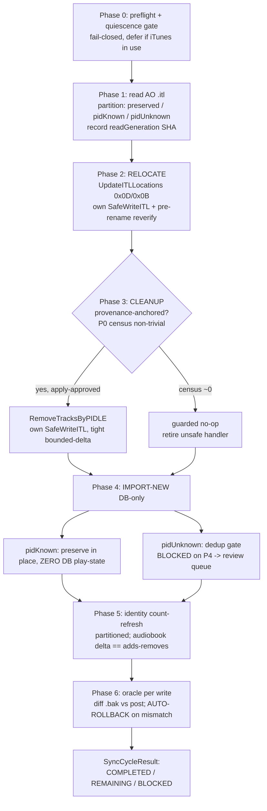

<!-- file: docs/specs/2026-07-23-itunes-2way-sync-system-design.md -->
<!-- version: 1.1.0 -->
<!-- guid: 7f3a9c2e-8b41-4d6a-9e05-2c1f4a8b7d63 -->
<!-- last-edited: 2026-07-23 -->

<!-- v1.1.0: §10a records the owner decisions RESOLVED 2026-07-23 (SHA-gated
     auto-merge carve-out; playlist-member refuse+review with measured 292 smart /
     59 static split + binary-parser caveat; V1-respect iTunes deletions; fallback
     accepted + ZFS snapshot baseline taken). Where §4/§8.1 describe the earlier
     open framing, §10a supersedes them. -->


# iTunes 2-Way Sync — Definitive Steady-State System Design + Phased Plan

**Repo:** `github.com/jdfalk/audiobook-organizer` · **Status:** DESIGN (nothing here is applied) · **Date:** 2026-07-23

This document is the single authoritative synthesis. It supersedes the framing in and folds together:
`docs/specs/2026-07-22-itunes-2way-sync-writeback-design.md`,
`docs/specs/2026-07-19-fingerprint-driven-reconciliation-design.md`, and
`docs/specs/2026-07-23-itunes-2way-sync-continuation-findings.md`.
All file:line anchors were verified against HEAD on 2026-07-23.

**Design lens:** recoverability is the top-level invariant; simplicity and honest scoping are the tie-breakers. Where earlier candidate designs disagreed, the resolutions are called out explicitly in §11.

---

## 1. Problem, the 4-state model, and the locked decisions

### 1.1 The 4-state library model

iTunes runtime state lives in a binary `.itl` database; iTunes *also* emits a read-only `.xml`/plist export that it regenerates from the `.itl` and **never reads back**. There are two physical libraries, each with these two files — four artifacts total:

| # | Artifact | Path (today) | Role |
|---|---|---|---|
| 1 | **Original `.itl`** | `books/itunes/iTunes Library.itl` | The REAL externally-managed iTunes DB. **HANDS-OFF / read-only.** Frozen, recoverable fallback. |
| 2 | **Original `.xml`** | `books/itunes/iTunes Library.xml` | Read-only export of #1 (deprecated import source). Parse-convenience only. |
| 3 | **AO `.itl`** | `.itunes-writeback/iTunes Library.itl` | The writeback library iTunes is (or will be) pointed at. **The sole live edit target.** |
| 4 | **AO `.xml`** | `.itunes-writeback/iTunes Library.xml` | iTunes-regenerated read-only export of #3. Parse-convenience only. |

**Crucial domain fact (drives every write decision):** the `.xml` is a one-way export iTunes never reads back. Therefore *the only way to change what iTunes sees is to write the `.itl`*. The `.xml` files are READ surfaces (parse convenience) exclusively; no code path ever writes them to influence iTunes.

### 1.2 Ownership rule (the invariant every phase defends)

- **AO owns the audiobook set.** Its dedup/organization wins. AO may add, relocate, and (provenance-anchored) remove *audiobook* tracks in the AO `.itl`.
- **iTunes owns everything else** — music, podcasts, *all* playlists, and *all* runtime play-state (play counts, ratings, bookmarks, date-added). AO preserves these verbatim and never authors them.

### 1.3 The three locked owner decisions (2026-07-23) — honored exactly

- **Decision 1 — HARD CUTOVER + recoverable fallback.** Once iTunes runs full-time on the AO library, the AO `.itl` is the SOLE source of truth for runtime state. The Original becomes a FROZEN, read-only, recoverable fallback. The escape hatch — *"repoint iTunes at the Original + reimport any books added since"* — must ALWAYS remain possible. AO owns the audiobook set; iTunes owns everything else, preserved verbatim.
- **Decision 2 — READ-BACK = PRESERVE-ONLY (v1).** AO does NOT ingest iTunes-side play-state/playlists into its own DB yet. Edit-in-place already keeps every field in the `.itl` untouched. DB ingest of play-state/playlists is deferred to a later phase. **v1 performs ZERO DB writes of iTunes-side play-state.**
- **Decision 3 — NEW-AUDIOBOOK IMPORT.** In steady state, import new audiobooks FROM the AO library (`IsAudiobook`-filtered), dedup-gated against the DB (fingerprint/title) so AO never re-ingests its own writeback output. Depends on dedup-on-import (reconciliation P4).

### 1.4 The core insight that makes this shippable: PID-partition of AO-side tracks

Every track AO ever wrote back into the AO `.itl` carries a PersistentID that AO already knows (recorded in `external_id_mappings` and on `BookFile.ITunesPersistentID`). Relocate preserves those PIDs. Therefore, when we read the AO `.itl` back, the audiobook tracks partition cleanly:

- **PID-known** (its PID resolves to a DB book/book_file): this is AO's own writeback output *or* a book AO already tracks. It is NEVER a "new" book. Handled by relocate + preserve-in-place. **Ships now — blocked on nothing.**
- **PID-unknown** (no PID/title/path hit): genuinely new to AO — e.g. an audiobook the owner dragged directly into iTunes on the AO library. This is the *only* bucket that needs the fingerprint dedup gate, and it is the only part **blocked on the unbuilt dedup-on-import (reconciliation P4)**.

This partition is what lets the recurring relocate + preserve loop ship immediately while the genuinely-blocked import-new capability waits for its real dependency.

---

## 2. Config model for the 4 states

### 2.1 Today (the 2-slot model that conflates roles)

`ITunesConfig` (`internal/config/config.go:236`) is a flat struct. Two path fields carry the whole model:
- `LibraryReadPath` (:242) — import source; currently the deprecated `books/itunes/…xml`.
- `LibraryWritePath` (:241) — writeback target = `.itunes-writeback/iTunes Library.itl`.
- `PathMappings` (:247) — `[{from:"W:", to:"/mnt/bigdata/books"}]`.
- `ProtectedPaths` (on `Config`, ~:633).

There is no representation of frozen-Original vs live-AO, no `.itl`/`.xml` distinction per library, and no cutover state. Confirmed greenfield.

### 2.2 Proposed model — an explicit `LibrarySet`, with the two axes separated

The two legacy fields conflate **which library is authoritative right now** with **which physical file we read vs write**. Model both axes explicitly; keep the legacy fields as **derived compatibility shims** so no downstream call site breaks on day one.

```go
// internal/config/config.go — new types

// LibraryRef is one physical iTunes library: its live binary DB and its
// read-only regenerated export. iTunes only ever READS the .itl; the .xml is a
// one-way convenience export (never read back by iTunes).
type LibraryRef struct {
    ITLPath string `json:"itl_path" mapstructure:"itl_path"` // binary runtime DB — the write/authority surface
    XMLPath string `json:"xml_path" mapstructure:"xml_path"` // read-only export — parse-convenience only
    Frozen  bool   `json:"frozen"   mapstructure:"frozen"`   // true => HANDS-OFF, read-only recoverable fallback
}

// LibrarySet models the full 4-state world plus the two orthogonal mode facts.
type LibrarySet struct {
    // Original: the REAL externally-managed iTunes library under books/itunes/**.
    // ALWAYS Frozen=true in steady state. NEVER a write target.
    Original LibraryRef `json:"original" mapstructure:"original"`

    // AO: the writeback library iTunes is pointed at, under .itunes-writeback/.
    // Its ITLPath is the sole live edit target and, post-cutover, the sole runtime truth.
    AO LibraryRef `json:"ao" mapstructure:"ao"`

    // --- The two mode facts, kept SEPARATE (resolves the safety judge's "one Mode
    //     flag conflates two facts" must-fix). During the cutover window they can
    //     legitimately differ, giving defined intermediate states. ---

    // PointedAt = which library iTunes itself is currently running against.
    // "original" | "ao". Set by the human when they repoint iTunes.
    PointedAt string `json:"pointed_at" mapstructure:"pointed_at"`

    // ImportSource = which library the importer reads NEW audiobooks from.
    // "original" (legacy one-time import) | "ao" (steady-state re-import).
    ImportSource string `json:"import_source" mapstructure:"import_source"`
}
```

Extend `ITunesConfig`:

```go
type ITunesConfig struct {
    // ... existing fields (SyncEnabled, WriteBackEnabled, AutoWriteBack, PathMappings, ...) ...
    Libraries LibrarySet `json:"libraries" mapstructure:"libraries"`
}
```

Config keys (viper/mapstructure): `itunes.libraries.original.itl_path`, `.original.xml_path`, `.original.frozen`, `.ao.itl_path`, `.ao.xml_path`, `.ao.frozen`, `.pointed_at`, `.import_source`.

### 2.3 Migration & compatibility shims (no downstream churn)

A `func (c *ITunesConfig) Resolve()` runs once at load and derives the legacy fields so `importer.Sync`/`applyDeferredITunesUpdates` and every ambient `LibraryReadPath`/`LibraryWritePath` reader keep working unchanged:

| Legacy field | Derived from |
|---|---|
| `LibraryWritePath` | `Libraries.AO.ITLPath` — **always**, regardless of mode (the write target never changes; see §4). |
| `LibraryReadPath` | Authority-dependent: `ImportSource=="original"` → `Libraries.Original.XMLPath`; `ImportSource=="ao"` → `Libraries.AO.ITLPath`. |

The orchestrator always passes an explicit per-request `library_path` override to `Execute`/`Sync`, so the shim only needs a sane default; every non-orchestrator caller of `LibraryReadPath` inherits the Authority-correct default (resolves the clean-arch judge's "enumerate every non-orchestrator caller" must-fix — the shim satisfies all of them by construction because it is computed at load).

### 2.4 Fail-closed config-load assertions (INV-1 becomes structural, not aspirational)

`config.Validate()` (near config.go:1447) MUST reject, at startup, before any handler serves:

1. `Original.ITLPath` and `Original.XMLPath` are **not** covered by `ProtectedPaths` → **abort**. (Populate `ProtectedPaths` on prod with `books/itunes/**` — this is currently an open item; landing it is a P0 gate, see §9/P0.)
2. `AO.ITLPath` resolves to anywhere under `books/itunes/**` → **abort** (a misconfigured writeback target must never point at the Original).
3. `Original.Frozen == false` while `PointedAt == "ao"` → **abort** (the fallback source cannot be silently mutable once AO is authoritative).
4. `AO.ITLPath == "" ` while any sync-cycle op is enabled → **abort** (no zero-value write target; also see §9/P6 resume-bug fix).

These four assertions are the config-layer half of the hands-off guarantee. The write-path half is §6's structural denylist inside `SafeWriteITL`.

---

## 3. The steady-state cycle as an ordered algorithm

### 3.1 Design decision: DECOUPLED writes, not one combined pass

Two earlier candidates proposed fusing relocate + cleanup + import into a single `ApplyITLOperations`/`SafeWriteITL` pass ("one backup, one oracle"). **This synthesis rejects fusion** for three reasons the judges raised:

1. Relocate is already **deployed and itl-diff-verified** (6,414 applied) as its own `UpdateITLLocations`→`SafeWriteITL` write. Rerouting it through the combined path forces re-verification of working code for no safety gain.
2. Fusion enlarges a *single* bounded-delta budget to cover three op classes, weakening blast-radius control. Decoupled writes each get their own tight, class-specific bound (§6.4).
3. The concurrency window that fusion was meant to shrink is instead closed by wiring the **already-built** `libraryNotInUse` precondition + a pre-rename checksum re-verify (§3.4). Fusion is not needed for that.

**Therefore:** each ITL-touching phase is its own `SafeWriteITL` write, with its own `.bak`, its own 10-guard contract, its own bounded-delta budget, and its own itl-diff oracle. The cycle *sequences* them; it does not merge them.

### 3.2 Phase order and rationale

```
CYCLE(cfg):                                    writes            blocked?
  Phase 0  PRE-FLIGHT & QUIESCENCE   read-only + gate           no
  Phase 1  READ + PARTITION          read-only                  no
  Phase 2  RELOCATE                  AO .itl  (its own write)    no   [ships first]
  Phase 3  CLEANUP (provenance)      AO .itl  (its own write)    conditional on P0 census
  Phase 4  IMPORT-NEW (dedup-gated)  DB only  (no .itl write)    PID-unknown branch blocked on P4
  Phase 5  IDENTITY COUNT-REFRESH    sidecar only               no
  Phase 6  VERIFY (oracle)           read-only                  no
```

Ordering rationale (resolves the clean-arch "fix or delete the import-before-cleanup rationale" must-fix): the order is **not** a data dependency between phases — it is a *safety* ordering. Relocate (0 adds/0 removes, the proven low-risk write) goes first. Cleanup reads **committed** `MergedIntoBookID`/journal state independent of this cycle's import, so its position relative to import is arbitrary-for-correctness; it is placed before import purely so a human reviewing the cycle sees removals before additions. Import writes only the DB. Identity-refresh and verify run last so the sidecar and oracle see the final on-disk state.

### 3.3 The algorithm

```
# ---- Phase 0: pre-flight & quiescence (fail-closed) ----
0.1  Assert PointedAt=="ao" and ImportSource=="ao" (else: not in steady state; refuse).
0.2  Assert Libraries.AO.ITLPath == resolved LibraryWritePath (the ONE write target).
0.3  Assert Original.Frozen && Original.{ITL,XML} under ProtectedPaths (belt-and-suspenders; config
     already asserted at load, re-assert here so a hot-reload can't slip through).
0.4  PID-uniqueness preflight: run GET /itunes/pid-integrity census. If duplicate book_file PIDs
     exceed threshold (target ~3 known-ambiguous), BLOCK the cycle — relocate correctness needs
     1 PID -> 1 book_file. (pid-repair is a separate, already-built, dry-run-gated op.)
0.5  QUIESCENCE GATE (fail-closed): call the AO-path libraryNotInUse check
     (itunes.FileActivityLibraryCheck(AO.ITLPath, window) via WithLibraryNotInUse). If iTunes holds
     the library open OR the signal is ambiguous/unknown -> treat as IN-USE -> DEFER the whole cycle.
     Never write under a live iTunes. (See §3.4 for the flush-on-quit settle window.)

# ---- Phase 1: read the AO library + partition (the 2-way starting point) ----
1.1  lib := ParseITL(AO.ITLPath)                     # itl.go:515 (binary), or ParseLibrary auto-detect
1.2  Record readGeneration := SHA256(AO.ITLPath bytes) and readTrackCount := len(lib.Tracks).
1.3  Partition lib.Tracks:
       preserved  = {t : !IsAudiobook(t)}            # music/podcasts — NEVER in any op set
       audiobook  = {t : IsAudiobook(t)}             # parser.go:107
     Further partition audiobook by PID (see §1.4):
       pidKnown   = {t : t.PID resolves via external_id_mappings / BookFile.ITunesPersistentID}
       pidUnknown = audiobook \ pidKnown
     Playlists (static+smart) are never enumerated for mutation (preserved by construction, §7).
1.4  preservedPIDs := {t.PID : t in preserved}       # captured for the disjointness assertions below

# ---- Phase 2: RELOCATE (AO owns; touch only 0x0D/0x0B) ----
2.1  ops1 := ComputeRelocateOps(store, AO.ITLPath, PathMappings)   # relocate.go:45; pidKnown only,
       location drift where DB FilePath (W:->/mnt mapped) != ITL 0x0D. 0 adds, 0 removes.
2.2  ASSERT DISJOINTNESS: {pid in ops1.LocationUpdates} ∩ preservedPIDs == ∅  (fail closed).
2.3  If ops1 non-empty: SafeWriteITL(AO.ITLPath) via UpdateITLLocations (the DEPLOYED path),
       armed with K13=LibraryPID + K14=partitioned expected count (§5) + bounded-delta (§6.4).
     Immediately before the atomic rename, RE-VERIFY SHA256(AO.ITLPath)==readGeneration
       (K17 promoted to hard reject on apply); on mismatch -> abort this write, defer cycle (§3.4).
     Gate bookkeeping on ITLWriteBackResult.UpdatedPersistentIDs (itl.go:104), never the requested set.
     Run the Phase-6 oracle for THIS write against its own SafeWriteITL .bak.

# ---- Phase 3: CLEANUP (provenance-anchored; conditional — see §6.5) ----
3.1  ops2 := ComputeMergeOrphanCleanup(store, AO.ITLPath)   # §6.5; may be empty (measure-first)
3.2  ASSERT: {pid in ops2.Removes} ∩ preservedPIDs == ∅ AND ∩ {any live playlist member} == ∅
       (fail closed — §7 playlist rule).
3.3  If ops2 non-empty AND apply-approved: SafeWriteITL(AO.ITLPath) via RemoveTracksByPIDLE,
       bounded-delta capped at the census-measured provable-orphan count (§6.4), pre-rename
       re-verify as in 2.3, then the Phase-6 oracle against this write's .bak.

# ---- Phase 4: IMPORT-NEW (DB only; dedup-gated) ----
4.1  For t in pidKnown: it is NOT new. Preserve-in-place only. ZERO DB play-state writes (Decision 2).
4.2  For t in pidUnknown:  # genuinely new to AO
       gate := DedupGate(t)     # PID/title/path already missed by definition; run fingerprint gate
       if gate == NO_MATCH:      CreateBook(t)                       # a real new audiobook
       if gate == FP_MATCH(P):   create pending dedup_candidate(t, P) # DO NOT create; DO NOT eagerly
                                                                     # bind t.PID to P (defer to human
                                                                     # resolution — clean-arch must-fix)
     NOTE: the fingerprint branch (4.2) is BLOCKED on dedup-on-import (reconciliation P4). Until it
     lands, pidUnknown is surfaced to a review queue and NOT auto-created (§9/P4). PID-known
     preserve (4.1) ships now.

# ---- Phase 5: IDENTITY COUNT-REFRESH (partitioned; §5) ----
5.1  RefreshLibraryTrackCount(AO.ITLPath): re-read, recompute counts, update sidecar TrackCount
     for the NON-AUDIOBOOK remainder only; assert the AUDIOBOOK count moved by exactly
     (adds - removes) this cycle, else FAIL/alert. LibraryPID stays pinned (never re-blessed here).

# ---- Phase 6: VERIFY (independent oracle; §8) ----
6.1  For each write that landed this cycle: PID-indexed structural diff of that write's SafeWriteITL
     .bak vs the post-write AO .itl. Assert diff == plan exactly (see §8). On ANY mismatch:
     AUTO-ROLLBACK by restoring that write's .bak (fail-safe, not alert-only), mark cycle BLOCKED,
     retain artifacts, alert operator.

# ---- Read-back = PRESERVE-ONLY (Decision 2) ----
# Play-state/bookmarks survive in the .itl by edit-in-place (never in any op set). NO DB ingestion
# of play-state or playlists in v1. That pipeline is a later phase, not this cycle.
```

### 3.4 Concurrency: the TOCTOU close and the flush-on-quit hazard

The window between the Phase-1 read and each write is where a live iTunes could mutate the `.itl`. Closed by three layered mechanisms (resolves the safety judge's TOCTOU + flush-on-quit must-fixes):

1. **Quiescence gate (Phase 0.5), fail-closed.** The **already-built** `FileActivityLibraryCheck`/`WithLibraryNotInUse` (`internal/itunes/library_activity.go:34`, wired today into `WriteBackBatcher` with a 2-min window at `service.go:111`) is re-targeted at `AO.ITLPath` and wired into the sync-cycle `SafeWriteITL` calls. Unknown/ambiguous → treat as in-use → defer. This is **wiring existing code**, not new machinery.
2. **Settle window for flush-on-quit.** iTunes flushes state to the `.itl` on quit. Require the quiescence signal to show a **stable checksum for a settle window** (e.g. mtime + SHA unchanged for N seconds) before proceeding, so we never write into the middle of iTunes' own flush.
3. **Pre-rename re-verify (K17 as a hard gate on apply).** Immediately before each `SafeWriteITL` atomic rename, re-hash the on-disk `.itl` and compare to `readGeneration` from Phase 1.2. If it moved, **abort the write** (original left byte-identical by construction) and defer the cycle to a fresh read. Today K17 is detect-and-log only (`itl_safe_write.go:227`); this promotes it to a fail-closed apply gate.

### 3.5 Mermaid overview



---

## 4. Cutover + recoverable-fallback mechanics

### 4.1 Design thesis: fallback is the *default state of the Original tree*, not a recovery procedure

The whole system obeys one data-flow rule: **AO only ever writes the AO `.itl` under `.itunes-writeback/`, and never moves/renames/deletes an audio file on disk.** The Original `.itl`/`.xml` and every audio file are physically untouched by every sync op. The escape hatch is therefore not something we hope works — it is the *default state of a tree no code path can reach* (enforced by §2.4 config assertions + §6.1 write-path denylist). Everything AO does is a reversible edit on a ZFS-snapshot-recoverable copy.

### 4.2 Cutover (one-time, owner-gated)

1. **Seed + bless the AO base identity.** AO has already relocated 6,414 file locations into `.itunes-writeback/iTunes Library.itl` (done, itl-diff-verified). Run `POST /api/v1/itunes/adopt-base` (`adoptBaseHandler`, `internal/server/itl_relocate.go:90` → `AdoptLibraryIdentity`, `relocate.go:172`) so `.identity.json` records `LibraryPID + TrackCount + PlaylistCount` from the AO bytes. This is the anti-swap anchor for all future writes. **Capture the AO `LibraryPID` at this moment** — the pre-cutover 6,414-relocation baseline may have been armed against a different identity; the first post-cutover cycle must verify against the LibraryPID blessed *here*, not an earlier one (resolves minimal-change's cutover-sequencing must-fix).
2. **Point iTunes at the AO library** (iTunes → hold Option → choose `.itunes-writeback/iTunes Library.itl`). iTunes opens it, regenerates `AO.XMLPath`, settles counts. Set `Libraries.PointedAt = "ao"`.
3. **Flip `Libraries.ImportSource = "ao"`.** This — and only this — switches the importer's read source to the AO `.itl`. The write target does not change (it was always `AO.ITLPath`).
4. **Freeze the Original.** Set `Libraries.Original.Frozen = true`. No other action is needed: it is already read-only, `ProtectedPaths`-covered, and no code writes it. Record `Original.ITLPath`'s own `LibraryPID` in config as the fallback marker.

The two mode facts (`PointedAt`, `ImportSource`) let step 2 and step 3 be distinct events, giving the cutover window defined intermediate states rather than one atomic flag flip.

### 4.3 The recoverable fallback (a designed, drilled capability)

Because the Original tree is byte-frozen, fallback is a *repoint*, not a *restore*:

```
FALLBACK():
  1. Owner quits iTunes.
  2. Owner repoints iTunes at Original.ITLPath (books/itunes/iTunes Library.itl). Reopen.
     -> iTunes is now on the last-known-good library as of cutover. Fully functional.
  3. Flip Libraries.PointedAt = "original" and Libraries.ImportSource = "original".
  4. REIMPORT-SINCE (manual/review-queue in v1 — see loss boundary + §9/P5):
       GET /api/v1/itunes/fallback-plan lists exactly the audiobooks CREATED after cutover
       (import timestamp / ITunesImportSource=AO) that the frozen Original does not contain.
       This is a queryable worklist, not a guess. The owner reimports those books.
```

### 4.4 Fallback loss boundary (stated honestly, owner-acknowledged)

Repointing to the frozen Original is **always possible** but is **lossy for post-cutover runtime state**. Enumerate exactly what the frozen Original does NOT have (it is a snapshot as of cutover):

| Lost when repointing to Original | Recoverable from |
|---|---|
| Post-cutover play counts, ratings, last-played, bookmarks | The AO `.itl` + its `.bak-<ts>` + ZFS snapshots (NOT the Original) |
| Audiobooks added in iTunes after cutover | Re-addable via the `fallback-plan` worklist; the DB is the ledger |
| Music/podcasts added in iTunes after cutover | The AO `.itl` + ZFS (NOT the Original) |
| Playlists created/modified after cutover | The AO `.itl` + ZFS (NOT the Original) |

**Precise recoverability guarantee:** *the audiobook set + audio files are always re-addable; post-cutover iTunes runtime state is recoverable only from the AO tree (`.bak`/ZFS), not from the Original.* The "repoint" half always holds unconditionally; the "reimport-since automation" half is **manual/review-queue in v1** precisely because full auto-dedup on reimport is the same unbuilt P4 dependency as import-new (resolves the safety judge's "fallback leaks the P4 dependency" must-fix — v1 fallback reimport is manual, so P5 is genuinely independent of P4).

### 4.5 The always-possible invariants (tested, §9/P5 drill)

- **INV-F1:** No sync op writes under `books/itunes/**` (config assertion §2.4 + write-path denylist §6.1; unit + integration tested).
- **INV-F2:** No sync op moves/renames/deletes any audio file (relocate is 0x0D/0x0B-only; cleanup is ITL-track-removal-only; import is `AddTracksLE`-only — none touch filesystem audio).
- **INV-F3:** The AO `.itl` and every `.bak-<RFC3339>` live on a ZFS-snapshotted dataset — any AO-side state is point-in-time recoverable even if fallback is never used.
- **Fallback drill (P5, on a ZFS clone):** cutover → add a book in iTunes → run fallback → assert Original opens byte-unchanged and the `fallback-plan` worklist names exactly the added book. Gates any prod cutover.

---

## 5. Identity / adopt-base steady-state + count-auto-refresh

### 5.1 The gap

The writeback library is the one iTunes actively mutates. Between AO cycles iTunes adds/removes *non-audiobook* tracks (music, podcasts). The only sidecar-refresh primitive today is `AdoptLibraryIdentity` (`relocate.go:172`) / `POST /itunes/adopt-base` — an **all-or-nothing** re-bless of `LibraryPID + TrackCount + up-to-1024 PID sample`. There is no delta-aware refresh. Once non-audiobook drift exceeds K14's ~10% band, even a pure location-only relocate (0 adds/0 removes) is false-rejected — because `ExpectedTrackCount` was pinned to a stale sidecar count.

### 5.2 The fix: partitioned count-auto-refresh (K13 strict, K14 re-anchored, drift-ceilinged)

Three rules, resolving the correctness + safety judges' partition and drift-ceiling must-fixes:

1. **K13 (`LibraryPID`) stays strict.** `ExpectedIdentity.LibraryPID = LoadLibraryIdentity(AO.ITLPath).LibraryPID` on every write. A `LibraryPID` change means a *different library* (reseed) and MUST fail closed until an explicit `adopt-base`. **[P0 HARD BLOCKER — do not assume: verify whether `guardLibraryIdentity` (K13) compares `LibraryPID` ONLY, or also a PID sample. The entire "verify LibraryPID, never re-bless" fallback guarantee depends on K13 being LibraryPID-only. If K13 also samples PIDs, large legitimate iTunes-side additions could trip it, and the drift-vs-reseed boundary must be redefined precisely.]**

2. **K14 (magnitude) re-anchors to the CURRENT on-disk base count each cycle — but PARTITIONED.** We re-read the library at Phase 1 anyway, so this is free:
   - `expectedAudiobookCount = priorAudiobookCount + adds − removes` (from the *verified* provenance plan, not caller-claimed counts). **Assert the actual post-write audiobook count equals this exactly; FAIL/alert otherwise.** AO owns the audiobook set, so its count is DB-authoritative and must move only by our plan.
   - Only the **non-audiobook remainder** is absorbed into the refreshed `TrackCount`. iTunes owns those tracks; their drift is legitimate and must not false-block relocate.
   This defeats the self-arming blind spot (grounding flagged that `ApplyITLOperations` computes K14's band from its *own* claimed adds/removes, so a dedup-gate bug importing a duplicate wouldn't trip K14): the audiobook side is checked against the *plan*, not the *actual*, so a bug that adds an unplanned audiobook track trips the assertion.

3. **Drift-ceiling that count-auto-refresh cannot dissolve.** Define `MaxNonAudiobookDriftPct` (independent of the plan, e.g. 25% per cycle). If the non-audiobook count moved by more than this since the last blessed count, the cycle **refuses and asks a human** rather than silently re-anchoring — so K14's re-anchoring can never absorb a catastrophic iTunes-side loss (e.g. iTunes rebuilt its library and lost half the tracks). Refresh the non-audiobook count **only when K17 confirms an external write** (positive evidence of legitimate iTunes activity); otherwise treat an unexpected count move as suspicious.

### 5.3 New primitive vs the existing re-bless

- **New: `RefreshLibraryTrackCount(itlPath)`** in `itl_identity.go` — a delta-aware sidecar update that recomputes `TrackCount`/`PlaylistCount` to current on-disk values while **preserving `LibraryPID`** (and merging newly-seen non-audiobook PIDs into the sample). Fail-closed if `LibraryPID` no longer matches. Called at the *end* of a successful cycle (Phase 5), **after** the write and gated on the Phase-6 oracle passing, so a bad cycle's count is never blessed into the K14 expectation before verification confirms it (resolves the clean-arch "reorder identity-refresh after verify" must-fix).
- **Existing: `AdoptLibraryIdentity` / `POST /adopt-base`** is narrowed to genuine reseed only — when the writeback slot is replaced/reseeded and `LibraryPID` changes. Never for routine membership drift, and never automatic (a full re-bless throws away the `LibraryPID` continuity that makes K13 meaningful).

### 5.4 Arm K14 consistently across entry points

Grounding: `UpdateITLLocations`/`InsertITLTracks`/`InsertITLPlaylist` do **not** set `ExpectedTrackCount`, so K14 is vacuously disarmed on those paths (`itl_safety_contract.go:715`), while `ApplyITLOperations` self-arms it. Standardize: the sync-cycle wrapper always passes an explicit `ContractConfig{ExpectedTrackCount: partitioned-expected, ExpectedIdentity: LibraryPID, Force: false}` on **every** `SafeWriteITL` it issues (relocate and cleanup alike), so magnitude protection is identical and derived from the freshly-refreshed partitioned count. **Steady-state cycles NEVER pass `ForceContractConfig`** (that override belongs only to `/rebuild-full`, which is guard-blocked anyway).

---

## 6. Integration of already-built ops + the redefined cleanup

### 6.1 Structural write-path denylist (last-line defense, inside SafeWriteITL)

Independent of config and of K13 (which anchors to the *target's own* sidecar and thus does NOT prevent writing the *wrong* library), add a hard guard inside `SafeWriteITL` (and any `ITLWriter` wrapper): **refuse any resolved target path under `books/itunes/**` and any path != the configured `AO.ITLPath`.** This is the caller-discipline-independent backstop the earlier designs left implicit (resolves the safety judge's "hard structural denylist inside SafeWriteITL" must-fix).

### 6.2 Integration table

| Capability | Built artifact (reuse) | Role | Change needed |
|---|---|---|---|
| **Relocate** | `relocate.go:45` `ComputeRelocateOps` → `UpdateITLLocations` (itl.go:699) → `SafeWriteITL`; `POST /itunes/relocate` | Phase 2 (verbatim, its own write) | Arm K14 partitioned (§5.4); add pre-rename re-verify (§3.4); deterministic tie-break or review-routing for the 94→0 PID-on-multiple-primaries cases (kept at 0 by the pid-repair preflight). |
| **PID uniqueness** | `enforceBookFilePIDUniqueness`; `GET /itunes/pid-integrity`; `POST /itunes/pid-repair` | Phase 0 preflight | None. Run dry-run-reviewed repair once; keep the forward invariant live. |
| **Rebuild guards** | `GuardRebuildTarget` (`library_shape.go:86`) on `/rebuild` + `/rebuild-full` | Standing footgun-blocker; cutover sanity gate | Confirm threshold (>1000 non-audiobook OR >50 playlists) active on both handlers; require `allow_full_library=true`. NOT used in the steady-state cycle (cycle is edit-in-place, never full-rebuild). |
| **adopt-base** | `adoptBaseHandler` (`itl_relocate.go:90`) | Cutover + deliberate reseed only (§5.3) | Narrow role in docs; add sibling `RefreshLibraryTrackCount` for drift. |
| **Safe remove + playlist-ref cleanup** | `RemoveTracksByPIDLE` (`itl_le_remove_by_pid.go:42`) | Phase 3 | Consume the REDEFINED selection (§6.5). |
| **libraryNotInUse** | `FileActivityLibraryCheck` / `WithLibraryNotInUse` (`library_activity.go:34`) — **already built + wired to the batcher** | Phase 0 quiescence gate | Re-target at `AO.ITLPath`; wire into sync-cycle `SafeWriteITL`; make fail-closed on unknown. **Not new work.** |
| **Merge-loser provenance** | `AutoMergeJournalEntry{WinnerID, LoserID}` (`dedup_automerge_journal.go:36`) + `MergedIntoBookID` field | Phase 3 selection input | Reconcile BOTH sources (§6.5) — reuse the journal instead of adding a new store method. |
| **Dry-run + sample removal set** | pattern from commit d1d78d15 | Phase 3 `apply=false` | None. |
| **Oracle** | `cmd/itl-diff --audit` | Phase 6 | **BUILD** a PID-indexed structural diff mode (§8.2) — `--audit` emits human text today, not a per-PID/per-playlist comparator. |

### 6.3 Sequencing precedent honored

`Sync` already flushes deferred ITL location fixes at the very start (`applyDeferredITunesUpdates`, `importer.go:663`) before matching. The orchestrator generalizes this: **write-side flush (relocate) precedes read-side import** every cycle.

### 6.4 Bounded-delta budgets (tight, per-write, not the flat 5000)

The flat `RemovedTracksMax = 5000` (`itl_safety_contract.go:141`) is a rebuild-scale cap, not a steady-state blast-radius control. Each steady-state write gets a **tight, class-specific** bound (resolves both judges' "tighten the ceiling" must-fixes):

- **Relocate:** 0 adds / 0 removes by construction; bounded-delta caps *rewrites* (0x0D/0x0B) at the planned `len(LocationUpdates)` with a small tolerance.
- **Cleanup:** `Removes` capped at (or very near) the **P0-census-measured provable-orphan count** — not 5000.
- **Import (when P4 lands):** `Adds` capped at the **dry-run-reviewed count**.
- Plus an **independent absolute sanity bound** per cycle (e.g. no single steady-state write may remove > K tracks, K small) that no plan-derived expectation can raise, so a plan/dedup-gate bug cannot pass guards by moving its own expectation.

### 6.5 The cleanup redefinition (current op is HELD / UNSAFE)

**Current criterion (`cleanup_merged.go:87–135`, confirmed by read):** enumerate books via a soft-delete-*excluding* getter, classify by `IsPrimaryVersion`, remove non-primary PIDs present in the ITL and not also owned by a primary. This **selects live non-primary audio (genuine alternate editions / version-group members), NOT merged duplicates** — merge losers are soft-deleted and *invisible* to the getter, so the op literally cannot see its intended population. Applying it would delete legitimate tracks. **HELD as unsafe; must be redefined.**

**Redefined: `ComputeMergeOrphanCleanup` — provenance-anchored removal only.** Remove a track ONLY when you can *name the surviving kept-primary track that carries the same audio*:

```
# Loser enumeration reconciles BOTH provenance sources (P0-verified — see below):
losers := union(
    books where MergedIntoBookID != nil,                 # set by FlagMetadataHashDuplicate (Pebble
                                                          #   stub) and any path that sets the field
    {LoserID from every AutoMergeJournalEntry},           # Tier-1 auto-merges (authoritative loser record)
    combine-path losers,                                  # if the combine op records losers separately
)
# CRITICAL: this requires a store accessor that INCLUDES soft-deleted rows
#           (the current getter EXCLUDES them — that exclusion is the original bug).

For each loser L (audiobook, soft-deleted):
    survivor S := resolveFinalPrimary(L)   # WALK the merge chain to the FINAL surviving primary
                                           #   (L -> S1 -> S2 -> ... -> S); handle re-merges
    require: S exists, S.IsPrimaryVersion == true, S is NOT soft-deleted
    require: S has a book_file whose PID is PRESENT in the AO .itl   # the survivor track is kept
    require: L's orphan PID is PRESENT in the AO .itl and owned by NO live book_file
    require: L's orphan PID is NOT a live member of ANY static/smart playlist  # §7 fail-closed rule
    => queue ONLY L's orphan PID for removal
```

**Hard exclusions:**
- **Reject any `version_group_id`-based removal outright.** Version groups hold genuinely different editions → that is reconciliation/regroup, never delete.
- **Fail-closed everywhere:** if the DB cannot be fully enumerated (including soft-deleted), or the survivor's track is not confirmed present, remove nothing.
- **P0 MEASURE-FIRST + HARD EXIT-GATE (resolves the safety judge's "measure-and-stop as default" must-fix):** the size of the provable-orphan set is unknown and may be ~0 (the writeback batcher was mostly functioning). Ship the **dry-run census first**. If the set is ~0, P3 **retires the old unsafe handler as a guarded no-op and does NOT build removal machinery.** Building the removal path is *conditional* on the census showing a non-trivial, provable set. The measure-and-stop branch is the default expectation.

**Why reconcile both loser sources:** the only in-tree `MergedIntoBookID` setter is `FlagMetadataHashDuplicate` (`pebble_store.go:2811`), explicitly a *PebbleStore stub* ("metadata dedup is only performed by SQLiteStore in production"). The production merge path records losers in the `AutoMergeJournalEntry{WinnerID, LoserID}` journal. A criterion keyed solely on `MergedIntoBookID` would miss the real orphan set. P0 must verify which source(s) actually carry the production losers and enumerate their union.

---

## 7. Topology / playlist-remap handling

### 7.1 What is preserved by construction

- **Relocate never opens the playlist container.** `rewriteChunksLEImpl` rewrites only blockType 0x01 (track-list msdh); blockType 0x02 (playlist-list) is copied byte-for-byte (`itl_le.go:476`). All static + smart playlists survive a relocate verbatim.
- **Smart-playlist criteria/info** (0x65/0x66) are opaque byte blobs, never decoded/re-encoded → always round-trip untouched.
- **Non-audiobook tracks** are never enumerated into any op set → untouched.
- **Per-track unknown mhoh sub-blocks** (including, apparently, the audiobook playback-position **Bookmark**) fall into the generic copy-through default branch (`itl_le.go:702`). **This survival is INCIDENTAL, not a designed guarantee** — the binary LE parser has no Bookmark field; Bookmark is read only from the `.xml` plist. §8.3 converts this accident into a checked invariant.

### 7.2 The removal topology hazard, resolved fail-closed

`RemoveTracksByPIDLE` → `RepairITLDropDanglingMtphLE` (`itl_le_repair.go:99`) **prunes** a removed track's playlist entries but never **re-points** them onto a surviving track. If a merge loser's PID was a live member of any playlist, removing it silently shrinks that playlist's cardinality — which **violates locked Decision 1's "all playlists preserved verbatim."**

**Resolution (fail-closed, resolves both the safety and minimal-change judges' must-fixes):** Phase 3 **refuses to remove any PID that is a live member of any static or smart playlist** (§6.5 requirement). Such a PID is routed to **review**, not silently pruned. Membership-*transfer* onto the surviving primary is a genuine future capability, explicitly **out of scope for v1**. This is stricter than "accept the prune" and is the only stance consistent with "verbatim."

- Provenance-anchored merge orphans that are NOT playlist members are safe to remove (the loser track shouldn't have existed as a separate playlist entity).
- Do NOT extend cleanup to topology-changing merges of *live* tracks without a membership-transfer design.
- **Folder-playlist (nested miph) caveat:** the general read parser is flat (`walkMsdhPlaylistsLE`, `itl_le.go:328`) while the repair-path scanner recurses (`locateMtphRange`, `itl_le_repair.go:50`); `ITLPlaylist.IsFolder` has an open TODO. Any "N playlists preserved" report must not over-claim folder structure — the oracle (§8) checks playlist *membership* deltas structurally, not folder labels.
- **mlah (album list)** is explicitly out of scope of both removal and the dangling-ref guard (`itl_le_remove_by_pid.go:34`) — pre-existing dangling album→TID refs are tolerated by iTunes and touching mlah historically caused corruption.

### 7.3 Cross-type PID collision measurement (P0)

Before any write, §3.3 asserts op-set PIDs are disjoint from `preservedPIDs`. This is only meaningful if audiobook and non-audiobook tracks don't share PIDs. **P0 measures cross-type PID collisions** on a snapshot; if any exist, the disjointness assertion is the fail-closed backstop (post-write oracle detection is insufficient because the bytes already landed).

---

## 8. Trigger / cadence + observability + the itl-diff acceptance oracle

### 8.1 Trigger & cadence

- **v1 — manual, HTTP-triggered** (matches today: no scheduler wires `itunes.import`/`itunes.sync`; the only non-HTTP trigger is the startup resume). One new op `itunes.sync-cycle` (`POST /api/v1/itunes/sync-cycle`), the Phase 0–6 pipeline, reusing the v1-Operation + v2-op bridge (`RegisterITunesSyncOp`, `itunes_ops.go:38`). `dry_run=true` default; `apply=true` requires the prod-apply review gate (a real `AskUserQuestion` decision, not a text reply).
- **Single-flight lock.** Never two cycles; never a cycle concurrent with a manual `relocate`/`pid-repair`/`cleanup` — all mutate the same AO `.itl` and `SafeWriteITL`'s backup/rename is not concurrency-safe.
- **Target-pinned, resume-safe op params.** The op persists `LibraryWritePath` + the resolved plan in its params and refuses on zero-value/nil params, so the pre-existing `server_lifecycle.go:157` nil-params resume bug (which would `ParseLibrary("")` against an unintended target) cannot resurface (resolves minimal-change's resume-safety must-fix).
- **v2 — scheduled, flag-gated (later).** Add `MaintenanceConfig.ITunesSyncCycle bool` (nightly window already exists, `config.go:~250`, off by default). Auto-apply *relocate-only* first (low-risk: 0 adds/0 removes, contract-guarded, itl-diff-verified class), gated on the quiescence check passing (iTunes closed overnight). Cleanup and import auto-apply stay behind explicit kill-switch flags defaulting false. **Never auto-enable import until dedup-on-import (P4) is built and the AO-self-reimport guard is proven.**

### 8.2 The oracle — a BUILD task, not an assumed capability

The AO `.itl` body is AES-encrypted; raw grep sees nothing. `cmd/itl-diff --audit` decrypts + inflates + structurally diffs — **but today it emits human-readable text**, not the structured per-PID/per-playlist comparator this design needs (resolves the safety judge's "re-scope the oracle as a BUILD task" must-fix). **P2 builds a structured diff mode** on `cmd/itl-diff`:

- A **PID-indexed track inventory diff**: for each PID, {added / removed / location-changed / metadata-changed / unchanged}.
- A **per-playlist membership diff**: for each playlist, the set of added/removed track references.

Phase 6 diffs **each write's own SafeWriteITL `.bak`** (the atomically-captured true pre-image) vs the post-write `.itl` — **not** a separately-snapshotted copy — so iTunes-side drift between a Phase-0.5 snapshot and the write can never produce a false cycle-integrity alert (resolves the safety judge's ".bak not a copy" must-fix). Assertions:

1. Changed 0x0D/0x0B blocks == that write's planned `UpdatedPersistentIDs`.
2. Removed PIDs == that write's confirmed loser set; added PIDs == planned adds (0 in v1).
3. **ZERO changes to any `!IsAudiobook` (preserved) PID.**
4. **ZERO playlist-membership changes except the mtph excisions this write accounted for.**
5. **Bookmark-preservation (§8.3).**

### 8.3 Verification is PREVENTIVE and fail-safe

On **any** oracle mismatch, **AUTO-ROLLBACK** by restoring that write's `.bak-<ts>` (not merely alert) — a contract-passing but plan-diverging write must never persist unattended (resolves the safety judge's "preventive not post-hoc" must-fix). Because `SafeWriteITL` already left the original byte-identical on guard failure, and the `.bak` captures the true pre-image, restore is well-defined. Rollback semantics stated plainly: **`SafeWriteITL`'s in-memory + re-read contract is the pre-commit guard; the Phase-6 oracle is a post-commit detector whose failure action is an explicit `.bak` restore.** The cycle is marked BLOCKED, artifacts retained, operator alerted.

**Bookmark preservation (accident → invariant):** for a sample of audiobook tracks NOT targeted by any op this cycle, assert their `mith` spans are **byte-identical** pre→post — catching any accidental clobber of the copy-through Bookmark mhoh block. **P0 additionally runs an itl-diff on a ZFS clone carrying REAL play-state (bookmarks, play counts, ratings, smart-playlist criteria)** across a relocate AND across the remove path, asserting zero changes to every untouched (`!IsAudiobook` AND untouched-audiobook) track — *byte-for-byte on the whole set for the remove/reserialize path*, not extrapolated by assertion from the relocate-only proof (resolves the safety judge's "prove field-preservation on the reserializing path" must-fix). No preservation claim is made until this passes.

### 8.4 Observability (day-one, per project logging standard)

- Structured start/progress/complete/skip per phase with **exact counts**: `PhaseResult{applied, skipped, deferred, errors}`.
- `sync-cycle: start` (pointed_at, import_source, base LibraryPID, liveAudiobookCount, liveNonAudiobookCount, dry_run).
- Per phase: `relocate: computed N ops`, `cleanup: N provable / M playlist-member-skipped / K unanchored-skipped / sample`, `import: N pidUnknown / K review-queued`.
- `guards: K13 pass, K14 audiobook expected=E actual=A, nonAudiobook drift=D% (ceiling=C%)`, `bounded-delta removed=R cap=cap`.
- `oracle: matched planned ops` OR **`CYCLE-INTEGRITY ALERT + AUTO-ROLLBACK: diff diverged from plan`**.
- Cycle result ends with the mandated honesty triplet: `COMPLETED: <n> — <list>`, `REMAINING: <n> — <list>`, `BLOCKED: <n> — <list>`. Never "done" without a count.
- New read surface `GET /itunes/sync-status`: last-cycle summary (ops applied, non-audiobook drift %, K14 headroom, last oracle verdict). Reuse `GET /itunes/pid-integrity` for PID-duplication drift.

---

## 9. Phased, gated implementation plan

Each phase: worktree + `PLAN.md` + human-approved plan first (CLAUDE.md); `-race` tests; dry-run before any prod apply; the itl-diff oracle as the accept gate; `.bak`/ZFS as rollback. Worktree-per-phase, PR-per-phase, rebase/FF.

The **minimal-viable steady-state** (resolves the safety judge's "define MVP before the framework" must-fix) is **P0 + P1 + P2**: recurring relocate (the proven path) + partitioned count-auto-refresh + the quiescence-gated sync-cycle wrapper. Everything after is additive. The 4-state config and mode facts are introduced in P0 because P2's authority preconditions and the fallback tooling need them — but no *dead* config is front-loaded; every field added in P0 is consumed by P2/P5.

### P0 — Measure + config scaffold (reads only; no prod writes). *Deps: none.*
- **Goal:** land the config model, the fail-closed assertions, and the measurement gates that decide whether later phases even build.
- **Files:** `internal/config/config.go` (`LibraryRef`/`LibrarySet`, `Resolve()`, `Validate()` assertions §2.4), `internal/itunes/cleanup_merged.go` (census only), new `cmd/itl-diff` structured-diff scaffolding stub.
- **Measurements (hard exit-gates):**
  - **K13 semantics** — LibraryPID-only vs PID-sample (§5.2 rule 1). Blocks P1/P2 arming design.
  - **Cleanup provenance census** — enumerate the union of `MergedIntoBookID` + `AutoMergeJournalEntry.LoserID` + combine-path losers; measure the provable-orphan set (§6.5). If ~0 → P3 becomes measure-and-stop.
  - **Cross-type PID collisions** (§7.3); **PID-on-multiple-primaries** (already 94→0 via pid-repair — confirm).
  - **Field-preservation proof** on a ZFS clone with real play-state, relocate AND remove paths (§8.3).
  - **ProtectedPaths populated on prod** with `books/itunes/**` and the config-load assertion landed (§2.4) — INV-1 is aspirational until both exist.
  - Confirm no `RebuildITLFromDB`/`ComputeITLDiff` caller exists outside the two guarded handlers.
- **Tests:** config resolve/alias + all four `Validate()` rejections; census dry-run on a snapshot; clone-based preservation itl-diff.
- **Rollback:** config-only + read-only; revert PR.
- **Blocked?** No.

### P1 — Partitioned count-auto-refresh + identity steady-state. *Deps: P0 (K13 verification).*
- **Goal:** iTunes-side non-audiobook drift never false-blocks relocate; audiobook count stays plan-authoritative.
- **Files:** `internal/itunes/itl_identity.go` (`RefreshLibraryTrackCount`), the sync-cycle arming wrapper (partitioned `ExpectedTrackCount`, K13 pin, drift-ceiling refusal).
- **Tests:** drift-injection (add N non-audiobook tracks to a clone → a 0-op relocate still passes K14); audiobook-delta-mismatch (inject an unplanned audiobook add → assert FAIL); reseed (`LibraryPID` change → K13 rejects until adopt-base); drift-ceiling (> `MaxNonAudiobookDriftPct` → cycle refuses).
- **Rollback:** new function unused by default; revert.
- **Blocked?** No.

### P2 — The `itunes.sync-cycle` op (relocate-only, dry-run-first) + the oracle. *Deps: P1.*
- **Goal:** the shippable recurring loop: quiescence-gated relocate with the structured oracle and auto-rollback.
- **Files:** new `internal/server/handlers/itunes_sync_cycle.go` + op registration; wire `WithLibraryNotInUse` at the AO path (re-target existing `FileActivityLibraryCheck`, make fail-closed) + settle window + pre-rename re-verify (§3.4); `cmd/itl-diff` structured PID-indexed + per-playlist diff mode (§8.2); Phase-6 auto-rollback; write-path denylist inside `SafeWriteITL` (§6.1).
- **Tests:** full-cycle integration on a clone (relocate + oracle assertion + sidecar refresh); library-in-use defer; pre-rename-mismatch abort (mutate the `.itl` mid-cycle → assert abort, original intact); oracle-mismatch auto-rollback (inject a divergent write → assert `.bak` restored); denylist (attempt a write targeting `books/itunes/**` → refused).
- **Rollback:** op additive; disable flag; every write leaves a `.bak`.
- **Blocked?** No. **This is the end of the minimal-viable steady-state.**

### P3 — Redefined provenance-anchored cleanup (CONDITIONAL). *Deps: P2; P0 census non-trivial; new soft-delete-including store accessor.*
- **Goal:** remove ONLY provable merge orphans; retire the unsafe handler.
- **Files:** `internal/itunes/cleanup_merged.go` (replace criterion with `ComputeMergeOrphanCleanup`, §6.5 — union loser sources, chain-walk to final primary, playlist-member fail-closed, version-group rejection), new store accessor including `MarkedForDeletion`.
- **Behavior gate:** if P0 census ~0 → **guarded no-op**, document, do NOT build removal machinery. If non-trivial → build, fold `Removes` into its own `SafeWriteITL` write with a census-capped bounded-delta; `apply=false` dry-run + sample; prod-apply behind `AskUserQuestion`.
- **Tests:** fabricated merge (loser soft-deleted, survivor primary kept, not in any playlist) → only the orphan PID removed; loser that IS a playlist member → routed to review, NOT removed; unanchored loser → skipped; version-group edition → NEVER selected (regression against the old criterion); chain re-merge → resolves to final primary; oracle confirms only planned PIDs removed + only accounted mtph excised.
- **Rollback:** cleanup contributes 0 ops by default until explicitly enabled.
- **Blocked?** Conditional on the P0 census.

### P4 — Dedup-gated import-new (BLOCKED — the hard dependency). *Deps: dedup-on-import (reconciliation P4), which is UNBUILT.*
- **Goal:** ingest genuinely-new AO-side audiobooks (`pidUnknown`) without AO re-ingesting its own writeback output.
- **Buildable now (does NOT need P4):** the PID/title/path self-reimport defense — reuse `Sync`'s existing `pidIndex`/`titleIndex`/`pathIndex` (`importer.go:706`) + the `external_id_mappings` tombstone, with `IsAudiobook` source-filtering the AO `.itl`. Because relocate preserves PIDs, *every track AO previously wrote back matches here and takes the update path, not create* — this alone satisfies "AO never re-ingests its own writeback output" for the common case. **Play-state on matched rows: ZERO DB writes (Decision 2)** — the `.itl` already carries iTunes play-state; the cycle does not mirror it into the DB in v1.
- **BLOCKED — the fingerprint branch for `pidUnknown` no-PID/title/path-hit tracks.** Grounding is decisive: fingerprint matching runs at import (`CheckBook`→`runUnifiedScoringForBook`, `engine.go:528/654`) but only ever writes **pending** candidates — nothing auto-merges except exact byte-identical `FileHash` (won't catch iTunes-reprocessed writeback output). `AutoResolveCertain` is manual-only; `AutoResolveEnabled` defaults false ("never defaulted true"); reconciliation spec §8.1 locks fingerprint auto-resolve to **REVIEW-FIRST ALWAYS**. Therefore P4's fingerprint branch ships as **flag-not-merge**: fingerprint-match → create a *pending* `dedup_candidate` against the matched primary, do NOT create a new book, do NOT eagerly bind the AO PID to the primary (defer to human resolution). True auto-absorb-into-primary stays **blocked on an explicit owner §8.1 carve-out** for the AO-self-reimport case (see §10).
- **Until P4/§8.1:** the cycle's import phase produces zero `CreateBook` for fp-matched tracks and zero Adds to the `.itl`; new audiobooks dragged into iTunes wait in a review queue. Relocate + cleanup steady-state is fully functional without it.
- **Tests:** AO writeback track (preserved PID) → update path, zero new books, zero DB play-state writes; genuinely-new AO track, no fp match → 1 review-queue entry (not silent create); new track with fp match → 0 new books + 1 pending candidate, PID not eagerly bound.
- **Blocked?** **Yes — fingerprint branch on reconciliation-P4 + owner §8.1 carve-out.** PID/title/path defense + preserve is buildable now.

### P5 — Cutover tooling + fallback capability + drill + scheduling. *Deps: P2 (+ P3 if built).*
- **Goal:** make cutover and the recoverable fallback real, tested, and (optionally) scheduled.
- **Files:** `GET /itunes/fallback-plan` (post-cutover added-books worklist); cutover runbook wiring `adopt-base` + the two mode-fact flips + `Frozen` assertions; the ZFS-clone fallback drill; the flag-gated maintenance-window trigger (relocate-only auto-apply first).
- **Fallback reimport in v1 is manual/review-queue** (independent of P4 — §4.4).
- **Tests:** the drill (cutover → add book → fallback → Original byte-unchanged + `fallback-plan` names exactly the added book); INV-F1/F2/F3 assertion tests (no write under `books/itunes/**`, no audio-file mutation, snapshot recoverability); config refuses to unfreeze Original while `PointedAt=="ao"`.
- **Rollback:** disable op/flag; the drill gates any prod cutover.
- **Blocked?** No (fallback repoint half); the auto-reimport half stays manual until P4.

### P6 — Cadence flag hardening (deferred). *Deps: clean prod dry-runs from P1–P3, P5.*
- **Goal:** safe scheduled operation.
- **Files:** `MaintenanceConfig.ITunesSyncCycle` (off by default); wire orchestrator into the maintenance window; fix the `server_lifecycle.go:157` nil-params resume bug.
- **Blocked?** No, but explicitly last.

**Cross-cutting rollback:** every ITL-touching phase routes through `SafeWriteITL` (original byte-identical on any guard failure + `.bak-<ts>`), combined with ZFS snapshots and the always-recoverable frozen Original. Audio files on disk are never touched by any phase.

---

## 10. Decisions + open risks

### 10a. Owner decisions — RESOLVED 2026-07-23

1. **§8.1 auto-merge carve-out — RESOLVED: SHA-gated auto-merge, else review.** For a `pidUnknown` new-in-iTunes audiobook that matches an existing AO book, **auto-merge ONLY when the file content hash (`FileHash`/SHA) is byte-identical** on both sides — i.e. 100% proof it is the same file (this is AO's own writeback output re-imported, or a literal duplicate). This aligns with the engine's existing exact-`FileHash` auto-resolve (the only auto-merge already permitted). **Any non-exact match (fingerprint-similar but not byte-identical) is review-gated** — create a pending `dedup_candidate`, do NOT auto-create, do NOT bind the PID. This is the narrow carve-out to `AutoResolveEnabled=false`: exact-hash only. So P4's fingerprint branch = flag-not-merge; the SHA branch = auto-merge. Removes the "one hard product blocker" — the carve-out is now defined and provably safe (byte-identity is not a heuristic).
5. **Playlist-member removal — RESOLVED: fail-closed refuse + review (option 1).** Measured on the live AO library (`.xml` export, 2026-07-23): **351 playlists = 292 smart / 59 static.** Smart playlists store only rules (`SmartCriteria`) and self-recompute → **immune to track removal, preserved automatically** (already mirrored to `UserPlaylist`). Only the **59 static** playlists (explicit `mtph` track lists — incl. real per-audiobook chapter lists, the owner's custom lists, system playlists, and some junk like `Playlist 2`/79,818 items) are the removal hazard. Cleanup **refuses to remove any track that is a live member of a static playlist; routes to review.** Membership-*transfer* is deferred. Cost is near-zero in practice (the P3 removal set may be ~0). **⚠️ Design correction (measured): the binary LE `.itl` parser does NOT classify smart vs static** (it reported all 357 as static; only the `.xml` knew the 292/59 split) — so the static-membership safety check MUST derive membership from the `.xml` export (`AO.XMLPath`) or a fixed parser, never the binary `IsSmart`. (Optional separate cleanup: purge the junk static playlists — owner's call, out of the sync loop.)
6. **iTunes-side audiobook deletion — RESOLVED: V1 respects it, V2 smarter.** When a `pidKnown` audiobook track is deleted in iTunes (its PID vanishes from the AO `.itl`), **v1 respects the deletion** (does not auto-re-add; relocate won't match a vanished PID) and surfaces it in `sync-status` as drift. A smarter reconciliation (AO-set-authoritative re-add with human awareness) is **deferred to V2.**
7. **Fallback runtime-state loss — RESOLVED: accepted (repoint, not mirror) + snapshot taken.** Owner accepts that repointing to the frozen baseline resets post-cutover runtime state to the snapshot (recoverable from AO `.itl`/`.bak`/ZFS, not merged back). **Fallback baseline captured 2026-07-23: ZFS snapshot `bigdata/BD/bigdata/books@itunes-ao-fallback-2026-07-23`** of the *current working AO library* (iTunes is already pointed at AO and healthy) — so the fallback is a snapshot of the known-good AO state, not (only) the older Original tree. No periodic play-state export in v1.

### 10b. P0 verification tasks (facts to measure, not owner choices)

2. **K13 PID-sample question (P0 hard blocker).** Verify whether `guardLibraryIdentity` compares `LibraryPID` only or also samples track PIDs. The "verify identity, never re-bless" fallback guarantee depends on LibraryPID-only. Must be read from code in P0 before P1 arming.
3. **Cleanup provenance source + set size (P0 measure).** The only in-tree `MergedIntoBookID` setter is a Pebble stub; production losers live in `AutoMergeJournalEntry`. P0 enumerates the union and measures the provable-orphan set — P3 may correctly be a measure-and-stop no-op.
4. **Bookmark preservation is currently incidental (P0 byte-proof).** No binary-LE field models it; survival is copy-through. P0's ZFS-clone byte-identity proof (relocate AND remove paths) converts it to a checked invariant — no preservation claim until it passes.

---

## Appendix A — Invariant summary (the safety contract of the whole system)

| ID | Invariant | Enforced by |
|---|---|---|
| INV-1 | AO only ever writes `.itunes-writeback/…itl`; never `books/itunes/**` | Config-load assertions (§2.4) + write-path denylist inside `SafeWriteITL` (§6.1) |
| INV-2 | No sync op moves/renames/deletes any audio file | Ops are ITL-only (0x0D/0x0B rewrite, track add/remove) |
| INV-3 | Every `.itl` write goes through `SafeWriteITL` (backup + 10 guards ×2 + auto-rollback) | The `SafeWriteITL` chokepoint |
| INV-4 | Steady-state never uses `ForceContractConfig`; per-write tight bounded-delta always armed | Cycle passes explicit non-Force `ContractConfig` (§5.4, §6.4) |
| INV-5 | `LibraryPID` (K13) pins identity; only a genuine reseed re-blesses via `adopt-base` | K13 + `RefreshLibraryTrackCount` (count-only) vs `AdoptLibraryIdentity` (full) |
| INV-6 | iTunes-side non-audiobook drift never false-blocks relocate; audiobook count stays plan-authoritative | Partitioned K14 re-anchor + drift-ceiling refusal (§5.2) |
| INV-7 | Non-audiobooks + all playlists + all play-state preserved verbatim | Never enumerated into op set; rewrite path skips playlist container; playlist-member removals refused (§7.2) |
| INV-8 | Every write is independently verified against its plan; divergence auto-rolls-back | PID-indexed `itl-diff` oracle vs `.bak` + auto-restore (§8) |
| INV-9 | Repoint-at-Original always possible; reimport-since is queryable (manual in v1) | INV-1/2/3 + frozen Original + `fallback-plan` + tested drill (§4, §9/P5) |
| INV-10 | Cleanup removes a track only when a surviving kept-primary track carries the same audio | Provenance-anchored `ComputeMergeOrphanCleanup`; version-group removal rejected (§6.5) |
| INV-11 | No write under a live iTunes; TOCTOU closed | Fail-closed quiescence gate + settle window + pre-rename re-verify (§3.4) |
| INV-12 | v1 writes ZERO iTunes-side play-state into the DB | Decision 2; Phase 4 preserve-only (§3.3, §9/P4) |

**The one hard blocker:** steady-state import-new's *fingerprint branch* (P4) depends on dedup-on-import (reconciliation P4, unbuilt) and an owner §8.1 carve-out. Relocate + partitioned-count-refresh + provenance-anchored-cleanup + cutover/fallback (P0–P3, P5) are fully deliverable **without** it; the fingerprint auto-absorb is the only capability that must wait.

---

## Appendix B — Key file anchors

Config `internal/config/config.go:236` (`ITunesConfig`, `LibraryWritePath`:241, `LibraryReadPath`:242, `PathMappings`:247), `ProtectedPaths` ~:633. Endpoints/handlers: `internal/server/server_lifecycle.go:1301` (pid-integrity/pid-repair/adopt-base), `internal/server/itl_relocate.go` (relocate:48, adopt-base:90), `itl_cleanup.go`, `itl_pid.go`, `itl_rebuild.go`. iTunes core: `internal/itunes/relocate.go:45/172`, `cleanup_merged.go:50/87` (UNSAFE criterion), `itl.go:515/699` (ParseITL/UpdateITLLocations), `itl_le.go:328/476/702` (playlist/rewrite/copy-through), `itl_le_remove_by_pid.go:42`, `itl_le_repair.go:99`, `itl_combined_mutate.go:92`, `itl_safe_write.go:181/185/227`, `itl_safety_contract.go:141/152/713/789` (bounded-delta/orderedGuards/K14/K13), `itl_identity.go:149`, `library_activity.go:34` (FileActivityLibraryCheck), `library_shape.go:86` (GuardRebuildTarget). Import: `internal/itunes/service/importer.go:663/706/779`, `internal/server/itunes_ops.go:38`, `internal/server/server_lifecycle.go:157` (nil-params resume bug). Dedup: `internal/dedup/engine.go:528/654`, `auto_resolve.go:97`, `internal/database/dedup_automerge_journal.go:36` (`AutoMergeJournalEntry`), `internal/database/pebble_store.go:2811` (`MergedIntoBookID` stub setter). Oracle: `cmd/itl-diff`.
