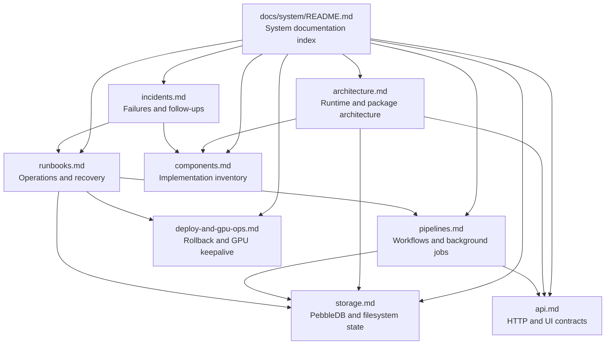

<!-- file: docs/system/README.md -->
<!-- version: 1.3.0 -->
<!-- guid: 42030117-6ba8-4f26-a2c6-9b5f9014ef88 -->
<!-- last-edited: 2026-07-11 -->

# System Documentation

> **Status:** DOCS-1 workstream complete (#1276). All eight area documents below are
> written and cross-linked, covering the issue's six-item scope (process graphs/data
> flow, architecture diagrams, component inventory, operations runbooks, incident
> history, and API/storage detail). No scope item is deferred. Incident history was
> last refreshed 2026-07-11 with the July STOREFID/concurrency work.

Audiobook Organizer is a single-binary server (Go backend, React frontend) for scanning,
normalizing, enriching, deduplicating, organizing, and serving audiobook
libraries. The backend exposes Gin API routes, coordinates long-running
operation pipelines, stores domain state in PebbleDB (activity-log data is stored in NutsDB), and embeds the
compiled React UI so the same binary can manage library data, filesystem
changes, metadata fetches, AI-assisted parsing, and operational workflows.

## Documentation Index

| Document | Summary |
|---|---|
| [Architecture](architecture.md) | System boundaries, runtime shape, package responsibilities, and request flow. |
| [Pipelines](pipelines.md) | Scan, metadata, deduplication, organization, import, and background operation flows. |
| [Storage](storage.md) | PebbleDB keyspaces, logical entities, filesystem assets, migrations, and persistence tradeoffs. |
| [API](api.md) | HTTP route families, authentication expectations, response conventions, and frontend/API contracts. |
| [Runbooks](runbooks.md) | Operational procedures for local builds, production service care, deployments, backups, and recovery. |
| [Components](components.md) | Backend packages, frontend surfaces, integrations, and their primary ownership areas. |
| [Incidents](incidents.md) | Known failure modes, historical incident notes, diagnostic entry points, and prevention follow-ups. |
| [Deploy & GPU Ops](deploy-and-gpu-ops.md) | Deploy rollback flow, local-config templates, and Windows GPU (Ollama) keepalive. |

## Site Map

