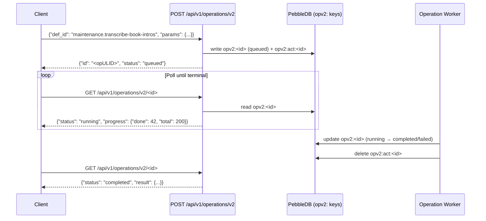

<!-- file: docs/system/api.md -->
<!-- version: 1.0.0 -->
<!-- guid: d4e5f6a7-b8c9-0123-def0-123456789012 -->
<!-- last-edited: 2026-06-29 -->

# HTTP API

The Audiobook Organizer backend exposes a JSON REST API under `/api/v1/`. All endpoints require authentication except `/api/v1/auth/bootstrap` (first-run setup) and `/api/v1/auth/status`.

## Authentication

**All API calls must include:**
```
Authorization: Bearer <token>
```

Token types:
- `abk_…` prefix — API key (persistent, programmatic access). Routed through API key validation.
- Session token — short-lived cookie-backed token from browser login. Also accepted in `Authorization: Bearer`.

**Never use `X-API-Key` header** — it is not supported.

To obtain an API key:
1. Bootstrap admin via `POST /api/v1/auth/bootstrap` (first-run only). Response: `{ "data": { "api_key": "abk_…" } }`
2. Or: log in via browser, then `POST /api/v1/auth/api-keys` to create a persistent key.

## Endpoint Reference

### Library / Audiobooks

| Method | Path | Description |
|---|---|---|
| `GET` | `/api/v1/audiobooks` | List books with filtering and pagination |
| `GET` | `/api/v1/audiobooks/:id` | Get single book with enrichment |
| `PATCH` | `/api/v1/audiobooks/:id` | Update book metadata |
| `DELETE` | `/api/v1/audiobooks/:id` | Soft-delete book |
| `POST` | `/api/v1/audiobooks/batch-operations` | Per-item update / delete / restore |
| `GET` | `/api/v1/audiobooks/:id/files` | List book file segments |
| `GET` | `/api/v1/audiobooks/:id/cover` | Get cover art image |
| `POST` | `/api/v1/audiobooks/:id/cover` | Upload/replace cover art |
| `GET` | `/api/v1/audiobooks/:id/activity` | Activity log entries for a book |
| `GET` | `/api/v1/audiobooks/:id/changelog` | Metadata changelog |

#### Library List Query Parameters

| Parameter | Type | Default | Notes |
|---|---|---|---|
| `limit` | int | 20 | Max 1000 |
| `offset` | int | 0 | Pagination offset |
| `sort_by` | string | `title` | `title`, `author`, `duration`, `created_at`, `updated_at` |
| `sort_order` | string | `asc` | `asc` or `desc` |
| `is_primary_version` | bool | — | Filter to primary versions only |
| `show_quarantined` | bool | false | Include quarantined books |
| `author_id` | string | — | Filter by author ULID |
| `series_id` | string | — | Filter by series ULID |
| `search` | string | — | Full-text search query |
| `review_status` | string | — | `matched`, `no_match`, `audio_confirmed` |
| `has_cover` | bool | — | Filter by cover art presence |
| `fingerprint_status` | string | — | `has_fingerprint`, `no_fingerprint` |

### Authors and Series

| Method | Path | Description |
|---|---|---|
| `GET` | `/api/v1/authors` | List authors |
| `GET` | `/api/v1/authors/:id` | Get author |
| `PATCH` | `/api/v1/authors/:id` | Update author |
| `DELETE` | `/api/v1/authors/:id` | Delete author |
| `GET` | `/api/v1/series` | List series |
| `GET` | `/api/v1/series/:id` | Get series |
| `PATCH` | `/api/v1/series/:id` | Update series |

### Metadata

| Method | Path | Description |
|---|---|---|
| `POST` | `/api/v1/audiobooks/:id/metadata/fetch` | Trigger metadata fetch for a book |
| `POST` | `/api/v1/audiobooks/:id/metadata/apply` | Apply fetched metadata |
| `GET` | `/api/v1/audiobooks/:id/metadata/candidates` | List scored metadata candidates |
| `POST` | `/api/v1/metadata/batch-fetch` | Queue bulk metadata fetch |

### Deduplication

| Method | Path | Description |
|---|---|---|
| `GET` | `/api/v1/dedup/candidates` | List dedup candidate pairs |
| `POST` | `/api/v1/dedup/candidates/:id/resolve` | Resolve a candidate pair |
| `GET` | `/api/v1/dedup/stats` | Dedup statistics |

### Operations (v2)

| Method | Path | Description |
|---|---|---|
| `POST` | `/api/v1/operations/v2` | Launch an operation by def_id |
| `GET` | `/api/v1/operations/v2` | List all operations (recent) |
| `GET` | `/api/v1/operations/v2/:id` | Poll operation status |
| `DELETE` | `/api/v1/operations/v2/:id` | Cancel operation |

### Maintenance / Admin

| Method | Path | Description |
|---|---|---|
| `POST` | `/api/v1/admin/scan` | Trigger library scan |
| `POST` | `/api/v1/admin/recompact-digests` | Recompact NutsDB activity digests |
| `GET` | `/api/v1/admin/diagnostics` | Diagnostic ZIP export |
| `POST` | `/api/v1/backup/create` | Create PebbleDB backup (checkpoint) |

### Authentication

| Method | Path | Description |
|---|---|---|
| `POST` | `/api/v1/auth/bootstrap` | First-run admin setup |
| `GET` | `/api/v1/auth/status` | Session status (unauthenticated OK) |
| `POST` | `/api/v1/auth/login` | Login with username/password |
| `POST` | `/api/v1/auth/logout` | Invalidate session |
| `POST` | `/api/v1/auth/api-keys` | Create API key |
| `GET` | `/api/v1/auth/api-keys` | List API keys |
| `GET` | `/api/v1/auth/api-keys/:id` | Get API key |
| `PATCH` | `/api/v1/auth/api-keys/:id` | Enable/disable key |
| `DELETE` | `/api/v1/auth/api-keys/:id` | Revoke key |

## Operations v2 Lifecycle

Operations are long-running jobs (scan, transcription, dedup, organize, etc.) that run in the background with real-time progress reporting.



### Known def_ids

| def_id | Description |
|---|---|
| `maintenance.transcribe-book-intros` | Whisper intro transcription (`reparse_only` param supported) |
| `maintenance.transcribe-book-intros` (reparse_only) | Re-parse stored transcripts only (no GPU/ffmpeg) |
| `maintenance.dedup-exact-triage` | Classify dedup candidates (read-only, dry-run) |
| `maintenance.dedup-auto-purge` | Purge confirmed purgeable dedup candidates |
| `maintenance.itunes-heal` | Heal stale iTunes file paths after organize |
| `maintenance.reconcile-scan` | Reconcile library paths vs. filesystem |
| `maintenance.author-dedup-scan` | Scan for author near-duplicates |
| `maintenance.window` | Nightly maintenance window (dispatches sub-ops) |
| `library.bulk-write-back` | Bulk tag write-back to audio files |
| `ai.author-review` | AI-assisted author dedup review |
| `ai.author-merge-apply` | Apply AI author merge recommendations |

## Response Conventions

All responses use the envelope format:
```json
{
  "data": { ... },
  "error": null
}
```

Errors:
```json
{
  "data": null,
  "error": "human-readable error message"
}
```

Pagination responses include `total` alongside `data`:
```json
{
  "data": [...],
  "total": 10891,
  "limit": 20,
  "offset": 0
}
```

## Cross-references

- Architecture (handler wiring): [architecture.md](architecture.md)
- Pipelines (operation internals): [pipelines.md](pipelines.md)
- Runbooks (deploy and ops): [runbooks.md](runbooks.md)
