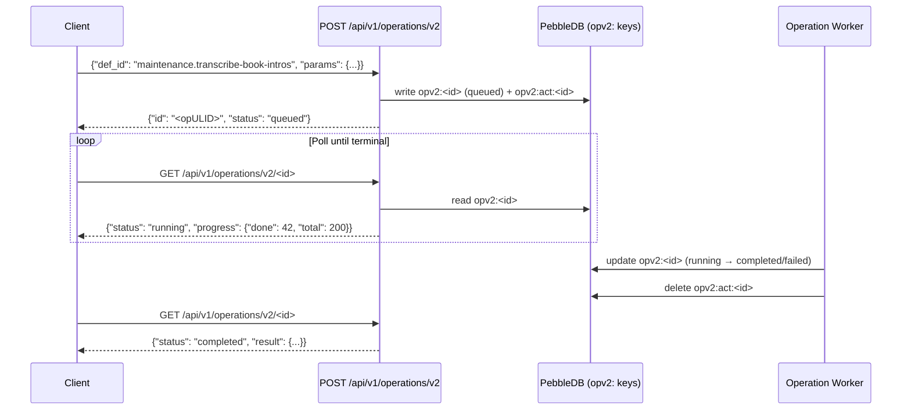

<!-- file: docs/system/api.md -->
<!-- version: 1.5.0 -->
<!-- guid: d4e5f6a7-b8c9-0123-def0-123456789012 -->
<!-- last-edited: 2026-10-03 -->

# HTTP API

The Audiobook Organizer backend exposes a JSON REST API under `/api/v1/`. All endpoints require authentication except `/api/v1/auth/bootstrap` (first-run setup) and `/api/v1/auth/status`.

## Authentication

**All API calls must include:**
```
Authorization: Bearer <token>
```

Token types:
- `abk_…` prefix — API key (persistent, programmatic access). Routed through API key validation.
- Session token — short-lived cookie-backed token from browser login. Also accepted in `Authorization: Bearer`.

**Never use `X-API-Key` header** — it is not supported.

To obtain an API key:
1. Bootstrap admin via `POST /api/v1/auth/bootstrap` (first-run only). Response: `{ "data": { "api_key": "abk_…" } }`
2. Or: log in via browser, then `POST /api/v1/auth/api-keys` to create a persistent key.

## Endpoint Reference

### Library / Audiobooks

| Method | Path | Description |
|---|---|---|
| `GET` | `/api/v1/audiobooks` | List books with filtering and pagination |
| `GET` | `/api/v1/audiobooks/:id` | Get single book with enrichment |
| `PUT` | `/api/v1/audiobooks/:id` | Update book metadata |
| `DELETE` | `/api/v1/audiobooks/:id` | Soft-delete book |
| `POST` | `/api/v1/audiobooks/batch-operations` | Per-item update / delete / restore |
| `GET` | `/api/v1/audiobooks/:id/files` | List book file segments |
| `GET` | `/api/v1/audiobooks/:id/cover` | Get cover art image |
| `GET` | `/api/v1/audiobooks/:id/cover-text` | Vision-extracted cover text |
| `GET` | `/api/v1/audiobooks/:id/changelog` | Metadata changelog |
| `GET` | `/api/v1/audiobooks/:id/metadata-history` | Per-field metadata history (`/:field`, `/:field/undo`) |
| `POST` | `/api/v1/audiobooks/:id/rescan` | Reconcile the book's files against disk (`/force-rescan` re-reads tags) |

#### Library List Query Parameters

| Parameter | Type | Default | Notes |
|---|---|---|---|
| `limit` | int | 20 | Max 1000 |
| `offset` | int | 0 | Pagination offset |
| `sort_by` | string | `title` | `title`, `author`, `duration`, `created_at`, `updated_at` |
| `sort_order` | string | `asc` | `asc` or `desc` |
| `is_primary_version` | bool | — | Filter to primary versions only |
| `show_quarantined` | bool | false | Include quarantined books |
| `author_id` | string | — | Filter by author ULID |
| `series_id` | string | — | Filter by series ULID |
| `search` | string | — | Full-text search query |
| `review_status` | string | — | `matched`, `no_match`, `audio_confirmed` |
| `has_cover` | bool | — | Filter by cover art presence |
| `fingerprint_status` | string | — | `has_fingerprint`, `no_fingerprint` |

### Authors and Series

| Method | Path | Description |
|---|---|---|
| `GET` | `/api/v1/authors` | List authors |
| `GET` | `/api/v1/authors/:id` | Get author (`/books`, `/aliases`) |
| `PUT` | `/api/v1/authors/:id/name` | Rename author |
| `POST` | `/api/v1/authors/:id/split` · `/reclassify-as-narrator` · `/resolve-production` | Author repairs |
| `POST` | `/api/v1/authors/merge` | Merge authors |
| `DELETE` | `/api/v1/authors/:id` | Delete author (`POST /authors/bulk-delete` for many) |
| `GET` | `/api/v1/series` | List series |
| `PATCH` | `/api/v1/series/:id` | Update series name (`PUT /series/:id/name`, `/split`, `DELETE` empty series) |
| `GET` | `/api/v1/series/duplicates` · `/prune/preview` · `/normalize/preview` | Series dedup / prune / normalize previews (POST applies) |

### Metadata

| Method | Path | Description |
|---|---|---|
| `POST` | `/api/v1/audiobooks/:id/fetch-metadata` | Trigger metadata fetch for a book |
| `POST` | `/api/v1/audiobooks/:id/apply-metadata` | Apply fetched metadata |
| `GET` | `/api/v1/audiobooks/:id/metadata-rejections` | Candidates a human rejected for this book |
| `POST` | `/api/v1/metadata/bulk-fetch` | Queue bulk metadata fetch |
| `GET` | `/api/v1/metadata/search` · `/fields` | Provider search; known metadata fields |
| `GET` | `/api/v1/metadata/providers/throttles` | Provider throttle state (`DELETE` clears) |

### Deduplication

| Method | Path | Description |
|---|---|---|
| `GET` | `/api/v1/dedup/candidates` | List dedup candidate pairs (`/export`, `/:id/breakdown`) |
| `POST` | `/api/v1/dedup/candidates/:id/link` | Link (merge) a candidate pair; `/:id/reject` dismisses it. `/merge` and `/dismiss` are deprecated aliases |
| `POST` | `/api/v1/dedup/candidates/bulk-link` · `/link-cluster` · `/reject-cluster` | Bulk and cluster forms of link/reject |
| `POST` | `/api/v1/dedup/scan` · `/scan-llm` · `/scan-acoustid` · `/scan-book-signature` · `/split-book-scan` | Trigger the dedup scans (each enqueues a v2 op) |
| `GET` | `/api/v1/dedup/stats` | Dedup statistics |

### Review Queue

The producer-agnostic review queue behind the `/review` workspace's **Review queue** lane (`internal/server/handlers/review`). Reads need `library.view`; mutations need `library.edit-metadata`.

| Method | Path | Description |
|---|---|---|
| `GET` | `/api/v1/review/count` | Pending item count |
| `GET` | `/api/v1/review/items` | List review items |
| `POST` | `/api/v1/review/items/:id/approve` | Approve; dispatches the chosen action to its apply handler only while `review_apply_enabled` is on, otherwise records `approved` |
| `POST` | `/api/v1/review/items/:id/reject` | Reject |
| `POST` | `/api/v1/review/bulk` | Bulk approve/reject |
| `POST` | `/api/v1/review/replay-approved` | Re-run apply for items already approved |

### Repairs Lane

Library fixers built on `internal/repairs`; the **Repairs** lane of `/review` calls these (`internal/server/wire_repairs_routes.go`, handler `internal/server/handlers/repairs`).

| Method | Path | Description |
|---|---|---|
| `GET` | `/api/v1/repairs` | List fixers: `{fixers: [{id, title, description, last_plan, last_apply}]}` |
| `POST` | `/api/v1/repairs/:fixer/plan` | Enqueue a `repairs.plan` run (a "trial"); 202 with `operation_id`; an identical queued/running request is deduped |
| `GET` | `/api/v1/repairs/:fixer/plan/:op_id/rows` | Page the stored plan's rows: `?filter=`, `?class=`, `?offset=`, `?limit=` |
| `POST` | `/api/v1/repairs/:fixer/apply` | Enqueue `repairs.apply` for `{plan_op_id, row_ids, dry_run}`; only an explicit `dry_run: false` writes, omitted means preview |

Registered fixers: `duplicate-copies`, `folder-books`, `fragment-consolidation`, `maintenance.normalize-letter-l-ordinals`, `maintenance.repair-junk-authors`, `maintenance.repair-junk-titles`, `version-group-primary-repair`. Apply re-plans each selected row and refuses one whose fingerprint changed (`changed_since_plan`); rows under `books/itunes/**` or Doctor Who / Big Finish / Torchwood are skipped at plan time and refused at apply time; nothing is deleted through the lane.

### Operations (v2)

| Method | Path | Description |
|---|---|---|
| `POST` | `/api/v1/operations/v2` | Launch an operation by def_id |
| `GET` | `/api/v1/operations/v2` | List all operations (recent) |
| `GET` | `/api/v1/operations/v2/:id` | Poll operation status |
| `DELETE` | `/api/v1/operations/v2/:id` | Cancel operation |
| `POST` | `/api/v1/operations/v2/:id/retry` | Re-run a finished operation as a new run (202) |
| `DELETE` | `/api/v1/operations/v2/:id/record` | Discard: delete the persisted record of a finished or interrupted run (204; 409 while queued/running) |

Retired 2026-09-11: `DELETE /api/v1/operations/history?status=…` now answers 404.
It deleted from the legacy v1 `operation:` keyspace by status and reported the
count as success, while the rows the Activity page shows (v2) were untouched.
Remove finished runs one at a time with `DELETE /api/v1/operations/v2/:id/record`.

### Maintenance / Admin

| Method | Path | Description |
|---|---|---|
| `POST` | `/api/v1/operations/v2` `{"def_id":"library.scan"}` | Trigger a library scan (there is no separate scan route) |
| `POST` | `/api/v1/admin/recompact-digests` | Enqueue `maintenance.recompact-activity-digests` (re-derives legacy digest items on every activity backend); 202 with the op id |
| `POST` | `/api/v1/diagnostics/export` | Diagnostic ZIP export (`GET /diagnostics/export/:operationId/download`; `/diagnostics/db-health`) |
| `POST` | `/api/v1/backup/create` | Create PebbleDB backup (checkpoint) |
| `POST` | `/api/v1/system/reset` · `/system/factory-reset` | Admin-only resets |

### Authentication

| Method | Path | Description |
|---|---|---|
| `POST` | `/api/v1/auth/bootstrap` | First-run admin setup |
| `GET` | `/api/v1/auth/status` | Session status (unauthenticated OK) |
| `POST` | `/api/v1/auth/login` | Login with username/password |
| `POST` | `/api/v1/auth/logout` | Invalidate session |
| `POST` | `/api/v1/auth/api-keys` | Create API key |
| `GET` | `/api/v1/auth/api-keys` | List API keys |
| `GET` | `/api/v1/auth/api-keys/:id` | Get API key |
| `PATCH` | `/api/v1/auth/api-keys/:id` | Enable/disable key |
| `DELETE` | `/api/v1/auth/api-keys/:id` | Revoke key |

## Operations v2 Lifecycle

Operations are long-running jobs (scan, transcription, dedup, organize, etc.) that run in the background with real-time progress reporting.


```mermaid
sequenceDiagram
    participant Client
    participant API as POST /api/v1/operations/v2
    participant DB as PebbleDB (opv2: keys)
    participant Worker as Operation Worker

    Client->>API: {"def_id": "maintenance.transcribe-book-intros", "params": {...}}
    API->>DB: write opv2:<id> (queued) + opv2:act:<id>
    API-->>Client: {"id": "<opULID>", "status": "queued"}

    loop Poll until terminal
        Client->>API: GET /api/v1/operations/v2/<id>
        API->>DB: read opv2:<id>
        API-->>Client: {"status": "running", "progress": {"done": 42, "total": 200}}
    end

    Worker->>DB: update opv2:<id> (running → completed/failed)
    Worker->>DB: delete opv2:act:<id>

    Client->>API: GET /api/v1/operations/v2/<id>
    API-->>Client: {"status": "completed", "result": {...}}
```

### Known def_ids

| def_id | Description |
|---|---|
| `maintenance.transcribe-book-intros` | Whisper intro transcription (`reparse_only` param supported) |
| `maintenance.transcribe-book-intros` (reparse_only) | Re-parse stored transcripts only (no GPU/ffmpeg) |
| `maintenance.dedup-exact-triage` | Classify dedup candidates (read-only, dry-run) |
| `dedup.purge-stale` | Cleanup stale dedup candidates (manual) |
| `repairs.plan` / `repairs.apply` | Repairs lane plan ("trial") and apply runs; launched via `/api/v1/repairs/:fixer/*` |
| `maintenance.version-group-primary-repair` | Elect exactly one primary per version group (also the `version-group-primary-repair` fixer) |
| `maintenance.purge-empty-authors` / `maintenance.purge-empty-narrators` | Purge author/narrator rows with no books (fail-closed ref counts) |
| `library.scan` | Library scan (per-book scan lock since #3635, so repairs may apply during a scan) |
| `itunes.heal` | Heal stale iTunes file paths after organize (former ID `maintenance.itunes-heal` still resolves) |
| `maintenance.reconcile-scan` | Reconcile library paths vs. filesystem |
| `maintenance.author-dedup-scan` | Scan for author near-duplicates |
| `maintenance.window` | Nightly maintenance window (dispatches sub-ops) |
| `library.bulk-write-back` | Bulk tag write-back to audio files |
| `ai.author-review` | AI-assisted author dedup review |
| `ai.author-merge-apply` | Apply AI author merge recommendations |

**Renamed def_ids.** A renamed op keeps its old ID as an alias
(`OperationDef.FormerIDs`). The old ID is accepted by `POST /operations/v2`,
`?def_id=` timeline filters, resume and retry, and it resolves to the new op.
Stored rows keep the ID they were written under. The metric
`audiobook_organizer_operation_deprecated_def_id_total{alias,entry}` counts
how often each old ID is still used. The 2026-09-25 renames are
`maintenance.itunes-{regroup,playlist-import,heal,clone-into-library}` →
`itunes.{regroup,playlist-import,heal,clone-into-library}`, `library.optimize`
→ `maintenance.library-optimize`, and `maintenance.dedup-llm-review` →
`dedup.llm-review`.

## Response Conventions

All responses use the envelope format:
```json
{
  "data": { ... },
  "error": null
}
```

Errors:
```json
{
  "data": null,
  "error": "human-readable error message"
}
```

Pagination responses include `total` alongside `data`:
```json
{
  "data": [...],
  "total": 10891,
  "limit": 20,
  "offset": 0
}
```

## Cross-references

- Architecture (handler wiring): [architecture.md](architecture.md)
- Pipelines (operation internals): [pipelines.md](pipelines.md)
- Runbooks (deploy and ops): [runbooks.md](runbooks.md)
