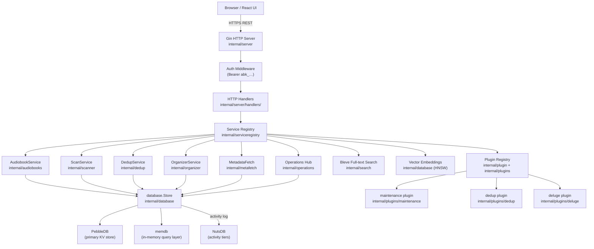

<!-- file: docs/system/architecture.md -->
<!-- version: 1.0.0 -->
<!-- guid: a1b2c3d4-e5f6-7890-abcd-ef1234567890 -->
<!-- last-edited: 2026-06-29 -->

# System Architecture

Audiobook Organizer is a single-binary Go server that embeds a compiled React/TypeScript frontend via `//go:embed web/dist`. The same binary serves the UI, the REST API, and all background operations.

## Runtime Shape

```
┌────────────────────────────────────────────────────────┐
│  audiobook-organizer binary (linux/amd64)              │
│                                                        │
│  ┌──────────────┐   ┌─────────────────────────────┐   │
│  │  Gin HTTP    │   │  React 18 / TypeScript UI    │   │
│  │  server      │   │  (embedded via go:embed)     │   │
│  └──────┬───────┘   └─────────────────────────────┘   │
│         │                                              │
│  ┌──────▼──────────────────────────────────────────┐  │
│  │  Service Registry (serviceregistry.Container)   │  │
│  │  KeyStore / KeyScan / KeyDedup / KeyOrganize … │  │
│  └──────┬──────────────────────────────────────────┘  │
│         │                                              │
│  ┌──────▼───────────────────────────────────────────┐ │
│  │  Domain Services                                  │ │
│  │  audiobooks · scanner · organizer · dedup        │ │
│  │  metafetch · matcher · fingerprint · tagger      │ │
│  │  transcribe · search · activity · operations     │ │
│  └──────┬───────────────────────────────────────────┘ │
│         │                                              │
│  ┌──────▼────────────────────────┐                    │
│  │  Store Layer                  │                    │
│  │  PebbleDB (primary)           │                    │
│  │  memdb (in-memory query)      │                    │
│  │  NutsDB (activity log)        │                    │
│  └───────────────────────────────┘                    │
└────────────────────────────────────────────────────────┘
```

## Component Overview



## Service Registry / Container Pattern

All domain services are registered in `internal/serviceregistry` with string keys defined in `internal/serviceregistry/keys.go`. During server startup (`NewServer`), the registry resolves dependency order, calls `Build`, then `PostInit` before wiring HTTP handlers. The known keys are:

| Key constant | Service |
|---|---|
| `KeyStore` | `database.Store` (PebbleDB-backed) |
| `KeyScan` | Scanner / importer |
| `KeyDedup` | Dedup engine |
| `KeyOrganize` | File organizer |
| `KeyMetaFetch` | Metadata fetch + scoring |
| `KeyActivity` | Activity log service |
| `KeyOpHub` | Operations hub (v2 registry) |
| `KeyITunes` | iTunes XML sync |
| `KeyConfig` | Configuration service |
| `KeyWork` | Work-item / task queue |

## Layer Responsibilities

### HTTP Layer (`internal/server`)

- Gin engine with CORS, security headers, session/cookie auth middleware
- Routes split across per-domain files: `wire_auth_routes.go`, `wire_library_routes.go`, `wire_audiobooks_routes.go`, `wire_metadata_routes.go`, `wire_entities_routes.go`, `wire_operations_routes.go`, `wire_system_routes.go`, `wire_dedup_routes.go`, `wire_media_routes.go`
- Handler instantiation stays in `wire_handlers.go`

### Operations / Plugin System

Long-running jobs run as v2 Operations registered via `opsregistry.OperationDef`. Plugins (`internal/plugin` SDK, `internal/plugins/*`) implement the `sdk.Plugin` interface and register their `OperationDef` entries at startup. The operation hub persists state to PebbleDB (`opv2:*` keys) and exposes `POST /api/v1/operations/v2` and `GET /api/v1/operations/v2/:id` for launch and polling.

### AI / Embeddings

- `internal/ai`: OpenAI batch job dispatch and universal batch poller
- `internal/metafetch`: Multi-source metadata scoring (Open Library, Google Books, Audible scraper)
- `internal/database`: local vector embeddings (bge-m3 via Ollama) stored in PebbleDB; optional HNSW index for fast ANN queries

### Frontend Embedding

The React UI is compiled by `npm run build` into `web/dist/`, then embedded at compile time via `//go:embed web/dist` with the `embed_frontend` build tag. The `make build` target handles both steps. `make build-api` skips the frontend build for faster backend iteration.

## Build Tags

| Tag | Effect |
|---|---|
| `embed_frontend` | Embeds `web/dist` into binary (required for production) |
| _(none)_ | API-only binary; UI served from dev Vite server |

## Cross-references

- Storage details: [storage.md](storage.md)
- Pipeline flows: [pipelines.md](pipelines.md)
- HTTP API surface: [api.md](api.md)
- Package inventory: [components.md](components.md)
