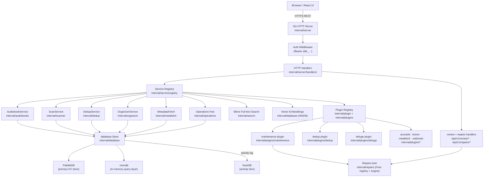

<!-- file: docs/system/architecture.md -->
<!-- version: 1.1.0 -->
<!-- guid: a1b2c3d4-e5f6-7890-abcd-ef1234567890 -->
<!-- last-edited: 2026-10-03 -->

# System Architecture

Audiobook Organizer is a single-binary Go server that embeds a compiled React/TypeScript frontend via `//go:embed web/dist`. The same binary serves the UI, the REST API, and all background operations.

## Runtime Shape

```
┌────────────────────────────────────────────────────────┐
│  audiobook-organizer binary (linux/amd64)              │
│                                                        │
│  ┌──────────────┐   ┌─────────────────────────────┐   │
│  │  Gin HTTP    │   │  React 18 / TypeScript UI    │   │
│  │  server      │   │  (embedded via go:embed)     │   │
│  └──────┬───────┘   └─────────────────────────────┘   │
│         │                                              │
│  ┌──────▼──────────────────────────────────────────┐  │
│  │  Service Registry (serviceregistry.Container)   │  │
│  │  KeyStore / KeyScan / KeyDedup / KeyOrganize … │  │
│  └──────┬──────────────────────────────────────────┘  │
│         │                                              │
│  ┌──────▼───────────────────────────────────────────┐ │
│  │  Domain Services                                  │ │
│  │  audiobooks · scanner · organizer · dedup        │ │
│  │  metafetch · matcher · fingerprint · tagger      │ │
│  │  transcribe · search · activity · operations     │ │
│  └──────┬───────────────────────────────────────────┘ │
│         │                                              │
│  ┌──────▼────────────────────────┐                    │
│  │  Store Layer                  │                    │
│  │  PebbleDB (primary)           │                    │
│  │  memdb (in-memory query)      │                    │
│  │  NutsDB (activity log)        │                    │
│  └───────────────────────────────┘                    │
└────────────────────────────────────────────────────────┘
```

## Component Overview


```mermaid
flowchart TD
    Browser["Browser / React UI"] -->|"HTTPS REST"| GinHTTP["Gin HTTP Server\ninternal/server"]
    GinHTTP --> AuthMW["Auth Middleware\n(Bearer abk_…)"]
    AuthMW --> Handlers["HTTP Handlers\ninternal/server/handlers/"]
    Handlers --> SvcReg["Service Registry\ninternal/serviceregistry"]
    SvcReg --> AudiobookSvc["AudiobookService\ninternal/audiobooks"]
    SvcReg --> ScanSvc["ScanService\ninternal/scanner"]
    SvcReg --> DedupSvc["DedupService\ninternal/dedup"]
    SvcReg --> OrgSvc["OrganizerService\ninternal/organizer"]
    SvcReg --> MetaFetch["MetadataFetch\ninternal/metafetch"]
    SvcReg --> OpHub["Operations Hub\ninternal/operations"]
    AudiobookSvc --> Store["database.Store\ninternal/database"]
    ScanSvc --> Store
    DedupSvc --> Store
    OrgSvc --> Store
    MetaFetch --> Store
    OpHub --> Store
    Store --> Pebble["PebbleDB\n(primary KV store)"]
    Store --> MemDB["memdb\n(in-memory query layer)"]
    Store -->|"activity log"| NutsDB["NutsDB\n(activity tiers)"]
    SvcReg --> Search["Bleve Full-text Search\ninternal/search"]
    SvcReg --> Embeddings["Vector Embeddings\ninternal/database (HNSW)"]
    SvcReg --> PluginReg["Plugin Registry\ninternal/plugin + internal/plugins"]
    PluginReg --> MaintenancePlug["maintenance plugin\ninternal/plugins/maintenance"]
    PluginReg --> DedupPlug["dedup plugin\ninternal/plugins/dedup"]
    PluginReg --> DelugePlug["deluge plugin\ninternal/plugins/deluge"]
    PluginReg --> OtherPlugs["acoustid · itunes · metafetch · webhook\ninternal/plugins/*"]
    MaintenancePlug --> Repairs["Repairs lane\ninternal/repairs (Fixer registry + engine)"]
    Handlers --> ReviewH["review + repairs handlers\n/api/v1/review/* · /api/v1/repairs/*"]
    ReviewH --> Repairs
```

## Service Registry / Container Pattern

All domain services are registered in `internal/serviceregistry` with string keys defined in `internal/serviceregistry/keys.go`. During server startup (`NewServer`), the registry resolves dependency order, calls `Build`, then `PostInit` before wiring HTTP handlers. The keys in `keys.go` are:

| Key constant | Service |
|---|---|
| `KeyStore` | `database.Store` (PebbleDB-backed) |
| `KeyActivity`, `KeyActivityStore` | Activity log service and its store |
| `KeyAudiobook` | AudiobookService (list/filter/get/update) |
| `KeyBatch` | AI batch job dispatch |
| `KeyConfig`, `KeyConfigUpdate` | Configuration read and update services |
| `KeyDashboard` | Dashboard stats |
| `KeyDedup` | Dedup engine |
| `KeyEmbeddingStore` | Vector embedding store |
| `KeyEventBus` | SSE event bus |
| `KeyFilesystem` | Filesystem abstraction |
| `KeyImportPath` | Import-path management |
| `KeyITunes` | iTunes XML sync |
| `KeyMerge` | Book merge service |
| `KeyMetadataState`, `KeyMetaFetch` | Metadata state tracking; metadata fetch + scoring |
| `KeyOpHub` | Operations hub (v2 registry) |
| `KeyOrganize` | File organizer |
| `KeyQuarantine` | Quarantine zone |
| `KeyScan` | Scanner / importer |
| `KeySystem` | System info / reset |
| `KeyUpdater` | Auto-updater |
| `KeyWork` | Work-item / task queue |

## Layer Responsibilities

### HTTP Layer (`internal/server`)

- Gin engine with CORS, security headers, session/cookie auth middleware
- Routes split across per-domain files: `wire_abs_routes.go` (Audiobookshelf-compatible surface), `wire_audiobooks_routes.go`, `wire_auth_routes.go`, `wire_catalog_routes.go`, `wire_dedup_routes.go`, `wire_entities_routes.go`, `wire_fpworker_routes.go` (remote fingerprint workers), `wire_library_routes.go`, `wire_media_routes.go`, `wire_metadata_routes.go`, `wire_operations_routes.go`, `wire_repairs_routes.go`, `wire_review_routes.go`, `wire_system_routes.go`
- Handler instantiation stays in `wire_handlers.go`; handlers live in per-domain packages under `internal/server/handlers/` (`abs`, `review`, `repairs`, …)

### Operations / Plugin System

Long-running jobs run as v2 Operations registered via `registry.OperationDef` (`internal/operations/registry`). Plugins (`internal/plugin` SDK, `internal/plugins/{acoustid,dedup,deluge,itunes,maintenance,metafetch,webhook}`) implement the `sdk.Plugin` interface and register their `OperationDef` entries at startup. The operation hub persists state to PebbleDB (`opv2:*` keys) and exposes `POST /api/v1/operations/v2` and `GET /api/v1/operations/v2/:id` for launch and polling, plus `/retry` and `/record` (see [api.md](api.md)). A renamed def keeps its old ID as an alias (`OperationDef.FormerIDs`), and `OperationDef.Permissions` is checked on the trigger route.

### Review Workspace and Repairs Lane

`/review` in the UI is one workspace with four lanes — Review queue, Duplicates, Metadata and Repairs (`web/src/components/review/lanes/`). The review queue (`internal/server/handlers/review`, `database.ReviewStore`) is producer-agnostic: a producer such as the regroup op writes items, a human approves or rejects, and approve dispatches on the chosen action to a registered apply handler only while `review_apply_enabled` is on; `POST /review/replay-approved` re-runs approved items later.

The Repairs lane is the shared framework in `internal/repairs`: a `Fixer` (`ID/Title/Description/Plan/Replan/Apply`) decides what a row is and how one row is written, and the engine owns everything that must not differ between fixers — plans run as the `repairs.plan` operation with every row stored in the op result, `repairs.apply` takes explicit row ids from a stored plan and refuses a row whose fingerprint changed (`changed_since_plan`), rows under `books/itunes/**` or Doctor Who / Big Finish / Torchwood are skipped and refused, writes go through a `Writer` that records metadata history and offers no delete, and apply holds the library-scan stand-down. The maintenance plugin registers the fixers (`Plugin.Repairs()`): `duplicate-copies`, `folder-books`, `fragment-consolidation`, `maintenance.normalize-letter-l-ordinals`, `maintenance.repair-junk-authors`, `maintenance.repair-junk-titles`, `version-group-primary-repair`. HTTP surface: `GET /api/v1/repairs`, `POST /repairs/:fixer/plan`, `GET /repairs/:fixer/plan/:op_id/rows`, `POST /repairs/:fixer/apply`.

### AI / Embeddings

- `internal/ai`: OpenAI batch job dispatch and universal batch poller
- `internal/metafetch`: Multi-source metadata scoring (Open Library, Google Books, Audible scraper)
- `internal/database`: local vector embeddings (bge-m3 via Ollama) stored in PebbleDB; optional HNSW index for fast ANN queries

### Frontend Embedding

The React UI is compiled by `npm run build` into `web/dist/`, then embedded at compile time via `//go:embed web/dist` with the `embed_frontend` build tag. The `make build` target handles both steps. `make build-api` skips the frontend build for faster backend iteration.

## Build Tags

| Tag | Effect |
|---|---|
| `embed_frontend` | Embeds `web/dist` into binary (required for production) |
| _(none)_ | API-only binary; UI served from dev Vite server |

## Cross-references

- Storage details: [storage.md](storage.md)
- Pipeline flows: [pipelines.md](pipelines.md)
- HTTP API surface: [api.md](api.md)
- Package inventory: [components.md](components.md)
