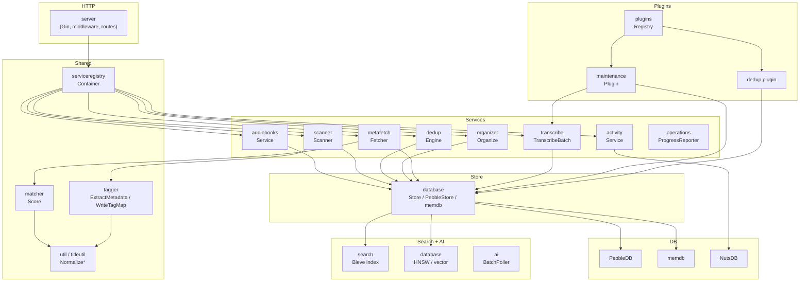

<!-- file: docs/system/components.md -->
<!-- version: 1.0.0 -->
<!-- guid: f6a7b8c9-d0e1-2345-f012-345678901234 -->
<!-- last-edited: 2026-06-29 -->

# Component Inventory

This document lists all backend packages in `internal/`, their responsibilities, and key types or entry points.

## Package Map

| Package | Responsibility | Key types / entry points |
|---|---|---|
| `acoustid` | AcoustID fingerprint submission and lookup | `Client`, `Lookup` |
| `activity` | Activity log service (write events, query, compact) | `Service`, `Entry`, `DigestDetails` |
| `ai` | OpenAI batch job dispatch; universal batch poller | `BatchPoller`, `JobDispatcher` |
| `aiscan` | AI-driven audiobook scan result store | `AIJobStore`, `ScanResult` |
| `audio` | Audio file utilities (duration, format detection) | `Info`, `GetDuration` |
| `audiobooks` | Core AudiobookService: list, filter, get, update, delete | `Service`, split across `service_query.go`, `service_mutation.go`, `service_filtering.go`, `service_tags.go` |
| `auth` | Session management, password hashing, API key CRUD | `SessionStore`, `APIKeyStore` |
| `backup` | PebbleDB checkpoint backup; `Checkpointable` interface | `CreateBackupWithCheckpoint`, `Checkpointable` |
| `batch` | OpenAI batch-job creation and result retrieval | `BatchClient` |
| `cache` | Generic TTL-keyed in-memory cache | `Cache[K,V]` |
| `config` | Server configuration struct hierarchy (7 sub-structs) | `Config`, `EmbeddingConfig`, `DedupConfig`, `ITunesConfig`, … |
| `covers` | Cover art storage, SHA-256 dedup, history archival | `Store`, `WriteImage`, `DeduplicateCover` |
| `database` | Store interfaces, PebbleDB impl, memdb, NutsDB, schema | `Store`, `PebbleStore`, `BookReader`, `BookWriter`, `OpsV2Store` |
| `dedup` | Unified dedup scoring engine, LSH index, candidate management | `Engine`, `LSHIndex`, `Candidate`, `UnifiedScorer` |
| `deluge` | Deluge torrent download integration and importer | `Client`, `Centralizer` |
| `diagnosis` | Structured diagnostic result types | `Result`, `Finding` |
| `diagnostics` | Diagnostic ZIP export and AI batch analysis | `Exporter`, `AnalyzeZIP` |
| `download` | Generic HTTP download with progress tracking | `Downloader` |
| `fileops` | Safe file move/copy/rename with copy-on-write | `MoveFile`, `CopyFile`, `SafeRename` |
| `fingerprint` | fpcalc / Chromaprint fingerprint pipeline | `FingerprintFile`, `doFingerprintFile` |
| `httputil` | Shared HTTP response helpers, error wrapping | `RespondJSON`, `RespondError` |
| `importer` | Generic file importer (non-iTunes) | `Importer` |
| `itunes` | iTunes XML parser, PID backfill, path translation (W:\ → /mnt/bigdata/books/) | `Parser`, `BackfillExternalIDs`, `HealPaths` |
| `logger` | Structured slog wrapper with request context | `Logger`, `FromContext` |
| `logging` | Log-level management and log-line formatting | `LevelSetter` |
| `maintenance` | Plugin package: all maintenance OperationDefs (scan, organize, transcribe, dedup-triage, reconcile, …) | `Plugin`, multiple `*Def()` + `run*()` methods |
| `matcher` | Fuzzy title/author matching for metadata scoring | `Score`, `NormalizeTitle`, `NormalizeAuthor` |
| `mediainfo` | `mediainfo` CLI wrapper; extended format/codec metadata | `GetInfo`, `FileInfo` |
| `merge` | Book merge/consolidation service | `Merger`, `MergeBooks` |
| `metabatch` | Bulk metadata fetch queue and batch dispatch | `BatchQueue`, `Dispatcher` |
| `metadata` | Metadata state tracking, apply pipeline, tag priority logic | `ApplyPipeline`, `isProtectedPath`, `MetadataState` |
| `metafetch` | Multi-source metadata fetch (Open Library, Google Books, Audible) + scoring with transcription hints | `Fetcher`, `pickBestMatchFromScored`, `transcriptionHints` |
| `metrics` | Prometheus metrics collection and NutsDB metrics store | `MetricsStore`, `Collector` |
| `models` | Shared domain model types (not database-specific) | `AudiobookSummary`, `TagMap` |
| `mtls` | mTLS bridge for subprocess isolation (Whisper, etc.) | `Bridge`, `Client` |
| `openlibrary` | Open Library API client for ISBN/ASIN lookup | `Client`, `Search` |
| `operations` | Operations v1 legacy types and `ProgressReporter` interface | `ProgressReporter`, `Operation` |
| `organizer` | File rename/move according to configurable template | `Organize`, `PreviewOrganize`, `BuildPath` |
| `pathutil` | Safe path utilities, import-path conflict detection | `IsUnder`, `IsDangerousRoot` |
| `playlist` | Playlist CRUD and playback order management | `Service`, `Playlist`, `Item` |
| `plugin` | Plugin SDK: `OperationDef`, `Reporter`, `Plugin` interface | `OperationDef`, `Plugin`, `Reporter` |
| `plugins` | Plugin registry and built-in plugin loader | `Registry`, `Load` |
| `policy` | Authorization policy (role checks) | `Policy`, `CanAdmin` |
| `quarantine` | Quarantine zone: mark/unmark books for manual review | `Service`, `Quarantine` |
| `readstatus` | Per-user book read/unread/in-progress status | `StatusStore` |
| `realtime` | Server-Sent Events bus for live operation progress | `EventBus`, `Publish` |
| `reconcile` | Path reconciliation (BookFile.FilePath vs. actual filesystem) | `Reconciler`, `ReconcileBook` |
| `remux` | ffmpeg-based audio remux for format conversion | `Remux`, `Options` |
| `scanner` | Filesystem scanner: walk, group, extract, upsert | `Scanner`, `ScanResult`, `DetectMultiFileGroup` |
| `scheduler` | Cron-based scheduled operation dispatcher | `Scheduler`, `Schedule` |
| `search` | Bleve full-text search index management | `Index`, `Search`, `IndexBook` |
| `server` | Gin HTTP server, middleware, route wiring, serviceregistry wiring | `Server`, `NewServer`, `wireServerFromContainer` |
| `serviceregistry` | Dependency-injection container for domain services | `Container`, `Get[T]`, keys in `keys.go` |
| `sweep` | Bulk sweep utilities for large-library fan-out | `Sweep`, `RunItems[T]` |
| `sysinfo` | System info (disk usage, OS, Go runtime stats) | `SystemInfo`, `DiskUsage` |
| `tagger` | taglib-based tag read/write (standard + `AUDIOBOOK_ORGANIZER_*` custom tags) | `ExtractMetadata`, `WriteTagMap`, `WriteImage` |
| `telemetry` | OpenTelemetry tracing setup | `Setup`, `Tracer` |
| `titleutil` | Title normalization, subtitle stripping, sort-key generation | `NormalizeTitle`, `SortKey` |
| `tools` | Developer CLI tools (reconcile-paths, etc.) | various `main` packages in `tools/cmd/` |
| `transcode` | ffmpeg-based audio transcode (MP3/M4B/AAC target) | `Transcode`, `Options` |
| `transcribe` | Whisper batch transcription: `TranscribeBatch`, `ParseAudiobookIntro`, embedded `batch_whisper.py` | `TranscribeBatch`, `ParseAudiobookIntro`, `IntroFields` |
| `undo` | Undo-stack for reversible operations (tag write, rename) | `Stack`, `Push`, `Pop` |
| `updater` | Auto-update checker and release download | `Updater`, `CheckLatest` |
| `util` | String utilities: `NormalizeTitle`, `NormalizeAuthor`, `NormalizeString` | `NormalizeTitle`, `NormalizeAuthor` |
| `versions` | Version-group management (multiple physical files of same book) | `GroupVersions`, `VersionGroup` |
| `watcher` | Filesystem watcher for new-file notifications | `Watcher`, `Watch` |
| `work` | Work-item queue for async DB operations | `Queue`, `WorkItem` |
| `writeback` | Tag write-back coordinator: build tag map, call tagger, record changelog | `WriteBack`, `BuildFullTagMap` |

## Dependency Flowchart

## Frontend Surfaces

The React/TypeScript UI (`web/src/`) provides these main views:

| Surface | Description |
|---|---|
| Library | Book list with column toggles, quick-filter presets, search, pagination (max 1000) |
| Book detail | Metadata, files (format-grouped trays), iTunes linked panel, version group chip |
| Tag comparison | Transposed table: tags as columns, sources as rows; resizable; snapshot dismiss |
| Changelog | Timeline with revert buttons; clicking metadata_apply or tag_write shows snapshot diff |
| Dedup | Unified dedup tab with candidate pairs, triage results, scoring breakdown |
| Diagnostics | ZIP export, AI batch analysis, results review |
| Activity log | Namespace-colored tag chips, click-to-filter, per-item timestamps, digest expansion |
| Settings | Import paths, metadata sources, backup, config sub-structs (7 groups) |

## Cross-references

- Architecture overview: [architecture.md](architecture.md)
- Incident history: [incidents.md](incidents.md)
