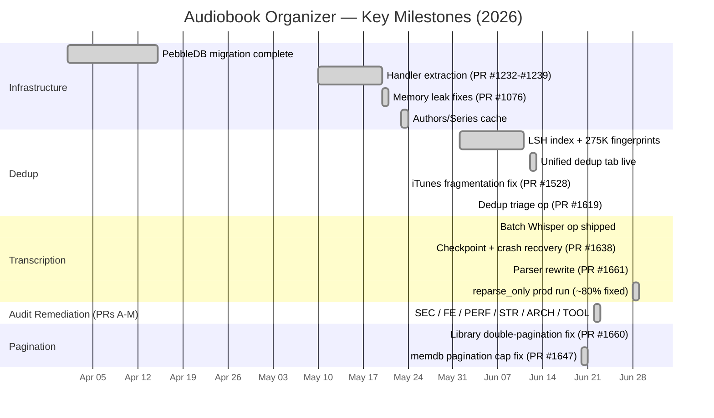

<!-- file: docs/system/incidents.md -->
<!-- version: 1.0.0 -->
<!-- guid: a7b8c9d0-e1f2-3456-0123-456789012345 -->
<!-- last-edited: 2026-06-29 -->

# Incidents and Decisions

This document records known failure modes, historical incidents, architectural decisions, and follow-up actions. Use it as a first stop when diagnosing unexpected behavior.

## Incident Log

### INC-01: memdb pagination cap (PR #1647)

**Date:** 2026-06 (discovered during full-library job)
**Component:** `internal/database` — `GetAllBooksFrom` memdb path
**Root cause:** The cursor-pagination path in `GetAllBooksFrom` was silently capped at `2 * limit` (~400 books). For libraries with >400 books, jobs that iterated via `GetAllBooksFrom` would process only the first 400 books and silently stop. The tail of the library was never processed.
**Fix (PR #1647):** Corrected the cursor accumulation logic; `GetAllBooksFrom` now iterates the full library. Tests added that verify mid-library books are returned.
**Prevention:** For full-library jobs, prefer `ListBookIDs + RunItems[T]` over `GetAllBooksFrom`. Always verify results against mid-library books, not just head/tail.

---

### INC-02: Double-pagination bug — page 2 returns 0 items (PR #1660)

**Date:** 2026-06-28
**Component:** `internal/audiobooks` — `GetAudiobooks` service method
**Root cause:** The light-pushdown path let memdb paginate (applying `offset` + `limit`), then the post-filter block re-sliced the already-paginated page using the original `offset` value. For page 2, `offset=20` applied to a slice that was already 20 items long → out-of-bounds → nil. Users saw page 1 = 10 items, page 2 = 0 items.
**Fix (PR #1660):** Added a `didPushdown` flag that signals the post-filter block to skip the redundant re-slice. Also fixed the service list-cache key that formatted a `*bool` with `%v` (printed the pointer address, so cache never hit for primary-version queries). Pagination cap raised 500→1000; 1000 option added to UI.
**Prevention:** Pushdown and post-filter pagination must be mutually exclusive. The `didPushdown` flag is the canonical guard.

---

### INC-03: Transcription parser producing garbage metadata

**Date:** 2026-06-28 (fix PR #1661)
**Component:** `internal/transcribe` — `ParseAudiobookIntro`
**Root cause:** The original parser attempted to extract title/author/narrator from Whisper transcription text using a single regex pass. Publisher preambles (`Simon and Schuster audio presents Salem's Lot`) caused the full preamble to be captured as the title, and the author field consumed the entire acknowledgements section.
**Fix (PR #1661):** Rewrote `ParseAudiobookIntro` as a staged extractor: (1) strip `[Publisher] presents` prefix, (2) split title on first `by`, (3) split author/narrator on `read by`, (4) truncate each name at the first prose boundary. 11-case table test. First prod run with `reparse_only=true` corrected ~80% of transcribed books.
**Prevention:** Run `reparse_only=true` after any parser change to apply fixes to existing transcriptions cheaply.

---

### INC-04: Dedup false positives — boilerplate / short-clip / iTunes fragmentation (PRs #1528, #1529)

**Date:** 2026-06-13 to 2026-06-19
**Component:** `internal/dedup`, `internal/plugins/maintenance` (dedup-triage), `internal/itunes`
**Root cause:** Three separate iTunes import bugs created ~380K false-positive dedup candidates:
- **CONS-16:** iTunes importer stored file duration in milliseconds instead of dividing by 1000. Books appeared to be 1000× too long.
- **CONS-17:** Books were titled after their first track (e.g. `"Chapter 1"`) instead of the album. These single-track "books" collided in the dedup engine.
- **CONS-FRAG (PR #1528):** `groupTracksByAlbum` used `artist` as a grouping key, causing multi-narrator anthologies and albums with blank-artist parts to shatter into single-file "books" (the "6/47" false positive pattern).
**Fix:** Forward fix for CONS-FRAG shipped + deployed (PR #1528). Blocking quarantine test fixed (PR #1529). CONS-16/17 drain blocked on a re-import of affected books.
**Prevention:** Always use `(Album, Artist)` as the iTunes grouping key — never Album Artist or Composer (both are narrator-contaminated for audiobooks). Artist is 99.8% populated in iTunes data.

---

### INC-05: Cache warm-up memory bloat (~69 GB peak)

**Date:** 2026-05 (discovered, fixed by 2026-05-20)
**Component:** `internal/cache` — library counts warm-up
**Root cause:** Cache warm-up stored full API response objects (including all enriched book metadata for 50K books) in a single in-memory cache entry. Peak RSS reached ~69 GB on the production server before OOM.
**Fix:** Disabled the warm-up entirely. Memory settled at ~208 MB stable. The proper long-term fix (refactor cache to store minimal aggregates, not full response objects) is tracked in `project_cache_warmup_memory_fix.md`.
**Prevention:** Never cache full API response blobs. Cache only minimal identifiers (IDs, counts) and re-hydrate on demand.

---

### INC-06: iTunes file path stale after organize run

**Date:** 2026-06-26
**Component:** `internal/itunes` — `BackfillExternalIDs`, file path tracking
**Root cause:** An organize run moved ~19,922 iTunes-linked audio files into the organized library directory (`/mnt/bigdata/books/audiobook-organizer/`). The `BookFile.FilePath` records still pointed to the old import paths. `file_not_found` errors appeared for all affected iTunes tracks.
**Fix (PR #1625):** New `maintenance.itunes-heal` op: parses iTunes XML as ground truth, builds a parallel filename index of the organized library, fans out 16 workers using `RunItems[T]` for O(1) map lookup + ZFS reflink per track. First run: 2,274 healed, 3,720 ambiguous, 5,349 not found on disk, 0 errors.
**Prevention:** After any organize run, check for iTunes `file_not_found` errors in the activity log. Run `maintenance.itunes-heal` if present. Never dismiss iTunes `file_not_found` as "expected" — all files live on the NAS (172.16.2.30); zero Windows-local-only files exist.

---

## Architectural Decisions

### DEC-01: PebbleDB as sole durable store

**Date:** 2026-04
**Decision:** PebbleDB (sorted KV) is the only production database. SQLite is available only for legacy opt-in. All new features must implement `PebbleStore` fully before shipping.
**Rationale:** PebbleDB provides prefix-scan efficiency, atomic batch writes, built-in checkpoint/backup, and deterministic ULID key ordering. SQLite's row-level locking is unsuitable for the concurrent write patterns of the scanner and organizer.

### DEC-02: memdb as query layer (not durable)

**Date:** 2026-04
**Decision:** `hashicorp/go-memdb` is populated at startup from PebbleDB and used for all hot-path queries. It is never written to independently; PebbleDB is always written first.
**Rationale:** Avoids PebbleDB scan overhead for common list/filter queries. Trade-off: startup warmup (~30s for 50K books) and the `AcoustIDFingerprint` stripping footgun.

### DEC-03: Operations v2 registry (UOS pattern)

**Date:** 2026-05
**Decision:** All long-running jobs are implemented as `OperationDef` entries registered with the v2 operations registry. HTTP API provides launch + poll. State persists to PebbleDB (`opv2:*` keys). Checkpoint support allows resume after server restart.
**Rationale:** Replaces a tangled mix of goroutines, channels, and ad-hoc HTTP endpoints. Provides uniform progress reporting, cancellation, and history.

---

## Project Timeline

## Diagnostic Entry Points

When investigating an issue, start here:

| Symptom | First check |
|---|---|
| Page 2 of library returns 0 items | `didPushdown` flag in `service_filtering.go`; check `list-cache` key format |
| iTunes book shows `file_not_found` | Run `maintenance.itunes-heal`; check `FilePath` vs actual disk path |
| Dedup false positives | Run `maintenance.dedup-exact-triage`; check stub/fragment/title_leak counts |
| High memory usage | Check cache warm-up (`internal/cache`); disable warm-ups if RSS > 2 GB |
| Transcribed fields are wrong | Run `maintenance.transcribe-book-intros` with `reparse_only=true` |
| Fingerprinting not progressing | Check `FingerprintFailedAt` on `BookFile`; fpcalc may need reinstall |
| memdb shows stale counts | `InvalidateLibraryStats` should have been called; check for missed `UpdateBook` callers |
| Operation stuck in "running" | Check `opv2:act:<id>` key exists; if server restarted mid-op, op may need manual cancel |

## Cross-references

- Component inventory: [components.md](components.md)
- Architecture: [architecture.md](architecture.md)
- Runbooks: [runbooks.md](runbooks.md)
