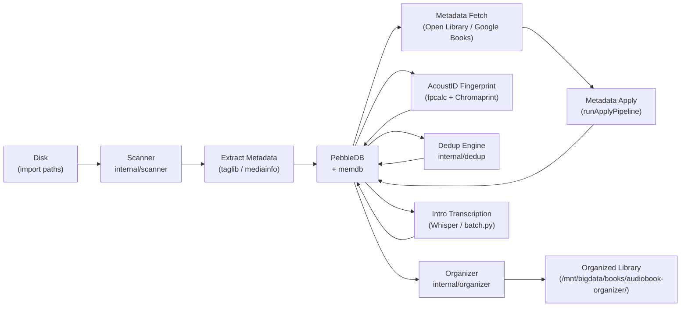
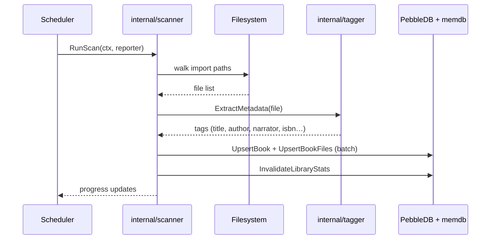
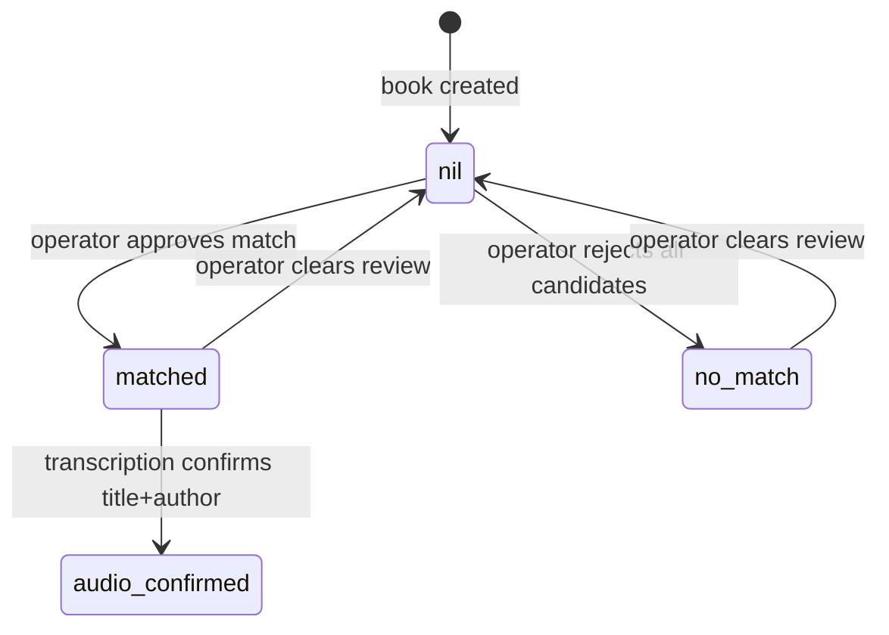
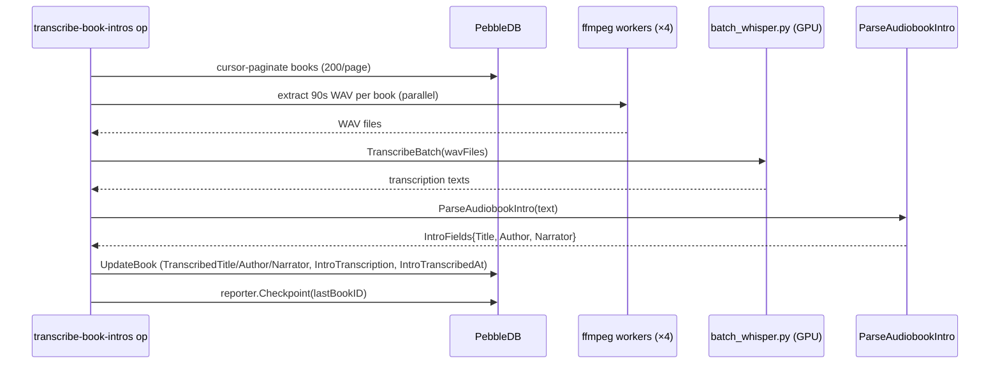

<!-- file: docs/system/pipelines.md -->
<!-- version: 1.0.0 -->
<!-- guid: b2c3d4e5-f6a7-8901-bcde-f01234567890 -->
<!-- last-edited: 2026-06-29 -->

# Data Pipelines

This document describes the major data pipelines: how audiobooks flow from raw files on disk through scanning, metadata enrichment, fingerprinting, deduplication, organization, and transcription.

## Pipeline Overview

## Scan → Store Pipeline

The scanner (`internal/scanner`) walks configured import paths, groups audio files into logical books (by album+artist tag, or filename sequence if tags are absent), extracts metadata via `taglib` and `mediainfo`, and upserts into PebbleDB via `saveBookToDatabase`.

Key rules:
- iTunes import paths are excluded from scanning (configured `SkipPaths`)
- Multi-file dedup: `SegmentHashes` are carried forward to avoid re-hashing on the write pass (PERF-2b)
- Books with no-tag sequential files are grouped by folder name as title (AP-5)

## Metadata Fetch → Apply Pipeline

After scan, books without curated metadata enter the metadata fetch queue. `internal/metafetch` queries Open Library, Google Books, and (optionally) an Audible scraper, scores candidates, and stores the best match.

`runApplyPipeline` applies the fetched metadata:
1. Checks `isProtectedPath` — aborts if book is in a protected location
2. Calls `ensureLibraryCopy` + `syncMetadataToLibraryCopy` to get fresh data
3. Writes curated fields to PebbleDB via `UpdateBook` (full column replacement)
4. Enqueues ISBN enrichment (Open Library background goroutine)

**Critical:** `UpdateBook` does a FULL column replacement. Always supply all fields or data will be wiped.

**Tag priority for author:** `album_artist > artist > composer` (composer = narrator in audiobooks).

## Metadata Review State Machine

Books track their manual review status in `MetadataReviewStatus`:

Values: `null` (unreviewed), `"matched"` (operator approved), `"no_match"` (operator rejected), `"audio_confirmed"` (Whisper transcription confirms metadata).

## Fingerprint Pipeline

`internal/fingerprint` runs `fpcalc` (Chromaprint) on each audio file and submits to the AcoustID API. Results are stored in `BookFile.AcoustIDFingerprint` and `AcoustIDFingerprintDurationSec`.

- Permanent-failure tombstone: if `fpcalc`/`ffmpeg` fails, `FingerprintFailedAt` is written; the LSH indexer skips these from re-enqueue
- memdb strips `AcoustIDFingerprint` (large field); use `AcoustIDFingerprintDurationSec > 0` as the memdb-safe proxy for "has fingerprint"

## Dedup Pipeline

`internal/dedup` (unified scoring engine):
1. LSH (Locality-Sensitive Hashing) indexes 275K+ fingerprints
2. Candidate pairs are scored across multiple signals: exact file hash, ISBN/ASIN, metadata hash, AcoustID similarity, local embeddings (bge-m3)
3. Results stored as dedup pairs in PebbleDB
4. Triage op (`maintenance.dedup-exact-triage`) classifies pairs: genuine / stub / fragment / title_leak / unknown

**Caution:** Purge ops are irreversible. Always run dry-run triage first.

## Organization Pipeline

`internal/organizer` moves/renames files according to a configurable template (e.g. `{Author}/{Series}/{Title}`). The `PR #1062` fix suppresses `{Title} - {Title}` doubled folder names.

- Copy-on-write: `.bak-*` files with TTL cleanup via maintenance
- Path history tracked in `book_path_history` (migration 35)
- Cover art embedded during write-back via `taglib.WriteImage`; old covers archived to `covers/history/` with SHA-256 dedup

## Transcription (Intro) Pipeline

`maintenance.transcribe-book-intros` extracts the first 90 seconds of each book's first audio file and transcribes it using Whisper (`batch_whisper.py`, embedded via `//go:embed`).

Key params:
- `reparse_only=true` — re-runs the parser on stored transcripts only (no ffmpeg/Whisper). Use to apply parser fixes to existing books cheaply.
- Transcribed fields are stored separately from curated metadata (`TranscribedTitle` ≠ `Title`) so errors cannot overwrite manually curated data.
- Model: `base.en` for bulk run; `small.en` for targeted re-runs on empty-parse books.

## Background Scheduling

`internal/scheduler` runs maintenance windows and scheduled operations. The `maintenance.window` op fires nightly and dispatches sub-ops: scan, fingerprint backfill, dedup sweep, cover art sync, activity compaction.

## Cross-references

- Architecture overview: [architecture.md](architecture.md)
- HTTP API for launching ops: [api.md](api.md)
- Storage layer: [storage.md](storage.md)
